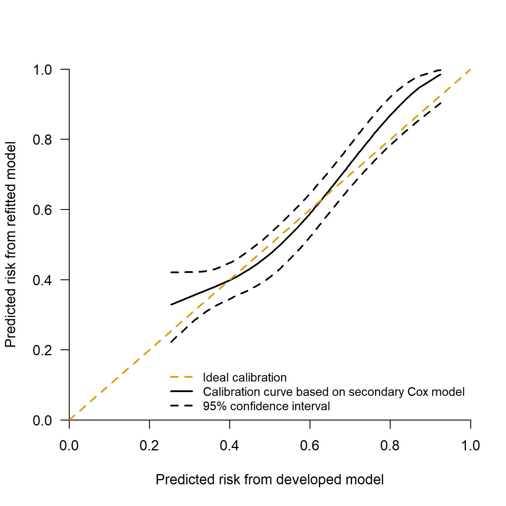

Performance assessment of survival prediction models - simplified code
================

-   [Goals](#goals)
    -   [Set up - load packages and import
        data](#set-up---load-packages-and-import-data)
-   [Goal 1 - Develop a risk prediction model with a time to event
    outcome](#goal-1---develop-a-risk-prediction-model-with-a-time-to-event-outcome)
    -   [1.1 Model development - fit the risk prediction
        models](#11-model-development---fit-the-risk-prediction-models)
-   [Goal 2 - Assessing performance in survival prediction
    models](#goal-2---assessing-performance-in-survival-prediction-models)
    -   [2.1 Discrimination measures](#21-discrimination-measures)
    -   [2.2 Calibration](#22-calibration)
    -   [2.2.1 Observed Expected ratio](#221-observed-expected-ratio)
    -   [2.2.2 Calibration plot using restricted cubic
        splines](#222-calibration-plot-using-restricted-cubic-splines)
    -   [2.3 Overall performance
        measures](#23-overall-performance-measures)
-   [Goal 3 - Clinical utility](#goal-3---clinical-utility)
-   [Additional notes](#additional-notes)
-   [Reproducibility ticket](#reproducibility-ticket)

## Goals

In this document, we assume that individual data of the development and
validation set are both available. This file illustrates in a simplified
way how to develop a survival prediction model and how to assess the
corresponding prediction performance using internal and external
validation.

The goals are:  
1. To develop a risk prediction model with a time-to-event outcome;  
2. To assess the prediction performance of a model with a time-to-event
outcome;  
3. To assess the potential clinical utility of a risk prediction model
with time-to-event outcome;

### Set up - load packages and import data

Please run the following code to set up the data used in the following
document. The following libraries are needed to achieve the following
goals, if you have not them installed, please use install.packages(’‘)
(e.g. install.packages(’survival’)) or use the user-friendly approach if
you are using RStudio.

``` r
# Use pacman to check whether packages are installed, if not load
if (!require("pacman")) install.packages("pacman")
library(pacman)

pacman::p_load(
  survival,
  rms,
  pec,
  riskRegression,
  timeROC
)

options(show.signif.stars = FALSE)  # display statistical intelligence
palette("Okabe-Ito")  # color-blind friendly  (needs R 4.0)

# Development data
# Recurrence free survival is the time until the earlier of
#  recurrence or death. 
rotterdam$ryear <- rotterdam$rtime/365.25  # time in years
rotterdam$rfs <- with(rotterdam, pmax(recur, death)) #The variable rfs is a status indicator, 0=alive without relapse, 1= death or relapse.
rotterdam$ryear[rotterdam$rfs == 1 & rotterdam$recur == 0 & rotterdam$death==1 & (rotterdam$rtime < rotterdam$dtime)] <- rotterdam$dtime[rotterdam$rfs == 1 & rotterdam$recur==0 & rotterdam$death==1 & (rotterdam$rtime < rotterdam$dtime)]/365.25  #Fix the outcome for 43 patients who have died but censored at time of recurrence which was less than death time. The actual death time should be used rather than the earlier censored recurrence time.

# variables used in the analysis
pgr99 <- quantile(rotterdam$pgr, .99) # there is a large outlier of 5000
rotterdam$pgr2 <- pmin(rotterdam$pgr, pgr99) # Winsorized value
rotterdam$csize <- rotterdam$size           # categorized size
rotterdam$cnode <- cut(rotterdam$nodes, c(-1, 0, 3, 51),
                       c("0", "1-3", ">3"))   # categorized node
rotterdam$grade3 <- as.factor(rotterdam$grade)
levels(rotterdam$grade3) <- c("1-2", "3")

# Save in the data the restricted cubic spline term using Hmisc::rcspline.eval() package
rcs3_pgr <- rcspline.eval(rotterdam$pgr2, knots = c(0, 41, 486))
attr(rcs3_pgr, "dim") <- NULL
attr(rcs3_pgr, "knots") <- NULL
rotterdam$pgr3 <- rcs3_pgr

# Validation data
gbsg$ryear <- gbsg$rfstime/365.25
gbsg$rfs   <- gbsg$status           # the GBSG data contains RFS
gbsg$cnode <- cut(gbsg$nodes, c(-1,0, 3, 51),
                       c("0", "1-3", ">3"))   # categorized node
gbsg$csize <- cut(gbsg$size,  c(-1, 20, 50, 500), #categorized size
                  c("<=20", "20-50", ">50"))
gbsg$pgr2 <- pmin(gbsg$pgr, pgr99) # Winsorized value
gbsg$grade3 <- as.factor(gbsg$grade)
levels(gbsg$grade3) <- c("1-2", "1-2", "3")

# Restricted cubic spline for PGR
rcs3_pgr <- rcspline.eval(gbsg$pgr2, knots = c(0, 41, 486))
attr(rcs3_pgr, "dim") <- NULL
attr(rcs3_pgr, "knots") <- NULL
gbsg$pgr3 <- rcs3_pgr


# Much of the analysis will focus on the first 5 years: create
#  data sets that are censored at 5
temp <- survSplit(Surv(ryear, rfs) ~ ., data = rotterdam, cut=5,
                  episode="epoch")
rott5 <- subset(temp, epoch==1)  # only the first 5 years
temp <- survSplit(Surv(ryear, rfs) ~ ., data = gbsg, cut=5,
                  episode ="epoch")
gbsg5 <- subset(temp, epoch==1)

# Relevel
rott5$cnode <- relevel(rotterdam$cnode, "0")
gbsg5$cnode <- relevel(gbsg$cnode, "0")
```

We loaded the development (rotterdam) and the validation data (gbsg)
from survival package. The Rotterdam breast cancer data was used to
predict the risk of recurrence or death using size, stage and tumor size
as predictors. These three predictors were used in the Nottingham
Prognostic Index, one of the most popular indeces to determine prognosis
following surgery of breast cancer.  
The Germany Breast Cancer Study Group data was used as an external
validation of the model developed in the Rotterdam breast cancer data.
The prediction model will be then extended using the progesterone (PGR)
marker measured at primary surgery.  
The improvement in prediction performance will be evaluated internally
in the Rotterdam data (development data) and in German Breast Cancer
Study data (validation data).

## Goal 1 - Develop a risk prediction model with a time to event outcome

Prediction models are useful to provide the estimated probability of a
specific outcome using personal information. In many studies, especially
in medicine, the main outcome under assessment is the time to an event
of interest defined generally as survival time. Prognostic models for
survival end points, such as recurrence or progression of disease, need
to account for drop out during follow-up. Patients who have not
experienced the event of interest are censored observations. Cox
regression analysis is the most popular statistical model to deal with
such data in oncology and other medical research.

### 1.1 Model development - fit the risk prediction models

We develop the risk prediction model in the development data considering
the first 5-year follow-up to minimize the violation of proportional
hazard including size, node and grade. We also administratively censored
the validation data at 5 years.

``` r
# Libraries needed
if (!require("pacman")) install.packages("pacman")
pacman::p_load(survival,
              Hmisc,
              pec)

# Fit the model without PGR
efit1 <- coxph(Surv(ryear, rfs) ~ csize + cnode + grade3,
  data = rott5, 
  x = T, 
  y = T)
efit1
```

    ## Call:
    ## coxph(formula = Surv(ryear, rfs) ~ csize + cnode + grade3, data = rott5, 
    ##     x = T, y = T)
    ## 
    ##               coef exp(coef) se(coef)      z        p
    ## csize20-50 0.38342   1.46729  0.06504  5.895 3.74e-09
    ## csize>50   0.66355   1.94167  0.09126  7.271 3.57e-13
    ## cnode1-3   0.35998   1.43330  0.07534  4.778 1.77e-06
    ## cnode>3    1.06278   2.89440  0.07035 15.108  < 2e-16
    ## grade33    0.37477   1.45466  0.07130  5.256 1.47e-07
    ## 
    ## Likelihood ratio test=483.6  on 5 df, p=< 2.2e-16
    ## n= 2982, number of events= 1275

``` r
# Baseline at 5 years
bh <- basehaz(efit1, centered = FALSE) # uncentered
bh$surv <- exp(-bh$hazard) # baseline survival
S0_t5 <- bh$surv[bh$time == 5] 
# NOTE: this can be used to calculate S(t = 5) = S0(t = 5)**exp(X*beta)

# The model with additional PGR marker
efit1_pgr  <- update(efit1, . ~ . + pgr2 + pgr3)
```

The coefficients of the models indicated that higher size, higher number
of positive lymph nodes and higher grade is more associate with poorer
prognosis. The association of the progesterone marker and the outcome is
non-linear as investigated previously.

## Goal 2 - Assessing performance in survival prediction models

The performance of a risk prediction models may be evaluated through:

-   discrimination: the ability of the model to identify patients with
    and without the outcome. It requires the coefficients (or the log of
    the hazard ratios) of the developed risk prediction model to be
    evaluated.

-   calibration: the agreement between observed and predicted
    probabilities. It requires the baseline (cumulative) hazard or
    survival.

-   overall performance measures: as a combination of discrimination and
    calibration and/or as a measure of the explained variation;

Unfortunately, only few publications report the complete baseline
(cumulative) hazard or survival or even the baseline (cumulative) hazard
or survival at fixed time horizon *t*. If we had both individual data of
the development and validation, a complete assessment of discrimination
and calibration would be possible. We could evaluate the prediction
performance of a risk prediction model at a fixed time horizon(s) *t*
and for the complete follow-up time. In risk prediction, physicians
typically focus on one or more clinically relevant time horizons to
inform subjects about their risk. For this reason, according to
information available, different levels of validation assessment are
possible. Here we aim to assess the prediction performance of a risk
prediction model with time-to-event outcome in case all individual data
are available and in case of only the model equation of a fixed time
horizon (i.e. at 5 years) is provided including the baseline survival.

### 2.1 Discrimination measures

Discrimination is the ability to differentiate between subjects who have
the outcome and subjects who do not. Concordance can be assessed over
several different time intervals:

-   the entire range of the data. Two concordance measures are
    suggested:

    -   Harrell’s C quantifies the degree of concordance as the
        proportion of such pairs where the patient with a longer
        survival time has better predicted survival;

    -   Uno’s C uses a time dependent weighting that more fully adjusts
        for censoring;

-   a 5 year window corresponding to our target assessment point. Uno’s
    time-dependent Area Under the Curve (AUC) is suggested. Uno’s
    time-dependent AUC summarizes discrimination at specific fixed time
    points. At any time point of interest, *t*, a patient is classified
    as having an event if the patient experienced the event between
    baseline and *t* (5 years in our case study), and as a non-event if
    the patient remained event-free at *t*. The time-dependent AUC
    evaluates whether predicted probabilities were higher for cases than
    for non-cases.

Clearly the last of these is most relevant.

This is easy to compute using the concordance function in the survival
package. There is some uncertainty in the literature about the original
Harrell formulation versus Uno’s suggestion to re-weigh the time scale
by the factor 1/*G*<sup>2</sup>(*t*) where *G* is the censoring
distribution. There is more detailed information in the concordance
vignette found in the survival package.

We also propose to calculate Uno’s time-dependent AUC at a specific time
horizon *t*.  
More explanations and details are in the paper.

The time horizon to calculate the time-dependent measures was set to 5
years. Values close to 1 indicate good discrimination ability, while
values close to 0.5 indicated poor discrimination ability.  
We used the time horizon at 4.99 and not 5 years since non-cases are
considered patients at risk after the time horizon and we
administratively censored at 5 years to minimize the violation of PH
assumption.

``` r
# Libraries needed
if (!require("pacman")) install.packages("pacman")
library(pacman)
pacman::p_load(survival,
               Hmisc,
               pec,
               timeROC)

# Add linear predictor in the validation set
gbsg5$lp <- predict(efit1, newdata = gbsg5)

### Harrell and Uno's concordance index 
# Harrell's C


## Validation data
# Harrell's C
harrell_C_gbsg5 <- concordance(Surv(ryear, rfs) ~ lp, 
                               gbsg5, 
                               reverse = TRUE)
# Uno's C
Uno_C_gbsg5 <- concordance(Surv(ryear, rfs) ~ lp, 
                           gbsg5, 
                           reverse = TRUE,
                           timewt = "n/G2")
```

    ##                              Estimate Lower .95 Upper .95
    ## Harrell C - Validation data      0.65      0.62      0.68
    ## Uno C - Validation data          0.64      0.61      0.67

Harrell C and Uno C were 0.65 and 0.64, respectively.

    ##   Uno AUC Lower .95 Upper .95 
    ##      0.69      0.63      0.74

The time-dependent AUCs at 5 years were in the external validation was
0.69.

### 2.2 Calibration

Calibration is the agreement between observed outcomes and predicted
probabilities. For example, in survival models, a predicted survival
probability at a fixed time horizon *t* of 80% is considered reliable if
it can be expected that 80 out of 100 will survive among patients who
received a predicted survival probability of 80%.

Calibration is measured by:

-   Observed and Expected ratio at time horizon (*t*):

    -   the number of observed events (per 100) is calculated as one
        minus the Kaplan-Meier curve at time *t*;

    -   the number of expected events (per 100) is calculated as the
        mean of the predicted risk at time *t*;

    -   Confidence intervals are calculated using the Normal
        approximation of the Poisson distribution.

-   Calibration plot: it is a graphical representation of calibration.
    It shows:

    -   on the *x-axis* the predicted survival (or risk) probabilities
        at a fixed time horizon (e.g. at 5 years);

    -   on the *y-axis* the observed survival (or risk) probabilities at
        a fixed time horizon (e.g. at 5 years);

    -   The 45-degree line indicates the good overall calibration.
        Points below the 45-degree line indicates that the model
        overestimate the observed risk. If points are above the
        45-degree line, the model underestimate the observed risk; The
        observed probabilities estimated by the Kaplan-Meier curves (in
        case of survival) or by the complementary of the Kaplan-Meier
        curves (in case of risk in absence of competing risks) are
        represented in terms of percentiles of the predicted survival
        (risk) probabilities.

Other calibration measures are proposed in the literature. More details
are provided in the references at the end of the document.

### 2.2.1 Observed Expected ratio

We calculate the observed/ expected ratio (OE) at 5 years in the
development and validation data. In the development data the OE should
be (close to) 1.

``` r
# Libraries needed
if (!require("pacman")) install.packages("pacman")
library(pacman)
pacman::p_load(survival,
               Hmisc)

# Observed / Expected ratio
t_horizon <- 5

# Observed
obj <- summary(survfit(
  Surv(ryear, rfs) ~ 1, 
  data = gbsg5),
  times = t_horizon)

obs_t <- 1 - obj$surv

# Predicted risk 
gbsg5$pred <- 1 - predictSurvProb(efit1, 
                                  newdata = gbsg5,
                                  times = t_horizon)
# Expected
exp_t <- mean(gbsg5$pred)

# Observed / Expected ratio
OE_t <- obs_t / exp_t

alpha <- .05
OE_summary <- c(
  "OE" = OE_t,
  "2.5 %" = OE_t * exp(-qnorm(1 - alpha / 2) * sqrt(1 / obj$n.event)),
  "97.5 %" = OE_t * exp(+qnorm(1 - alpha / 2) * sqrt(1 / obj$n.event))
)

OE_summary
```

    ##        OE     2.5 %    97.5 % 
    ## 1.0444489 0.9299645 1.1730270

Observed and expected ratio was 1.04.

### 2.2.2 Calibration plot using restricted cubic splines

Calibration plots of the external validation data with and without PGR
are calculated and shown using restricted cubic splines.  
The interpretation of the calibration plot was provided in the section
2.2 reported above, in the corresponding paper and in the literature
provided in the paper and at the end of this document.

``` r
if (!require("pacman")) install.packages("pacman")
library(pacman)
pacman::p_load(survival,
               Hmisc,
               rms)

gbsg5$pred <- 1 - predictSurvProb(efit1, 
                                  newdata = gbsg5, 
                                  times = 5)
gbsg5$pred.cll <- log(-log(1 - gbsg5$pred))


# Estimate actual risk
vcal <- cph(Surv(ryear, rfs) ~ rcs(pred.cll, 3),
            x = T,
            y = T,
            surv = T,
            data = gbsg5
) 

dat_cal <- cbind.data.frame(
  "obs" = 1 - survest(vcal, 
                      times = 5, 
                      newdata = gbsg5)$surv,
  
  "lower" = 1 - survest(vcal, 
                        times = 5, 
                        newdata = gbsg5)$upper,
  
  "upper" = 1 - survest(vcal, 
                        times = 5, 
                        newdata = gbsg5)$lower,
  "pred" = gbsg5$pred
)

dat_cal <- dat_cal[order(dat_cal$pred), ]

par(xaxs = "i", yaxs = "i", las = 1)
plot(
  dat_cal$pred, 
  dat_cal$obs,
  type = "l", 
  lty = 1, 
  xlim = c(0, 1),
  ylim = c(0, 1), 
  lwd = 2,
  xlab = "Predicted probability",
  ylab = "Observed probability", bty = "n"
)
lines(dat_cal$pred, 
      dat_cal$lower, 
      type = "l", 
      lty = 2, 
      lwd = 2)
lines(dat_cal$pred, 
      dat_cal$upper,
      type = "l", 
      lty = 2, 
      lwd = 2)
abline(0, 1, lwd = 2, lty = 2, col = "red")
```



``` r
# Numerical measures
absdiff_cph <- abs(dat_cal$pred - dat_cal$obs)

numsum_cph <- c(
  "ICI" = mean(absdiff_cph),
  setNames(quantile(absdiff_cph, c(0.5, 0.9)), c("E50", "E90")),
  "Emax" = max(absdiff_cph)
)
numsum_cph
```

    ##        ICI        E50        E90       Emax 
    ## 0.02724664 0.02973399 0.06101062 0.06912009

Good calibration was estimated using calibration plot and calibration
measures.

### 2.3 Overall performance measures

We calculate the Brier Score and the Index of Prediction Accuracy (IPA,
the scaled Brier) as a overall performance measure.

We calculate the overall performance measures: Brier score, Scaled Brier
(IPA) and the corresponding confidence intervals.

``` r
# Libraries needed
if (!require("pacman")) install.packages("pacman")
library(pacman)
pacman::p_load(survival,
               Hmisc,
               pec)

# Fit the model without PGR
efit1 <- coxph(Surv(ryear, rfs) ~ csize + cnode + grade3,
  data = rott5, 
  x = T, 
  y = T)

# The model with additional PGR marker
efit1_pgr  <- update(efit1, . ~ . + pgr2 + pgr3)

# Brier Score and IPA in the validation set (model without PGR)
score_gbsg5 <-
  Score(list("cox_validation" = efit1),
    formula = Surv(ryear, rfs) ~ 1, 
    data = gbsg5, 
    conf.int = TRUE, 
    times = 4.99,
    cens.model = "km", 
    metrics = "brier",
    summary = "ipa"
)

# Extra: bootstrap confidence intervals for IPA ------
B <- 100
horizon <- 4.99
boots_ls <- lapply(seq_len(B), function(b) {
  
  # Resample validation data
  data_boot <- gbsg5[sample(nrow(gbsg5), replace = TRUE), ]

  
  # Get IPA on boot validation data
  score_boot <- Score(
    list("cox_validation" = efit1),
    formula = Surv(ryear, rfs) ~ 1,
    cens.model = "km", 
    data = data_boot, 
    conf.int = FALSE, 
    times = horizon,
    metrics = c("brier"),
    summary = c("ipa")
  )
  
  #.. can add other measure heres, eg. concordance
  
  ipa_boot <- score_boot$Brier$score[model == "cox_validation"][["IPA"]]
  cbind.data.frame("ipa" = ipa_boot)
})

df_boots <- do.call(rbind.data.frame, boots_ls)
```

    ##                                Estimate Lower .95  Upper .95
    ## Brier - Validation data            0.22       0.21      0.24
    ## Scaled Brier - Validation data     0.10       0.03      0.16

Brier and scaled Brier score were 0.22 and 0.11, respectively.

## Goal 3 - Clinical utility

Discrimination and calibration measures are essential to assess the
prediction performance but insufficient to evaluate the potential
clinical utility of a risk prediction model for decision making. When
new markers are available, clinical utility assessment evaluates whether
the extended model helps to improve decision making.  
Clinical utility is measured by the net benefit that includes the number
of true positives and the number of false positives. For example, in
time-to-event models, the true positives reflect the benefit of being
event free for a given time horizon using additional interventions such
as additional treatments, personalized follow-up or additional
surgeries. The false positives represent the harms of unnecessary
interventions.  
Generally, in medicine, clinicians accepts to treat a certain number of
patients for which interventions are unnecessary to be event free for a
given time horizon. So, false negatives (the harm of not being event
free for a given time horizon) are more important than false positives
(the harm of unnecessary interventions). Thus, net benefit is the number
of true positives classifications minus the false positives
classifications weighted by a factor related to the harm of not
preventing the event versus unnecessary interventions. The weighting is
derived from the threshold probability to death (one minus survival
probability) using a defined time horizon (for example 5 years since
diagnosis). For example, a threshold of 10% implies that additional
interventions for 10 patients of whom one would have experience the
event in 5 years if untreated is acceptable (thus treating 9 unnecessary
patients). This strategy is compared with the strategies of treat all
and treat none of the patients. If overtreatment is harmful, a higher
threshold should be used.  
The net benefit is calculated as:


*TP*=true positive patients  
*FP*=false positive patients  
*n*=number of patients and *p*<sub>t</sub> is the risk threshold.

For survival data *TP* and *FP* is calculated as follows:  


where  
*S(t)* survival at time *t*  
*X=1* where the predicted probability at time *t* is *p*<sub>t</sub>

And the the decision curve is calculated as follows:

1.  Choose a time horizon (in this case 5 years);
2.  Specify a risk threshold which reflects the ratio between harms and
    benefit of an additional intervention;
3.  Calculate the number of true positive and false positive given the
    threshold specified in (2);
4.  Calculate the net benefit of the survival model;
5.  Plot net benefit on the *y-axis* against the risk threshold on the
    *x-axis*;
6.  Repeat steps 2-4 for each model consideration;
7.  Repeat steps 2-4 for the strategy of assuming all patients are
    treated;
8.  Draw a straight line parallel to the *x-axis* at y=0 representing
    the net benefit associated with the strategy of assuming that all
    patients are not treated.

Given some thresholds, the model/strategy with higher net benefit
represents the one that potentially improves clinical decision making.
However, poor discrimination and calibration lead to lower net benefit.

``` r
if (!require("pacman")) install.packages("pacman")
library(pacman)
pacman::p_load(survival,
               Hmisc)

# Run decision curve analysis

# Development data
# Model without PGR
gbsg5 <- as.data.frame(gbsg5)
dca_gbsg5 <- stdca(
  data = gbsg5, 
  outcome = "rfs", 
  ttoutcome = "ryear",
  timepoint = 5, 
  predictors = "pred", 
  xstop = 1.0,
  ymin = -0.01, 
  graph = FALSE
)
```

    ## [1] "pred: No observations with risk greater than 84%, and therefore net benefit not calculable in this range."

``` r
# Decision curves plot
par(xaxs = "i", yaxs = "i", las = 1)
plot(dca_gbsg5$net.benefit$threshold,
  dca_gbsg5$net.benefit$pred,
  type = "l", 
  lwd = 2,
  lty = 1,
  xlab = "Threshold probability in %", 
  ylab = "Net Benefit",
  xlim = c(0, 1), 
  ylim = c(-0.10, 0.60), 
  bty = "n",
  cex.lab = 1.2, 
  cex.axis = 1
)

lines(dca_gbsg5$net.benefit$threshold, 
      dca_gbsg5$net.benefit$none, 
      type = "l", 
      lwd = 2, 
      lty = 4)
lines(dca_gbsg5$net.benefit$threshold, 
      dca_gbsg5$net.benefit$all, 
      type = "l", 
      lwd = 2, 
      col = "darkgray")
lines(dca_gbsg5$net.benefit$threshold, 
      dca_gbsg5$net.benefit$pred, 
      type = "l", lwd = 2, lty = 5)
legend("topright",
  c(
    "Treat All",
    "Original model",
    "Treat None"
  ),
  lty = c(1, 1, 4), 
  lwd = 2, 
  col = c("darkgray", "black", "black"),
  bty = "n"
)
```


The potential benefit at 23% threshold of the prediction model is 0.36.
This means that the model might identify a net 36 patients out of 100
who will have recurrent breast cancer or die within 5 years of surgery
and thus require adjuvant chemotherapy.

Potential benefit can be also defined in terms of net reduction of
avoidable interventions (e.g adjuvant chemotherapy per 100 patients) by:


where *NB*<sub>model</sub> is the net benefit of the prediction model,
*NB*<sub>all</sub> is the net benefit of the strategy treat all and
*p*<sub>*t*</sub> is the risk threshold.

## Additional notes

1.  To run the apparent validation find in any performance measure
    calculation find “gbsg5” and replace with “rott5” except for model
    development part;

2.  To run validation of the extended model in any performance find
    “efit1” and replace with “efit1_pgr”.

## Reproducibility ticket

``` r
sessioninfo::session_info()
```

    ## - Session info ---------------------------------------------------------------
    ##  setting  value
    ##  version  R version 4.1.2 (2021-11-01)
    ##  os       Windows 10 x64 (build 19044)
    ##  system   x86_64, mingw32
    ##  ui       RTerm
    ##  language (EN)
    ##  collate  English_United States.1252
    ##  ctype    English_United States.1252
    ##  tz       Europe/Berlin
    ##  date     2021-12-22
    ##  pandoc   2.14.0.3 @ C:/Program Files/RStudio/bin/pandoc/ (via rmarkdown)
    ## 
    ## - Packages -------------------------------------------------------------------
    ##  package        * version    date (UTC) lib source
    ##  assertthat       0.2.1      2019-03-21 [1] CRAN (R 4.1.2)
    ##  backports        1.3.0      2021-10-27 [1] CRAN (R 4.1.1)
    ##  base64enc        0.1-3      2015-07-28 [1] CRAN (R 4.1.1)
    ##  caret            6.0-90     2021-10-09 [1] CRAN (R 4.1.2)
    ##  checkmate        2.0.0      2020-02-06 [1] CRAN (R 4.1.2)
    ##  class            7.3-19     2021-05-03 [2] CRAN (R 4.1.2)
    ##  cli              3.1.0      2021-10-27 [1] CRAN (R 4.1.2)
    ##  cluster          2.1.2      2021-04-17 [2] CRAN (R 4.1.2)
    ##  cmprsk           2.2-10     2020-06-09 [1] CRAN (R 4.1.2)
    ##  codetools        0.2-18     2020-11-04 [2] CRAN (R 4.1.2)
    ##  colorspace       2.0-2      2021-06-24 [1] CRAN (R 4.1.2)
    ##  conquer          1.2.1      2021-11-01 [1] CRAN (R 4.1.2)
    ##  crayon           1.4.2      2021-10-29 [1] CRAN (R 4.1.2)
    ##  data.table       1.14.2     2021-09-27 [1] CRAN (R 4.1.2)
    ##  DBI              1.1.1      2021-01-15 [1] CRAN (R 4.1.2)
    ##  digest           0.6.29     2021-12-01 [1] CRAN (R 4.1.2)
    ##  dplyr            1.0.7      2021-06-18 [1] CRAN (R 4.1.2)
    ##  ellipsis         0.3.2      2021-04-29 [1] CRAN (R 4.1.2)
    ##  evaluate         0.14       2019-05-28 [1] CRAN (R 4.1.2)
    ##  fansi            0.5.0      2021-05-25 [1] CRAN (R 4.1.2)
    ##  fastmap          1.1.0      2021-01-25 [1] CRAN (R 4.1.2)
    ##  foreach          1.5.1      2020-10-15 [1] CRAN (R 4.1.2)
    ##  foreign          0.8-81     2020-12-22 [2] CRAN (R 4.1.2)
    ##  Formula        * 1.2-4      2020-10-16 [1] CRAN (R 4.1.1)
    ##  future           1.23.0     2021-10-31 [1] CRAN (R 4.1.2)
    ##  future.apply     1.8.1      2021-08-10 [1] CRAN (R 4.1.2)
    ##  generics         0.1.1      2021-10-25 [1] CRAN (R 4.1.2)
    ##  ggplot2        * 3.3.5      2021-06-25 [1] CRAN (R 4.1.2)
    ##  globals          0.14.0     2020-11-22 [1] CRAN (R 4.1.1)
    ##  glue             1.5.1      2021-11-30 [1] CRAN (R 4.1.2)
    ##  gower            0.2.2      2020-06-23 [1] CRAN (R 4.1.1)
    ##  gridExtra        2.3        2017-09-09 [1] CRAN (R 4.1.2)
    ##  gtable           0.3.0      2019-03-25 [1] CRAN (R 4.1.2)
    ##  here           * 1.0.1      2020-12-13 [1] CRAN (R 4.1.2)
    ##  highr            0.9        2021-04-16 [1] CRAN (R 4.1.2)
    ##  Hmisc          * 4.6-0      2021-10-07 [1] CRAN (R 4.1.2)
    ##  htmlTable        2.3.0      2021-10-12 [1] CRAN (R 4.1.2)
    ##  htmltools        0.5.2      2021-08-25 [1] CRAN (R 4.1.2)
    ##  htmlwidgets      1.5.4      2021-09-08 [1] CRAN (R 4.1.2)
    ##  ipred            0.9-12     2021-09-15 [1] CRAN (R 4.1.2)
    ##  iterators        1.0.13     2020-10-15 [1] CRAN (R 4.1.2)
    ##  jpeg             0.1-9      2021-07-24 [1] CRAN (R 4.1.1)
    ##  knitr            1.36       2021-09-29 [1] CRAN (R 4.1.2)
    ##  lattice        * 0.20-45    2021-09-22 [2] CRAN (R 4.1.2)
    ##  latticeExtra     0.6-29     2019-12-19 [1] CRAN (R 4.1.2)
    ##  lava             1.6.10     2021-09-02 [1] CRAN (R 4.1.2)
    ##  lifecycle        1.0.1      2021-09-24 [1] CRAN (R 4.1.2)
    ##  listenv          0.8.0      2019-12-05 [1] CRAN (R 4.1.2)
    ##  lubridate        1.8.0      2021-10-07 [1] CRAN (R 4.1.2)
    ##  magrittr         2.0.1      2020-11-17 [1] CRAN (R 4.1.2)
    ##  MASS             7.3-54     2021-05-03 [2] CRAN (R 4.1.2)
    ##  Matrix           1.3-4      2021-06-01 [2] CRAN (R 4.1.2)
    ##  MatrixModels     0.5-0      2021-03-02 [1] CRAN (R 4.1.2)
    ##  matrixStats      0.61.0     2021-09-17 [1] CRAN (R 4.1.2)
    ##  mets             1.2.9      2021-09-06 [1] CRAN (R 4.1.2)
    ##  ModelMetrics     1.2.2.2    2020-03-17 [1] CRAN (R 4.1.2)
    ##  multcomp         1.4-17     2021-04-29 [1] CRAN (R 4.1.2)
    ##  munsell          0.5.0      2018-06-12 [1] CRAN (R 4.1.2)
    ##  mvtnorm          1.1-3      2021-10-08 [1] CRAN (R 4.1.1)
    ##  nlme             3.1-153    2021-09-07 [2] CRAN (R 4.1.2)
    ##  nnet             7.3-16     2021-05-03 [2] CRAN (R 4.1.2)
    ##  numDeriv         2016.8-1.1 2019-06-06 [1] CRAN (R 4.1.1)
    ##  pacman         * 0.5.1      2019-03-11 [1] CRAN (R 4.1.2)
    ##  parallelly       1.29.0     2021-11-21 [1] CRAN (R 4.1.2)
    ##  pec            * 2021.10.11 2021-10-11 [1] CRAN (R 4.1.2)
    ##  pillar           1.6.4      2021-10-18 [1] CRAN (R 4.1.2)
    ##  pkgconfig        2.0.3      2019-09-22 [1] CRAN (R 4.1.2)
    ##  plyr             1.8.6      2020-03-03 [1] CRAN (R 4.1.2)
    ##  png              0.1-7      2013-12-03 [1] CRAN (R 4.1.1)
    ##  polspline        1.1.19     2020-05-15 [1] CRAN (R 4.1.1)
    ##  pROC             1.18.0     2021-09-03 [1] CRAN (R 4.1.2)
    ##  prodlim        * 2019.11.13 2019-11-17 [1] CRAN (R 4.1.2)
    ##  purrr            0.3.4      2020-04-17 [1] CRAN (R 4.1.2)
    ##  quantreg         5.86       2021-06-06 [1] CRAN (R 4.1.2)
    ##  R6               2.5.1      2021-08-19 [1] CRAN (R 4.1.2)
    ##  RColorBrewer     1.1-2      2014-12-07 [1] CRAN (R 4.1.1)
    ##  Rcpp             1.0.7      2021-07-07 [1] CRAN (R 4.1.2)
    ##  recipes          0.1.17     2021-09-27 [1] CRAN (R 4.1.2)
    ##  reshape2         1.4.4      2020-04-09 [1] CRAN (R 4.1.2)
    ##  riskRegression * 2021.10.10 2021-10-11 [1] CRAN (R 4.1.2)
    ##  rlang            0.4.12     2021-10-18 [1] CRAN (R 4.1.2)
    ##  rmarkdown        2.11       2021-09-14 [1] CRAN (R 4.1.2)
    ##  rms            * 6.2-0      2021-03-18 [1] CRAN (R 4.1.2)
    ##  rpart            4.1-15     2019-04-12 [2] CRAN (R 4.1.2)
    ##  rprojroot        2.0.2      2020-11-15 [1] CRAN (R 4.1.2)
    ##  rstudioapi       0.13       2020-11-12 [1] CRAN (R 4.1.2)
    ##  sandwich         3.0-1      2021-05-18 [1] CRAN (R 4.1.2)
    ##  scales           1.1.1      2020-05-11 [1] CRAN (R 4.1.2)
    ##  sessioninfo      1.2.2      2021-12-06 [1] CRAN (R 4.1.2)
    ##  SparseM        * 1.81       2021-02-18 [1] CRAN (R 4.1.1)
    ##  stringi          1.7.6      2021-11-29 [1] CRAN (R 4.1.2)
    ##  stringr          1.4.0      2019-02-10 [1] CRAN (R 4.1.2)
    ##  survival       * 3.2-13     2021-08-24 [1] CRAN (R 4.1.2)
    ##  TH.data          1.1-0      2021-09-27 [1] CRAN (R 4.1.2)
    ##  tibble           3.1.6      2021-11-07 [1] CRAN (R 4.1.2)
    ##  tidyselect       1.1.1      2021-04-30 [1] CRAN (R 4.1.2)
    ##  timeDate         3043.102   2018-02-21 [1] CRAN (R 4.1.1)
    ##  timereg          2.0.1      2021-10-13 [1] CRAN (R 4.1.2)
    ##  timeROC        * 0.4        2019-12-18 [1] CRAN (R 4.1.2)
    ##  utf8             1.2.2      2021-07-24 [1] CRAN (R 4.1.2)
    ##  vctrs            0.3.8      2021-04-29 [1] CRAN (R 4.1.2)
    ##  withr            2.4.3      2021-11-30 [1] CRAN (R 4.1.2)
    ##  xfun             0.28       2021-11-04 [1] CRAN (R 4.1.2)
    ##  yaml             2.2.1      2020-02-01 [1] CRAN (R 4.1.1)
    ##  zoo              1.8-9      2021-03-09 [1] CRAN (R 4.1.2)
    ## 
    ##  [1] C:/Users/dgiardiello/Documents/R/win-library/4.1
    ##  [2] C:/Program Files/R/R-4.1.2/library
    ## 
    ## ------------------------------------------------------------------------------
