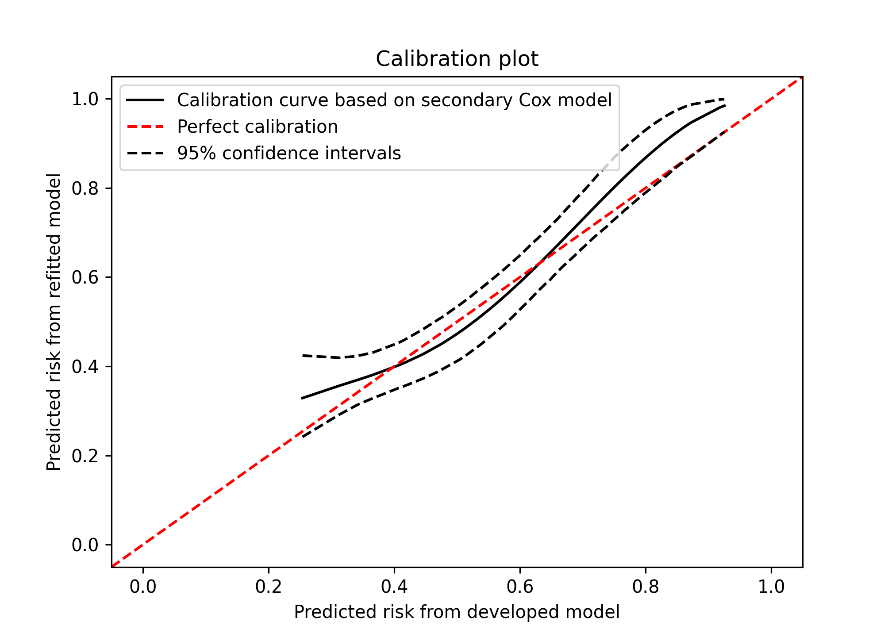
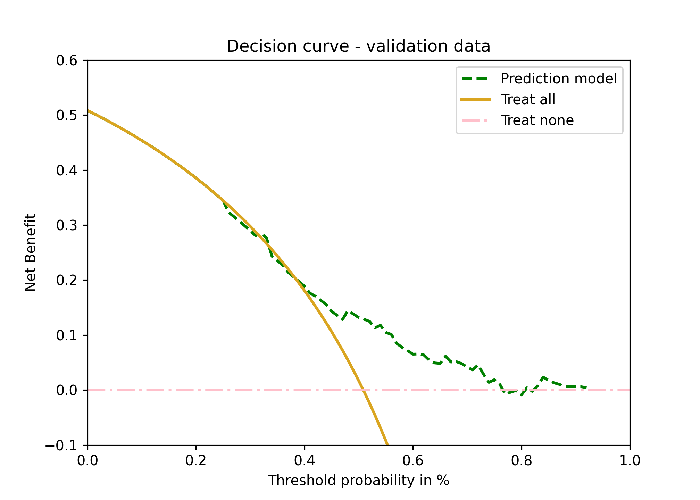

Performance assessment of survival prediction models - simplified code
================

-   <a href="#goals" id="toc-goals">Goals</a>
    -   <a href="#set-up---load-packages-and-import-data"
        id="toc-set-up---load-packages-and-import-data">Set up - load packages
        and import data</a>
    -   <a href="#data-and-recoding" id="toc-data-and-recoding">Data and
        recoding</a>
-   <a
    href="#goal-1---develop-a-risk-prediction-model-with-a-time-to-event-outcome"
    id="toc-goal-1---develop-a-risk-prediction-model-with-a-time-to-event-outcome">Goal
    1 - Develop a risk prediction model with a time to event outcome</a>
    -   <a href="#11-model-development---fit-the-risk-prediction-models"
        id="toc-11-model-development---fit-the-risk-prediction-models">1.1 Model
        development - fit the risk prediction models</a>
-   <a href="#goal-2---assessing-performance-in-survival-prediction-models"
    id="toc-goal-2---assessing-performance-in-survival-prediction-models">Goal
    2 - Assessing performance in survival prediction models</a>
    -   <a href="#21-discrimination-measures"
        id="toc-21-discrimination-measures">2.1 Discrimination measures</a>
    -   <a href="#22-calibration" id="toc-22-calibration">2.2 Calibration</a>
        -   <a href="#221-mean-calibration---fixed-time-point"
            id="toc-221-mean-calibration---fixed-time-point">2.2.1 Mean calibration
            - fixed time point</a>
        -   <a href="#222-weak-calibration---calibration-slope-for-fixed-time-point"
            id="toc-222-weak-calibration---calibration-slope-for-fixed-time-point">2.2.2
            Weak calibration - calibration slope for fixed time point</a>
        -   <a href="#223-moderate-calibration---fixed-time-point"
            id="toc-223-moderate-calibration---fixed-time-point">2.2.3 Moderate
            calibration - fixed time point</a>
    -   <a href="#23-overall-performance-measures"
        id="toc-23-overall-performance-measures">2.3 Overall performance
        measures</a>
-   <a href="#goal-3---clinical-utility"
    id="toc-goal-3---clinical-utility">Goal 3 - Clinical utility</a>
-   <a href="#additional-notes" id="toc-additional-notes">Additional
    notes</a>

## Goals

In this document, we assume that individual data of the development and
validation set are both available. This file illustrates in a simplified
way how to develop a survival prediction model and how to assess the
corresponding prediction performance.

The goals are:  
1. To develop a risk prediction model with a time-to-event outcome;  
2. To assess the prediction performance of a model with a time-to-event
outcome;  
3. To assess the potential clinical utility of a risk prediction model
with time-to-event outcome;

When a risk prediction model has been developed and published in the
literature, individual data that was used during model development are
not always available. In this document, we assume the scenario that a
risk prediction model was already developed and is available in the
literature. We assume that the author(s) developed a risk prediction
model using a Cox proportional hazard regression and provided the model
equation in terms of coefficients and the baseline survival at a fixed
time horizon *t* (e.g. five years).

### Set up - load packages and import data

Please run the following code to set up the data used in the following
document. The following libraries are needed to achieve the following
goals, if you have not them installed, please use install.packages(’‘)
(e.g. install.packages(’survival’)) or use the user-friendly approach if
you are using RStudio. In reticulate, you can use py_install to install
Python packages.

<details>
<summary>
Click to expand code
</summary>

``` r
# Use pacman to check whether packages are installed, if not load
if (!require("pacman")) install.packages("pacman")
library(pacman)

pacman::p_load(
  reticulate,
  tidyverse,
  knitr,
  kableExtra
)
```

</details>

    ## Loading required package: pacman

<details>
<summary>
Click to expand code
</summary>

``` python
# Load libraries and data
import warnings
warnings.simplefilter(action = "ignore", category = FutureWarning)
warnings.filterwarnings("ignore", category = RuntimeWarning) # suppressing warnings

import pandas as pd
import numpy as np
import scipy as sp
import statsmodels.api as smf
import matplotlib.pyplot as plt
import sklearn as sk
import lifelines as lf

# Get work directory
# os.getcwd()
url_rdata = "https://raw.githubusercontent.com/danielegiardiello/Prediction_performance_survival/main/Data/rotterdam.csv"
url_vdata = "https://raw.githubusercontent.com/danielegiardiello/Prediction_performance_survival/main/Data/gbsg.csv"
# NOTE: go to 
# "https://github.com/danielegiardiello/ValLogRegMod/blob/main/Data/vdata.csv"
# then click" Raw" button to the upper right corner of the file preview.
# Copy and paste the url link to have the raw gitHub version of the data
rotterdam = pd.read_csv(url_rdata)
gbsg = pd.read_csv(url_vdata)
# Inspect data:
# print(rotterdam.head(5)) # print the first five rows
# print(gbsg.head(5)) # print the first five rows
# rdata.info() # inspect data as in R str()
# vdata.info() # inspect data as in R str()
```

</details>

### Data and recoding

Outcome and predictors in the new data must be coded as provided in
manuscript.

We load the development (rotterdam) and the validation data (gbsg) from
`survival` package. The Rotterdam breast cancer data was used to predict
the risk of recurrence or death using size, stage and tumor size as
predictors. These three predictors were used in the Nottingham
Prognostic Index, one of the most popular indexes to determine prognosis
following surgery of breast cancer.  
The Germany Breast Cancer Study Group data was used as an external
validation of the model developed in the Rotterdam breast cancer data.
The prediction model will be then extended using the progesterone (PGR)
marker measured at primary surgery.

In the prediction model developed using the Rotterdam data, the data was
administratively censored at 5 years. For this reason, we also
administratively censor the data from patients in the validation data
(GBSG) at 5 years.

<details>
<summary>
Click to expand code
</summary>

``` python
## Data manipulation ----
# Development data --
rotterdam["ryear"] = rotterdam.rtime / 365.25
rotterdam["rfs"] = np.maximum(rotterdam.recur, rotterdam.death)

# Prolong the follow-up among those death 
# to the last follow-up info about death
def death_time(df):
  if (df["rfs"] == 1) & (df["recur"] == 0) & (df["death"] == 1) & (df["rtime"] < df["dtime"]):
    return df["dtime"] / 365.25
  else:
    return df["ryear"]
  
rotterdam['ryear'] = rotterdam.apply(death_time, axis = 1)
      
# Converting categorical variables to dummies
# rotterdam.info()
# Rename size and grade
rotterdam = rotterdam.rename(columns = {"size" : "csize",
                                        "grade" : "cgrade"})
rotterdam = pd.get_dummies(data = rotterdam,
                           columns = ["csize", "cgrade"])
rotterdam = rotterdam.rename(columns = {"cgrade_2" : "cgrade_1-2"})
                           
from scipy.stats.mstats import winsorize
rotterdam["pgr2"] = winsorize(rotterdam["pgr"], limits = .01)
rotterdam["nodes2"] = winsorize(rotterdam["nodes"], limits = .01)

# Create function to calculate restricted cubic splines with three knots
def rcs_3(x, data):
    res_x = np.zeros((len(data), 1))
    qknots = [.1, .5, .9]
    knots = np.round(np.quantile(x, q = qknots), 0)
    res_x[:, 0] = (np.power(np.clip((x - knots[0]), a_min = 0, a_max = None), 3) - np.power(np.clip((x - knots[1]), a_min = 0, a_max = None), 3) *((knots[2] - knots[0])/(knots[2] - knots[1])) + np.power(np.clip((x - knots[2]), a_min = 0, a_max = None), 3) * ((knots[1] - knots[0])/(knots[2] - knots[1]))) / ((knots[2] - knots[0])**2)
    return(res_x)
# NOTE: to be extended for 4,5, 6 and 7 knots

# Create variable for knots for PGR
rotterdam["pgr3"] = rcs_3(rotterdam.pgr2, rotterdam)
rotterdam["nodes3"] = rcs_3(rotterdam.nodes2, rotterdam)


# Validation data ---
gbsg["ryear"] = gbsg["rfstime"] / 365.25
gbsg["rfs"]  = gbsg["status"]          # the GBSG data contains RFS

# Create categorical predictors of size and grade
csize = pd.cut(gbsg["size"], 
               bins = [-1, 20, 50, 5000],
               labels =  ["<=20", "20-50", ">50"])
csize = csize.rename("csize")       
               
cgrade = pd.cut(gbsg["grade"],
                bins = [0, 2, 5],
                labels = ["1-2", "3"])
cgrade = cgrade.rename("cgrade")
               
gbsg = pd.concat([gbsg, csize, cgrade], axis = 1)

gbsg = pd.get_dummies(data = gbsg,
                     columns = ["csize", "cgrade"])
                     
# Winsorization PGR in the validation data based on values of development data
gbsg["pgr2"] = np.minimum(gbsg["pgr"], 1360)
gbsg["nodes2"] = np.minimum(gbsg["nodes"], 19)

# Spline PGR in the validation data based on knots of the development data
def rcs_3_eval(x, data, knots):
    res_x = np.zeros((len(data), 1))
    res_x[:, 0] = (np.power(np.clip((x - knots[0]), a_min = 0, a_max = None), 3) - np.power(np.clip((x - knots[1]), a_min = 0, a_max = None), 3) *((knots[2] - knots[0])/(knots[2] - knots[1])) + np.power(np.clip((x - knots[2]), a_min = 0, a_max = None), 3) * ((knots[1] - knots[0])/(knots[2] - knots[1]))) / ((knots[2] - knots[0])**2)
    return(res_x)
 
gbsg["pgr3"] = rcs_3_eval(gbsg["pgr2"], data = gbsg, knots = [0, 41, 486])
gbsg["nodes3"] = rcs_3_eval(gbsg["nodes2"], data = gbsg, knots = [0, 1, 9])


# Sanity check
# rotterdam.info()
# gbsg.info() 

# Much of the analysis will focus on the first 5 years: create
#  data sets that are censored at 5
# ryear, rfs

# Development data
rott5 = rotterdam
rott5["rfs"] = np.where( (rott5["rfs"] == 1) & (rott5["ryear"] > 5), 0, rott5["rfs"])   
rott5["ryear"] = np.where(rott5["ryear"] > 5, 5, rott5["ryear"])

# Validation data 
gbsg5 = gbsg
gbsg5["rfs"] = np.where( (gbsg5["rfs"] == 1) & (gbsg5["ryear"] > 5), 0, gbsg5["rfs"])   
gbsg5["ryear"] = np.where(gbsg5["ryear"] > 5, 5, gbsg5["ryear"])


# Select only variable needed
# Development data 
rott5_sel = rott5[["pid", "rfs", "ryear", 
                   "csize_<=20", "csize_20-50", "csize_>50", 
                   "cgrade_1-2", "cgrade_3", 
                   "nodes2", "nodes3", 
                   "pgr2", "pgr3"]]
                   
# Validation data 
gbsg5_sel = gbsg5[["pid", "rfs", "ryear", 
                   "csize_<=20", "csize_20-50", "csize_>50", 
                   "cgrade_1-2", "cgrade_3", 
                   "nodes2", "nodes3", 
                   "pgr2", "pgr3"]]

# gbsg5_sel.info()
# rott5_sel.info()
```

</details>

## Goal 1 - Develop a risk prediction model with a time to event outcome

Prediction models are useful to provide the estimated probability of a
specific outcome using personal information. In many studies, especially
in medicine, the main outcome under assessment is the time to an event
of interest defined generally as survival time. Prognostic models for
survival endpoints, such as recurrence or progression of disease, need
to account for drop out during follow-up. Patients who have not
experienced the event of interest are censored observations. Cox
regression analysis is the most popular statistical model to deal with
such data in oncology and other medical research.

### 1.1 Model development - fit the risk prediction models

We develop the risk prediction model in the development data considering
the first 5-year follow-up to minimize the violation of proportional
hazard including size, node and grade. We also administratively censored
the validation data at 5 years.

<details>
<summary>
Click to expand code
</summary>

``` python
## Fitting Cox proportional hazard model ------------------
# Cox model using lifelines library
# Cox model using also sklearn library
# See: https://scikit-survival.readthedocs.io/en/stable/user_guide/00-introduction.html#

from lifelines import CoxPHFitter
rott5_m01 = rott5_sel[["rfs", "ryear",
                       "csize_20-50", "csize_>50",
                       "cgrade_3",
                       "nodes2", "nodes3"]]
                       
gbsg5_m01 = gbsg5_sel[["rfs", "ryear",
                       "csize_20-50", "csize_>50",
                       "cgrade_3",
                       "nodes2", "nodes3"]]                       
                       
cph = CoxPHFitter()
cph_01 = cph.fit(rott5_m01, duration_col = 'ryear', event_col = 'rfs')
cph_01.print_summary()  # access the individual results using cph.summary


# Model with PGR 
# NOTE:  we did not assess the prediction performance of the extended model
#        in the minimal code
rott5_m02 = rott5_sel[["rfs", "ryear",
                       "csize_20-50", "csize_>50",
                       "cgrade_3",
                       "nodes2", "nodes3",
                       "pgr2", "pgr3"]]
                       
gbsg5_m02 = gbsg5_sel[["rfs", "ryear",
                       "csize_20-50", "csize_>50",
                       "cgrade_3",
                       "nodes2", "nodes3",
                       "pgr2", "pgr3"]]
                       
cph = CoxPHFitter()
cph_02 = cph.fit(rott5_m02, duration_col = 'ryear', event_col = 'rfs')
cph_02.print_summary()  # access the individual results using cph.summary

###############
#  Cox model using sklearn library ----------------
from sksurv.linear_model import CoxPHSurvivalAnalysis

# Import performance measures as c-index, time-dependent AUC, Brier Score
from sksurv.metrics import (
    concordance_index_censored, # Harrell c-index
    concordance_index_ipcw, # Uno's c-index
    cumulative_dynamic_auc,
    brier_score,
)

# Transform outcomes to boolean
rott5_rfs = rott5_m01.rfs.astype(bool)
gbsg5_rfs = gbsg5_m01.rfs.astype(bool)

# Creating structured array - development set
rfs = np.array(rott5_rfs)
ryear = np.array(rott5.ryear)
wtype = np.dtype([('rfs', rfs.dtype),('ryear', ryear.dtype)])
rott5_y = np.empty(len(rfs),dtype = wtype)
rott5_y['rfs']= rfs
rott5_y['ryear']= ryear

del rfs # deleting objects
del ryear

# Creating structured array - validation set
rfs = np.array(gbsg5_rfs)
ryear = np.array(gbsg5.ryear)
wtype = np.dtype([('rfs', rfs.dtype),('ryear', ryear.dtype)])
gbsg5_y = np.empty(len(rfs), dtype = wtype)
gbsg5_y['rfs']= rfs
gbsg5_y['ryear']= ryear

del rfs # deleting objects
del ryear

# Run Cox model using sksurv
from sksurv.linear_model import CoxPHSurvivalAnalysis
estimator = CoxPHSurvivalAnalysis()
rott5_m01_x = rott5_m01.drop(["rfs", "ryear"], axis = 1)
gbsg5_m01_x = gbsg5_m01.drop(["rfs", "ryear"], axis = 1)
cph_01_sk = estimator.fit(rott5_m01_x, rott5_y)
# cph_01_sk.coef_ # coefficients using sklearn
# cph_01.params_  # coefficients using lifelines
```

</details>

    ## <lifelines.CoxPHFitter: fitted with 2982 total observations, 1707 right-censored observations>
    ##              duration col = 'ryear'
    ##                 event col = 'rfs'
    ##       baseline estimation = breslow
    ##    number of observations = 2982
    ## number of events observed = 1275
    ##    partial log-likelihood = -9596.92
    ##          time fit was run = 2022-08-26 13:11:24 UTC
    ## 
    ## ---
    ##               coef  exp(coef)   se(coef)   coef lower 95%   coef upper 95%  exp(coef) lower 95%  exp(coef) upper 95%
    ## covariate                                                                                                           
    ## csize_20-50   0.34       1.41       0.07             0.21             0.47                 1.24                 1.60
    ## csize_>50     0.57       1.77       0.09             0.39             0.75                 1.48                 2.13
    ## cgrade_3      0.36       1.44       0.07             0.22             0.50                 1.25                 1.65
    ## nodes2        0.30       1.36       0.03             0.25             0.36                 1.28                 1.43
    ## nodes3       -0.81       0.44       0.10            -1.02            -0.61                 0.36                 0.55
    ## 
    ##               cmp to     z      p   -log2(p)
    ## covariate                                   
    ## csize_20-50     0.00  5.23 <0.005      22.46
    ## csize_>50       0.00  6.20 <0.005      30.74
    ## cgrade_3        0.00  5.07 <0.005      21.27
    ## nodes2          0.00 10.82 <0.005      88.17
    ## nodes3          0.00 -7.75 <0.005      46.67
    ## ---
    ## Concordance = 0.68
    ## Partial AIC = 19203.84
    ## log-likelihood ratio test = 531.00 on 5 df
    ## -log2(p) of ll-ratio test = 371.36

    ## <lifelines.CoxPHFitter: fitted with 2982 total observations, 1707 right-censored observations>
    ##              duration col = 'ryear'
    ##                 event col = 'rfs'
    ##       baseline estimation = breslow
    ##    number of observations = 2982
    ## number of events observed = 1275
    ##    partial log-likelihood = -9580.82
    ##          time fit was run = 2022-08-26 13:11:24 UTC
    ## 
    ## ---
    ##               coef  exp(coef)   se(coef)   coef lower 95%   coef upper 95%  exp(coef) lower 95%  exp(coef) upper 95%
    ## covariate                                                                                                           
    ## csize_20-50   0.32       1.38       0.07             0.19             0.45                 1.21                 1.57
    ## csize_>50     0.55       1.74       0.09             0.37             0.74                 1.45                 2.09
    ## cgrade_3      0.31       1.36       0.07             0.16             0.45                 1.18                 1.56
    ## nodes2        0.30       1.36       0.03             0.25             0.36                 1.28                 1.43
    ## nodes3       -0.82       0.44       0.10            -1.02            -0.62                 0.36                 0.54
    ## pgr2         -0.00       1.00       0.00            -0.00            -0.00                 1.00                 1.00
    ## pgr3          0.01       1.01       0.00             0.01             0.02                 1.01                 1.02
    ## 
    ##               cmp to     z      p   -log2(p)
    ## covariate                                   
    ## csize_20-50     0.00  4.89 <0.005      19.92
    ## csize_>50       0.00  6.00 <0.005      28.91
    ## cgrade_3        0.00  4.23 <0.005      15.40
    ## nodes2          0.00 10.87 <0.005      89.08
    ## nodes3          0.00 -7.85 <0.005      47.80
    ## pgr2            0.00 -5.05 <0.005      21.10
    ## pgr3            0.00  4.45 <0.005      16.85
    ## ---
    ## Concordance = 0.69
    ## Partial AIC = 19175.65
    ## log-likelihood ratio test = 563.19 on 7 df
    ## -log2(p) of ll-ratio test = 387.63

The coefficients of the models indicated that higher size, higher number
of positive lymph nodes and higher grade is more associate with poorer
prognosis. The association of the progesterone marker and the outcome is
non-linear as investigated previously.

## Goal 2 - Assessing performance in survival prediction models

The performance of a risk prediction models may be evaluated through:

-   discrimination: it is the ability to differentiate between subjects
    who have the outcome by a certain time point and subjects who do
    not. It requires the coefficients (or the log of the hazard ratios)
    of the developed risk prediction model to be evaluated.

-   calibration: the agreement between observed and predicted
    probabilities. It requires the baseline (cumulative) hazard or
    survival.  

-   overall performance measures: as a combination of discrimination and
    calibration and/or as a measure of the explained variation;

Unfortunately, only few publications report the complete baseline
(cumulative) hazard or survival or even the baseline (cumulative) hazard
or survival at fixed time horizon *t*. If we had both individual data of
the development and validation, a complete assessment of discrimination
and calibration would be possible. We could evaluate the prediction
performance of a risk prediction model at a fixed time horizon(s) *t*
and for the complete follow-up time. In risk prediction, physicians
typically focus on one or more clinically relevant time horizons to
inform subjects about their risk. For this reason, according to
information available, different levels of validation assessment are
possible. Here we aim to assess the prediction performance of a risk
prediction model with time-to-event outcome in case all individual data
are available and in case of only the model equation of a fixed time
horizon (i.e. at 5 years) is provided including the baseline survival.

### 2.1 Discrimination measures

Discrimination is the ability to differentiate between subjects who have
the outcome by a certain time point and subjects who do not. Concordance
can be assessed over several different time intervals:

-   the entire range of the data. Two concordance measures are
    suggested:

    -   Harrell’s C quantifies the degree of concordance as the
        proportion of evaluable pairs where the patient with a longer
        survival time has better predicted survival;

    -   Uno’s C uses a time dependent weighting that more fully adjusts
        for censoring;

-   a 5 year window corresponding to our target assessment point. Uno’s
    cumulative/dynamic time-dependent Area Under the Curve (AUC) is
    suggested. Uno’s time-dependent AUC summarizes discrimination at
    specific fixed time points. At any time point of interest, *t*, a
    patient is classified as having an event if the patient experienced
    the event between baseline and *t* (5 years in our case study), and
    as a non-event if the patient remained event-free at *t*. The
    time-dependent AUC evaluates whether predicted probabilities were
    higher for cases than for non-cases.

There is some uncertainty in the literature about the original Harrell
formulation versus Uno’s suggestion to re-weight the time scale by the
factor $1/G^2(t)$ where $G$ is the censoring distribution. There is more
detailed information in the concordance vignette found in the survival
package.

For all three measures, values close to 1 indicate good discrimination
ability, while values close to 0.5 indicated poor discrimination
ability.

<details>
<summary>
Click to expand code
</summary>

``` python
## Harrell c-index -----------------
# cindex_dev_01 = cph_01.score(rott5_m01, scoring_method = "concordance_index")
# cindex_dev_02 = cph_02.score(rott5_m02, scoring_method = "concordance_index")
cindex_Harrell_val_01 = cph_01.score(gbsg5_m01, 
                                     scoring_method = "concordance_index")
# cindex_val_02 = cph_02.score(gbsg5_m02, scoring_method = "concordance_index")


## Uno c-index
# Calculating prognostic index in the validation data using lifelines package
coeff = cph_01.params_
cov = gbsg5_m01[["csize_20-50", "csize_>50",
                 "cgrade_3",
                 "nodes2", "nodes3"]]
lp_val = np.matmul(cov, coeff)

# using sklearn
pi_gbsg5 = cph_01_sk.predict(gbsg5_m01_x) # calculating prognostic index (PI) using scikit

gbsg5_m01 = gbsg5_m01.assign(pi = pi_gbsg5) # Add PI to validatation set

cindex_Uno_val_01 = concordance_index_ipcw(rott5_y, gbsg5_y, 
                                           estimate = pi_gbsg5, tau = None)

# Time dependent AUC:
# See: sksurv.metrics.cumulative_dynamic_au
auc_val01 = cumulative_dynamic_auc(rott5_y, gbsg5_y, pi_gbsg5, times = 4.99)[1]

# Bootstrap percentile for confidence intervals
B = 2000
# b_dev_m01 = {}
# b_dev_m02 = {}
b_val_m01 = {}
b_val_m01_x = {}
# b_val_m02 = {}
# b_cindex_dev01 = [0] * B
# b_cindex_dev02 = [0] * B
b_cindex_Harrell_val01 = [0] * B
b_cindex_Uno_val01 = [0] * B
# b_cindex_val02 = [0] * B
b_pi_val01 = [0] * B
b_val_rfs = [0] * B
b_rfs = [0] * B
b_ryear = [0] * B
b_val_y = [0] * B
b_cd_auc_val01 = [0] * B

import warnings
warnings.simplefilter(action = "ignore")

for j in range(B):
  
  # b_dev_m01[j] = sk.utils.resample(rott5_m01,
  #     replace = True, 
  #     n_samples = len(rott5_m01)) # bootstrapping development data
  #     
  # b_dev_m02[j] = sk.utils.resample(rott5_m02,
  #     replace = True, 
  #     n_samples = len(rott5_m02)) # bootstrapping development data with PGR
      
  b_val_m01[j] = sk.utils.resample(gbsg5_m01,
      replace = True, 
      n_samples = len(gbsg5_m01)) # bootstrapping validation data 
      
  b_val_m01_x[j] = b_val_m01[j].drop(["rfs", "ryear"], axis = 1)
      
  # b_val_m02[j] = sk.utils.resample(gbsg5_m02,
  #     replace = True, 
  #     n_samples = len(gbsg5_m02)) # bootstrapping validation data with PGR
      
  # Bootstrap c-index
  # Harrell c-index
  # b_cindex_dev01[j] = cph_01.score(b_dev_m01[j], 
  #                                  scoring_method = "concordance_index")
  # b_cindex_dev02[j] = cph_01.score(b_dev_m02[j], 
  #                                  scoring_method = "concordance_index")
  b_cindex_Harrell_val01[j] = cph_01.score(b_val_m01[j], 
                                           scoring_method = "concordance_index")
  # b_cindex_val02[j] = cph_01.score(b_val_m02[j], 
  #                                  scoring_method = "concordance_index")

  # Uno c-index
  # Create bootstrapped structured array
  b_val_rfs[j] = b_val_m01[j].rfs.astype(bool)

  # Creating structured array - development set
  b_rfs[j] = np.array(b_val_rfs[j])
  b_ryear[j] = np.array(b_val_m01[j].ryear)
  wtype = np.dtype([('rfs', b_rfs[0].dtype),('ryear', b_ryear[0].dtype)])
  b_val_y[j] = np.empty(len(b_rfs[0]),dtype = wtype)
  b_val_y[j]['rfs']= b_rfs[j]
  b_val_y[j]['ryear']= b_ryear[j]

  b_cindex_Uno_val01[j] = concordance_index_ipcw(rott5_y, b_val_y[j], 
  estimate = np.array(b_val_m01[j].pi), tau = None)[0]
  
  b_cd_auc_val01[j] = cumulative_dynamic_auc(rott5_y, 
                                             b_val_y[j], 
                                             np.array(b_val_m01[j].pi), 
                                             times = 4.99)[1]
```

</details>

    ##                  Estimate  2.5 %  97.5 %
    ## Harrell C-index      0.65   0.62    0.68
    ## Uno C-index          0.65   0.62    0.68
    ## Uno AUC              0.69   0.64    0.75

Harrell C and Uno C were 0.65 and 0.64, respectively. The time-dependent
AUCs at 5 years were in the external validation was 0.68.

### 2.2 Calibration

Calibration is the agreement between observed outcomes and predicted
probabilities. For example, in survival models, a predicted survival
probability at a fixed time horizon *t* of 80% is considered reliable if
it can be expected that 80 out of 100 will survive among patients who
received a predicted survival probability of 80%. Calibration can be
assessed at a fixed time point (e.g. at 5 years), and globally
(considering the entire range of the data). In addition, different level
of calibration assessment can be estimated according to the level of
information available in the data. When individual data of development
and validation set are available, full assessment of calibration is
possible. Calibration at fixed time point is possible when baseline
hazard at fixed time point and coefficient are available.

In the scenario we consider here, we can evaluate calibration only at
fixed time point *t* (i.e. 5 years) since we may have baseline survival
at time *t* (5 years) and coefficients of the model.

-   Mean calibration at a fixed time point can be estimated using the
    Observed versus Expected ratio at time t;

-   Weak calibration can be estimated by additionally calculating
    calibration slope.

-   Moderate calibration can estimated at a fixed time point using a
    flexible calibration curve, complemented with ICI, E50, E90.

More detailed explanations are available in the paper.

#### 2.2.1 Mean calibration - fixed time point

The mean calibration at fixed time point (e.g. at 5 years) can be
estimated using the Observed versus Expected ratio. The observed is
estimated using the complementary of the Kaplan-Meier curve at the fixed
time point. The expected is estimated using the average predicted risk
of the event at the fixed time point.

<details>
<summary>
Click to expand code
</summary>

``` python
# Using lifelines
from lifelines import KaplanMeierFitter
kmf = KaplanMeierFitter()

kmf.fit(gbsg5_m01.ryear, event_observed = gbsg5_m01.rfs,
timeline = np.array((1, 5))) # observed survival using KM 
obs_t = 1 - kmf.survival_function_.iloc[1, 0]

# using sklearn
# from sksurv.nonparametric import SurvivalFunctionEstimator, kaplan_meier_estimator
#kaplan_meier_estimator(gbsg5_y["rfs"], gbsg5_y["ryear"])

# Expected mortality
gbsg5_pred_t5 =  1 - cph_01.predict_survival_function(gbsg5_m01, times = 5) # using lifelines
exp_t = gbsg5_pred_t5.mean(axis = 1)

OE_t = obs_t / exp_t
alpha = 0.05
OE_t_lower = OE_t * np.exp(-sp.stats.norm.ppf(1 - alpha / 2) * np.sqrt( 1 / sum(gbsg5.rfs)))
OE_t_upper = OE_t * np.exp(sp.stats.norm.ppf(1 - alpha / 2) * np.sqrt( 1 / sum(gbsg5.rfs)))
```

</details>

    ## <lifelines.KaplanMeierFitter:"KM_estimate", fitted with 686 total observations, 401 right-censored observations>

Results are shown together with weak calibration

#### 2.2.2 Weak calibration - calibration slope for fixed time point

<details>
<summary>
Click to expand code
</summary>

``` r
# Weak calibration (calibration slope)
# using lifelines (using sklearn seems univariable models cannot be fitted)
cph = CoxPHFitter()
calslope_val = gbsg5_m01[["rfs", "ryear", "pi"]]
cph_calslope = cph.fit(calslope_val, duration_col = 'ryear', event_col = 'rfs')
# cph_calslope.print_summary()  # results
```

</details>

    ##                    Estimate  2.5 %  97.5 %
    ## O/E ratio              1.02   0.91    1.14
    ## Calibration slope      1.06   0.82    1.30

#### 2.2.3 Moderate calibration - fixed time point

Moderate calibration at fixed time point can be assessed using flexible
calibration curve, complemented with ICI, E50, E90 as suggested by
Austin et al.

-   Calibration curve is a graphical representation of moderate
    calibration. It shows:

    -   on the *x-axis* the predicted survival (or risk) probabilities
        at a fixed time horizon (e.g. at 5 years);

    -   on the *y-axis* the observed survival (or risk) probabilities at
        a fixed time horizon (e.g. at 5 years);

    -   The 45-degree line indicates perfect calibration. Points below
        the 45-degree line indicate that the model overestimates the
        observed risk. If points are above the 45-degree line, the model
        underestimate the observed risk; The observed probabilities
        estimated by the Kaplan-Meier curves (in case of survival) or by
        the complementary of the Kaplan-Meier curves (in case of risk)
        are represented in terms of percentiles of the predicted
        survival (risk) probabilities.

-   Integrated Calibration Index (ICI) is the weighted mean of absolute
    difference between smoothed observed proportions and predicted
    probabilities in which observations are weighted by the empirical
    density function of the predicted probabilities;

-   E50 and E90 denote the median and the 90th percentile of the
    absolute differences between observed and predicted probabilities of
    the outcome at time *t*;

<details>
<summary>
Click to expand code
</summary>

``` python
# Moderate calibration (calibration-in-the-small)

# Calibration plot 
# Method used: The actual probability is estimated using a 'secondary' Cox PH regression model
# using the predicted probabilities as a covariate.

gbsg5["pred_val"] =  1 - cph_01.predict_survival_function(gbsg5_m01, times = 5).iloc[0, :]
gbsg5["pred_val_cll"] = np.log(-np.log(1 - gbsg5["pred_val"])) # cloglog transformation

# Add restricted cubic splines with three knots
def rcs_3(x, data):
    res_x = np.zeros((len(data), 1))
    qknots = [.1, .5, .9]
    knots = np.quantile(x, q = qknots)
    res_x[:, 0] = (np.power(np.clip((x - knots[0]), a_min = 0, a_max = None), 3) - np.power(np.clip((x - knots[1]), a_min = 0, a_max = None), 3) *((knots[2] - knots[0])/(knots[2] - knots[1])) + np.power(np.clip((x - knots[2]), a_min = 0, a_max = None), 3) * ((knots[1] - knots[0])/(knots[2] - knots[1]))) / ((knots[2] - knots[0])**2)
    return(res_x)
  
gbsg5["pred_val_cll3"] = rcs_3(gbsg5.pred_val_cll, gbsg5) # calculate rcs with 3 knots

# Create dataframe to run the secondary Cox model
pred_val_cal = pd.DataFrame({'ryear' : gbsg5.ryear,
                             'rfs' : gbsg5.rfs,
                             'pred_val_cll' : gbsg5.pred_val_cll,
                             'pred_val_cll3' : gbsg5.pred_val_cll3})
cph = CoxPHFitter()
cph_cal = cph.fit(pred_val_cal, duration_col = 'ryear', event_col = 'rfs')
# cph_cal.print_summary()  # access the individual results using cph.summary

# Estimate the observed values
obs_val =   1 - cph_cal.predict_survival_function(gbsg5, times = 5).iloc[0, :]

# Bootstrapping observed values 
# NOTE: percentile bootstrap is an alternative to estimate the confidence intervals
# for the estimated observed values, standard error formula would be ideal
B = 2000
b_gbsg5 = {}
b_pred_val_cal = {}
b_cph_cal = {}
b_obs_val = pd.DataFrame(np.empty((len(gbsg5), B)))
for j in range(B):

  b_pred_val_cal[j] = sk.utils.resample(pred_val_cal,
      replace = True, 
      n_samples = len(pred_val_cal)) 
      
  b_cph_cal = cph.fit(b_pred_val_cal[j], duration_col = 'ryear', event_col = 'rfs')
 
  b_obs_val.iloc [:, j] = 1 - b_cph_cal.predict_survival_function(gbsg5, times = 5).iloc[0, :]  
  
# Create df for calibration plot based on secondary log reg
alpha = 0.05
df_cal = pd.DataFrame({
    'obs' : obs_val,
    'pred' : gbsg5.pred_val,
    'lower_95' : np.quantile(b_obs_val, q = alpha / 2, axis = 1),
    'upper_95' : np.quantile(b_obs_val, q = 1 - alpha / 2, axis = 1)
})

# Sorting
df_cal = df_cal.sort_values(by = ['pred'])

# Calibration plots
# Calibration plots
p1 = plt.plot(df_cal.pred, df_cal.obs, "-", 
         label = "Calibration curve based on secondary Cox model", 
         color = "black")
plt.axline(xy1 = (0, 0), xy2 = (1, 1), linestyle = "--", color = "r", 
          label = "Perfect calibration")
p3 = plt.plot(df_cal.pred, df_cal.lower_95, "--", 
         label = "95% confidence intervals", color = "black")
plt.legend(loc = "upper left")
p4 = plt.plot(df_cal.pred, df_cal.upper_95, "--", 
         label = "95% confidence intervals", color = "black")
plt.xlabel("Predicted risk from developed model")
plt.ylabel("Predicted risk from refitted model")
plt.title("Calibration plot")
plt.show()
plt.clf()
plt.cla()
plt.close('all')

# Calibration metrics based on a secondary logistic regression model
cal_metrics = pd.DataFrame(
  {'ICI' : np.mean(abs(df_cal.obs - df_cal.pred)),
   'E50' : np.median(abs(df_cal.obs - df_cal.pred)),
   'E90' : np.quantile(abs(df_cal.obs - df_cal.pred), 
                       0.9, 
                       method = 'midpoint')}, 
  index = [0]
)
cal_metrics
```

</details>



    ##         ICI       E50       E90
    ## 0  0.030129  0.026222  0.074587

Good calibration was estimated using calibration plot and calibration
measures.

### 2.3 Overall performance measures

Two overall performance measures are proposed for prediction models with
a survival outcome:

-   Brier score: it is the mean squared difference between observed
    event indicators and predicted risks at a fixed time point (e.g. at
    5 years), lower is better;

-   Scaled Brier score, also known as Index of Prediction Accuracy
    (IPA): it improves interpretability by scaling the Brier Score. It
    is the decrease in Brier compared to a null model, expressed as a
    percentage, higher is better.

<details>
<summary>
Click to expand code
</summary>

``` python
# Overall performance measures --------------
# Brier Score
from sksurv.metrics import brier_score
survs =  cph_01.predict_survival_function(gbsg5_m01, times = 4.99).iloc[0, :]
brier_01 = brier_score(gbsg5_y, gbsg5_y, estimate = survs, times = 4.99)[1]


# Empty Cox model 
kmf.fit(rott5_m01.ryear, event_observed = rott5_m01.rfs,
timeline = np.array((1, 5))) # observed survival using KM in the development data

survs_null = kmf.survival_function_.iloc[1, 0]
survs_null = pd.Series([survs_null] * len(gbsg5))
brier_null = brier_score(gbsg5_y, gbsg5_y, estimate = survs_null, times = 4.99)[1]

# Scaled brier score -
scaled_brier_01 = 1 - (brier_01 / brier_null)

# Create dataframe with all we need for bootstrap Brier Score
df_brier = pd.DataFrame({'ryear' : gbsg5_m01.ryear,
                         'rfs' : gbsg5_m01.rfs,
                         'surv_null' : survs_null,
                         'surv' : survs})

# Bootstrap percentile for confidence intervals
B = 2000
b_valbrier_m01 = {}
b_val_rfs = [0] * B
b_rfs = [0] * B
b_ryear = [0] * B
b_val_y = [0] * B
b_brier_01 = [0] * B
b_brier_null = [0] * B
b_scaled_brier_01 = [0] * B

for j in range(B):
      
  b_valbrier_m01[j] = sk.utils.resample(df_brier,
      replace = True, 
      n_samples = len(df_brier)) # bootstrapping validation data 
    
      
  # Create bootstrapped structured array
  b_val_rfs[j] = b_valbrier_m01[j].rfs.astype(bool)

  # Creating structured array - development set
  b_rfs[j] = np.array(b_val_rfs[j])
  b_ryear[j] = np.array(b_valbrier_m01[j].ryear)
  wtype = np.dtype([('rfs', b_rfs[0].dtype),('ryear', b_ryear[0].dtype)])
  b_val_y[j] = np.empty(len(b_rfs[0]),dtype = wtype)
  b_val_y[j]['rfs']= b_rfs[j]
  b_val_y[j]['ryear']= b_ryear[j]

  # Bootstrap Brier Score
  b_brier_01[j] = brier_score(b_val_y[j], b_val_y[j], estimate = b_valbrier_m01[j].surv, times = 4.99)[1]
  b_brier_null[j] = brier_score(b_val_y[j], b_val_y[j], estimate = b_valbrier_m01[j].surv_null, times = 4.99)[1]
  b_scaled_brier_01[j] = 1 - (b_brier_01[j] / b_brier_null[j])    
```

</details>

    ## <lifelines.KaplanMeierFitter:"KM_estimate", fitted with 2982 total observations, 1707 right-censored observations>

    ##               Estimate     2.5 %    97.5 %
    ## Brier Score   0.224859  0.208999  0.242065
    ## Scaled Brier  0.121061  0.055535  0.183408

Brier and scaled Brier score were 0.22 and 0.12, respectively.

## Goal 3 - Clinical utility

Discrimination and calibration measures are essential to assess the
prediction performance but insufficient to evaluate the potential
clinical utility of a risk prediction model for decision making.
Clinical utility assessment evaluates whether a prediction model helps
to improve decision making.  
Clinical utility is measured by the net benefit that includes the number
of true positives and the number of false positives. The true positives
reflect the benefit of correctly predicting patients who will experience
an event during a given time horizon, giving the opportunity to use
additional interventions such as additional treatments, personalized
follow-up or additional surgeries. The false positives represent the
harms of incorrectly predicting events possibly leading to unnecessary
additional interventions. Net benefit is the number of true positives
classifications minus the false positives classifications weighted by a
factor related to the harm of failing to predict an event versus and the
harm of falsely predicting an event. The weighting is derived from a
predefined threshold probability using a defined time horizon (for
example 5 years since diagnosis). For example, a threshold of 10%
implies that additional interventions for 10 patients of whom one would
have experienced the event in the next 5 years if untreated is
acceptable (thus treating 9 patients unnecessarily). This strategy is
compared with the strategies of treating all and treating none of the
patients. If overtreatment is harmful, a higher threshold should be
used.  
The net benefit is calculated as:


*TP*=true positive patients  
*FP*=false positive patients  
*n*=number of patients and *p*<sub>t</sub> is the risk threshold.

For survival data *TP* and *FP* is calculated as follows:  


where  
*S(t)* survival at time *t*  
*X=1* when the predicted probability at time *t* exceeds *p*<sub>t</sub>

And the decision curve is calculated as follows:

1.  Choose a time horizon (in this case 5 years);
2.  Specify a risk threshold which reflects the ratio between harms and
    benefit of an additional intervention;
3.  Calculate the number of true positives and false positives given the
    threshold specified in (2);
4.  Calculate the net benefit of the survival model;
5.  Plot net benefit on the *y-axis* against the risk threshold on the
    *x-axis*;
6.  Repeat steps 2-4 for each model consideration;
7.  Repeat steps 2-4 for the strategy assuming all patients are treated;
8.  Draw a straight line parallel to the *x-axis* at y=0 representing
    the net benefit associated with the strategy assuming that none of
    the patients are treated.

<details>
<summary>
Click to expand code
</summary>

``` python
# Clinical utility ------

# Using lifelines
from lifelines import KaplanMeierFitter
kmf = KaplanMeierFitter()

val_out = pd.DataFrame({
  "pid" : gbsg5.pid,
  "ryear" : gbsg5.ryear,
  "rfs" : gbsg5.rfs,
  "pred_val" : gbsg5.pred_val})

epsilon = .001 # to select at least an observation
thresholds = np.arange(0, float(val_out[["pred_val"]].max() - epsilon), step = 0.01)
leng = np.arange(0, len(thresholds), step = 1)
f_all = 1 - kmf.fit(val_out.ryear, event_observed = val_out.rfs,
                   timeline = np.array((1, 5))).survival_function_.iloc[1, 0]
NB_all = [0] * len(thresholds)
NB = [0] * len(thresholds)

for j in leng:
  NB_all[j] = f_all - (1 - f_all) * (thresholds[j] / (1 - thresholds[j]))
  tdata = val_out[val_out["pred_val"] > thresholds[j]]
  f_given_exceed = 1 - kmf.fit(val_out[val_out["pred_val"] > thresholds[j]].ryear, 
                               event_observed = val_out[val_out["pred_val"] > thresholds[j]].rfs,
                               timeline = np.array((1, 5))).survival_function_.iloc[1, 0]
                               # NOTE: we can also use tdata directly
  TP = f_given_exceed * (len(tdata) / len(val_out)) 
  FP = (1 - f_given_exceed) * (len(tdata) / len(val_out))
  NB[j]= TP - (FP  * (thresholds[j] / (1 - thresholds[j])))
  
  
# Create dataframe
df_dca = pd.DataFrame({
  'threshold' : thresholds,
  'NB_all' : NB_all,
  'NB' : NB
  }
)

# Plot decision curves
plt.plot(df_dca.threshold, 
         df_dca.NB, "--", 
         color = "green", 
         label = "Prediction model", 
         linewidth = 2.0)
plt.plot(df_dca.threshold, 
         df_dca.NB_all, 
         color = "goldenrod", 
         label = "Treat all",
         linewidth = 2.0)
plt.xlim([0, 1])
plt.ylim([-0.1, 0.6])
plt.xlabel("Threshold probability in %")
plt.ylabel("Net Benefit")
plt.title("Decision curve - validation data")
plt.axhline(y = 0, 
            linestyle = 'dashdot', 
            color = 'pink', 
            label = "Treat none",
            linewidth = 2.0)
plt.legend(loc = "upper right")
plt.show()
plt.show()
plt.clf()
plt.cla()
plt.close('all')

# Read off 23%
df_dca[df_dca.threshold == 0.23]
```

</details>

    ## (0.0, 1.0)

    ## (-0.1, 0.6)



    ##     threshold  NB_all      NB
    ## 23       0.23  0.3615  0.3615

The potential benefit at 23% threshold of the prediction model is 0.362.
This means that the model might identify a net 36 patients out of 100
who will have recurrent breast cancer or die within 5 years of surgery
and thus require adjuvant chemotherapy. The benefit of the prediction
model is very close to ‘treat all’ strategy (0.362).

Potential benefit can be also defined in terms of net reduction of
avoidable interventions (e.g adjuvant chemotherapy per 100 patients) by:


where *NB*<sub>model</sub> is the net benefit of the prediction model,
*NB*<sub>all</sub> is the net benefit of the strategy treat all and
$p_{t}$ is the risk threshold.

## Additional notes

1.  To run the apparent validation find “gbsg5” and replace with “rott5”
    from paragraph “Discrimination” on.
2.  To run the model with the PGR as additional biomarker you should
    call model “\_02”

When use apparent validation, be careful to use the correct labels in
the plot!
