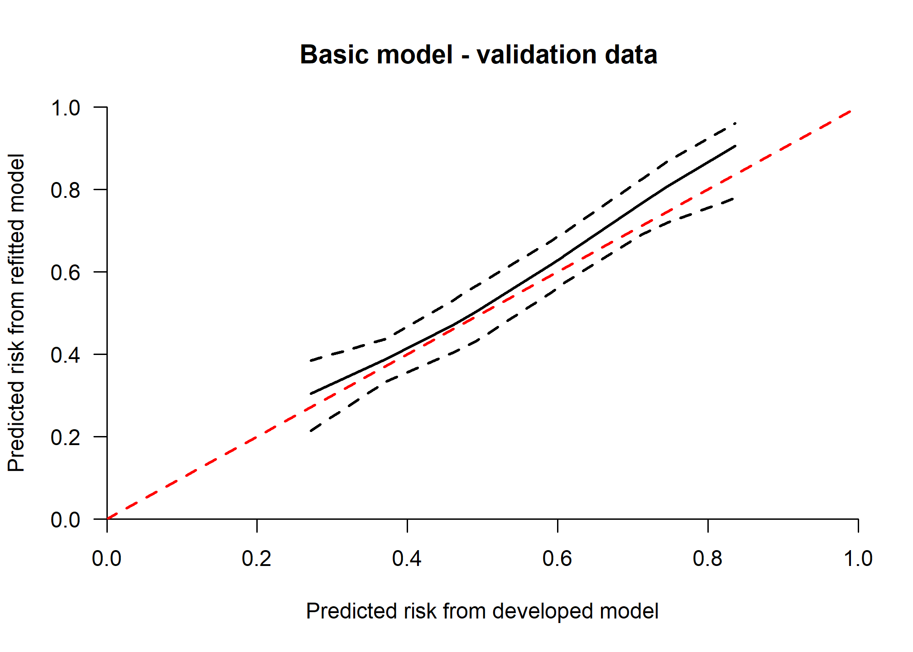
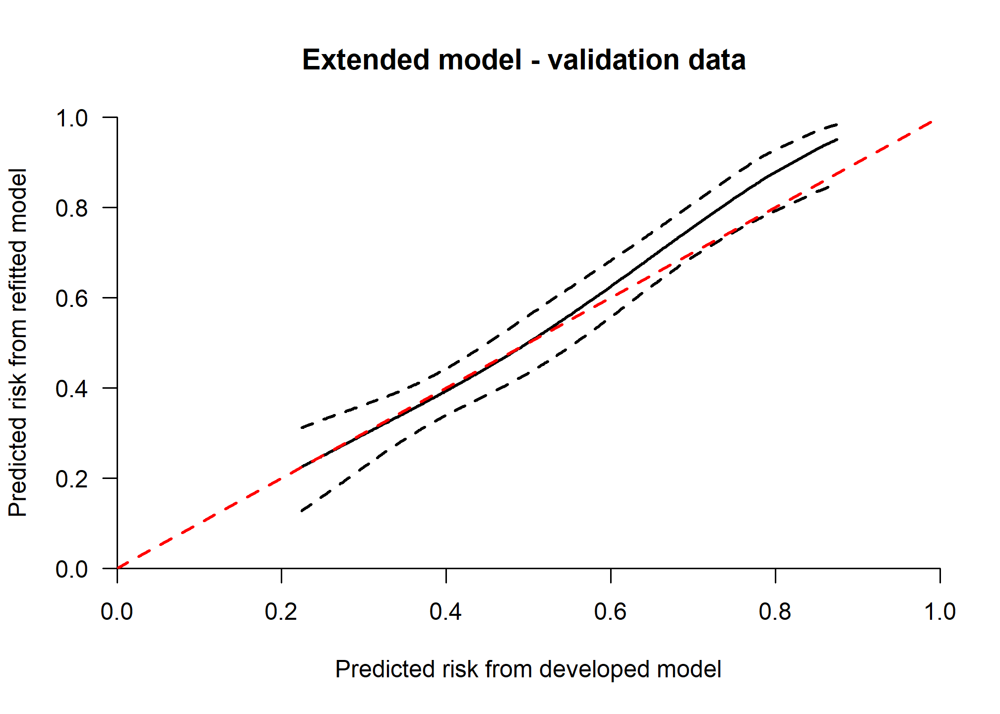
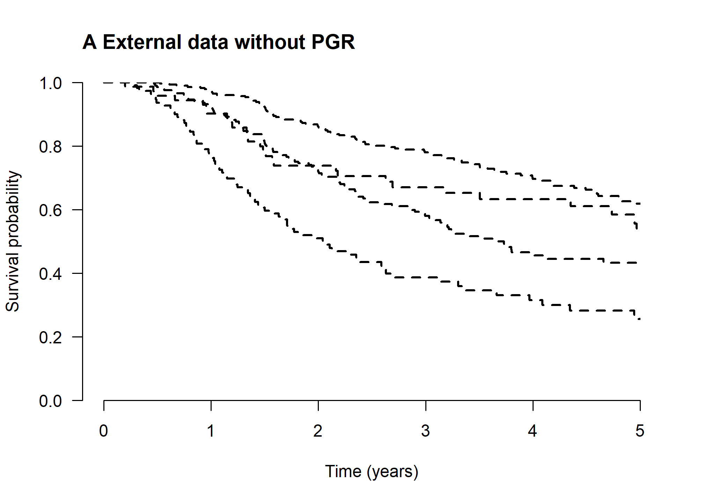
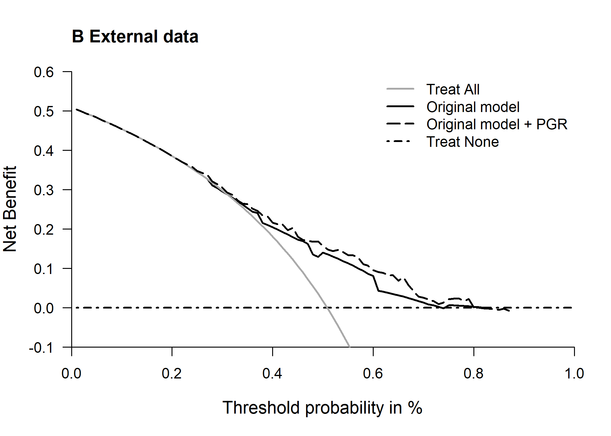

Performance assessment of survival prediction models
================

-   [Goals](#goals)
-   [Install/load packages and import
    data](#installload-packages-and-import-data)
    -   [Data preparation](#data-preparation)
-   [Goal 1: Assessing performance of a developed survival model in a
    new
    data](#goal-1-assessing-performance-of-a-developed-survival-model-in-a-new-data)
    -   [1.1 Calculate the absolute risk prediction at 5 years in the
        validation
        data](#11-calculate-the-absolute-risk-prediction-at-5-years-in-the-validation-data)
    -   [1.2 Discrimination measures](#12-discrimination-measures)
    -   [1.3 Calibration](#13-calibration)
        -   [1.3.1 Mean calibration - fixed time
            point](#131-mean-calibration---fixed-time-point)
        -   [1.3.2 Weak calibration - calibration slope for fixed time
            point](#132-weak-calibration---calibration-slope-for-fixed-time-point)
        -   [1.3.3 Moderate calibration - fixed time
            point](#133-moderate-calibration---fixed-time-point)
        -   [1.3.4 Calibration when only coefficients of the model are
            available](#134-calibration-when-only-coefficients-of-the-model-are-available)
    -   [1.4 Overall performance
        measures](#14-overall-performance-measures)
-   [Goal 2. Clinical utility](#goal-2-clinical-utility)
-   [Reproducibility ticket](#reproducibility-ticket)

## Goals

When a risk prediction model has been developed and published in the
literature, individual data that was used during model development are
not always available. In this document, we assume the scenario that a
risk prediction model was already developed and is available in the
literature. We assume that the author(s) developed a risk prediction
model using a Cox proportional hazard regression and provided the model
equation in terms of coefficients and the baseline survival at a fixed
time horizon *t* (e.g. five years).

The goals are:  
1. to assess the prediction performance of a published prediction model
with a time-to-event outcome in a new independent (external) data;  
2. to assess the potential clinical utility of a prediction model with
time-to-event outcome in the new data;

## Install/load packages and import data

First of all, install the R packages essential for the analyses. We
following libraries are needed to achieve the following goals. If you
don’t have them installed, please use install.packages(’‘)
(e.g. install.packages(’survival’)) or use the user-friendly approach if
you are using RStudio.

### Data preparation

Outcome and predictors in the new data must be coded as provided in the
model equation of the developed model. In our case study, the
time-to-event outcome should be in years and the predictors should be
categorized exactly as in the developed model.

In the prediction model developed using the Rotterdam data, the data was
administratively censored at 5 years. For this reason, we also
administratively censor the data from patients in the new (validation)
data at 5 years.

## Goal 1: Assessing performance of a developed survival model in a new data

The performance of a risk prediction models may be evaluated through:

-   discrimination: the ability of the model to correctly rank patients
    with and without the outcome by a certain time point. This requires
    the coefficients (or the log of the hazard ratios) of the developed
    Cox prediction model to be evaluated;

-   calibration: the agreement between observed and predicted
    probabilities. It additionally requires the baseline (cumulative)
    hazard or survival;

-   overall performance measures: a combination of discrimination and
    calibration.

Unfortunately, few publications report the complete baseline
(cumulative) hazard or survival or even the baseline (cumulative) hazard
or survival at fixed time horizon *t*.  
It is common that physicians focus on one or more clinically relevant
time horizons to inform subjects about their risk. We aim to assess the
prediction performance of a risk prediction model with time-to-event
outcome in a new data when information at a fixed time horizon(s) (here
at 5 years) of a developed prediction model were provided.

When the baseline is not available (unfortunately not uncommon in the
literature), only a graphical representation of calibration is possible.
We assume here to know the coefficients *and the baseline survival at 5
years *S*<sub>0</sub>*(t = 5)\* of the developed prediction model. We
also provide the graphical visualization of the calibration when the
baseline is not reported in the literature.

If the model equation is provided including the coefficients and the
baseline at fixed time point *t* (e.g. 5 years), we could validate the
risk prediction model in our external data. Typically, the model
equation is provided in terms of predicted survival at a fixed time
point *t*.


where:  
*S(t)* is the probability of surviving by time *t*.  
*S*<sub>0</sub>*(t)* is the baseline survival probability by time *t*.  

is the prognostic index: the combination of the model coefficients and
the value of the predictors.  

In some software, the baseline survival that is reported might relate to
the baseline survival when covariate values are all at the mean value.
Beware of that. See for example, the function `rms::cph()` and
`rms::cph()$center` in the `rms` package and in `survival` package
`help(basehaz)`, especially the argument `centered`. If the centercept
is mentioned in the model equation, this can be used to rescaled the
baseline using some algebraic steps.


### 1.1 Calculate the absolute risk prediction at 5 years in the validation data

This part must be run for all following parts of the code. After running
this, the user can also focus on one particular performance measure only
(e.g. discrimination).

### 1.2 Discrimination measures

Discrimination is the ability to differentiate between subjects who have
the outcome by a certain time point and subjects who do not. Concordance
can be assessed over several different time intervals:

-   the entire range of the data. Two concordance measures are
    suggested:

    -   Harrell’s C quantifies the degree of concordance as the
        proportion of evaluable pairs where the patient with a longer
        survival time has better predicted survival;

    -   Uno’s C uses a time dependent weighting that more fully adjusts
        for censoring;

-   a 5 year window corresponding to our target assessment point. Uno’s
    cumulative/dynamic time-dependent Area Under the Curve (AUC) is
    suggested. Uno’s time-dependent AUC summarizes discrimination at
    specific fixed time points. At any time point of interest, *t*, a
    patient is classified as having an event if the patient experienced
    the event between baseline and *t* (5 years in our case study), and
    as a non-event if the patient remained event-free at *t*. The
    time-dependent AUC evaluates whether predicted probabilities were
    higher for cases than for non-cases.

There is some uncertainty in the literature about the original Harrell
formulation versus Uno’s suggestion to re-weight the time scale by the
factor 1/*G*<sup>2</sup>(*t*) where *G* is the censoring distribution.
There is more detailed information in the concordance vignette found in
the survival package.

For all three measures, values close to 1 indicate good discrimination
ability, while values close to 0.5 indicated poor discrimination
ability.

<details>
<summary>
Click to expand code
</summary>

``` r
if (!require("pacman")) install.packages("pacman")
library(pacman)
pacman::p_load(survival,
               Hmisc,
               pec,
               timeROC)

harrell_C_gbsg5 <- concordance(Surv(ryear, rfs) ~ PI, 
                               gbsg5, 
                               reverse = TRUE)

harrell_C_gbsg5_pgr <- concordance(Surv(ryear, rfs) ~ PI_pgr, 
                               gbsg5, 
                               reverse = TRUE)

# Uno's C
Uno_C_gbsg5 <- concordance(Surv(ryear, rfs) ~ PI, 
                           gbsg5, 
                           reverse = TRUE,
                           timewt = "n/G2")

Uno_C_gbsg5_pgr <- concordance(Surv(ryear, rfs) ~ PI_pgr, 
                           gbsg5, 
                           reverse = TRUE,
                           timewt = "n/G2")
```

</details>
<table class="table table-striped" style="margin-left: auto; margin-right: auto;">
<thead>
<tr>
<th style="empty-cells: hide;border-bottom:hidden;" colspan="1">
</th>
<th style="border-bottom:hidden;padding-bottom:0; padding-left:3px;padding-right:3px;text-align: center; " colspan="3">

<div style="border-bottom: 1px solid #ddd; padding-bottom: 5px; ">

External

</div>

</th>
<th style="border-bottom:hidden;padding-bottom:0; padding-left:3px;padding-right:3px;text-align: center; " colspan="3">

<div style="border-bottom: 1px solid #ddd; padding-bottom: 5px; ">

External + PGR

</div>

</th>
</tr>
<tr>
<th style="text-align:left;">
</th>
<th style="text-align:right;">
Estimate
</th>
<th style="text-align:right;">
Lower .95
</th>
<th style="text-align:right;">
Upper .95
</th>
<th style="text-align:right;">
Estimate
</th>
<th style="text-align:right;">
Lower .95
</th>
<th style="text-align:right;">
Upper .95
</th>
</tr>
</thead>
<tbody>
<tr>
<td style="text-align:left;">
Harrell C - Validation data
</td>
<td style="text-align:right;">
0.65
</td>
<td style="text-align:right;">
0.62
</td>
<td style="text-align:right;">
0.68
</td>
<td style="text-align:right;">
0.68
</td>
<td style="text-align:right;">
0.65
</td>
<td style="text-align:right;">
0.71
</td>
</tr>
<tr>
<td style="text-align:left;">
Uno C - Validation data
</td>
<td style="text-align:right;">
0.64
</td>
<td style="text-align:right;">
0.61
</td>
<td style="text-align:right;">
0.67
</td>
<td style="text-align:right;">
0.67
</td>
<td style="text-align:right;">
0.63
</td>
<td style="text-align:right;">
0.70
</td>
</tr>
</tbody>
</table>

Concordance was between 0.64 and 0.68. The extended model slightly
improved discrimination ability compared to the basic model.

<details>
<summary>
Click to expand code
</summary>

``` r
if (!require("pacman")) install.packages("pacman")
library(pacman)
pacman::p_load(survival,
               Hmisc,
               pec,
               timeROC)

# External validation
Uno_gbsg5 <-
  timeROC(
    T = gbsg5$ryear, delta = gbsg5$rfs,
    marker = gbsg5$PI,
    cause = 1, weighting = "marginal", times = 4.99,
    iid = TRUE
  )

# External validation with pgr
Uno_gbsg5_pgr <-
  timeROC(
    T = gbsg5$ryear, delta = gbsg5$rfs,
    marker = gbsg5$PI_pgr,
    cause = 1, weighting = "marginal", times = 4.99,
    iid = TRUE
  )
# NOTE: if you have a lot of data n > 2000, standard error computation may be really long.
# In that case, please use bootstrap percentile to calculate confidence intervals.
```

</details>
<table class="table table-striped" style="margin-left: auto; margin-right: auto;">
<thead>
<tr>
<th style="empty-cells: hide;border-bottom:hidden;" colspan="1">
</th>
<th style="border-bottom:hidden;padding-bottom:0; padding-left:3px;padding-right:3px;text-align: center; " colspan="3">

<div style="border-bottom: 1px solid #ddd; padding-bottom: 5px; ">

External

</div>

</th>
<th style="border-bottom:hidden;padding-bottom:0; padding-left:3px;padding-right:3px;text-align: center; " colspan="3">

<div style="border-bottom: 1px solid #ddd; padding-bottom: 5px; ">

External + PGR

</div>

</th>
</tr>
<tr>
<th style="text-align:left;">
</th>
<th style="text-align:right;">
Estimate
</th>
<th style="text-align:right;">
Lower .95
</th>
<th style="text-align:right;">
Upper .95
</th>
<th style="text-align:right;">
Estimate
</th>
<th style="text-align:right;">
Lower .95
</th>
<th style="text-align:right;">
Upper .95
</th>
</tr>
</thead>
<tbody>
<tr>
<td style="text-align:left;">
Uno AUC
</td>
<td style="text-align:right;">
0.69
</td>
<td style="text-align:right;">
0.63
</td>
<td style="text-align:right;">
0.74
</td>
<td style="text-align:right;">
0.71
</td>
<td style="text-align:right;">
0.66
</td>
<td style="text-align:right;">
0.77
</td>
</tr>
</tbody>
</table>

The time-dependent AUCs at 5 years in the external validation were 0.69
and 0.71 for the basic and extended model, respectively.

### 1.3 Calibration

Calibration is the agreement between observed outcomes and predicted
probabilities. For example, in survival models, a predicted survival
probability at a fixed time horizon *t* of 80% is considered reliable if
it can be expected that 80 out of 100 will survive among patients who
received a predicted survival probability of 80%. Calibration can be
assessed at a fixed time point (e.g. at 5 years), and globally
(considering the entire range of the data). In addition, different level
of calibration assessment can be estimated according to the level of
information available in the data. When individual data of development
and validation set are available, full assessment of calibration is
possible. Calibration at fixed time point is possible when baseline
hazard at fixed time point and coefficient are available. When only
coefficients are available, assessment of calibration is limited.

In the scenario we consider here, we can evaluate calibration only at
fixed time point *t* (i.e. 5 years) since we may have baseline survival
at time *t* (5 years) and coefficients of the model.

-   Mean calibration at a fixed time point can be estimated using the
    Observed versus Expected ratio at time t;

-   Weak calibration can be estimated by additionally calculating
    calibration slope.

-   Moderate calibration can estimated at a fixed time point using a
    flexible calibration curve, complemented with ICI, E50, E90.

More detailed explanations are available in the paper.

#### 1.3.1 Mean calibration - fixed time point

The mean calibration at fixed time point (e.g. at 5 years) can be
estimated using the Observed versus Expected ratio. The observed is
estimated using the complementary of the Kaplan-Meier curve at the fixed
time point. The expected is estimated using the average predicted risk
of the event at the fixed time point.

<details>
<summary>
Click to expand code
</summary>

``` r
if (!require("pacman")) install.packages("pacman")
library(pacman)
pacman::p_load(survival,
               Hmisc,
               pec,
               timeROC,
               rms)
##  Observed / Expected ratio at time t ------------
# Observed: 1-Kaplan Meier at time (t)
horizon <- 5
obj <- summary(survfit(Surv(ryear, rfs) ~ 1, 
                       data = gbsg5), 
               times = horizon)

OE <- (1 - obj$surv) / mean(gbsg5$pred5)
OE_pgr <- (1 - obj$surv) / mean(gbsg5$pred5_pgr)
```

</details>
<table class="table table-striped" style="margin-left: auto; margin-right: auto;">
<thead>
<tr>
<th style="empty-cells: hide;border-bottom:hidden;" colspan="1">
</th>
<th style="border-bottom:hidden;padding-bottom:0; padding-left:3px;padding-right:3px;text-align: center; " colspan="3">

<div style="border-bottom: 1px solid #ddd; padding-bottom: 5px; ">

External

</div>

</th>
<th style="border-bottom:hidden;padding-bottom:0; padding-left:3px;padding-right:3px;text-align: center; " colspan="3">

<div style="border-bottom: 1px solid #ddd; padding-bottom: 5px; ">

External + PGR

</div>

</th>
</tr>
<tr>
<th style="text-align:left;">
</th>
<th style="text-align:right;">
Estimate
</th>
<th style="text-align:right;">
Lower .95
</th>
<th style="text-align:right;">
Upper .95
</th>
<th style="text-align:right;">
Estimate
</th>
<th style="text-align:right;">
Lower .95
</th>
<th style="text-align:right;">
Upper .95
</th>
</tr>
</thead>
<tbody>
<tr>
<td style="text-align:left;">
OE ratio
</td>
<td style="text-align:right;">
1.04
</td>
<td style="text-align:right;">
0.93
</td>
<td style="text-align:right;">
1.17
</td>
<td style="text-align:right;">
1.02
</td>
<td style="text-align:right;">
0.91
</td>
<td style="text-align:right;">
1.14
</td>
</tr>
</tbody>
</table>

Observed and Expected ratio is 1.07 (95% CI: 0.93 - 1.17) for the basic
model and 1.02 (95% CI: 0.91 - 1.14) for the extended model.

#### 1.3.2 Weak calibration - calibration slope for fixed time point

<details>
<summary>
Click to expand code
</summary>

``` r
if (!require("pacman")) install.packages("pacman")
library(pacman)
pacman::p_load(survival,
               Hmisc,
               pec,
               timeROC,
               rms)

# cloglog and center for the basic and extended model
lp.val <- log(-log(1 - gbsg5$pred5))   # lp = cloglog
lp.val_pgr <- log(-log(1 - gbsg5$pred5_pgr)) 
center <- mean(lp.val)  # center
center_pgr <- mean(lp.val_pgr)  # center


### Model with a slope and an intercept
horizon <- 5
f.val <- coxph(Surv(gbsg5$ryear, gbsg5$rfs) ~ lp.val)  
slope <- f.val$coefficients[1]
slope.se <- sqrt(vcov(f.val)[[1, 1]])

f.val_pgr <- coxph(Surv(gbsg5$ryear, gbsg5$rfs) ~ lp.val_pgr)  
slope_pgr <- f.val_pgr$coefficients[1]
slope.se_pgr <- sqrt(vcov(f.val_pgr)[[1, 1]])
```

</details>
<table class="table table-striped" style="margin-left: auto; margin-right: auto;">
<thead>
<tr>
<th style="empty-cells: hide;border-bottom:hidden;" colspan="1">
</th>
<th style="border-bottom:hidden;padding-bottom:0; padding-left:3px;padding-right:3px;text-align: center; " colspan="3">

<div style="border-bottom: 1px solid #ddd; padding-bottom: 5px; ">

External

</div>

</th>
<th style="border-bottom:hidden;padding-bottom:0; padding-left:3px;padding-right:3px;text-align: center; " colspan="3">

<div style="border-bottom: 1px solid #ddd; padding-bottom: 5px; ">

External + PGR

</div>

</th>
</tr>
<tr>
<th style="text-align:left;">
</th>
<th style="text-align:right;">
Estimate
</th>
<th style="text-align:right;">
Lower .95
</th>
<th style="text-align:right;">
Upper .95
</th>
<th style="text-align:right;">
Estimate
</th>
<th style="text-align:right;">
Lower .95
</th>
<th style="text-align:right;">
Upper .95
</th>
</tr>
</thead>
<tbody>
<tr>
<td style="text-align:left;">
Calibration slope
</td>
<td style="text-align:right;">
1.07
</td>
<td style="text-align:right;">
0.82
</td>
<td style="text-align:right;">
1.32
</td>
<td style="text-align:right;">
1.2
</td>
<td style="text-align:right;">
0.96
</td>
<td style="text-align:right;">
1.44
</td>
</tr>
</tbody>
</table>

Calibration slope was 1.07 and 1.20 for the basic and extended model,
respectively.

#### 1.3.3 Moderate calibration - fixed time point

Moderate calibration at fixed time point can be assessed using flexible
calibration curve, complemented with ICI, E50, E90 as suggested by
Austin et al.

-   Calibration curve is a graphical representation of moderate
    calibration. It shows:

    -   on the *x-axis* the predicted survival (or risk) probabilities
        at a fixed time horizon (e.g. at 5 years);

    -   on the *y-axis* the observed survival (or risk) probabilities at
        a fixed time horizon (e.g. at 5 years);

    -   The 45-degree line indicates perfect calibration. Points below
        the 45-degree line indicate that the model overestimates the
        observed risk. If points are above the 45-degree line, the model
        underestimate the observed risk; The observed probabilities
        estimated by the Kaplan-Meier curves (in case of survival) or by
        the complementary of the Kaplan-Meier curves (in case of risk)
        are represented in terms of percentiles of the predicted
        survival (risk) probabilities.

-   Integrated Calibration Index (ICI) is the weighted mean of absolute
    difference between smoothed observed proportions and predicted
    probabilities in which observations are weighted by the empirical
    density function of the predicted probabilities;

-   E50 and E90 denote the median and the 90th percentile of the
    absolute differences between observed and predicted probabilities of
    the outcome at time *t*;

<details>
<summary>
Click to expand code
</summary>

``` r
if (!require("pacman")) install.packages("pacman")
library(pacman)
pacman::p_load(survival,
               Hmisc,
               pec,
               timeROC,
               rms)

# Calibration plot --------
# Basic model
gbsg5 <- data.frame(gbsg5)
gbsg5$pred.cll <- log(-log(1 - gbsg5$pred5))

# Extended model
gbsg5$pred.cll_pgr <- log(-log(1 - gbsg5$pred5_pgr))


# Estimate actual risk - basic model
vcal <- cph(Surv(ryear, rfs) ~ rcs(pred.cll, 3),
            x = T,
            y = T,
            surv = T,
            data = gbsg5
) 

# Estimate actual risk - extended model
vcal_pgr <- cph(Surv(ryear, rfs) ~ rcs(pred.cll_pgr, 3),
            x = T,
            y = T,
            surv = T,
            data = gbsg5
) 


dat_cal <- cbind.data.frame(
  "obs" = 1 - survest(vcal, 
                      times = 5, 
                      newdata = gbsg5)$surv,
  
  "lower" = 1 - survest(vcal, 
                        times = 5, 
                        newdata = gbsg5)$upper,
  
  "upper" = 1 - survest(vcal, 
                        times = 5, 
                        newdata = gbsg5)$lower,
  
  "pred" = as.vector(gbsg5$pred5),
  
  
   "obs_pgr" = 1 - survest(vcal_pgr, 
                      times = 5, 
                      newdata = gbsg5)$surv,
  
  "lower_pgr" = 1 - survest(vcal_pgr, 
                        times = 5, 
                        newdata = gbsg5)$upper,
  
  "upper_pgr" = 1 - survest(vcal_pgr, 
                        times = 5, 
                        newdata = gbsg5)$lower,
  
  "pred_pgr" = as.vector(gbsg5$pred5_pgr)
  
)


# Flexible calibration curve - basic model
dat_cal <- dat_cal[order(dat_cal$pred), ]

par(xaxs = "i", yaxs = "i", las = 1)
plot(
  dat_cal$pred, 
  dat_cal$obs,
  type = "l", 
  lty = 1, 
  xlim = c(0, 1),
  ylim = c(0, 1), 
  lwd = 2,
  xlab = "Predicted risk from developed model",
  ylab = "Predicted risk from refitted model", bty = "n"
)
lines(dat_cal$pred, 
      dat_cal$lower, 
      type = "l", 
      lty = 2, 
      lwd = 2)
lines(dat_cal$pred, 
      dat_cal$upper,
      type = "l", 
      lty = 2, 
      lwd = 2)
abline(0, 1, lwd = 2, lty = 2, col = "red")
title("Basic model - validation data ")


# Flexible calibration curve - extended model
dat_cal <- dat_cal[order(dat_cal$pred_pgr), ]
par(xaxs = "i", yaxs = "i", las = 1)
plot(
  dat_cal$pred_pgr, 
  dat_cal$obs_pgr,
  type = "l", 
  lty = 1, 
  xlim = c(0, 1),
  ylim = c(0, 1), 
  lwd = 2,
  xlab = "Predicted risk from developed model",
  ylab = "Predicted risk from refitted model", 
  bty = "n"
)
lines(dat_cal$pred_pgr, 
      dat_cal$lower_pgr, 
      type = "l", 
      lty = 2, 
      lwd = 2)
lines(dat_cal$pred_pgr, 
      dat_cal$upper_pgr,
      type = "l", 
      lty = 2, 
      lwd = 2)
abline(0, 1, lwd = 2, lty = 2, col = "red")
title("Extended model - validation data ")

# Numerical measures ---------------
# Basic model
absdiff_cph <- abs(dat_cal$pred - dat_cal$obs)

numsum_cph <- c(
  "ICI" = mean(absdiff_cph),
  setNames(quantile(absdiff_cph, c(0.5, 0.9)), c("E50", "E90"))
)

# Extended model ------
absdiff_cph_pgr <- abs(dat_cal$pred_pgr - dat_cal$obs_pgr)

numsum_cph_pgr <- c(
  "ICI" = mean(absdiff_cph_pgr),
  setNames(quantile(absdiff_cph_pgr, c(0.5, 0.9)), c("E50", "E90"))
)
```

</details>



<table class="table table-striped" style="margin-left: auto; margin-right: auto;">
<thead>
<tr>
<th style="text-align:left;">
</th>
<th style="text-align:right;">
ICI
</th>
<th style="text-align:right;">
E50
</th>
<th style="text-align:right;">
E90
</th>
</tr>
</thead>
<tbody>
<tr>
<td style="text-align:left;">
External data
</td>
<td style="text-align:right;">
0.03
</td>
<td style="text-align:right;">
0.03
</td>
<td style="text-align:right;">
0.06
</td>
</tr>
<tr>
<td style="text-align:left;">
External data + PGR
</td>
<td style="text-align:right;">
0.02
</td>
<td style="text-align:right;">
0.01
</td>
<td style="text-align:right;">
0.07
</td>
</tr>
</tbody>
</table>

In the validation, ICI at 5 years was 0.03 and 0.02 for the basic and
extended model, respectively.

#### 1.3.4 Calibration when only coefficients of the model are available

When only coefficients of the development model are available and the
baseline survival is not provided, limited visual assessment of
calibration is sometimes possible based on Kaplan-Meier curves between
risk groups. Namely, if the development paper reported stratified
Kaplan-Meier curves for risk groups (eg according to quantiles of the PI
and these quantiles are provided) then it is possible to compare these
with the corresponding Kaplan-Meier curves from the validation cohort.
Further, plots where the curves are widely separated between risk groups
provide informal evidence of discrimination.

<details>
<summary>
Click to expand code
</summary>

``` r
# we assume the groups (cutpoints for linear predictor) are known from the publication of development model:
rotterdam_breaks <- c(-0.4577215, 0.2211214,  0.5990059,  1.0598272,  2.0176602)
# note that we obtained these from development data 
# rotterdam$lp_pgr <- predict(efit1_pgr, newdata = rotterdam, reference="zero") #note this requires object 'efit1_pgr' from the 01 code; we use reference is zero to avoid centering
# rotterdam_breaks = as.vector(quantile(rotterdam$lp_pgr, probs = seq(0, 1, 0.25)))

gbsg5$group1_pgr <- cut(gbsg5$PI_pgr, 
                    breaks =  c(-1000, rotterdam_breaks[2:4], +1000),
                    lowest = TRUE)
# table(gbsg5$group1_pgr)

par(las = 1, xaxs = "i", yaxs = "i")
plot(survfit(Surv(ryear, rfs) ~ group1_pgr, 
             data = gbsg5),
     bty = "n",
     xlim = c(0, 5), 
     ylim = c(0, 1), 
     lwd = 2, 
     col = "black",
     lty = 2, 
     xlab = "Time (years)", 
     ylab = "Survival probability"
)
title("Extended model validation set", adj = 0)
```

</details>



### 1.4 Overall performance measures

Two overall performance measures are proposed for prediction models with
a survival outcome:

-   Brier score: it is the mean squared difference between observed
    event indicators and predicted risks at a fixed time point (e.g. at
    5 years), lower is better;

-   Scaled Brier score, also known as Index of Prediction Accuracy
    (IPA): it improves interpretability by scaling the Brier Score. It
    is the decrease in Brier compared to a null model, expressed as a
    percentage, higher is better.

<details>
<summary>
Click to expand code
</summary>

``` r
brier_gbsg5 <-
  brier_score(
    tfup = gbsg5$ryear, status = gbsg5$rfs,
    thorizon = 4.99, survival = 1 - gbsg5$pred5
  )

brier_gbsg5b_pgr <-
  brier_score(
    tfup = gbsg5$ryear, status = gbsg5$rfs,
    thorizon = 4.99, survival = 1 - gbsg5$pred5_pgr
  )

## Overall measures: Bootstrap confidence intervals ---------------
B <- 100
horizon <- 4.99
set.seed(12345)
boots_ls <- lapply(seq_len(B), function(b) {
  
  # Resample validation data
  data_boot <- gbsg5[sample(nrow(gbsg5), replace = TRUE), ]

  
  # Get overall measures on boot validation data
  BS_boot <- brier_score(
    tfup = data_boot$ryear, status = data_boot$rfs,
    thorizon = 4.99, survival = 1 - data_boot$pred5
  )
  
  # Get overall measures on boot validation data
  BS_boot_pgr <- brier_score(
    tfup = data_boot$ryear, status = data_boot$rfs,
    thorizon = 4.99, survival = 1 - data_boot$pred5_pgr
  )
    
  brier_boot <- BS_boot["Brier"]
  scaled_brier <- BS_boot["IPA"]
  brier_boot_pgr <- BS_boot_pgr["Brier"]
  scaled_brier_pgr <- BS_boot_pgr["IPA"]
  #.. can add other measure heres, eg. concordance
  
  cbind.data.frame(
    "Brier" = brier_boot,
    "Scaled Brier" = scaled_brier,
    "Brier with PGR" = brier_boot_pgr,
    "Scaled Brier with PGR" = scaled_brier_pgr)
})

df_boots <- do.call(rbind.data.frame, boots_ls)

# As an alternative you can use riskRegression::Score() 
# to calculate the Brier score and IPA (scaled Brier Score). 
# However, the following code did not provide confidence intervals
# for the scaled Brier score (i.e. IPA)

# For basic model
score_gbsg5 <-
  Score(list(gbsg5$pred5),
        formula = Surv(ryear, rfs) ~ 1, 
        data = gbsg5, 
        conf.int = TRUE, 
        times = 4.99,
        cens.model = "km", 
        metrics = "brier",
        summary = "ipa"
  )

# For extended code including PGR
score_gbsg5_pgr <-
  Score(list(gbsg5$pred5_pgr),
        formula = Surv(ryear, rfs) ~ 1, 
        data = gbsg5, 
        conf.int = TRUE, 
        times = 4.99,
        cens.model = "km", 
        metrics = "brier",
        summary = "ipa"
  )
```

</details>
<table class="table table-striped" style="margin-left: auto; margin-right: auto;">
<thead>
<tr>
<th style="empty-cells: hide;border-bottom:hidden;" colspan="1">
</th>
<th style="border-bottom:hidden;padding-bottom:0; padding-left:3px;padding-right:3px;text-align: center; " colspan="3">

<div style="border-bottom: 1px solid #ddd; padding-bottom: 5px; ">

External

</div>

</th>
<th style="border-bottom:hidden;padding-bottom:0; padding-left:3px;padding-right:3px;text-align: center; " colspan="3">

<div style="border-bottom: 1px solid #ddd; padding-bottom: 5px; ">

External + PGR

</div>

</th>
</tr>
<tr>
<th style="text-align:left;">
</th>
<th style="text-align:right;">
Estimate
</th>
<th style="text-align:right;">
Lower .95
</th>
<th style="text-align:right;">
Upper .95
</th>
<th style="text-align:right;">
Estimate
</th>
<th style="text-align:right;">
Lower .95
</th>
<th style="text-align:right;">
Upper .95
</th>
</tr>
</thead>
<tbody>
<tr>
<td style="text-align:left;">
Brier
</td>
<td style="text-align:right;">
0.22
</td>
<td style="text-align:right;">
0.21
</td>
<td style="text-align:right;">
0.24
</td>
<td style="text-align:right;">
0.22
</td>
<td style="text-align:right;">
0.20
</td>
<td style="text-align:right;">
0.23
</td>
</tr>
<tr>
<td style="text-align:left;">
Scaled Brier
</td>
<td style="text-align:right;">
0.10
</td>
<td style="text-align:right;">
0.04
</td>
<td style="text-align:right;">
0.17
</td>
<td style="text-align:right;">
0.14
</td>
<td style="text-align:right;">
0.07
</td>
<td style="text-align:right;">
0.19
</td>
</tr>
</tbody>
</table>

As expected the overall performance measures were lower in the external
validation compared to the performance in the development data.
Including PGR slightly improved the overall performance.

## Goal 2. Clinical utility

Discrimination and calibration measures are essential to assess the
prediction performance but insufficient to evaluate the potential
clinical utility of a risk prediction model for decision making.
Clinical utility assessment evaluates whether a prediction model helps
to improve decision making.  
Clinical utility is measured by the net benefit that includes the number
of true positives and the number of false positives. The true positives
reflect the benefit of correctly predicting patients who will experience
an event during a given time horizon, giving the opportunity to use
additional interventions such as additional treatments, personalized
follow-up or additional surgeries. The false positives represent the
harms of incorrectly predicting events possibly leading to unnecessary
additional interventions. Net benefit is the number of true positives
classifications minus the false positives classifications weighted by a
factor related to the harm of failing to predict an event versus and the
harm of falsely predicting an event. The weighting is derived from a
predefined threshold probability using a defined time horizon (for
example 5 years since diagnosis). For example, a threshold of 10%
implies that additional interventions for 10 patients of whom one would
have experienced the event in the next 5 years if untreated is
acceptable (thus treating 9 patients unnecessarily). This strategy is
compared with the strategies of treating all and treating none of the
patients. If overtreatment is harmful, a higher threshold should be
used.  
The net benefit is calculated as:


*TP*=true positive patients  
*FP*=false positive patients  
*n*=number of patients and *p*<sub>t</sub> is the risk threshold.

For survival data *TP* and *FP* is calculated as follows:  


where  
*S(t)* survival at time *t*  
*X=1* when the predicted probability at time *t* exceeds *p*<sub>t</sub>

And the decision curve is calculated as follows:

1.  Choose a time horizon (in this case 5 years);
2.  Specify a risk threshold which reflects the ratio between harms and
    benefit of an additional intervention;
3.  Calculate the number of true positives and false positives given the
    threshold specified in (2);
4.  Calculate the net benefit of the survival model;
5.  Plot net benefit on the *y-axis* against the risk threshold on the
    *x-axis*;
6.  Repeat steps 2-4 for each model consideration;
7.  Repeat steps 2-4 for the strategy assuming all patients are treated;
8.  Draw a straight line parallel to the *x-axis* at y=0 representing
    the net benefit associated with the strategy assuming that none of
    the patients are treated.

<details>
<summary>
Click to expand code
</summary>

``` r
# External data
# Run decision curve analysis

# Development data
# Model without PGR
gbsg5 <- as.data.frame(gbsg5)
dca_gbsg5 <- stdca(
  data = gbsg5, outcome = "rfs", ttoutcome = "ryear",
  timepoint = 5, predictors = "pred5", xstop = 1.0,
  ymin = -0.01, graph = FALSE
)
# Model with PGR
dca_gbsg5_pgr <- stdca(
  data = gbsg5, outcome = "rfs", ttoutcome = "ryear",
  timepoint = 5, predictors = "pred5_pgr", xstop = 1,
  ymin = -0.01, graph = FALSE
)

# Decision curves plot
par(xaxs = "i", yaxs = "i", las = 1)
plot(dca_gbsg5$net.benefit$threshold,
  dca_gbsg5$net.benefit$pred5,
  type = "l", 
  lwd = 2, 
  lty = 1,
  xlab = "Threshold probability in %", 
  ylab = "Net Benefit",
  xlim = c(0, 1), 
  ylim = c(-0.10, 0.60), 
  bty = "n",
  cex.lab = 1.2, 
  cex.axis = 1
)
lines(dca_gbsg5$net.benefit$threshold, 
      dca_gbsg5$net.benefit$none, 
      type = "l", 
      lwd = 2, 
      lty = 4)
lines(dca_gbsg5$net.benefit$threshold, 
      dca_gbsg5$net.benefit$all, 
      type = "l", 
      lwd = 2, 
      col = "darkgray")
lines(dca_gbsg5_pgr$net.benefit$threshold,
      dca_gbsg5_pgr$net.benefit$pred5_pgr, 
      type = "l", 
      lwd = 2, 
      lty = 5)
legend("topright",
  c(
    "Treat All",
    "Original model",
    "Original model + PGR",
    "Treat None"
  ),
  lty = c(1, 1, 5, 4), lwd = 2, 
  col = c("darkgray", "black", "black", "black"),
  bty = "n"
)
title("B External data", adj = 0, cex = 1.5)
```

</details>

    ## [1] "pred5: No observations with risk greater than 84%, and therefore net benefit not calculable in this range."

    ## [1] "pred5_pgr: No observations with risk greater than 88%, and therefore net benefit not calculable in this range."



<table class="table table-striped" style="margin-left: auto; margin-right: auto;">
<thead>
<tr>
<th style="text-align:right;">
Theshold
</th>
<th style="text-align:right;">
Net benefit - Treat all
</th>
<th style="text-align:right;">
Net benefit - basic model
</th>
<th style="text-align:right;">
Net benefit - extended model with PGR
</th>
</tr>
</thead>
<tbody>
<tr>
<td style="text-align:right;">
0.23
</td>
<td style="text-align:right;">
0.362
</td>
<td style="text-align:right;">
0.362
</td>
<td style="text-align:right;">
0.363
</td>
</tr>
</tbody>
</table>

For the validation data, at 23% threshold the potential net benefit was
0.362 and 0.363 for the basic and extended model respectively. These
were highly similar to those of the ‘treat all’ strategy (0.362).

Moreover, net benefit can be defined in terms of reduction of avoidable
interventions (e.g adjuvant chemotherapy per 100 patients) by:


where *NB*<sub>model</sub> is the net benefit of the prediction model,
*NB*<sub>all</sub> is the net benefit of the strategy treat all and
*p*<sub>*t*</sub> is the risk threshold.

## Reproducibility ticket

``` r
sessioninfo::session_info()
```

    ## - Session info ---------------------------------------------------------------
    ##  setting  value
    ##  version  R version 4.1.2 (2021-11-01)
    ##  os       Windows 10 x64 (build 19044)
    ##  system   x86_64, mingw32
    ##  ui       RTerm
    ##  language (EN)
    ##  collate  English_United States.1252
    ##  ctype    English_United States.1252
    ##  tz       Europe/Berlin
    ##  date     2022-03-17
    ##  pandoc   2.14.0.3 @ C:/Program Files/RStudio/bin/pandoc/ (via rmarkdown)
    ## 
    ## - Packages -------------------------------------------------------------------
    ##  package        * version    date (UTC) lib source
    ##  assertthat       0.2.1      2019-03-21 [1] CRAN (R 4.1.2)
    ##  backports        1.3.0      2021-10-27 [1] CRAN (R 4.1.1)
    ##  base64enc        0.1-3      2015-07-28 [1] CRAN (R 4.1.1)
    ##  broom            0.7.10     2021-10-31 [1] CRAN (R 4.1.2)
    ##  broom.helpers    1.5.0      2021-12-07 [1] CRAN (R 4.1.2)
    ##  caret            6.0-90     2021-10-09 [1] CRAN (R 4.1.2)
    ##  cellranger       1.1.0      2016-07-27 [1] CRAN (R 4.1.2)
    ##  checkmate        2.0.0      2020-02-06 [1] CRAN (R 4.1.2)
    ##  class            7.3-19     2021-05-03 [2] CRAN (R 4.1.2)
    ##  cli              3.1.0      2021-10-27 [1] CRAN (R 4.1.2)
    ##  cluster          2.1.2      2021-04-17 [2] CRAN (R 4.1.2)
    ##  cmprsk           2.2-10     2020-06-09 [1] CRAN (R 4.1.2)
    ##  codetools        0.2-18     2020-11-04 [2] CRAN (R 4.1.2)
    ##  colorspace       2.0-2      2021-06-24 [1] CRAN (R 4.1.2)
    ##  conquer          1.2.1      2021-11-01 [1] CRAN (R 4.1.2)
    ##  crayon           1.4.2      2021-10-29 [1] CRAN (R 4.1.2)
    ##  data.table       1.14.2     2021-09-27 [1] CRAN (R 4.1.2)
    ##  DBI              1.1.1      2021-01-15 [1] CRAN (R 4.1.2)
    ##  dbplyr           2.1.1      2021-04-06 [1] CRAN (R 4.1.2)
    ##  digest           0.6.29     2021-12-01 [1] CRAN (R 4.1.2)
    ##  dplyr          * 1.0.7      2021-06-18 [1] CRAN (R 4.1.2)
    ##  ellipsis         0.3.2      2021-04-29 [1] CRAN (R 4.1.2)
    ##  evaluate         0.14       2019-05-28 [1] CRAN (R 4.1.2)
    ##  fansi            0.5.0      2021-05-25 [1] CRAN (R 4.1.2)
    ##  fastmap          1.1.0      2021-01-25 [1] CRAN (R 4.1.2)
    ##  forcats        * 0.5.1      2021-01-27 [1] CRAN (R 4.1.2)
    ##  foreach          1.5.1      2020-10-15 [1] CRAN (R 4.1.2)
    ##  foreign          0.8-81     2020-12-22 [2] CRAN (R 4.1.2)
    ##  Formula        * 1.2-4      2020-10-16 [1] CRAN (R 4.1.1)
    ##  fs               1.5.1      2021-11-30 [1] CRAN (R 4.1.2)
    ##  future           1.23.0     2021-10-31 [1] CRAN (R 4.1.2)
    ##  future.apply     1.8.1      2021-08-10 [1] CRAN (R 4.1.2)
    ##  geepack        * 1.3.3      2022-01-09 [1] CRAN (R 4.1.2)
    ##  generics         0.1.1      2021-10-25 [1] CRAN (R 4.1.2)
    ##  ggplot2        * 3.3.5      2021-06-25 [1] CRAN (R 4.1.2)
    ##  globals          0.14.0     2020-11-22 [1] CRAN (R 4.1.1)
    ##  glue             1.5.1      2021-11-30 [1] CRAN (R 4.1.2)
    ##  gower            0.2.2      2020-06-23 [1] CRAN (R 4.1.1)
    ##  gridExtra        2.3        2017-09-09 [1] CRAN (R 4.1.2)
    ##  gt               0.3.1      2021-08-07 [1] CRAN (R 4.1.2)
    ##  gtable           0.3.0      2019-03-25 [1] CRAN (R 4.1.2)
    ##  gtsummary      * 1.5.0      2021-10-16 [1] CRAN (R 4.1.2)
    ##  haven            2.4.3      2021-08-04 [1] CRAN (R 4.1.2)
    ##  here             1.0.1      2020-12-13 [1] CRAN (R 4.1.2)
    ##  highr            0.9        2021-04-16 [1] CRAN (R 4.1.2)
    ##  Hmisc          * 4.6-0      2021-10-07 [1] CRAN (R 4.1.2)
    ##  hms              1.1.1      2021-09-26 [1] CRAN (R 4.1.2)
    ##  htmlTable        2.3.0      2021-10-12 [1] CRAN (R 4.1.2)
    ##  htmltools        0.5.2      2021-08-25 [1] CRAN (R 4.1.2)
    ##  htmlwidgets      1.5.4      2021-09-08 [1] CRAN (R 4.1.2)
    ##  httr             1.4.2      2020-07-20 [1] CRAN (R 4.1.2)
    ##  ipred            0.9-12     2021-09-15 [1] CRAN (R 4.1.2)
    ##  iterators        1.0.13     2020-10-15 [1] CRAN (R 4.1.2)
    ##  jpeg             0.1-9      2021-07-24 [1] CRAN (R 4.1.1)
    ##  jsonlite         1.7.2      2020-12-09 [1] CRAN (R 4.1.2)
    ##  kableExtra     * 1.3.4      2021-02-20 [1] CRAN (R 4.1.2)
    ##  knitr          * 1.36       2021-09-29 [1] CRAN (R 4.1.2)
    ##  lattice        * 0.20-45    2021-09-22 [2] CRAN (R 4.1.2)
    ##  latticeExtra     0.6-29     2019-12-19 [1] CRAN (R 4.1.2)
    ##  lava             1.6.10     2021-09-02 [1] CRAN (R 4.1.2)
    ##  lifecycle        1.0.1      2021-09-24 [1] CRAN (R 4.1.2)
    ##  listenv          0.8.0      2019-12-05 [1] CRAN (R 4.1.2)
    ##  lubridate        1.8.0      2021-10-07 [1] CRAN (R 4.1.2)
    ##  magrittr         2.0.1      2020-11-17 [1] CRAN (R 4.1.2)
    ##  MASS             7.3-54     2021-05-03 [2] CRAN (R 4.1.2)
    ##  Matrix           1.3-4      2021-06-01 [2] CRAN (R 4.1.2)
    ##  MatrixModels     0.5-0      2021-03-02 [1] CRAN (R 4.1.2)
    ##  matrixStats      0.61.0     2021-09-17 [1] CRAN (R 4.1.2)
    ##  mets             1.2.9      2021-09-06 [1] CRAN (R 4.1.2)
    ##  ModelMetrics     1.2.2.2    2020-03-17 [1] CRAN (R 4.1.2)
    ##  modelr           0.1.8      2020-05-19 [1] CRAN (R 4.1.2)
    ##  multcomp         1.4-17     2021-04-29 [1] CRAN (R 4.1.2)
    ##  munsell          0.5.0      2018-06-12 [1] CRAN (R 4.1.2)
    ##  mvtnorm          1.1-3      2021-10-08 [1] CRAN (R 4.1.1)
    ##  nlme             3.1-153    2021-09-07 [2] CRAN (R 4.1.2)
    ##  nnet             7.3-16     2021-05-03 [2] CRAN (R 4.1.2)
    ##  numDeriv         2016.8-1.1 2019-06-06 [1] CRAN (R 4.1.1)
    ##  pacman         * 0.5.1      2019-03-11 [1] CRAN (R 4.1.2)
    ##  parallelly       1.29.0     2021-11-21 [1] CRAN (R 4.1.2)
    ##  pec            * 2021.10.11 2021-10-11 [1] CRAN (R 4.1.2)
    ##  pillar           1.6.4      2021-10-18 [1] CRAN (R 4.1.2)
    ##  pkgconfig        2.0.3      2019-09-22 [1] CRAN (R 4.1.2)
    ##  plyr             1.8.6      2020-03-03 [1] CRAN (R 4.1.2)
    ##  png              0.1-7      2013-12-03 [1] CRAN (R 4.1.1)
    ##  polspline        1.1.19     2020-05-15 [1] CRAN (R 4.1.1)
    ##  pROC             1.18.0     2021-09-03 [1] CRAN (R 4.1.2)
    ##  prodlim        * 2019.11.13 2019-11-17 [1] CRAN (R 4.1.2)
    ##  purrr          * 0.3.4      2020-04-17 [1] CRAN (R 4.1.2)
    ##  quantreg         5.86       2021-06-06 [1] CRAN (R 4.1.2)
    ##  R6               2.5.1      2021-08-19 [1] CRAN (R 4.1.2)
    ##  RColorBrewer     1.1-2      2014-12-07 [1] CRAN (R 4.1.1)
    ##  Rcpp             1.0.7      2021-07-07 [1] CRAN (R 4.1.2)
    ##  readr          * 2.1.1      2021-11-30 [1] CRAN (R 4.1.2)
    ##  readxl           1.3.1      2019-03-13 [1] CRAN (R 4.1.2)
    ##  recipes          0.1.17     2021-09-27 [1] CRAN (R 4.1.2)
    ##  reprex           2.0.1      2021-08-05 [1] CRAN (R 4.1.2)
    ##  reshape2         1.4.4      2020-04-09 [1] CRAN (R 4.1.2)
    ##  riskRegression * 2021.10.10 2021-10-11 [1] CRAN (R 4.1.2)
    ##  rlang            0.4.12     2021-10-18 [1] CRAN (R 4.1.2)
    ##  rmarkdown        2.11       2021-09-14 [1] CRAN (R 4.1.2)
    ##  rms            * 6.2-0      2021-03-18 [1] CRAN (R 4.1.2)
    ##  rpart            4.1-15     2019-04-12 [2] CRAN (R 4.1.2)
    ##  rprojroot        2.0.2      2020-11-15 [1] CRAN (R 4.1.2)
    ##  rstudioapi       0.13       2020-11-12 [1] CRAN (R 4.1.2)
    ##  rvest            1.0.2      2021-10-16 [1] CRAN (R 4.1.2)
    ##  sandwich         3.0-1      2021-05-18 [1] CRAN (R 4.1.2)
    ##  scales           1.1.1      2020-05-11 [1] CRAN (R 4.1.2)
    ##  sessioninfo      1.2.2      2021-12-06 [1] CRAN (R 4.1.2)
    ##  SparseM        * 1.81       2021-02-18 [1] CRAN (R 4.1.1)
    ##  stringi          1.7.6      2021-11-29 [1] CRAN (R 4.1.2)
    ##  stringr        * 1.4.0      2019-02-10 [1] CRAN (R 4.1.2)
    ##  survival       * 3.2-13     2021-08-24 [1] CRAN (R 4.1.2)
    ##  svglite          2.0.0      2021-02-20 [1] CRAN (R 4.1.2)
    ##  systemfonts      1.0.3      2021-10-13 [1] CRAN (R 4.1.2)
    ##  TH.data          1.1-0      2021-09-27 [1] CRAN (R 4.1.2)
    ##  tibble         * 3.1.6      2021-11-07 [1] CRAN (R 4.1.2)
    ##  tidyr          * 1.1.4      2021-09-27 [1] CRAN (R 4.1.2)
    ##  tidyselect       1.1.1      2021-04-30 [1] CRAN (R 4.1.2)
    ##  tidyverse      * 1.3.1      2021-04-15 [1] CRAN (R 4.1.2)
    ##  timeDate         3043.102   2018-02-21 [1] CRAN (R 4.1.1)
    ##  timereg          2.0.1      2021-10-13 [1] CRAN (R 4.1.2)
    ##  timeROC        * 0.4        2019-12-18 [1] CRAN (R 4.1.2)
    ##  tzdb             0.2.0      2021-10-27 [1] CRAN (R 4.1.2)
    ##  utf8             1.2.2      2021-07-24 [1] CRAN (R 4.1.2)
    ##  vctrs            0.3.8      2021-04-29 [1] CRAN (R 4.1.2)
    ##  viridisLite      0.4.0      2021-04-13 [1] CRAN (R 4.1.2)
    ##  webshot          0.5.2      2019-11-22 [1] CRAN (R 4.1.2)
    ##  withr            2.4.3      2021-11-30 [1] CRAN (R 4.1.2)
    ##  xfun             0.28       2021-11-04 [1] CRAN (R 4.1.2)
    ##  xml2             1.3.3      2021-11-30 [1] CRAN (R 4.1.2)
    ##  yaml             2.2.1      2020-02-01 [1] CRAN (R 4.1.1)
    ##  zoo              1.8-9      2021-03-09 [1] CRAN (R 4.1.2)
    ## 
    ##  [1] C:/Users/dgiardiello/Documents/R/win-library/4.1
    ##  [2] C:/Program Files/R/R-4.1.2/library
    ## 
    ## ------------------------------------------------------------------------------
