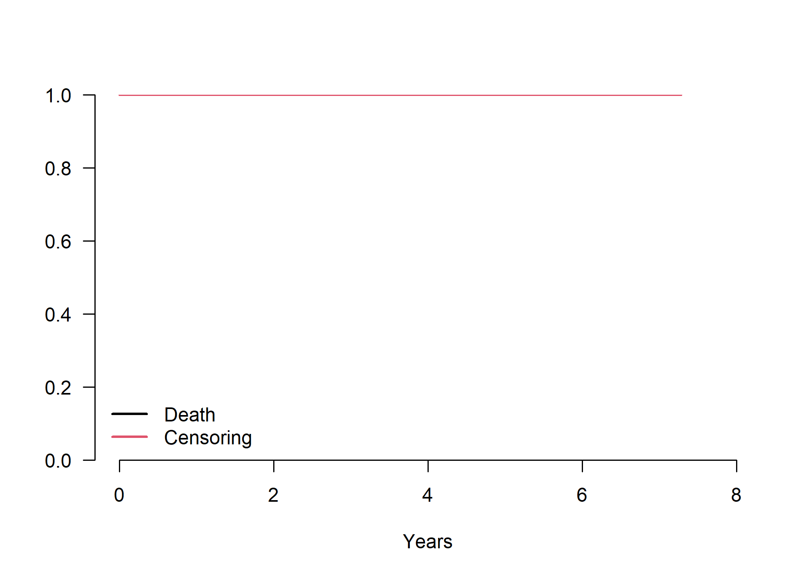
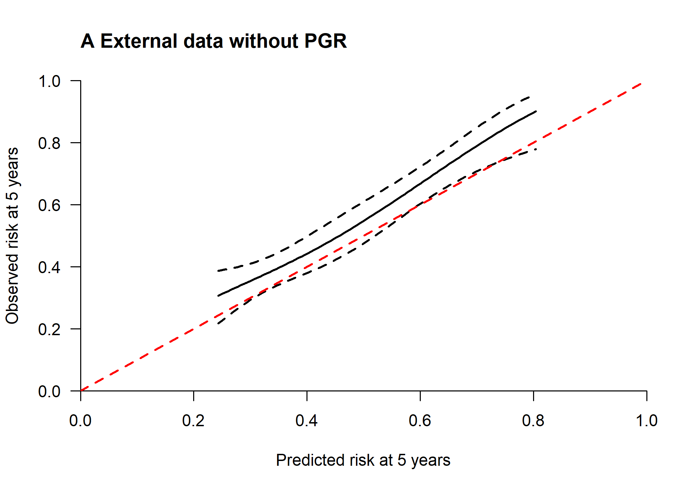
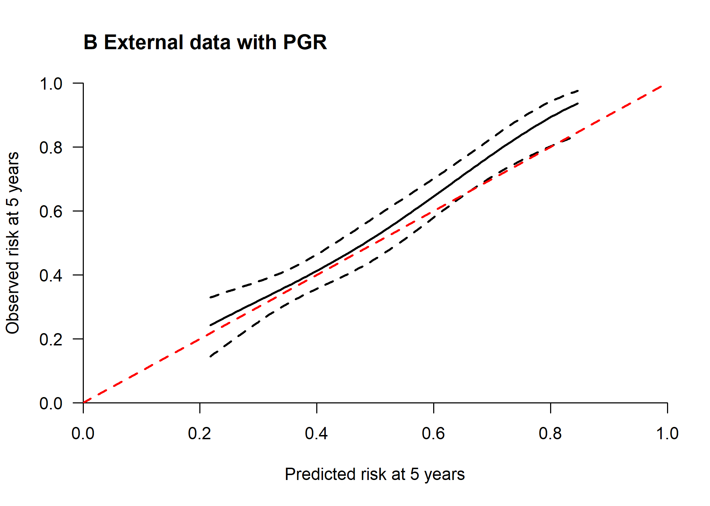
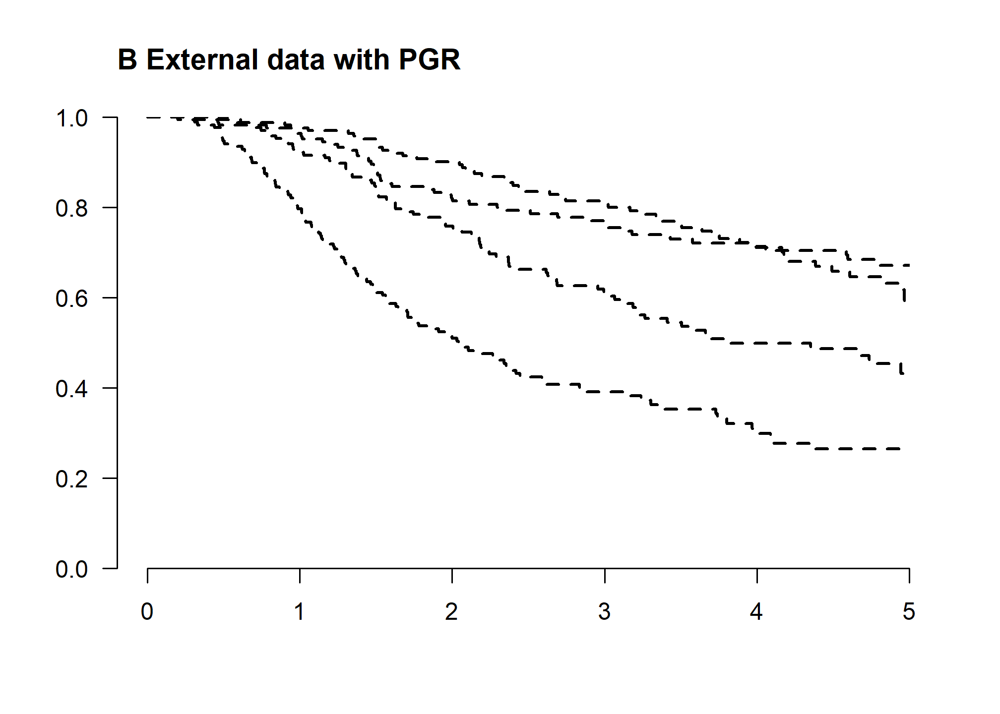

Performance assessment of survival prediction models
================

-   [Goals](#goals)
-   [Install/load packages and import
    data](#installload-packages-and-import-data)
    -   [Data and descriptive
        statistics](#data-and-descriptive-statistics)
    -   [Descriptive statistics of validation
        data](#descriptive-statistics-of-validation-data)
-   [Goal 1: Assessing performance of a developed survival model in a
    new
    data](#goal-1-assessing-performance-of-a-developed-survival-model-in-a-new-data)
    -   [1.1 Calculate the absolute risk prediction at 5 years in the
        validation
        data](#calculate-the-absolute-risk-prediction-at-5-years-in-the-validation-data)
    -   [1.2 Overall performance
        measures](#overall-performance-measures)
    -   [1.3 Discrimination measures](#discrimination-measures)
    -   [1.4 Calibration](#calibration)
-   [2. Clinical utility](#clinical-utility)
-   [References](#references)
-   [Reproducibility ticket](#reproducibility-ticket)

## Goals

When a risk prediction model has been developed and published in the
literature, individual data are probably not available. In this
document, we assume the common scenario that a risk prediction model was
already developed and it is available in the literature. We assume that
the author(s) developed a risk prediction model using a Cox proportional
hazard regression providing the model equation in terms of coefficients
and the baseline survival at a fixed time horizon *t* (e.g. five years).

In summary the goals here are:  
+ Goal 1: to assess the prediction performance of a published risk model
with a time-to-event outcome in a new independent (external) data;  
+ Goal 2: to assess the potential clinical utility of a risk prediction
model with time-to-event outcome in the new data;

## Install/load packages and import data

First of all, install the R packages essential for the analyses. We
following libraries are needed to achieve the following goals, if you
have not them installed, please use install.packages(’‘)
(e.g. install.packages(’survival’)) or use the user-friendly approach if
you are using RStudio.

``` r
# Use pacman to check whether packages are installed, if not load
if (!require("pacman")) install.packages("pacman")
library(pacman)

pacman::p_load(
  rio,
  survival,
  rms,
  mstate,
  sqldf,
  pec,
  riskRegression,
  survAUC,
  survivalROC,
  timeROC,
  plotrix,
  splines,
  knitr,
  table1,
  kableExtra,
  gtsummary,
  boot,
  tidyverse,
  rsample,
  gridExtra,
  webshot
)
# webshot::install_phantomjs()
```

### Data and descriptive statistics

Outcome and predictors in the new data must be coded as provided in the
model equation of the developed model. The time-to-death outcome should
be in years and the variables should be categorized exactly as in the
developed model.

``` r
# Load
vdata <- readRDS(here::here("Data/vdata.rds"))
options(show.signif.stars = FALSE) # display statistical intelligence

# Winzorise PGR to the 99th percentile to deal with very large influential values;
p99 <- 1347.85
# 99th quantile of development data and they should available in the literature
vdata$pgr2 <- pmin(vdata$pgr, p99)

# Create the splines as provided in the paper for the PGR variable
rcs3_pgr <- rcspline.eval(vdata$pgr2, knots = c(0, 41, 486))
attr(rcs3_pgr, "dim") <- NULL
attr(rcs3_pgr, "knots") <- NULL
vdata$pgr3 <- rcs3_pgr
rm(rcs3_pgr)
```

### Descriptive statistics of validation data

Descriptive statistics were provided in the table below.

``` r
vsel <- vdata[, c("id", "csize", "cnode", "cgrade", "age", "pgr")]

label(vsel$csize) <- "Size"
label(vsel$cnode) <- "Number of nodes"
label(vsel$cgrade) <- "Grade of tumor"
label(vsel$age) <- "Age"
label(vsel$pgr) <- "PGR"

units(vsel$csize) <- "mm"
units(vsel$age) <- "years"
units(vsel$pgr) <- "ng/mL"

tab1 <- table1(~ csize + cnode + cgrade + age + pgr, data = vsel, topclass = "Rtable1-zebra")
```

<table class="table table-striped" style="margin-left: auto; margin-right: auto;">
<thead>
<tr>
<th style="text-align:left;">
Characteristic
</th>
<th style="text-align:left;">
N = 686
</th>
</tr>
</thead>
<tbody>
<tr>
<td style="text-align:left;">
Size (cm)
</td>
<td style="text-align:left;">
</td>
</tr>
<tr>
<td style="text-align:left; padding-left:  2em;" indentlevel="1">
&lt;=20
</td>
<td style="text-align:left;">
180 (26%)
</td>
</tr>
<tr>
<td style="text-align:left; padding-left:  2em;" indentlevel="1">
21-50
</td>
<td style="text-align:left;">
453 (66%)
</td>
</tr>
<tr>
<td style="text-align:left; padding-left:  2em;" indentlevel="1">
&gt;50
</td>
<td style="text-align:left;">
53 (7.7%)
</td>
</tr>
<tr>
<td style="text-align:left;">
Number of nodes
</td>
<td style="text-align:left;">
</td>
</tr>
<tr>
<td style="text-align:left; padding-left:  2em;" indentlevel="1">
0
</td>
<td style="text-align:left;">
0 (0%)
</td>
</tr>
<tr>
<td style="text-align:left; padding-left:  2em;" indentlevel="1">
1-3
</td>
<td style="text-align:left;">
376 (55%)
</td>
</tr>
<tr>
<td style="text-align:left; padding-left:  2em;" indentlevel="1">
4+
</td>
<td style="text-align:left;">
310 (45%)
</td>
</tr>
<tr>
<td style="text-align:left;">
Grade of tumor
</td>
<td style="text-align:left;">
</td>
</tr>
<tr>
<td style="text-align:left; padding-left:  2em;" indentlevel="1">
1-2
</td>
<td style="text-align:left;">
525 (77%)
</td>
</tr>
<tr>
<td style="text-align:left; padding-left:  2em;" indentlevel="1">
3+
</td>
<td style="text-align:left;">
161 (23%)
</td>
</tr>
<tr>
<td style="text-align:left;">
Age (years)
</td>
<td style="text-align:left;">
</td>
</tr>
<tr>
<td style="text-align:left; padding-left:  2em;" indentlevel="1">
Mean (SD)
</td>
<td style="text-align:left;">
53 (10)
</td>
</tr>
<tr>
<td style="text-align:left; padding-left:  2em;" indentlevel="1">
Median (Range)
</td>
<td style="text-align:left;">
53 (21, 80)
</td>
</tr>
<tr>
<td style="text-align:left;">
PGR (ng/mL)
</td>
<td style="text-align:left;">
</td>
</tr>
<tr>
<td style="text-align:left; padding-left:  2em;" indentlevel="1">
Mean (SD)
</td>
<td style="text-align:left;">
110 (202)
</td>
</tr>
<tr>
<td style="text-align:left; padding-left:  2em;" indentlevel="1">
Median (Range)
</td>
<td style="text-align:left;">
32 (0, 2,380)
</td>
</tr>
</tbody>
</table>

We draw the survival and the censoring curves of validation data

``` r
# Validation set
sfit3 <- survfit(Surv(ryear, status == 1) ~ 1, data = vdata) # survival
sfit4 <- survfit(Surv(ryear, status == 0) ~ 1, data = vdata) # censoring

par(xaxs = "i", yaxs = "i", las = 1)
plot(sfit3, conf.int = FALSE, lwd = 2, xlab = "Years", bty = "n", xlim = c(0, 8))
lines(sfit4, conf.int = FALSE, col = 2, lwd = 2)
legend("bottomleft", c("Death", "Censoring"), col = 1:2, lwd = 2, bty = "n")
title("Validation set")
```


A number of 686 patients were selected to externally validate the risk
prediction model.The median survival in the validation data was 4 years.
The median survival was 4.5 years while the 5-year survival was 49% (95%
CI: 45-54%).

In the prediction model developed using the Rotterdam data, violation of
proportional hazards was detected for some predictors and the
development data was administratively censored at 5 years. For this
reason, we also administratively censor patients in the new (validation)
data at 5 years.

``` r
evdata <- survSplit(Surv(ryear, status) ~ ., data = vdata, cut = 5, episode = "epoch")
evdata1 <- evdata[evdata$epoch == 1, ]
```

## Goal 1: Assessing performance of a developed survival model in a new data

The performance of a risk prediction models may be evaluated through:  
+ discrimination: the ability of the model to identify patients with and
without the outcome and it requires the coefficients (or the log of the
hazard ratios) of the developed risk prediction model to be evaluated.

-   calibration: the agreement between observed and predicted
    probabilities. It requires the baseline (cumulative) hazard or
    survival.

-   overall performance measures: as a combination of discrimination and
    calibration and/or as a measure of the explained variation;

Unfortunately, a few publications report the complete baseline
(cumulative) hazard or survival or even the baseline (cumulative) hazard
or survival at fixed time horizon *t*.  
It is common that physicians focus on one or more clinically relevant
time horizons to inform subjects about their risk. We aim to assess the
prediction performance of a risk prediction model with time-to-event
outcome in a new data when information at a fixed time horizon(s) (here
at 5 years) of a developed prediction model were provided. The
coefficients of the model(s) are essential to assess the overall
performances and to calculate the discrimination ability of the
developed model in a new data. Information of the baseline
hazard/survival over the follow-up time or at a fixed time horizon *t*
are needed for calibration assessment.  
When the baseline is not available (and it is not uncommon in the
literature), only a graphical representation of the calibration is
possible. We assume here to know the coefficients *and the baseline
survival at 5 years *S\_0(t=5)\* of the developed prediction model. We
also provide the graphical visualization of the calibration when the
baseline is not reported in the literature.

If the model equation is provided including the coefficients and the
baseline at fixed time point *t* (e.g. 5 years), we could validate the
risk prediction model in our external data. Typically, the model
equation is provided in terms of predicted survival at a fixed time
point *t*.


where:  
*S(t)* is the survival at time *t*.  
*S*<sub>0</sub>*(t)* is the baseline survival at time *t*.  

is the predictor index: the combination of the coefficients estimated by
the statistical model (i.e Cox model) and the predictors.  

In some software, the baseline survival might be already internally
rescaled including the centercept. Since the function cph() in the rms R
package provides the centercept the formula above included also the
centercept in the model equation. More information can be found in
*help(cph)*. However, if the centercept is mentioned in the model
equation, this can be used to rescaled the baseline using some easy
algebraic steps:


The model equation assuming the centercept was mentioned in the
developed model was:


The extended model equation including the additional information of the
progesterone biomarker was:


Where the predictors are:  
- csize is the size of the tumor (categorical variable);  
- cnode is the number of positive lymph nodes (categorical variable);  
- cgrade is the grade of the tumor (categorical variable);  
- pgr is the progesterone biomarker (continuous variable, used for the
extended model);

Pgr was modeled using a three-knot restricted cubic splines to consider
the non linear association with the outcome. More details about spline
are given in the other html document and in the book ‘Regression model
strategies’ (Harrell, 2nd edition, 2015). Categorization of number of
positive lymph nodes was suboptimal in this example since categorization
of continuous predictors is a bad idea.

### 1.1 Calculate the absolute risk prediction at 5 years in the validation data

``` r
# Baseline survival at 5 years
S0.5yr <- .614 # Assuming the baseline survival at 5 years is available in the model equation (model with no PGR)
S0b.5yr <- .616 # Baseline survival for the extended model (with PGR)

# Centercepts of the models
centercept1 <- .920
centercept1b <- .658

# Calculate the predictor index (linear predictor) and predicted survival at 5 years in the validation data for the model without PGR
vdf_lp <- as.data.frame(model.matrix(~ csize + cnode + cgrade, data = evdata1))
vdf_lp$`(Intercept)` <- NULL
coef_efit1 <- c(.394, .623, .361, 1.090, .415)
lp <- as.matrix(vdf_lp) %*% cbind(coef_efit1)
evdata1$lp <- lp - centercept1
evdata1$predsurv5 <- S0.5yr**exp(evdata1$lp)

vdf_lp_1b <- as.data.frame(model.matrix(~ csize + cnode + cgrade + I(pgr2) + I(pgr3), data = evdata1))
vdf_lp_1b$`(Intercept)` <- NULL
coef_efit1b <- c(.370, .598, .385, 1.09, .35, -.003, .014)
lp_1b <- as.matrix(vdf_lp_1b) %*% cbind(coef_efit1b)
evdata1$lp_1b <- lp_1b - centercept1b
evdata1$predsurv5_1b <- S0b.5yr**exp(evdata1$lp_1b)
```

### 1.2 Overall performance measures

Some overall performance measures are proposed using survival data:

-   Brier score: it is the squared differences between observed and
    predicted values at fixed time point (e.g. at 5 years);

-   Index of prediction accuracy (IPA): it improves interpretability by
    scaling the Brier Score.

Bootstrapping validation data to calculate bootstrap percentile
confidence intervals

``` r
set.seed(20200416)
vboot <- bootstraps(evdata1, times = 10)
# NOTE: B=10 otherwise the computation time will be too long
```

``` r
brier_evdata1 <-
  brier_score(
    tfup = evdata1$ryear, status = evdata1$status,
    thorizon = 4.95, survival = evdata1$predsurv5
  )

brier_evdata1b <-
  brier_score(
    tfup = evdata1$ryear, status = evdata1$status,
    thorizon = 4.95, survival = evdata1$predsurv5_1b
  )

brier_score_boot1 <- function(split) {
  brier_score(
    tfup = analysis(split)$ryear,
    status = analysis(split)$status,
    thorizon = 4.95,
    survival = analysis(split)$predsurv5
  )
}

brier_score_boot1b <- function(split) {
  brier_score(
    tfup = analysis(split)$ryear,
    status = analysis(split)$status,
    thorizon = 4.95,
    survival = analysis(split)$predsurv5_1b
  )
}

# Bootstrap percentile confidence intervals for Brier score
vboot <- vboot %>% mutate(
  err1 = map(splits, brier_score_boot1),
  err1b = map(splits, brier_score_boot1b),
  Brier1 = map_dbl(err1, "Brier"),
  Brier1b = map_dbl(err1b, "Brier"),
  IPA1 = map_dbl(err1, "IPA"),
  IPA1b = map_dbl(err1b, "IPA")
)
```

<table class="table table-striped" style="margin-left: auto; margin-right: auto;">
<thead>
<tr>
<th style="empty-cells: hide;border-bottom:hidden;" colspan="1">
</th>
<th style="border-bottom:hidden;padding-bottom:0; padding-left:3px;padding-right:3px;text-align: center; " colspan="3">

<div style="border-bottom: 1px solid #ddd; padding-bottom: 5px; ">

External

</div>

</th>
<th style="border-bottom:hidden;padding-bottom:0; padding-left:3px;padding-right:3px;text-align: center; " colspan="3">

<div style="border-bottom: 1px solid #ddd; padding-bottom: 5px; ">

External + PGR

</div>

</th>
</tr>
<tr>
<th style="text-align:left;">
</th>
<th style="text-align:right;">
Estimate
</th>
<th style="text-align:right;">
Lower .95
</th>
<th style="text-align:right;">
Upper .95
</th>
<th style="text-align:right;">
Estimate
</th>
<th style="text-align:right;">
Lower .95
</th>
<th style="text-align:right;">
Upper .95
</th>
</tr>
</thead>
<tbody>
<tr>
<td style="text-align:left;">
Brier
</td>
<td style="text-align:right;">
0.22
</td>
<td style="text-align:right;">
0.20
</td>
<td style="text-align:right;">
0.23
</td>
<td style="text-align:right;">
0.21
</td>
<td style="text-align:right;">
0.19
</td>
<td style="text-align:right;">
0.22
</td>
</tr>
<tr>
<td style="text-align:left;">
IPA
</td>
<td style="text-align:right;">
0.11
</td>
<td style="text-align:right;">
0.09
</td>
<td style="text-align:right;">
0.19
</td>
<td style="text-align:right;">
0.14
</td>
<td style="text-align:right;">
0.13
</td>
<td style="text-align:right;">
0.22
</td>
</tr>
</tbody>
</table>

As expected the overall performance measures were lower in the external
validation. Including information about PGR slightly improved the
overall performance.

### 1.3 Discrimination measures

Discrimination is the ability to differentiate between subjects who have
the outcome and subjects who do not. In prognostic modelling,
discrimination reflects separation between survival curves for
individuals or groups. The following discrimination measures is
proposed:

-   Uno’s time-dependent Area Under the ROC curve (AUC);

The time horizon to calculate the time-dependent measures was set to 5
years. Values close to 1 indicate good discrimination ability, while
values close to 0.5 indicated poor discrimination ability. More details
are in the paper and in the references (link available at the end of the
document). The dynamic controls are defined as subjects surviving after
the time horizon (i.e. 5 years). However, since we administratively
censored follow-up at 5 years, no controls would be available. For this
reason we calculate the time-dependent AUC using a time horizon at 4.95.
This is just a trick, we expect no events between 4.95 and 5 years. We
could otherwise to be more confident set a time horizon as 4.99. The
choice depends how precise the follow-up is measured.

``` r
# Run time-dependent AUC
# NOTE: when N >2000 the calculation of the standard errors using iid=TRUE is computationally demanding. We suggest to use the bootstrap as we did for the Brier Score.


# External validation
Uno_vdata1 <-
  timeROC(
    T = evdata1$ryear, delta = evdata1$status,
    marker = evdata1$lp,
    cause = 1, weighting = "marginal", times = 4.95,
    iid = TRUE
  )

# External validation with pgr
Uno_vdata1b <-
  timeROC(
    T = evdata1$ryear, delta = evdata1$status,
    marker = evdata1$lp_1b,
    cause = 1, weighting = "marginal", times = 4.95,
    iid = TRUE
  )
# NOTE: if you have a lot of data n > 2000, standard error computation may be really long.
# In that case, please use bootstrap percentile to calculate confidence intervals.
```

<table class="table table-striped" style="margin-left: auto; margin-right: auto;">
<thead>
<tr>
<th style="empty-cells: hide;border-bottom:hidden;" colspan="1">
</th>
<th style="border-bottom:hidden;padding-bottom:0; padding-left:3px;padding-right:3px;text-align: center; " colspan="3">

<div style="border-bottom: 1px solid #ddd; padding-bottom: 5px; ">

External

</div>

</th>
<th style="border-bottom:hidden;padding-bottom:0; padding-left:3px;padding-right:3px;text-align: center; " colspan="3">

<div style="border-bottom: 1px solid #ddd; padding-bottom: 5px; ">

External + PGR

</div>

</th>
</tr>
<tr>
<th style="text-align:left;">
</th>
<th style="text-align:right;">
Estimate
</th>
<th style="text-align:right;">
Lower .95
</th>
<th style="text-align:right;">
Upper .95
</th>
<th style="text-align:right;">
Estimate
</th>
<th style="text-align:right;">
Lower .95
</th>
<th style="text-align:right;">
Upper .95
</th>
</tr>
</thead>
<tbody>
<tr>
<td style="text-align:left;">
Uno AUC
</td>
<td style="text-align:right;">
0.69
</td>
<td style="text-align:right;">
0.63
</td>
<td style="text-align:right;">
0.74
</td>
<td style="text-align:right;">
0.72
</td>
<td style="text-align:right;">
0.67
</td>
<td style="text-align:right;">
0.77
</td>
</tr>
</tbody>
</table>

The time-dependent AUCs at 5 years were in the external validation were
between 0.68 and 0.72 showing moderate discrimination. The additional
information of the PGR marker increased the discrimination by 0.04.

### 1.4 Calibration

Calibration is measured by:

-   Observed and Expected ratio at time horizon (*t*):

    -   the number of observed event is calculated as the one minus the
        Kaplan-Meier curve at time *t*;

    -   the number of expected event is calculated as the mean of the
        predicted risk at time *t*;

    -   Confidence intervals are calculated using the Normal
        approximation of the Poisson distribution.

-   Calibration slope: below (above) 1.0 indicate over (under)
    estimation of risk due to the coefficients of the model;

-   Calibration plot: it is an overall graphical representation of
    calibration. It shows:

    -   on the *x-axis* the predicted survival (or risk) probabilities
        at a fixed time horizon (e.g. at 5 years);

    -   on the *y-axis* the observed survival (or risk) probabilities at
        a fixed time horizon (e.g. at 5 years);

    -   The 45-degree line indicates the good overall calibration.
        Points below the 45-degree line indicates that the model
        overestimate the observed risk. If points are above the
        45-degree line, the model underestimate the observed risk; The
        observed probabilities estimated by the Kaplan-Meier curves (in
        case of survival) or by the complementary of the Kaplan-Meier
        curves (in case of risk in absence of competing risks) are
        represented in terms of percentiles of the predicted survival
        (risk) probabilities.

Other calibration measures are proposed in the literature. More details
are provided in the references at the end of the document.

When only the coefficients of a developed prediction model is provided
but the baseline at time *t* is unavailable in the literature,
calibration assessment may be incomplete. However, a basic graphical
representation of calibration may be provided through:

-   Kaplan-Meier curves may be used as calibration assessment using the
    predictor index (PI, see formula above). The PI is the combination
    of the coefficients estimated in the development data multiplied by
    the predictors in the validation data. Basically, if the survival
    curves among risk groups are separated, then good calibration might
    be implied. However, this is not strict comparison between observed
    and predicted values since a model-based approach cannot be used.

When a risk prediction model has been developed and published in the
literature, individual data are probably not available. If the model
equation is provided including the coefficients and the baseline at
fixed time point *t* (e.g. 5 years), we could validate the risk
prediction model in our external data. Typically, the model equation is
provided in terms of predicted survival at a fixed time point *t*.

``` r
#' Calculate the O/E ratio
#'
#' @param tfup follow-up time
#' @param event variable indication event (0=no, 1=yes)
#' @param pred.risk predicted risk at time horizon
#' @param thorizon time horizon to calculate the observed/expected ratio at time t
#' @param alpha type I error (to calculate confidence intervals, default: 0.05)
#'
#' @return 
#'
#' @examples

OE.ratio.t <- function(tfup, event, pred.risk, thorizon, alpha = .05) {
  obs_t <- 1 - summary(survfit(Surv(tfup, event) ~ 1), times = thorizon)$surv
  exp_t <- mean(pred.risk)

  OE <- obs_t / exp_t
  OE.lower <- OE * exp(-qnorm(1 - alpha / 2) * sqrt(1 / sum(event)))
  OE.upper <- OE * exp(+qnorm(1 - alpha / 2) * sqrt(1 / sum(event)))
  res <- c(OE, OE.lower, OE.upper)
  names(res) <- c("Estimate", "Lower .95", "Upper .95")
  return(res)
}

# Calculation
# Without PGR
OE_ratio5 <- OE.ratio.t(
  tfup = evdata1$ryear, event = evdata1$status,
  pred.risk = 1 - evdata1$predsurv5,
  thorizon = 5
)
# With PGR
OE_ratio5_1b <- OE.ratio.t(
  tfup = evdata1$ryear, event = evdata1$status,
  pred.risk = 1 - evdata1$predsurv5_1b,
  thorizon = 5
)

# Calibration slope
calslope <- coxph(Surv(ryear, status) ~ lp, data = evdata1)
calslope_1b <- coxph(Surv(ryear, status) ~ lp_1b, data = evdata1)
```

<table class="table table-striped" style="margin-left: auto; margin-right: auto;">
<thead>
<tr>
<th style="empty-cells: hide;border-bottom:hidden;" colspan="1">
</th>
<th style="border-bottom:hidden;padding-bottom:0; padding-left:3px;padding-right:3px;text-align: center; " colspan="3">

<div style="border-bottom: 1px solid #ddd; padding-bottom: 5px; ">

External

</div>

</th>
<th style="border-bottom:hidden;padding-bottom:0; padding-left:3px;padding-right:3px;text-align: center; " colspan="3">

<div style="border-bottom: 1px solid #ddd; padding-bottom: 5px; ">

External + PGR

</div>

</th>
</tr>
<tr>
<th style="text-align:left;">
</th>
<th style="text-align:right;">
Estimate
</th>
<th style="text-align:right;">
Lower .95
</th>
<th style="text-align:right;">
Upper .95
</th>
<th style="text-align:right;">
Estimate
</th>
<th style="text-align:right;">
Lower .95
</th>
<th style="text-align:right;">
Upper .95
</th>
</tr>
</thead>
<tbody>
<tr>
<td style="text-align:left;">
O/E ratio at 5 years
</td>
<td style="text-align:right;">
1.12
</td>
<td style="text-align:right;">
0.99
</td>
<td style="text-align:right;">
1.25
</td>
<td style="text-align:right;">
1.05
</td>
<td style="text-align:right;">
0.94
</td>
<td style="text-align:right;">
1.18
</td>
</tr>
<tr>
<td style="text-align:left;">
Calibration slope
</td>
<td style="text-align:right;">
1.04
</td>
<td style="text-align:right;">
0.80
</td>
<td style="text-align:right;">
1.28
</td>
<td style="text-align:right;">
1.15
</td>
<td style="text-align:right;">
0.92
</td>
<td style="text-align:right;">
1.39
</td>
</tr>
</tbody>
</table>

The OE ratio was 1.12 and 1.05 indicating that the predicted values at 5
years were systematic overestimated for both models with and without
PGR. The calibration slope was 1.04 and 1.15 indicate good estimation of
the risk by the model and slight under estimation when PGR was included
as a predictor. Recalibration may be useful to improve prediction in the
external data. Calibration plot at 5 years may be created using
equally-sized groups of patients based on percentiles of the predicted
survival distribution, restricted cubic splines and hazard regression.
We provide here calibration plot based on restricted cubic splines.

``` r
## External data without PGR
evdata1$predmort5 <- 1 - evdata1$predsurv5
evdata1$predmort5.cll <- log(-log(1 - evdata1$predmort5))

# Estimate
vcalibrate.efit1 <- cph(Surv(ryear, status) ~ rcs(predmort5.cll, 3), x = T, y = T, data = evdata1, surv = T) # better rms::cph?
predict.grid <- seq(quantile(evdata1$predmort5, prob = 0.01), quantile(evdata1$predmort5, prob = 0.99), length = 100)
predict.grid.cll <- log(-log(1 - predict.grid))
predict.grid.df <- data.frame(predict.grid)
predict.grid.cll.df <- data.frame(predict.grid.cll)
names(predict.grid.df) <- "predmort5"
names(predict.grid.cll.df) <- "predmort5.cll"

# Plot
pred.vcalibrate.efit1 <- 1 - survest(vcalibrate.efit1, newdata = predict.grid.cll.df, times = 5)$surv
pred.vcalibrate.efit1.lower <- 1 - survest(vcalibrate.efit1, newdata = predict.grid.cll.df, times = 5)$upper
pred.vcalibrate.efit1.upper <- 1 - survest(vcalibrate.efit1, newdata = predict.grid.cll.df, times = 5)$lower
par(xaxs = "i", yaxs = "i", las = 1)
plot(predict.grid, pred.vcalibrate.efit1,
  type = "l", lty = 1, xlim = c(0, 1),
  ylim = c(0, 1), lwd = 2,
  xlab = "Predicted risk at 5 years",
  ylab = "Observed risk at 5 years", bty = "n"
)
lines(predict.grid, pred.vcalibrate.efit1.lower, type = "l", lty = 2, lwd = 2)
lines(predict.grid, pred.vcalibrate.efit1.upper, type = "l", lty = 2, lwd = 2)
abline(0, 1, lwd = 2, lty = 2, col = "red")
title("A External data without PGR", adj = 0)
```



``` r
# par(new=T)
# plot(density(evdata1$predmort5),
#     axes=F,xlab=NA,ylab=NA,
#     main="")


## External data with PGR
evdata1$predmort5 <- 1 - evdata1$predsurv5_1b
evdata1$predmort5.cll <- log(-log(1 - evdata1$predmort5))

# Estimate
vcalibrate.efit1b <- cph(Surv(ryear, status) ~ rcs(predmort5.cll, 3), x = T, y = T, data = evdata1, surv = T) # better rms::cph?
predict.grid <- seq(quantile(evdata1$predmort5, prob = 0.01), quantile(evdata1$predmort5, prob = 0.99), length = 100)
predict.grid.cll <- log(-log(1 - predict.grid))
predict.grid.df <- data.frame(predict.grid)
predict.grid.cll.df <- data.frame(predict.grid.cll)
names(predict.grid.df) <- "predmort5"
names(predict.grid.cll.df) <- "predmort5.cll"


# Plot
pred.vcalibrate.efit1b <- 1 - survest(vcalibrate.efit1b, newdata = predict.grid.cll.df, times = 5)$surv
pred.vcalibrate.efit1b.lower <- 1 - survest(vcalibrate.efit1b, newdata = predict.grid.cll.df, times = 5)$upper
pred.vcalibrate.efit1b.upper <- 1 - survest(vcalibrate.efit1b, newdata = predict.grid.cll.df, times = 5)$lower
par(xaxs = "i", yaxs = "i", las = 1)
plot(predict.grid, pred.vcalibrate.efit1b,
  type = "l", lty = 1, xlim = c(0, 1),
  ylim = c(0, 1), lwd = 2,
  xlab = "Predicted risk at 5 years",
  ylab = "Observed risk at 5 years", bty = "n"
)
lines(predict.grid, pred.vcalibrate.efit1b.lower, type = "l", lty = 2, lwd = 2)
lines(predict.grid, pred.vcalibrate.efit1b.upper, type = "l", lty = 2, lwd = 2)
abline(0, 1, lwd = 2, lty = 2, col = "red")
title("B External data with PGR", adj = 0)
```



``` r
# par(new=T)
# plot(density(evdata1$predmort5),
#      axes=F,xlab=NA,ylab=NA,
#      main="")
```

Both plots identified good calibration although predicted risk were
slightly underestimated especially for the lowest and the highest values
of the observed probabilities.  
The additional information of PGR improved the overall calibration,
especially for the highest values, as shown in the two calibration plots
above.

When only coefficients of the predictors of a risk prediction model are
provided, full calibration cannot be assessed. However, one graphical
representation of calibration is based on the Kaplan-Meier survival
curves based on the distribution of the predictor index. For example,
four equally sized patients based on quartiles of the predicted survival
probabilities.

``` r
# Development and validation dataset without pgr
## NOTE: this code should be adjusted using assuming only information of the coefficients is provided according to the previous sections

evdata1$group1 <- cut(evdata1$lp, breaks = quantile(evdata1$lp, probs = seq(0, 1, 0.25)), include.lowest = TRUE)

par(las = 1, xaxs = "i", yaxs = "i")
plot(survfit(Surv(ryear, status) ~ group1, data = evdata1),
  bty = "n", xlim = c(0, 5), ylim = c(0, 1), lwd = 2, col = "black",
  lty = 2, xlab = "Time (years)", ylab = "Survival probability"
)
title("A External data without PGR", adj = 0)
```


``` r
evdata1$group1b <- cut(
  evdata1$lp_1b,
  breaks = quantile(evdata1$lp_1b, probs = seq(0, 1, 0.25)),
  include.lowest = TRUE
)
# evdata1$group1b<-cut(evdata1$lp1b,breaks=quantile(evdata1$# lp1b,probs=seq(0,1,0.25)),include.lowest = TRUE)

par(las = 1, xaxs = "i", yaxs = "i")
plot(survfit(Surv(ryear, status) ~ group1b, data = evdata1),
  bty = "n", xlim = c(0, 5),
  ylim = c(0, 1), lwd = 2, col = "black", lty = 2
)
title("B External data with PGR", adj = 0)
```



## 2. Clinical utility

Discrimination and calibration measures are essential to assess the
prediction performance but insufficient to evaluate the potential
clinical utility of a risk prediction model for decision making. When
new markers are available, clinical utility assessment evaluates whether
the extended model helps to improve decision making.  
Clinical utility is measured by the net benefit that includes the number
of true positives and the number of false positives. For example, in
time-to-event models, the true positives reflect the benefit of being
event free for a given time horizon using additional interventions such
as additional treatments, personalized follow-up or additional
surgeries. The false positives represent the harms of unnecessary
interventions.  
Generally, in medicine, clinicians accepts to treat a certain number of
patients for which interventions are unnecessary to be event free for a
given time horizon. So, false negatives (the harm of not being event
free for a given time horizon) are more important than false positives
(the harm of unnecessary interventions). Thus, net benefit is the number
of true positives classifications minus the false positives
classifications weighted by a factor related to the harm of not
preventing the event versus unnecessary interventions. The weighting is
derived from the threshold probability to death (one minus survival
probability) using a defined time horizon (for example 5 years since
diagnosis). For example, a threshold of 10% implies that additional
interventions for 10 patients of whom one would have experience the
event in 5 years if untreated is acceptable (thus treating 9 unnecessary
patients). This strategy is compared with the strategies of treat all
and treat none patients. If overtreatment is harmful, a higher threshold
should be used.  
The net benefit is calculated as:


*TP*=true positive patients  
*FP*=false positive patients  
*n*=number of patients and *p*<sub>t</sub> is the risk threshold.

For survival data *TP* and *FP* is calculated as follows:  


where  
*S(t)* survival at time *t*  
*X=1* where the predicted probability at time *t* is *p*<sub>t</sub>

And the the decision curve is calculated as follows:

1.  Choose a time horizon (in this case 5 years);
2.  Specify a risk threshold which reflects the ratio between harms and
    benefit of an additional intervention;
3.  Calculate the number of true positive and false positive given the
    threshold specified in (2);
4.  Calculate the net benefit of the survival model;
5.  Plot net benefit on the *y-axis* against the risk threshold on the
    *x-axis*;
6.  Repeat steps 2-4 for each model consideration;
7.  Repeat steps 2-4 for the strategy of assuming all patients are
    treated;
8.  Draw a straight line parallel to the *x-axis* at y=0 representing
    the net benefit associated with the strategy of assuming that all
    patients are not treated.

Given some thresholds, the model/strategy with higher net benefit
represents the one that potentially improves clinical decision making.
However, poor discrimination and calibration lead to lower net benefit.

``` r
# Development data
# Predicted probability calculation


# External data
# Validation data
# Predicted probability calculation
evdata1$mort5_model1 <- 1 - evdata1$predsurv5

# Extended model with PGR
# Predicted probability calculation
evdata1$mort5_model1b <- 1 - evdata1$predsurv5_1b

# Run decision curve analysis

# Validation data
# Model without PGR
evdata1 <- as.data.frame(evdata1)
dca_vdata_model1 <- stdca(
  data = evdata1, outcome = "status", ttoutcome = "ryear",
  timepoint = 5, predictors = "mort5_model1", xstop = 1.0,
  ymin = -0.01, graph = FALSE
)
```

    ## [1] "mort5_model1: No observations with risk greater than 81%, and therefore net benefit not calculable in this range."

``` r
# Model with PGR
dca_vdata_model1b <- stdca(
  data = evdata1, outcome = "status", ttoutcome = "ryear",
  timepoint = 5, predictors = "mort5_model1b", xstop = 1,
  ymin = -0.01, graph = FALSE
)
```

    ## [1] "mort5_model1b: No observations with risk greater than 86%, and therefore net benefit not calculable in this range."

``` r
# Decision curves plot
par(xaxs = "i", yaxs = "i", las = 1)
plot(dca_vdata_model1$net.benefit$threshold,
  dca_vdata_model1$net.benefit$mort5_model1,
  type = "l", lwd = 2, lty = 1,
  xlab = "Threshold probability in %", ylab = "Net Benefit",
  xlim = c(0, 1), ylim = c(-0.10, 0.60), bty = "n",
  cex.lab = 1.2, cex.axis = 1
)
# legend('topright',c('Treat all','Treat none','Prediction model'),
#        lwd=c(2,2,2),lty=c(1,1,2),col=c('darkgray','black','black'),bty='n')
lines(dca_vdata_model1$net.benefit$threshold, dca_vdata_model1$net.benefit$none, type = "l", lwd = 2, lty = 4)
lines(dca_vdata_model1$net.benefit$threshold, dca_vdata_model1$net.benefit$all, type = "l", lwd = 2, col = "darkgray")
lines(dca_vdata_model1b$net.benefit$threshold, dca_vdata_model1b$net.benefit$mort5_model1b, type = "l", lwd = 2, lty = 5)
legend("topright",
  c(
    "Treat All",
    "Original model",
    "Original model + PGR",
    "Treat None"
  ),
  lty = c(1, 1, 5, 4), lwd = 2, col = c("darkgray", "black", "black", "black"),
  bty = "n"
)
title("B External data", adj = 0, cex = 1.5)
```


Based on previous research we used a range of thresholds from 14% to 23%
for adjuvant chemotherapy. If we choose a threshold of 20% the model had
a net benefit of 0.385 in the validation data using the basic model.
This means that the model would identify 38 patients per 100 who will
have recurrent breast cancer or die within 5 years since diagnosis and
thus adjuvant chemotherapy is really needed. The decision curve shows
that the net benefit compared with intervention in all would be much
larger for higher threshold values, i.e., patients accepting higher
risks of recurrence.

Moreover, net benefit can be defined in terms of reduction of avoidable
interventions (e.g adjuvant chemotherapy per 100 patients) by:


where *NB*<sub>model</sub> is the net benefit of the prediction model,
*NB*<sub>all</sub> is the net benefit of the strategy treat all and
*p*<sub>*t*</sub> is the risk threshold.

## References

-   Overall measures  
    Reference:
    <https://diagnprognres.biomedcentral.com/articles/10.1186/s41512-018-0029-2*/>  
    R Vignette:
    <https://cran.r-project.org/web/packages/riskRegression/vignettes/IPA.html#fn.1>  

-   Discrimination measures   <https://www.jstor.org/stable/27639883>  
    <https://onlinelibrary.wiley.com/doi/10.1002/sim.5958>  

-   Calibration  
    <https://www.ncbi.nlm.nih.gov/pmc/articles/PMC3933449/pdf/nihms542648.pdf>  
    <https://onlinelibrary.wiley.com/doi/full/10.1002/sim.8281>  
    <https://onlinelibrary.wiley.com/doi/full/10.1002/sim.8570>  

-   Clinical utility (decision curves)  
    R/SAS/STATA code and references:  
    <https://www.mskcc.org/departments/epidemiology-biostatistics/biostatistics/decision-curve-analysis>  
    More guidelines about net benefit assessment and interpretation  
    <https://www.ncbi.nlm.nih.gov/pmc/articles/PMC6261531/>  
    <https://diagnprognres.biomedcentral.com/articles/10.1186/s41512-019-0064-7>  

-   Other useful references  
    <https://www.ncbi.nlm.nih.gov/pmc/articles/PMC6728752/>  
    <https://www.ncbi.nlm.nih.gov/pmc/articles/PMC7100774/>  

## Reproducibility ticket

``` r
sessioninfo::session_info()
```

    ## - Session info ---------------------------------------------------------------
    ##  setting  value                       
    ##  version  R version 4.0.3 (2020-10-10)
    ##  os       Windows 10 x64              
    ##  system   x86_64, mingw32             
    ##  ui       RTerm                       
    ##  language (EN)                        
    ##  collate  English_Netherlands.1252    
    ##  ctype    English_Netherlands.1252    
    ##  tz       Europe/Berlin               
    ##  date     2021-04-03                  
    ## 
    ## - Packages -------------------------------------------------------------------
    ##  package        * version    date       lib source        
    ##  assertthat       0.2.1      2019-03-21 [1] CRAN (R 4.0.3)
    ##  backports        1.2.0      2020-11-02 [1] CRAN (R 4.0.3)
    ##  base64enc        0.1-3      2015-07-28 [1] CRAN (R 4.0.3)
    ##  bit              4.0.4      2020-08-04 [1] CRAN (R 4.0.3)
    ##  bit64            4.0.5      2020-08-30 [1] CRAN (R 4.0.3)
    ##  blob             1.2.1      2020-01-20 [1] CRAN (R 4.0.3)
    ##  boot           * 1.3-25     2020-04-26 [2] CRAN (R 4.0.3)
    ##  broom            0.7.4      2021-01-29 [1] CRAN (R 4.0.3)
    ##  broom.helpers    1.2.1      2021-02-26 [1] CRAN (R 4.0.4)
    ##  cachem           1.0.1      2021-01-21 [1] CRAN (R 4.0.3)
    ##  cellranger       1.1.0      2016-07-27 [1] CRAN (R 4.0.3)
    ##  checkmate        2.0.0      2020-02-06 [1] CRAN (R 4.0.3)
    ##  chron            2.3-56     2020-08-18 [1] CRAN (R 4.0.3)
    ##  cli              2.3.0      2021-01-31 [1] CRAN (R 4.0.3)
    ##  cluster          2.1.0      2019-06-19 [2] CRAN (R 4.0.3)
    ##  cmprsk           2.2-10     2020-06-09 [1] CRAN (R 4.0.3)
    ##  codetools        0.2-16     2018-12-24 [2] CRAN (R 4.0.3)
    ##  colorspace       2.0-0      2020-11-11 [1] CRAN (R 4.0.3)
    ##  conquer          1.0.2      2020-08-27 [1] CRAN (R 4.0.3)
    ##  crayon           1.4.0      2021-01-30 [1] CRAN (R 4.0.3)
    ##  curl             4.3        2019-12-02 [1] CRAN (R 4.0.3)
    ##  data.table       1.13.6     2020-12-30 [1] CRAN (R 4.0.3)
    ##  DBI              1.1.1      2021-01-15 [1] CRAN (R 4.0.3)
    ##  dbplyr           2.1.0      2021-02-03 [1] CRAN (R 4.0.3)
    ##  digest           0.6.27     2020-10-24 [1] CRAN (R 4.0.3)
    ##  dplyr          * 1.0.3      2021-01-15 [1] CRAN (R 4.0.3)
    ##  ellipsis         0.3.1      2020-05-15 [1] CRAN (R 4.0.3)
    ##  evaluate         0.14       2019-05-28 [1] CRAN (R 4.0.3)
    ##  fastmap          1.1.0      2021-01-25 [1] CRAN (R 4.0.3)
    ##  forcats        * 0.5.1      2021-01-27 [1] CRAN (R 4.0.3)
    ##  foreach          1.5.1      2020-10-15 [1] CRAN (R 4.0.3)
    ##  foreign          0.8-80     2020-05-24 [2] CRAN (R 4.0.3)
    ##  Formula        * 1.2-4      2020-10-16 [1] CRAN (R 4.0.3)
    ##  fs               1.5.0      2020-07-31 [1] CRAN (R 4.0.3)
    ##  furrr            0.2.2      2021-01-29 [1] CRAN (R 4.0.3)
    ##  future           1.21.0     2020-12-10 [1] CRAN (R 4.0.3)
    ##  generics         0.1.0      2020-10-31 [1] CRAN (R 4.0.3)
    ##  ggplot2        * 3.3.3      2020-12-30 [1] CRAN (R 4.0.3)
    ##  globals          0.14.0     2020-11-22 [1] CRAN (R 4.0.3)
    ##  glue             1.4.2      2020-08-27 [1] CRAN (R 4.0.3)
    ##  gridExtra      * 2.3        2017-09-09 [1] CRAN (R 4.0.3)
    ##  gsubfn         * 0.7        2018-03-16 [1] CRAN (R 4.0.3)
    ##  gt               0.2.2      2020-08-05 [1] CRAN (R 4.0.4)
    ##  gtable           0.3.0      2019-03-25 [1] CRAN (R 4.0.3)
    ##  gtsummary      * 1.3.7      2021-02-26 [1] CRAN (R 4.0.4)
    ##  haven            2.3.1      2020-06-01 [1] CRAN (R 4.0.3)
    ##  here             1.0.1      2020-12-13 [1] CRAN (R 4.0.4)
    ##  highr            0.8        2019-03-20 [1] CRAN (R 4.0.3)
    ##  Hmisc          * 4.4-2      2020-11-29 [1] CRAN (R 4.0.3)
    ##  hms              1.0.0      2021-01-13 [1] CRAN (R 4.0.3)
    ##  htmlTable        2.1.0      2020-09-16 [1] CRAN (R 4.0.3)
    ##  htmltools        0.5.1.1    2021-01-22 [1] CRAN (R 4.0.3)
    ##  htmlwidgets      1.5.3      2020-12-10 [1] CRAN (R 4.0.3)
    ##  httr             1.4.2      2020-07-20 [1] CRAN (R 4.0.3)
    ##  iterators        1.0.13     2020-10-15 [1] CRAN (R 4.0.3)
    ##  jpeg             0.1-8.1    2019-10-24 [1] CRAN (R 4.0.3)
    ##  jsonlite         1.7.2      2020-12-09 [1] CRAN (R 4.0.3)
    ##  kableExtra     * 1.3.1      2020-10-22 [1] CRAN (R 4.0.3)
    ##  knitr          * 1.31       2021-01-27 [1] CRAN (R 4.0.3)
    ##  lattice        * 0.20-41    2020-04-02 [2] CRAN (R 4.0.3)
    ##  latticeExtra     0.6-29     2019-12-19 [1] CRAN (R 4.0.3)
    ##  lava             1.6.8.1    2020-11-04 [1] CRAN (R 4.0.3)
    ##  lifecycle        0.2.0      2020-03-06 [1] CRAN (R 4.0.3)
    ##  listenv          0.8.0      2019-12-05 [1] CRAN (R 4.0.3)
    ##  lubridate        1.7.9.2    2020-11-13 [1] CRAN (R 4.0.3)
    ##  magrittr         2.0.1      2020-11-17 [1] CRAN (R 4.0.3)
    ##  MASS             7.3-53     2020-09-09 [2] CRAN (R 4.0.3)
    ##  Matrix           1.2-18     2019-11-27 [2] CRAN (R 4.0.3)
    ##  MatrixModels     0.4-1      2015-08-22 [1] CRAN (R 4.0.3)
    ##  matrixStats      0.58.0     2021-01-29 [1] CRAN (R 4.0.3)
    ##  memoise          2.0.0      2021-01-26 [1] CRAN (R 4.0.3)
    ##  mets             1.2.8.1    2020-09-28 [1] CRAN (R 4.0.3)
    ##  modelr           0.1.8      2020-05-19 [1] CRAN (R 4.0.3)
    ##  mstate         * 0.3.1      2020-12-17 [1] CRAN (R 4.0.3)
    ##  multcomp         1.4-15     2020-11-14 [1] CRAN (R 4.0.3)
    ##  munsell          0.5.0      2018-06-12 [1] CRAN (R 4.0.3)
    ##  mvtnorm          1.1-1      2020-06-09 [1] CRAN (R 4.0.3)
    ##  nlme             3.1-149    2020-08-23 [2] CRAN (R 4.0.3)
    ##  nnet             7.3-14     2020-04-26 [2] CRAN (R 4.0.3)
    ##  numDeriv         2016.8-1.1 2019-06-06 [1] CRAN (R 4.0.3)
    ##  openxlsx         4.2.3      2020-10-27 [1] CRAN (R 4.0.4)
    ##  pacman         * 0.5.1      2019-03-11 [1] CRAN (R 4.0.4)
    ##  parallelly       1.23.0     2021-01-04 [1] CRAN (R 4.0.3)
    ##  pec            * 2020.11.17 2020-11-16 [1] CRAN (R 4.0.3)
    ##  pillar           1.4.7      2020-11-20 [1] CRAN (R 4.0.3)
    ##  pkgconfig        2.0.3      2019-09-22 [1] CRAN (R 4.0.3)
    ##  plotrix        * 3.8-1      2021-01-21 [1] CRAN (R 4.0.3)
    ##  png              0.1-7      2013-12-03 [1] CRAN (R 4.0.3)
    ##  polspline        1.1.19     2020-05-15 [1] CRAN (R 4.0.3)
    ##  prodlim        * 2019.11.13 2019-11-17 [1] CRAN (R 4.0.3)
    ##  proto          * 1.0.0      2016-10-29 [1] CRAN (R 4.0.3)
    ##  purrr          * 0.3.4      2020-04-17 [1] CRAN (R 4.0.3)
    ##  quantreg         5.83       2021-01-22 [1] CRAN (R 4.0.3)
    ##  R6               2.5.0      2020-10-28 [1] CRAN (R 4.0.3)
    ##  RColorBrewer     1.1-2      2014-12-07 [1] CRAN (R 4.0.3)
    ##  Rcpp             1.0.6      2021-01-15 [1] CRAN (R 4.0.3)
    ##  readr          * 1.4.0      2020-10-05 [1] CRAN (R 4.0.3)
    ##  readxl           1.3.1      2019-03-13 [1] CRAN (R 4.0.3)
    ##  reprex           1.0.0      2021-01-27 [1] CRAN (R 4.0.3)
    ##  rio            * 0.5.26     2021-03-01 [1] CRAN (R 4.0.4)
    ##  riskRegression * 2020.12.08 2020-12-09 [1] CRAN (R 4.0.3)
    ##  rlang            0.4.10     2020-12-30 [1] CRAN (R 4.0.3)
    ##  rmarkdown        2.6        2020-12-14 [1] CRAN (R 4.0.3)
    ##  rms            * 6.1-0      2020-11-29 [1] CRAN (R 4.0.3)
    ##  rpart            4.1-15     2019-04-12 [2] CRAN (R 4.0.3)
    ##  rprojroot        2.0.2      2020-11-15 [1] CRAN (R 4.0.3)
    ##  rsample        * 0.0.8      2020-09-23 [1] CRAN (R 4.0.3)
    ##  RSQLite        * 2.2.3      2021-01-24 [1] CRAN (R 4.0.3)
    ##  rstudioapi       0.13       2020-11-12 [1] CRAN (R 4.0.3)
    ##  rvest            0.3.6      2020-07-25 [1] CRAN (R 4.0.3)
    ##  sandwich         3.0-0      2020-10-02 [1] CRAN (R 4.0.3)
    ##  scales           1.1.1      2020-05-11 [1] CRAN (R 4.0.3)
    ##  sessioninfo      1.1.1      2018-11-05 [1] CRAN (R 4.0.4)
    ##  SparseM        * 1.78       2019-12-13 [1] CRAN (R 4.0.3)
    ##  sqldf          * 0.4-11     2017-06-28 [1] CRAN (R 4.0.3)
    ##  stringi          1.5.3      2020-09-09 [1] CRAN (R 4.0.3)
    ##  stringr        * 1.4.0      2019-02-10 [1] CRAN (R 4.0.3)
    ##  survAUC        * 1.0-5      2012-09-04 [1] CRAN (R 4.0.3)
    ##  survival       * 3.2-7      2020-09-28 [1] CRAN (R 4.0.3)
    ##  survivalROC    * 1.0.3      2013-01-13 [1] CRAN (R 4.0.3)
    ##  table1         * 1.2.1      2020-11-26 [1] CRAN (R 4.0.3)
    ##  TH.data          1.0-10     2019-01-21 [1] CRAN (R 4.0.3)
    ##  tibble         * 3.0.6      2021-01-29 [1] CRAN (R 4.0.3)
    ##  tidyr          * 1.1.2      2020-08-27 [1] CRAN (R 4.0.3)
    ##  tidyselect       1.1.0      2020-05-11 [1] CRAN (R 4.0.3)
    ##  tidyverse      * 1.3.0      2019-11-21 [1] CRAN (R 4.0.3)
    ##  timereg          1.9.8      2020-10-05 [1] CRAN (R 4.0.3)
    ##  timeROC        * 0.4        2019-12-18 [1] CRAN (R 4.0.3)
    ##  usethis          2.0.1      2021-02-10 [1] CRAN (R 4.0.4)
    ##  vctrs            0.3.6      2020-12-17 [1] CRAN (R 4.0.3)
    ##  viridisLite      0.3.0      2018-02-01 [1] CRAN (R 4.0.3)
    ##  webshot        * 0.5.2      2019-11-22 [1] CRAN (R 4.0.3)
    ##  withr            2.4.1      2021-01-26 [1] CRAN (R 4.0.3)
    ##  xfun             0.20       2021-01-06 [1] CRAN (R 4.0.3)
    ##  xml2             1.3.2      2020-04-23 [1] CRAN (R 4.0.3)
    ##  yaml             2.2.1      2020-02-01 [1] CRAN (R 4.0.3)
    ##  zip              2.1.1      2020-08-27 [1] CRAN (R 4.0.4)
    ##  zoo              1.8-8      2020-05-02 [1] CRAN (R 4.0.3)
    ## 
    ## [1] C:/Users/danie/Documents/R/win-library/4.0
    ## [2] C:/Program Files/R/R-4.0.3/library
