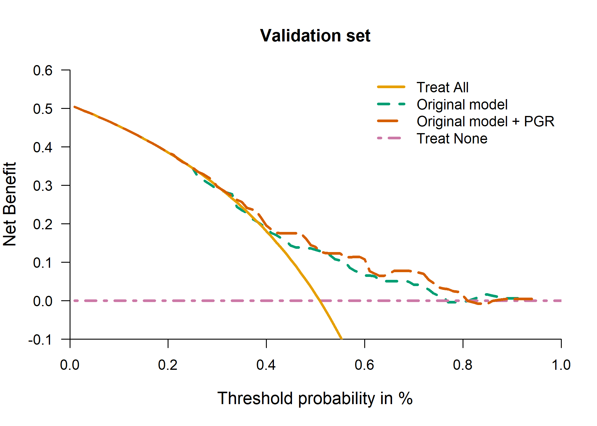

Performance assessment of survival prediction models
================

-   [Goals](#goals)
-   [Install/load packages and import
    data](#installload-packages-and-import-data)
    -   [Data preparation](#data-preparation)
-   [Goal 1: Assessing performance of a developed survival model in a
    new
    data](#goal-1-assessing-performance-of-a-developed-survival-model-in-a-new-data)
    -   [1.1 Calculate the absolute risk prediction at 5 years in the
        validation
        data](#11-calculate-the-absolute-risk-prediction-at-5-years-in-the-validation-data)
    -   [1.2 Discrimination measures](#12-discrimination-measures)
    -   [1.3 Calibration](#13-calibration)
        -   [1.3.1 Mean calibration - fixed time
            point](#131-mean-calibration---fixed-time-point)
        -   [1.3.2 Weak calibration - fixed time
            point](#132-weak-calibration---fixed-time-point)
        -   [1.3.3 Moderate calibration - fixed time
            point](#133-moderate-calibration---fixed-time-point)
        -   [1.3.4 Calibration when only coefficients of the model are
            available](#134-calibration-when-only-coefficients-of-the-model-are-available)
    -   [1.4 Overall performance
        measures](#14-overall-performance-measures)
-   [2. Clinical utility](#2-clinical-utility)
-   [Reproducibility ticket](#reproducibility-ticket)

## Goals

When a risk prediction model has been developed and published in the
literature, individual data are probably not available. In this
document, we assume the common scenario that a risk prediction model was
already developed and it is available in the literature. We assume that
the author(s) developed a risk prediction model using a Cox proportional
hazard regression providing the model equation in terms of coefficients
and the baseline survival at a fixed time horizon *t* (e.g. five years).

In summary the goals here are:  
+ Goal 1: to assess the prediction performance of a published risk model
with a time-to-event outcome in a new independent (external) data;  
+ Goal 2: to assess the potential clinical utility of a risk prediction
model with time-to-event outcome in the new data;

## Install/load packages and import data

First of all, install the R packages essential for the analyses. We
following libraries are needed to achieve the following goals, if you
have not them installed, please use install.packages(’‘)
(e.g. install.packages(’survival’)) or use the user-friendly approach if
you are using RStudio.

``` r
# Use pacman to check whether packages are installed, if not load
if (!require("pacman")) install.packages("pacman")
library(pacman)
pacman::p_load(survival,
               Hmisc,
               pec,
               timeROC,
               rms,
               knitr,
               kableExtra,
               tidyverse,
               gtsummary)
```

### Data preparation

Outcome and predictors in the new data must be coded as provided in the
model equation of the developed model. The time-to-death outcome should
be in years and the variables should be categorized exactly as in the
developed model.

In the prediction model developed using the Rotterdam data, violation of
proportional hazards was detected for some predictors and the
development data was administratively censored at 5 years. For this
reason, we also administratively censor patients in the new (validation)
data at 5 years.

``` r
# Validation data
gbsg$ryear <- gbsg$rfstime/365.25
gbsg$rfs   <- gbsg$status           # the GBSG data contains RFS
gbsg$cnode <- cut(gbsg$nodes, c(-1,0, 3, 51),
                       c("0", "1-3", ">3"))   # categorized node
gbsg$csize <- cut(gbsg$size,  c(-1, 20, 50, 500), #categorized size
                  c("<=20", "20-50", ">50"))
pgr99 <- 1347.85 
gbsg$pgr2 <- pmin(gbsg$pgr, pgr99) # Winsorized value


# Restricted cubic spline for PGR
rcs3_pgr <- rcspline.eval(gbsg$pgr2, knots = c(0, 41, 486))
attr(rcs3_pgr, "dim") <- NULL
attr(rcs3_pgr, "knots") <- NULL
gbsg$pgr3 <- rcs3_pgr


# Much of the analysis will focus on the first 5 years: create
#  data sets that are censored at 5
temp <- survSplit(Surv(ryear, rfs) ~ ., data = gbsg, cut=5,
                  episode ="epoch")
gbsg5 <- subset(temp, epoch==1)

# Relevel
gbsg5$cnode <- relevel(gbsg$cnode, "1-3")
```

## Goal 1: Assessing performance of a developed survival model in a new data

The performance of a risk prediction models may be evaluated through:

-   discrimination: the ability of the model to identify patients with
    and without the outcome and it requires the coefficients (or the log
    of the hazard ratios) of the developed risk prediction model to be
    evaluated;

-   calibration: the agreement between observed and predicted
    probabilities. It requires the baseline (cumulative) hazard or
    survival;

-   overall performance measures: as a combination of discrimination and
    calibration.

Unfortunately, a few publications report the complete baseline
(cumulative) hazard or survival or even the baseline (cumulative) hazard
or survival at fixed time horizon *t*.  
It is common that physicians focus on one or more clinically relevant
time horizons to inform subjects about their risk. We aim to assess the
prediction performance of a risk prediction model with time-to-event
outcome in a new data when information at a fixed time horizon(s) (here
at 5 years) of a developed prediction model were provided. The
coefficients of the model(s) are essential to assess the overall
performances and to calculate the discrimination ability of the
developed model in a new data. Information of the baseline
hazard/survival over the follow-up time or at a fixed time horizon *t*
are needed for calibration assessment.  
When the baseline is not available (and it is not uncommon in the
literature), only a graphical representation of the calibration is
possible. We assume here to know the coefficients *and the baseline
survival at 5 years *S*<sub>0</sub>*(t = 5)\* of the developed
prediction model. We also provide the graphical visualization of the
calibration when the baseline is not reported in the literature.

If the model equation is provided including the coefficients and the
baseline at fixed time point *t* (e.g. 5 years), we could validate the
risk prediction model in our external data. Typically, the model
equation is provided in terms of predicted survival at a fixed time
point *t*.


where:  
*S(t)* is the survival at time *t*.  
*S*<sub>0</sub>*(t)* is the baseline survival at time *t*.  

is the predictor index: the combination of the coefficients estimated by
the statistical model (i.e Cox model) and the predictors.  

In some software, the baseline survival might be already internally
rescaled including the centercept. For example, the function
`rms::cph()` in the `rms` R package provides the centercept the formula
above included also the centercept in the model equation. More
information can be found in `help(cph)` . In `survival` package the
baseline survival can be obtained using `survival::basehaz()` then
`exp(-survival::basehaz()$hazard)` to calculate *S*<sub>0</sub>*(t)* .
For details see `help(basehaz)`, especially the argument `centered`. If
the centercept is mentioned in the model equation, this can be used to
rescaled the baseline using some easy algebraic steps.


### 1.1 Calculate the absolute risk prediction at 5 years in the validation data

This part must be run. Then, the user can also focus on one prediction
performance is interested in (e.g. discrimination).

``` r
### Absolute risk  at 5 yrs - Basic model ---------------
# Baseline survival at 5 years - basic model
S0.5yr <- .8604385 
# Design matrix of predictors
des_matr <- as.data.frame(model.matrix(~ csize + cnode + grade, data = gbsg5))
des_matr$`(Intercept)` <- NULL
# Coefficients
coef <- c(0.3922098, 0.6656456, -0.3538533, 0.6936283,  0.3766110)
# Prognostic index (PI)
gbsg5$PI <- as.vector(as.matrix(des_matr) %*% cbind(coef))
# Absolute risk at 5 years (1 - S(t), 1 - survival at time t)
gbsg5$pred5 <-  as.vector(1 - S0.5yr**exp(gbsg5$PI))


### Absolute risk  at 5 yrs - Extended model with PGR ---------------
# Baseline survival at 5 years - basic model
S0.5yr_pgr <- .8084657  
# Design matrix of predictors
des_matr <- as.data.frame(model.matrix(~ csize + cnode + grade + 
                                        I(pgr2) + I(pgr3), data = gbsg5))
des_matr$`(Intercept)` <- NULL
# Coefficients
coef <- c(0.37096136, 0.64380754, -0.37445717, 
          0.66988919, 0.32169223, -0.00293231, 0.01281538)
# Prognostic index (PI)
gbsg5$PI_pgr <- as.vector(as.matrix(des_matr) %*% cbind(coef))
# Absolute risk at 5 years (1 - S(t), 1 - survival at time t)
gbsg5$pred5_pgr <-  as.vector(1 - S0.5yr_pgr**exp(gbsg5$PI_pgr))
```

### 1.2 Discrimination measures

Discrimination is the ability to differentiate between subjects who have
the outcome and subjects who do not. Concordance can be assessed over
several different time intervals:

-   the entire range of the data. Two concordance measures are
    suggested:

    -   Harrell’s C quantifies the degree of concordance as the
        proportion of such pairs where the patient with a longer
        survival time has better predicted survival;

    -   Uno’s C uses a time dependent weighting that more fully adjusts
        for censoring;

-   a 5 year window corresponding to our target assessment point. Uno’s
    time-dependent Area Under the Curve (AUC) is suggested. Uno’s
    time-dependent AUC summarizes discrimination at specific fixed time
    points. At any time point of interest, *t*, a patient is classified
    as having an event if the patient experienced the event between
    baseline and *t* (5 years in our case study), and as a non-event if
    the patient remained event-free at *t*. The time-dependent AUC
    evaluates whether predicted probabilities were higher for cases than
    for non-case.

Clearly the last of these is most relevant.

This is easy to compute using the concordance function in the survival
package There is some uncertainty in the literature about the original
Harrell formulation versus Uno’s suggestion to re-weight the time scale
by the factor 1/*G*<sup>2</sup>(*t*) where *G* is the censoring
distribution. There is more detailed information in the concordance
vignette found in the survival package.

We also propose to calculate Uno’s time-dependent AUC at a specific time
horizon *t*.  
More explanations and details are in the paper.

The time horizon to calculate the time-dependent measures was set to 5
years. Values close to 1 indicate good discrimination ability, while
values close to 0.5 indicated poor discrimination ability.

``` r
if (!require("pacman")) install.packages("pacman")
library(pacman)
pacman::p_load(survival,
               Hmisc,
               pec,
               timeROC)

harrell_C_gbsg5 <- concordance(Surv(ryear, rfs) ~ PI, 
                               gbsg5, 
                               reverse = TRUE)

harrell_C_gbsg5_pgr <- concordance(Surv(ryear, rfs) ~ PI_pgr, 
                               gbsg5, 
                               reverse = TRUE)

# Uno's C
Uno_C_gbsg5 <- concordance(Surv(ryear, rfs) ~ PI, 
                           gbsg5, 
                           reverse = TRUE,
                           timewt = "n/G2")

Uno_C_gbsg5_pgr <- concordance(Surv(ryear, rfs) ~ PI_pgr, 
                           gbsg5, 
                           reverse = TRUE,
                           timewt = "n/G2")
```

<table class="table table-striped" style="margin-left: auto; margin-right: auto;">
<thead>
<tr>
<th style="empty-cells: hide;border-bottom:hidden;" colspan="1">
</th>
<th style="border-bottom:hidden;padding-bottom:0; padding-left:3px;padding-right:3px;text-align: center; " colspan="3">

<div style="border-bottom: 1px solid #ddd; padding-bottom: 5px; ">

External

</div>

</th>
<th style="border-bottom:hidden;padding-bottom:0; padding-left:3px;padding-right:3px;text-align: center; " colspan="3">

<div style="border-bottom: 1px solid #ddd; padding-bottom: 5px; ">

External + PGR

</div>

</th>
</tr>
<tr>
<th style="text-align:left;">
</th>
<th style="text-align:right;">
Estimate
</th>
<th style="text-align:right;">
Lower .95
</th>
<th style="text-align:right;">
Upper .95
</th>
<th style="text-align:right;">
Estimate
</th>
<th style="text-align:right;">
Lower .95
</th>
<th style="text-align:right;">
Upper .95
</th>
</tr>
</thead>
<tbody>
<tr>
<td style="text-align:left;">
Harrell C - Validation data
</td>
<td style="text-align:right;">
0.66
</td>
<td style="text-align:right;">
0.63
</td>
<td style="text-align:right;">
0.69
</td>
<td style="text-align:right;">
0.68
</td>
<td style="text-align:right;">
0.65
</td>
<td style="text-align:right;">
0.69
</td>
</tr>
<tr>
<td style="text-align:left;">
Uno C - Validation data
</td>
<td style="text-align:right;">
0.65
</td>
<td style="text-align:right;">
0.62
</td>
<td style="text-align:right;">
0.68
</td>
<td style="text-align:right;">
0.67
</td>
<td style="text-align:right;">
0.64
</td>
<td style="text-align:right;">
0.70
</td>
</tr>
</tbody>
</table>

Concordance was between 0.64 and 0.68. The extended model slightly
improved discrimination ability compared to the basic model.

``` r
if (!require("pacman")) install.packages("pacman")
library(pacman)
pacman::p_load(survival,
               Hmisc,
               pec,
               timeROC)

# External validation
Uno_gbsg5 <-
  timeROC(
    T = gbsg5$ryear, delta = gbsg5$rfs,
    marker = gbsg5$PI,
    cause = 1, weighting = "marginal", times = 4.95,
    iid = TRUE
  )

# External validation with pgr
Uno_gbsg5_pgr <-
  timeROC(
    T = gbsg5$ryear, delta = gbsg5$rfs,
    marker = gbsg5$PI_pgr,
    cause = 1, weighting = "marginal", times = 4.95,
    iid = TRUE
  )
# NOTE: if you have a lot of data n > 2000, standard error computation may be really long.
# In that case, please use bootstrap percentile to calculate confidence intervals.
```

<table class="table table-striped" style="margin-left: auto; margin-right: auto;">
<thead>
<tr>
<th style="empty-cells: hide;border-bottom:hidden;" colspan="1">
</th>
<th style="border-bottom:hidden;padding-bottom:0; padding-left:3px;padding-right:3px;text-align: center; " colspan="3">

<div style="border-bottom: 1px solid #ddd; padding-bottom: 5px; ">

External

</div>

</th>
<th style="border-bottom:hidden;padding-bottom:0; padding-left:3px;padding-right:3px;text-align: center; " colspan="3">

<div style="border-bottom: 1px solid #ddd; padding-bottom: 5px; ">

External + PGR

</div>

</th>
</tr>
<tr>
<th style="text-align:left;">
</th>
<th style="text-align:right;">
Estimate
</th>
<th style="text-align:right;">
Lower .95
</th>
<th style="text-align:right;">
Upper .95
</th>
<th style="text-align:right;">
Estimate
</th>
<th style="text-align:right;">
Lower .95
</th>
<th style="text-align:right;">
Upper .95
</th>
</tr>
</thead>
<tbody>
<tr>
<td style="text-align:left;">
Uno AUC
</td>
<td style="text-align:right;">
0.7
</td>
<td style="text-align:right;">
0.65
</td>
<td style="text-align:right;">
0.76
</td>
<td style="text-align:right;">
0.73
</td>
<td style="text-align:right;">
0.68
</td>
<td style="text-align:right;">
0.78
</td>
</tr>
</tbody>
</table>

The time-dependent AUCs at 5 years were in the external validation were
0.70 and 0.73 for the basic and extended model, respectively.

### 1.3 Calibration

Calibration is the agreement between observed outcomes and predicted
probabilities. For example, in survival models, a predicted survival
probability at a fixed time horizon *t* of 80% is considered reliable if
it can be expected that 80 out of 100 will survive among patients
received a predicted survival probability of 80%. Calibration can be
assessed at a fixed time point (e.g. at 5 years), and globally
(considering the entire range of the data). In addition, different level
of calibration assessment can be estimated according to the level of
information available in the data. When individual data of development
and validation set are available, full assessment of calibration is
possible. Calibration at fixed time point is possible when baseline
hazard at fixed time point and coefficient are available. When only
coefficients are available, limited assessment of calibration is
possible.

In this scenario, we can evaluate calibration only at fixed time point
*t* (i.e. 5 years) since we may have baseline survival at time *t* (5
years) and coefficients of the model.

Since different level of information may be available, different level
of calibration can be estimated: mean, weak, and moderate calibration.

-   Mean calibration can be estimated:

    -   at a fixed time point:
        -   using the Observed and Expected ratio at time t;

-   Weak calibration can be estimated:

    -   at a fixed time point
        -   using intercept and slope as the coefficient of cloglog
            transformation of predicted probabilities in Cox model.
            Possible to determine intercept after adjusting for slope.

-   Moderate calibration can estimated:

    -   at a fixed time point:
        -   using flexible calibration curve, complemented with ICI,
            E50, E90.

More detailed explanations are available in the paper.

When a risk prediction model has been developed and published in the
literature, individual data are probably not available. If the model
equation is provided including the coefficients and the baseline at
fixed time point *t* (e.g. 5 years), we could validate the risk
prediction model in our external data. Typically, the model equation is
provided in terms of predicted survival at a fixed time point *t*.

#### 1.3.1 Mean calibration - fixed time point

The mean calibration at fixed time point (e.g. at 5 years) can be
estimated using the Observed and Expected ratio. The observed is
estimated using the complementary of the Kaplan-Meier curve at the fixed
time point. The expected is estimated using the average predicted risk
of the event at the fixed time point.

``` r
if (!require("pacman")) install.packages("pacman")
library(pacman)
pacman::p_load(survival,
               Hmisc,
               pec,
               timeROC,
               rms)
##  Observed / Expected ratio at time t ------------
# Observed: 1-Kaplan Meier at time (t)
horizon <- 5
obj <- summary(survfit(Surv(ryear, rfs) ~ 1, 
                       data = gbsg5), 
               times = horizon)

OE <- (1 - obj$surv) / mean(gbsg5$pred5)
OE_pgr <- (1 - obj$surv) / mean(gbsg5$pred5_pgr)
```

<table class="table table-striped" style="margin-left: auto; margin-right: auto;">
<thead>
<tr>
<th style="empty-cells: hide;border-bottom:hidden;" colspan="1">
</th>
<th style="border-bottom:hidden;padding-bottom:0; padding-left:3px;padding-right:3px;text-align: center; " colspan="3">

<div style="border-bottom: 1px solid #ddd; padding-bottom: 5px; ">

External

</div>

</th>
<th style="border-bottom:hidden;padding-bottom:0; padding-left:3px;padding-right:3px;text-align: center; " colspan="3">

<div style="border-bottom: 1px solid #ddd; padding-bottom: 5px; ">

External + PGR

</div>

</th>
</tr>
<tr>
<th style="text-align:left;">
</th>
<th style="text-align:right;">
Estimate
</th>
<th style="text-align:right;">
Lower .95
</th>
<th style="text-align:right;">
Upper .95
</th>
<th style="text-align:right;">
Estimate
</th>
<th style="text-align:right;">
Lower .95
</th>
<th style="text-align:right;">
Upper .95
</th>
</tr>
</thead>
<tbody>
<tr>
<td style="text-align:left;">
OE ratio
</td>
<td style="text-align:right;">
1.07
</td>
<td style="text-align:right;">
0.95
</td>
<td style="text-align:right;">
1.2
</td>
<td style="text-align:right;">
1.03
</td>
<td style="text-align:right;">
0.92
</td>
<td style="text-align:right;">
1.16
</td>
</tr>
</tbody>
</table>

Observed and Expected ratio is 1.07 (95% CI: 0.95 - 1.20) for the basic
model and 1.03 (95% CI: 0.92 - 1.16) for the extended model.

#### 1.3.2 Weak calibration - fixed time point

Weak calibration using intercept and slope as the coefficient of cloglog
transformation of predicted probabilities in Cox model.

``` r
if (!require("pacman")) install.packages("pacman")
library(pacman)
pacman::p_load(survival,
               Hmisc,
               pec,
               timeROC,
               rms)

# cloglog and center for the basic and extended model
lp.val <- log(-log(1 - gbsg5$pred5))   # lp = cloglog
lp.val_pgr <- log(-log(1 - gbsg5$pred5_pgr)) 
center <- mean(lp.val)  # center
center_pgr <- mean(lp.val_pgr)  # center


### Model with a slope and an intercept
horizon <- 5
f.val <- coxph(Surv(gbsg5$ryear, gbsg5$rfs) ~ lp.val)  
slope <- f.val$coefficients[1]
slope.se <- sqrt(vcov(f.val)[[1, 1]])

f.val_pgr <- coxph(Surv(gbsg5$ryear, gbsg5$rfs) ~ lp.val_pgr)  
slope_pgr <- f.val_pgr$coefficients[1]
slope.se_pgr <- sqrt(vcov(f.val_pgr)[[1, 1]])
 
### same procedure to find the intercept, now with slope-adjusted lp
f.val.offset <- coxph(Surv(gbsg5$ryear, gbsg5$rfs) ~ offset(slope*lp.val))
sf <- survfit(f.val.offset, conf.type = "log-log")
log.H <- log(-log(tail(sf$surv[sf$time <= horizon], 1)))   
int <- log.H - mean(slope*lp.val)
log.H.upper <- log(-log(tail(sf$upper,1)))
int.se <- (log.H-log.H.upper)/qnorm(.975)

# With marker
f.val.offset_pgr <- coxph(Surv(gbsg5$ryear, gbsg5$rfs) ~
                        offset(slope_pgr*lp.val_pgr))
sf_pgr <- survfit(f.val.offset_pgr, conf.type = "log-log")
log.H_pgr <- log(-log(tail(sf_pgr$surv[sf_pgr$time <= horizon], 1)))   
int_pgr <- log.H_pgr - mean(slope_pgr*lp.val_pgr)
log.H.upper_pgr <- log(-log(tail(sf_pgr$upper,1)))
int.se_pgr <- (log.H_pgr-log.H.upper_pgr)/qnorm(.975)
```

<table class="table table-striped" style="margin-left: auto; margin-right: auto;">
<thead>
<tr>
<th style="empty-cells: hide;border-bottom:hidden;" colspan="1">
</th>
<th style="border-bottom:hidden;padding-bottom:0; padding-left:3px;padding-right:3px;text-align: center; " colspan="3">

<div style="border-bottom: 1px solid #ddd; padding-bottom: 5px; ">

External

</div>

</th>
<th style="border-bottom:hidden;padding-bottom:0; padding-left:3px;padding-right:3px;text-align: center; " colspan="3">

<div style="border-bottom: 1px solid #ddd; padding-bottom: 5px; ">

External + PGR

</div>

</th>
</tr>
<tr>
<th style="text-align:left;">
</th>
<th style="text-align:right;">
Estimate
</th>
<th style="text-align:right;">
Lower .95
</th>
<th style="text-align:right;">
Upper .95
</th>
<th style="text-align:right;">
Estimate
</th>
<th style="text-align:right;">
Lower .95
</th>
<th style="text-align:right;">
Upper .95
</th>
</tr>
</thead>
<tbody>
<tr>
<td style="text-align:left;">
Calibration intercept
</td>
<td style="text-align:right;">
0.15
</td>
<td style="text-align:right;">
0.02
</td>
<td style="text-align:right;">
0.29
</td>
<td style="text-align:right;">
0.14
</td>
<td style="text-align:right;">
0.01
</td>
<td style="text-align:right;">
0.28
</td>
</tr>
<tr>
<td style="text-align:left;">
Calibration slope
</td>
<td style="text-align:right;">
1.08
</td>
<td style="text-align:right;">
0.84
</td>
<td style="text-align:right;">
1.32
</td>
<td style="text-align:right;">
1.17
</td>
<td style="text-align:right;">
0.94
</td>
<td style="text-align:right;">
1.40
</td>
</tr>
</tbody>
</table>

Calibration intercept (adjusted for the slope) was 0.15 and 0.14 for the
basic and extended model , respectively.  
Calibration slope was 1.08 and 1.17 for the basic and extended model,
respectively.

#### 1.3.3 Moderate calibration - fixed time point

Moderate calibration at fixed time point can be assessed using flexible
calibration curve, complemented with ICI, E50, E90 as suggested by
Austin et al.

Calibration curve: it is a graphical representation of calibration
in-the-large and calibration. It shows:

-   on the *x-axis* the predicted survival (or risk) probabilities at a
    fixed time horizon (e.g. at 5 years);

-   on the *y-axis* the observed survival (or risk) probabilities at a
    fixed time horizon (e.g. at 5 years);

-   The 45-degree line indicates the good overall calibration. Points
    below the 45-degree line indicates that the model overestimate the
    observed risk. If points are above the 45-degree line, the model
    underestimate the observed risk; The observed probabilities
    estimated by the Kaplan-Meier curves (in case of survival) or by the
    complementary of the Kaplan-Meier curves (in case of risk in absence
    of competing risks) are represented in terms of percentiles of the
    predicted survival (risk) probabilities.

-   Integrated Calibration Index (ICI): it is the weighted difference
    between smoothed observed proportions and predicted probabilities in
    which observations are weighted by the empirical density function of
    the predicted probabilities;

-   E50 and E90 denote the median, the 90th percentile of the absolute
    difference between observed and predicted probabilities of the
    outcome at time *t*;

``` r
if (!require("pacman")) install.packages("pacman")
library(pacman)
pacman::p_load(survival,
               Hmisc,
               pec,
               timeROC,
               rms)

# Calibration plot --------
# Basic model
gbsg5 <- data.frame(gbsg5)
gbsg5$pred.cll <- log(-log(1 - gbsg5$pred5))

# Extended model
gbsg5$pred.cll_pgr <- log(-log(1 - gbsg5$pred5_pgr))


# Estimate actual risk - basic model
vcal <- cph(Surv(ryear, rfs) ~ rcs(pred.cll, 3),
            x = T,
            y = T,
            surv = T,
            data = gbsg5
) 

# Estimate actual risk - extended model
vcal_pgr <- cph(Surv(ryear, rfs) ~ rcs(pred.cll_pgr, 3),
            x = T,
            y = T,
            surv = T,
            data = gbsg5
) 


dat_cal <- cbind.data.frame(
  "obs" = 1 - survest(vcal, 
                      times = 5, 
                      newdata = gbsg5)$surv,
  
  "lower" = 1 - survest(vcal, 
                        times = 5, 
                        newdata = gbsg5)$upper,
  
  "upper" = 1 - survest(vcal, 
                        times = 5, 
                        newdata = gbsg5)$lower,
  
  "pred" = as.vector(gbsg5$pred5),
  
  
   "obs_pgr" = 1 - survest(vcal_pgr, 
                      times = 5, 
                      newdata = gbsg5)$surv,
  
  "lower_pgr" = 1 - survest(vcal_pgr, 
                        times = 5, 
                        newdata = gbsg5)$upper,
  
  "upper_pgr" = 1 - survest(vcal_pgr, 
                        times = 5, 
                        newdata = gbsg5)$lower,
  
  "pred_pgr" = as.vector(gbsg5$pred5_pgr)
  
)


# Flexible calibration curve - basic model
dat_cal <- dat_cal[order(dat_cal$pred), ]

par(xaxs = "i", yaxs = "i", las = 1)
plot(
  dat_cal$pred, 
  dat_cal$obs,
  type = "l", 
  lty = 1, 
  xlim = c(0, 1),
  ylim = c(0, 1), 
  lwd = 2,
  xlab = "Predicted probability",
  ylab = "Observed probability", bty = "n"
)
lines(dat_cal$pred, 
      dat_cal$lower, 
      type = "l", 
      lty = 2, 
      lwd = 2)
lines(dat_cal$pred, 
      dat_cal$upper,
      type = "l", 
      lty = 2, 
      lwd = 2)
abline(0, 1, lwd = 2, lty = 2, col = "red")
title("Basic model - validation data ")
```


``` r
# Flexible calibration curve - extended model
dat_cal <- dat_cal[order(dat_cal$pred_pgr), ]
par(xaxs = "i", yaxs = "i", las = 1)
plot(
  dat_cal$pred_pgr, 
  dat_cal$obs_pgr,
  type = "l", 
  lty = 1, 
  xlim = c(0, 1),
  ylim = c(0, 1), 
  lwd = 2,
  xlab = "Predicted probability",
  ylab = "Observed probability", 
  bty = "n"
)
lines(dat_cal$pred_pgr, 
      dat_cal$lower_pgr, 
      type = "l", 
      lty = 2, 
      lwd = 2)
lines(dat_cal$pred_pgr, 
      dat_cal$upper_pgr,
      type = "l", 
      lty = 2, 
      lwd = 2)
abline(0, 1, lwd = 2, lty = 2, col = "red")
title("Extended model - validation data ")
```


``` r
# Numerical measures ---------------
# Basic model
absdiff_cph <- abs(dat_cal$pred - dat_cal$obs)

numsum_cph <- c(
  "ICI" = mean(absdiff_cph),
  setNames(quantile(absdiff_cph, c(0.5, 0.9)), c("E50", "E90"))
)

# Extended model ------
absdiff_cph_pgr <- abs(dat_cal$pred_pgr - dat_cal$obs_pgr)

numsum_cph_pgr <- c(
  "ICI" = mean(absdiff_cph_pgr),
  setNames(quantile(absdiff_cph_pgr, c(0.5, 0.9)), c("E50", "E90"))
)
```

<table class="table table-striped" style="margin-left: auto; margin-right: auto;">
<thead>
<tr>
<th style="text-align:left;">
</th>
<th style="text-align:right;">
ICI
</th>
<th style="text-align:right;">
E50
</th>
<th style="text-align:right;">
E90
</th>
</tr>
</thead>
<tbody>
<tr>
<td style="text-align:left;">
External data
</td>
<td style="text-align:right;">
0.04
</td>
<td style="text-align:right;">
0.04
</td>
<td style="text-align:right;">
0.06
</td>
</tr>
<tr>
<td style="text-align:left;">
External data + PGR
</td>
<td style="text-align:right;">
0.03
</td>
<td style="text-align:right;">
0.02
</td>
<td style="text-align:right;">
0.06
</td>
</tr>
</tbody>
</table>

In the validation, ICI at 5 years was 0.04 and 0.03 for the basic and
extended model, respectively.

#### 1.3.4 Calibration when only coefficients of the model are available

When only coefficients of the development model is available and the
baseline survival is not provided, only visual assessment of calibration
is possible based on Kaplan-Meier curves between risk groups.

``` r
# PI by groups
gbsg5$group1 <- cut(gbsg5$PI, 
                    breaks = quantile(gbsg5$PI, 
                                      probs = seq(0, 1, 0.25)),
                    include.lowest = TRUE)


par(las = 1, xaxs = "i", yaxs = "i")
plot(survfit(Surv(ryear, rfs) ~ group1, data = gbsg5),
  bty = "n", 
  xlim = c(0, 5), 
  ylim = c(0, 1), 
  lwd = 2, 
  col = "black",
  lty = 2, 
  xlab = "Time (years)", 
  ylab = "Survival probability"
)
title("A - basic model", adj = 0)
```


``` r
# Extended model
gbsg5$group1_pgr <- cut(gbsg5$PI_pgr, 
                    breaks = quantile(gbsg5$PI_pgr, 
                                      probs = seq(0, 1, 0.25)),
                    include.lowest = TRUE)


par(las = 1, xaxs = "i", yaxs = "i")
plot(survfit(Surv(ryear, rfs) ~ group1_pgr, 
             data = gbsg5),
     bty = "n",
     xlim = c(0, 5), 
     ylim = c(0, 1), 
     lwd = 2, 
     col = "black",
     lty = 2, 
     xlab = "Time (years)", 
     ylab = "Survival probability"
)
title("B - extended model", adj = 0)
```


### 1.4 Overall performance measures

Some overall performance measures are proposed using survival data:

-   Brier score: it is the squared differences between observed and
    predicted values at fixed time point (e.g. at 5 years);

-   Scaled Brier score (known as Index of prediction accuracy): it
    improves interpretability by scaling the Brier Score.

``` r
brier_gbsg5 <-
  brier_score(
    tfup = gbsg5$ryear, status = gbsg5$rfs,
    thorizon = 4.95, survival = 1 - gbsg5$pred5
  )

brier_gbsg5b_pgr <-
  brier_score(
    tfup = gbsg5$ryear, status = gbsg5$rfs,
    thorizon = 4.95, survival = 1 - gbsg5$pred5_pgr
  )

## Overall measures: Bootstrap confidence intervals ---------------
B <- 100
horizon <- 4.95
set.seed(12345)
boots_ls <- lapply(seq_len(B), function(b) {
  
  # Resample validation data
  data_boot <- gbsg5[sample(nrow(gbsg5), replace = TRUE), ]

  
  # Get overall measures on boot validation data
  BS_boot <- brier_score(
    tfup = data_boot$ryear, status = data_boot$rfs,
    thorizon = 4.95, survival = 1 - data_boot$pred5
  )
  
  # Get overall measures on boot validation data
  BS_boot_pgr <- brier_score(
    tfup = data_boot$ryear, status = data_boot$rfs,
    thorizon = 4.95, survival = 1 - data_boot$pred5_pgr
  )
    
  brier_boot <- BS_boot["Brier"]
  scaled_brier <- BS_boot["IPA"]
  brier_boot_pgr <- BS_boot_pgr["Brier"]
  scaled_brier_pgr <- BS_boot_pgr["IPA"]
  #.. can add other measure heres, eg. concordance
  
  cbind.data.frame(
    "Brier" = brier_boot,
    "Scaled Brier" = scaled_brier,
    "Brier with PGR" = brier_boot_pgr,
    "Scaled Brier with PGR" = scaled_brier_pgr)
})

df_boots <- do.call(rbind.data.frame, boots_ls)
```

<table class="table table-striped" style="margin-left: auto; margin-right: auto;">
<thead>
<tr>
<th style="empty-cells: hide;border-bottom:hidden;" colspan="1">
</th>
<th style="border-bottom:hidden;padding-bottom:0; padding-left:3px;padding-right:3px;text-align: center; " colspan="3">

<div style="border-bottom: 1px solid #ddd; padding-bottom: 5px; ">

External

</div>

</th>
<th style="border-bottom:hidden;padding-bottom:0; padding-left:3px;padding-right:3px;text-align: center; " colspan="3">

<div style="border-bottom: 1px solid #ddd; padding-bottom: 5px; ">

External + PGR

</div>

</th>
</tr>
<tr>
<th style="text-align:left;">
</th>
<th style="text-align:right;">
Estimate
</th>
<th style="text-align:right;">
Lower .95
</th>
<th style="text-align:right;">
Upper .95
</th>
<th style="text-align:right;">
Estimate
</th>
<th style="text-align:right;">
Lower .95
</th>
<th style="text-align:right;">
Upper .95
</th>
</tr>
</thead>
<tbody>
<tr>
<td style="text-align:left;">
Brier
</td>
<td style="text-align:right;">
0.22
</td>
<td style="text-align:right;">
0.20
</td>
<td style="text-align:right;">
0.23
</td>
<td style="text-align:right;">
0.21
</td>
<td style="text-align:right;">
0.20
</td>
<td style="text-align:right;">
0.22
</td>
</tr>
<tr>
<td style="text-align:left;">
Scaled Brier
</td>
<td style="text-align:right;">
0.12
</td>
<td style="text-align:right;">
0.08
</td>
<td style="text-align:right;">
0.19
</td>
<td style="text-align:right;">
0.15
</td>
<td style="text-align:right;">
0.11
</td>
<td style="text-align:right;">
0.21
</td>
</tr>
</tbody>
</table>

As expected the overall performance measures were lower in the external
validation. Including information about PGR slightly improved the
overall performance.

## 2. Clinical utility

Discrimination and calibration measures are essential to assess the
prediction performance but insufficient to evaluate the potential
clinical utility of a risk prediction model for decision making. When
new markers are available, clinical utility assessment evaluates whether
the extended model helps to improve decision making.  
Clinical utility is measured by the net benefit that includes the number
of true positives and the number of false positives. For example, in
time-to-event models, the true positives reflect the benefit of being
event free for a given time horizon using additional interventions such
as additional treatments, personalized follow-up or additional
surgeries. The false positives represent the harms of unnecessary
interventions.  
Generally, in medicine, clinicians accepts to treat a certain number of
patients for which interventions are unnecessary to be event free for a
given time horizon. So, false negatives (the harm of not being event
free for a given time horizon) are more important than false positives
(the harm of unnecessary interventions). Thus, net benefit is the number
of true positives classifications minus the false positives
classifications weighted by a factor related to the harm of not
preventing the event versus unnecessary interventions. The weighting is
derived from the threshold probability to death (one minus survival
probability) using a defined time horizon (for example 5 years since
diagnosis). For example, a threshold of 10% implies that additional
interventions for 10 patients of whom one would have experience the
event in 5 years if untreated is acceptable (thus treating 9 unnecessary
patients). This strategy is compared with the strategies of treat all
and treat none patients. If overtreatment is harmful, a higher threshold
should be used.  
The net benefit is calculated as:


*TP*=true positive patients  
*FP*=false positive patients  
*n*=number of patients and *p*<sub>t</sub> is the risk threshold.

For survival data *TP* and *FP* is calculated as follows:  


where  
*S(t)* survival at time *t*  
*X=1* where the predicted probability at time *t* is *p*<sub>t</sub>

And the the decision curve is calculated as follows:

1.  Choose a time horizon (in this case 5 years);
2.  Specify a risk threshold which reflects the ratio between harms and
    benefit of an additional intervention;
3.  Calculate the number of true positive and false positive given the
    threshold specified in (2);
4.  Calculate the net benefit of the survival model;
5.  Plot net benefit on the *y-axis* against the risk threshold on the
    *x-axis*;
6.  Repeat steps 2-4 for each model consideration;
7.  Repeat steps 2-4 for the strategy of assuming all patients are
    treated;
8.  Draw a straight line parallel to the *x-axis* at y=0 representing
    the net benefit associated with the strategy of assuming that all
    patients are not treated.

Given some thresholds, the model/strategy with higher net benefit
represents the one that potentially improves clinical decision making.
However, poor discrimination and calibration lead to lower net benefit.

``` r
# External data
# Run decision curve analysis

# Development data
# Model without PGR
gbsg5 <- as.data.frame(gbsg5)
dca_gbsg5 <- stdca(
  data = gbsg5, outcome = "status", ttoutcome = "ryear",
  timepoint = 5, predictors = "pred5", xstop = 1.0,
  ymin = -0.01, graph = FALSE
)
```

    ## [1] "pred5: No observations with risk greater than 84%, and therefore net benefit not calculable in this range."

``` r
# Model with PGR
dca_gbsg5_pgr <- stdca(
  data = gbsg5, outcome = "status", ttoutcome = "ryear",
  timepoint = 5, predictors = "pred5_pgr", xstop = 1,
  ymin = -0.01, graph = FALSE
)
```

    ## [1] "pred5_pgr: No observations with risk greater than 88%, and therefore net benefit not calculable in this range."

``` r
# Decision curves plot
par(xaxs = "i", yaxs = "i", las = 1)
plot(dca_gbsg5$net.benefit$threshold,
  dca_gbsg5$net.benefit$pred5,
  type = "l", 
  lwd = 2, 
  lty = 1,
  xlab = "Threshold probability in %", 
  ylab = "Net Benefit",
  xlim = c(0, 1), 
  ylim = c(-0.10, 0.60), 
  bty = "n",
  cex.lab = 1.2, 
  cex.axis = 1
)
lines(dca_gbsg5$net.benefit$threshold, 
      dca_gbsg5$net.benefit$none, 
      type = "l", 
      lwd = 2, 
      lty = 4)
lines(dca_gbsg5$net.benefit$threshold, 
      dca_gbsg5$net.benefit$all, 
      type = "l", 
      lwd = 2, 
      col = "darkgray")
lines(dca_gbsg5_pgr$net.benefit$threshold,
      dca_gbsg5_pgr$net.benefit$pred5_pgr, 
      type = "l", 
      lwd = 2, 
      lty = 5)
legend("topright",
  c(
    "Treat All",
    "Original model",
    "Original model + PGR",
    "Treat None"
  ),
  lty = c(1, 1, 5, 4), lwd = 2, 
  col = c("darkgray", "black", "black", "black"),
  bty = "n"
)
title("B External data", adj = 0, cex = 1.5)
```



The potential net benefit at 23% threshold of the prediction model was
0.27, 0.28 for the basic and extended model in the development data,
respectively. This means that the model might identify approximately
27/28 patients out of 100 who may develop recurrence or may die within 5
years since diagnosis and thus adjuvant chemotherapy may help to reduce
recurrence or mortality. For validation data, the potential net benefit
was 0.42 for the basic and extended model.

Moreover, net benefit can be defined in terms of reduction of avoidable
interventions (e.g adjuvant chemotherapy per 100 patients) by:


where *NB*<sub>model</sub> is the net benefit of the prediction model,
*NB*<sub>all</sub> is the net benefit of the strategy treat all and
*p*<sub>*t*</sub> is the risk threshold.

## Reproducibility ticket

``` r
sessioninfo::session_info()
```

    ## - Session info ---------------------------------------------------------------
    ##  setting  value                       
    ##  version  R version 4.0.5 (2021-03-31)
    ##  os       Windows 10 x64              
    ##  system   x86_64, mingw32             
    ##  ui       RTerm                       
    ##  language (EN)                        
    ##  collate  English_United States.1252  
    ##  ctype    English_United States.1252  
    ##  tz       Europe/Berlin               
    ##  date     2021-07-13                  
    ## 
    ## - Packages -------------------------------------------------------------------
    ##  package        * version    date       lib source        
    ##  assertthat       0.2.1      2019-03-21 [1] CRAN (R 4.0.5)
    ##  backports        1.2.1      2020-12-09 [1] CRAN (R 4.0.3)
    ##  base64enc        0.1-3      2015-07-28 [1] CRAN (R 4.0.3)
    ##  broom            0.7.6      2021-04-05 [1] CRAN (R 4.0.5)
    ##  broom.helpers    1.2.1      2021-02-26 [1] CRAN (R 4.0.5)
    ##  cellranger       1.1.0      2016-07-27 [1] CRAN (R 4.0.5)
    ##  checkmate        2.0.0      2020-02-06 [1] CRAN (R 4.0.5)
    ##  cli              2.4.0      2021-04-05 [1] CRAN (R 4.0.5)
    ##  cluster          2.1.1      2021-02-14 [2] CRAN (R 4.0.5)
    ##  cmprsk           2.2-10     2020-06-09 [1] CRAN (R 4.0.5)
    ##  codetools        0.2-18     2020-11-04 [2] CRAN (R 4.0.5)
    ##  colorspace       2.0-0      2020-11-11 [1] CRAN (R 4.0.5)
    ##  conquer          1.0.2      2020-08-27 [1] CRAN (R 4.0.5)
    ##  crayon           1.4.1      2021-02-08 [1] CRAN (R 4.0.5)
    ##  data.table       1.14.0     2021-02-21 [1] CRAN (R 4.0.5)
    ##  DBI              1.1.1      2021-01-15 [1] CRAN (R 4.0.5)
    ##  dbplyr           2.1.1      2021-04-06 [1] CRAN (R 4.0.5)
    ##  digest           0.6.27     2020-10-24 [1] CRAN (R 4.0.5)
    ##  dplyr          * 1.0.5      2021-03-05 [1] CRAN (R 4.0.5)
    ##  ellipsis         0.3.1      2020-05-15 [1] CRAN (R 4.0.5)
    ##  evaluate         0.14       2019-05-28 [1] CRAN (R 4.0.5)
    ##  fansi            0.4.2      2021-01-15 [1] CRAN (R 4.0.5)
    ##  forcats        * 0.5.1      2021-01-27 [1] CRAN (R 4.0.5)
    ##  foreach          1.5.1      2020-10-15 [1] CRAN (R 4.0.5)
    ##  foreign          0.8-81     2020-12-22 [2] CRAN (R 4.0.5)
    ##  Formula        * 1.2-4      2020-10-16 [1] CRAN (R 4.0.3)
    ##  fs               1.5.0      2020-07-31 [1] CRAN (R 4.0.5)
    ##  generics         0.1.0      2020-10-31 [1] CRAN (R 4.0.5)
    ##  ggplot2        * 3.3.3      2020-12-30 [1] CRAN (R 4.0.5)
    ##  glue             1.4.2      2020-08-27 [1] CRAN (R 4.0.5)
    ##  gridExtra        2.3        2017-09-09 [1] CRAN (R 4.0.5)
    ##  gt               0.2.2      2020-08-05 [1] CRAN (R 4.0.5)
    ##  gtable           0.3.0      2019-03-25 [1] CRAN (R 4.0.5)
    ##  gtsummary      * 1.3.7      2021-02-26 [1] CRAN (R 4.0.5)
    ##  haven            2.3.1      2020-06-01 [1] CRAN (R 4.0.5)
    ##  here             1.0.1      2020-12-13 [1] CRAN (R 4.0.5)
    ##  highr            0.8        2019-03-20 [1] CRAN (R 4.0.5)
    ##  Hmisc          * 4.5-0      2021-02-28 [1] CRAN (R 4.0.5)
    ##  hms              1.0.0      2021-01-13 [1] CRAN (R 4.0.5)
    ##  htmlTable        2.1.0      2020-09-16 [1] CRAN (R 4.0.5)
    ##  htmltools        0.5.1.1    2021-01-22 [1] CRAN (R 4.0.5)
    ##  htmlwidgets      1.5.3      2020-12-10 [1] CRAN (R 4.0.5)
    ##  httr             1.4.2      2020-07-20 [1] CRAN (R 4.0.5)
    ##  iterators        1.0.13     2020-10-15 [1] CRAN (R 4.0.5)
    ##  jpeg             0.1-8.1    2019-10-24 [1] CRAN (R 4.0.3)
    ##  jsonlite         1.7.2      2020-12-09 [1] CRAN (R 4.0.5)
    ##  kableExtra     * 1.3.4      2021-02-20 [1] CRAN (R 4.0.5)
    ##  knitr          * 1.31       2021-01-27 [1] CRAN (R 4.0.5)
    ##  lattice        * 0.20-41    2020-04-02 [2] CRAN (R 4.0.5)
    ##  latticeExtra     0.6-29     2019-12-19 [1] CRAN (R 4.0.5)
    ##  lava             1.6.9      2021-03-11 [1] CRAN (R 4.0.5)
    ##  lifecycle        1.0.0      2021-02-15 [1] CRAN (R 4.0.5)
    ##  lubridate        1.7.10     2021-02-26 [1] CRAN (R 4.0.5)
    ##  magrittr         2.0.1      2020-11-17 [1] CRAN (R 4.0.5)
    ##  MASS             7.3-53.1   2021-02-12 [2] CRAN (R 4.0.5)
    ##  Matrix           1.3-2      2021-01-06 [2] CRAN (R 4.0.5)
    ##  MatrixModels     0.5-0      2021-03-02 [1] CRAN (R 4.0.5)
    ##  matrixStats      0.58.0     2021-01-29 [1] CRAN (R 4.0.5)
    ##  mets             1.2.8.1    2020-09-28 [1] CRAN (R 4.0.5)
    ##  modelr           0.1.8      2020-05-19 [1] CRAN (R 4.0.5)
    ##  multcomp         1.4-16     2021-02-08 [1] CRAN (R 4.0.5)
    ##  munsell          0.5.0      2018-06-12 [1] CRAN (R 4.0.5)
    ##  mvtnorm          1.1-1      2020-06-09 [1] CRAN (R 4.0.3)
    ##  nlme             3.1-152    2021-02-04 [2] CRAN (R 4.0.5)
    ##  nnet             7.3-15     2021-01-24 [2] CRAN (R 4.0.5)
    ##  numDeriv         2016.8-1.1 2019-06-06 [1] CRAN (R 4.0.3)
    ##  pacman         * 0.5.1      2019-03-11 [1] CRAN (R 4.0.5)
    ##  pec            * 2020.11.17 2020-11-16 [1] CRAN (R 4.0.5)
    ##  pillar           1.5.1      2021-03-05 [1] CRAN (R 4.0.5)
    ##  pkgconfig        2.0.3      2019-09-22 [1] CRAN (R 4.0.5)
    ##  png              0.1-7      2013-12-03 [1] CRAN (R 4.0.3)
    ##  polspline        1.1.19     2020-05-15 [1] CRAN (R 4.0.3)
    ##  prodlim        * 2019.11.13 2019-11-17 [1] CRAN (R 4.0.5)
    ##  purrr          * 0.3.4      2020-04-17 [1] CRAN (R 4.0.5)
    ##  quantreg         5.85       2021-02-24 [1] CRAN (R 4.0.5)
    ##  R6               2.5.0      2020-10-28 [1] CRAN (R 4.0.5)
    ##  RColorBrewer     1.1-2      2014-12-07 [1] CRAN (R 4.0.3)
    ##  Rcpp             1.0.6      2021-01-15 [1] CRAN (R 4.0.4)
    ##  readr          * 1.4.0      2020-10-05 [1] CRAN (R 4.0.5)
    ##  readxl           1.3.1      2019-03-13 [1] CRAN (R 4.0.5)
    ##  reprex           2.0.0      2021-04-02 [1] CRAN (R 4.0.5)
    ##  riskRegression   2020.12.08 2020-12-09 [1] CRAN (R 4.0.5)
    ##  rlang            0.4.10     2020-12-30 [1] CRAN (R 4.0.5)
    ##  rmarkdown        2.7        2021-02-19 [1] CRAN (R 4.0.5)
    ##  rms            * 6.2-0      2021-03-18 [1] CRAN (R 4.0.5)
    ##  rpart            4.1-15     2019-04-12 [2] CRAN (R 4.0.5)
    ##  rprojroot        2.0.2      2020-11-15 [1] CRAN (R 4.0.5)
    ##  rstudioapi       0.13       2020-11-12 [1] CRAN (R 4.0.5)
    ##  rvest            1.0.0      2021-03-09 [1] CRAN (R 4.0.5)
    ##  sandwich         3.0-0      2020-10-02 [1] CRAN (R 4.0.5)
    ##  scales           1.1.1      2020-05-11 [1] CRAN (R 4.0.5)
    ##  sessioninfo      1.1.1      2018-11-05 [1] CRAN (R 4.0.5)
    ##  SparseM        * 1.81       2021-02-18 [1] CRAN (R 4.0.4)
    ##  stringi          1.5.3      2020-09-09 [1] CRAN (R 4.0.3)
    ##  stringr        * 1.4.0      2019-02-10 [1] CRAN (R 4.0.5)
    ##  survival       * 3.2-11     2021-04-26 [1] CRAN (R 4.0.5)
    ##  svglite          2.0.0      2021-02-20 [1] CRAN (R 4.0.5)
    ##  systemfonts      1.0.1      2021-02-09 [1] CRAN (R 4.0.5)
    ##  TH.data          1.0-10     2019-01-21 [1] CRAN (R 4.0.5)
    ##  tibble         * 3.1.0      2021-02-25 [1] CRAN (R 4.0.5)
    ##  tidyr          * 1.1.3      2021-03-03 [1] CRAN (R 4.0.5)
    ##  tidyselect       1.1.0      2020-05-11 [1] CRAN (R 4.0.5)
    ##  tidyverse      * 1.3.0      2019-11-21 [1] CRAN (R 4.0.5)
    ##  timereg          1.9.8      2020-10-05 [1] CRAN (R 4.0.5)
    ##  timeROC        * 0.4        2019-12-18 [1] CRAN (R 4.0.5)
    ##  usethis          2.0.1      2021-02-10 [1] CRAN (R 4.0.5)
    ##  utf8             1.2.1      2021-03-12 [1] CRAN (R 4.0.5)
    ##  vctrs            0.3.7      2021-03-29 [1] CRAN (R 4.0.5)
    ##  viridisLite      0.3.0      2018-02-01 [1] CRAN (R 4.0.5)
    ##  webshot          0.5.2      2019-11-22 [1] CRAN (R 4.0.5)
    ##  withr            2.4.1      2021-01-26 [1] CRAN (R 4.0.5)
    ##  xfun             0.22       2021-03-11 [1] CRAN (R 4.0.5)
    ##  xml2             1.3.2      2020-04-23 [1] CRAN (R 4.0.5)
    ##  yaml             2.2.1      2020-02-01 [1] CRAN (R 4.0.4)
    ##  zoo              1.8-9      2021-03-09 [1] CRAN (R 4.0.5)
    ## 
    ## [1] C:/Users/dgiardiello/Documents/R/win-library/4.0
    ## [2] C:/Program Files/R/R-4.0.5/library
