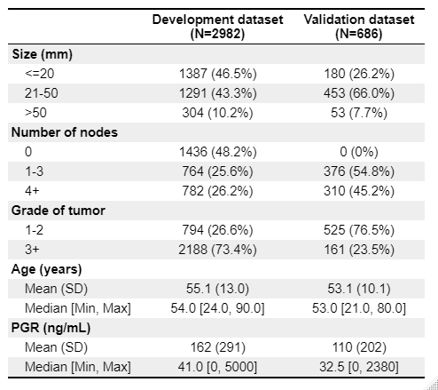

- [Goals](#goals)
  * [Install/load packages and import data](#install-load-packages-and-import-data)
  * [Descriptive statistics](#descriptive-statistics)
- [Goal 1: develop a risk prediction model with a time-to-event outcome](#goal-1--develop-a-risk-prediction-model-with-a-time-to-event-outcome)
  * [1.1 Preliminary investigation: survival and censoring curves in the development and validation data](#11-preliminary-investigation--survival-and-censoring-curves-in-the-development-and-validation-data)
  * [1.2 Secondary investigation: check non-linearity of continuous predictors](#12-secondary-investigation--check-non-linearity-of-continuous-predictors)
  * [1.3 Model development: first check - the proportional hazard (PH) assumption](#13-model-development--first-check---the-proportional-hazard--ph--assumption)
  * [1.4 Model development: fit the risk prediction models](#14-model-development--fit-the-risk-prediction-models)
- [Goal 2: Assessing performance in survival prediction models](#goal-2--assessing-performance-in-survival-prediction-models)
  * [2.1 Overall performance measures](#21-overall-performance-measures)
  * [2.2 Discrimination measures](#22-discrimination-measures)
  * [2.3 Calibration](#23-calibration)
    + [2.3.1 Calibration-in-the-large and calibration slope](#231-calibration-in-the-large-and-calibration-slope)
    + [2.3.2 Calibration plot using restricted cubic splines](#232-calibration-plot-using-restricted-cubic-splines)
    + [2.3.3 Other calibration metrics: ICI, E50,E90 and Emax based on restricted cubic splines](#233-other-calibration-metrics--ici--e50-e90-and-emax-based-on-restricted-cubic-splines)
- [Goal 3: Clinical utility](#goal-3--clinical-utility)
- [References](#references)

## Goals
Assessing the performance of prediction models with a time-to-event outcome: guidance for validation and updating with a new prognostic factor. In this document, we assume that individual data of the development and validation set are both available.

In particular:   
1. To develop a risk prediction model with a time-to-event outcome;  
2. To assess the prediction performance of a model with a time-to-event outcome;  
3. To assess the potential clinical utility of a risk prediction model with time-to-event outcome.

The extended code basically evaluates the prediction performance at a fixed time horizon (e.g. 5 years) and also for the entire follow-up time.

### Install/load packages and import data
We following libraries are needed to achieve the following goals, if you have not them installed, please use
install.packages('') (e.g. install.packages('survival')) or use the user-friendly approach if you are using RStudio.

```{r, wdlib, message=FALSE,warning=FALSE}

# Libraries needed
library(survival)
library(rms)
library(sqldf)
library(pec)
library(riskRegression)
library(survAUC)
library(survivalROC)
library(timeROC)
library(plotrix)
library(splines)
library(knitr)
library(table1)
library(kableExtra)
library(boot)
library(tidyverse)
library(rsample)
library(webshot)
webshot::install_phantomjs()


rdata <- readRDS("C:\\Users\\danie\\Documents\\Predsurv\\Data\\rdata.rds")
vdata <- readRDS("C:\\Users\\danie\\Documents\\Predsurv\\Data\\vdata.rds")
```
We loaded the development (rdata) and the validation data (vdata) from .rds format.
The Rotterdam breast cancer data was used to predict the risk of recurrence or death using size, stage and tumor size as predictors. These three predictors were used in the Nottingham Prognostic Index, one of the most popular index to determine prognosis following surgery of breast cancer.  
The Germany Breast Cancer Study Group data was used as an external validation of the model developed in the Rotterdam breast cancer data. The prediction model will be then extended using the progesterone (PGR) marker measured at primary surgery.  
The improvement in prediction performance will be evaluated internally in the Rotterdam data (development data) and in German Breast Cancer Study data (validation data).  

### Descriptive statistics
```{r, import,fig.align='center'}
rdata$id <- rdata$pid
rsel <- rdata[, c("id", "csize", "cnode", "cgrade", "age", "pgr")]
vsel <- vdata[, c("id", "csize", "cnode", "cgrade", "age", "pgr")]
rsel$dt <- 1
vsel$dt <- 2
cdata <- rbind(rsel, vsel)
cdata$dt <- factor(cdata$dt,
  levels = c(1, 2),
  labels = c("Development dataset", "Validation dataset")
)

label(cdata$csize) <- "Size"
label(cdata$cnode) <- "Number of nodes"
label(cdata$cgrade) <- "Grade of tumor"
label(cdata$age) <- "Age"
label(cdata$pgr) <- "PGR"
label(cdata$dt) <- "Dataset"

units(cdata$csize) <- "mm"
units(cdata$age) <- "years"
units(cdata$pgr) <- "ng/mL"


options(prType = "html")
tab1 <- table1(~ csize + cnode + cgrade + age + pgr | dt, data = cdata, overall = FALSE, topclass = "Rtable1-zebra")
# print(tab1)
rm(rsel, vsel, cdata)
```



## Goal 1: develop a risk prediction model with a time-to-event outcome
Prediction models are useful to provide the estimated probability of a specific outcome using personal information.
In many studies, especially in medicine, the main outcome under assessment is the time to an event of interest defined generally as survival time. Prognostic models for survival end points, such as recurrence or progression of disease, need to account for drop out during follow-up. Patients who have not experienced the event of interest are censored observations. Cox regression analysis is the most popular statistical model to deal with such data in oncology and other medical research.  

### 1.1 Preliminary investigation: survival and censoring curves in the development and validation data
First, we draw the survival and the censoring curves of the development and validation data
```{r, surv, fig.align='center'}
# Development set
sfit1 <- survfit(Surv(ryear, status == 1) ~ 1, data = rdata) # survival
sfit2 <- survfit(Surv(ryear, status == 0) ~ 1, rdata) # censoring

par(xaxs = "i", yaxs = "i", las = 1)
plot(sfit1, conf.int = FALSE, lwd = 2, xlab = "Years", bty = "n")
lines(sfit2, conf.int = FALSE, col = 2, lwd = 2)
legend(11, .9, c("Death", "Censoring"), col = 1:2, lwd = 2, bty = "n")
title("Development set")


# Validation set
sfit3 <- survfit(Surv(ryear, status == 1) ~ 1, data = vdata) # survival
sfit4 <- survfit(Surv(ryear, status == 0) ~ 1, vdata) # censoring

par(xaxs = "i", yaxs = "i", las = 1)
plot(sfit3, conf.int = FALSE, lwd = 2, xlab = "Years", bty = "n", xlim = c(0, 8))
lines(sfit4, conf.int = FALSE, col = 2, lwd = 2)
legend("bottomleft", c("Death", "Censoring"), col = 1:2, lwd = 2, bty = "n")
title("Validation set")
```
A number of 2982 patients were included to develop the risk prediction model for survival with a median follow-up of 9 years.
The median survival in the development data was 8 years with the corresponding 95% confidence intervals (CIs) of 7 and 9 years.
The 5-year survival was 59% (95% CI: 58-61%). 
A number of 686 patients were selected to externally validate the risk prediction model.The median survival in the validation data was 4 years. The median survival was 5 years while the 5-year survival was 49% (95% CI: 45-54%).


### 1.2 Secondary investigation: check non-linearity of continuous predictors
The potential non-linear relation between continuous predictors (i.e. progesterone level) and the outcome should be investigated before developing a risk prediction model. Non-linearity of continuous predictors can be checked using splines.  
Physically, a spline is a flexible wood or metal strip, which is passed through a set of fixed points (knots) in order to approximate a curve. The most common computational approximation to this is a cubic smoothing spline which is cubic between the knot points, and constrained to be linear beyond the two end knots. 
For the restricted cubic spline using rms::rcs() R package::function(), the position of the knots are defined at 10<sup>th</sup>,50<sup>th</sup> and 90<sup>th</sup> quantile of the continuous predictor distribution. For more details see Frank Harrell's book 'Regression Model Strategies' on page 27 (second edition).  
The user can specify the positions of the knots instead of using the default calculation of the knots proposed in the book of Frank Harrell.
To deal with very large influential value, we winzorize progesterone level to the 90<sup>th</sup>  percentile.

```{r,ff, warning=FALSE, fig.align='center'}
# Winzorise PGR to the 99th percentile to deal with very large influential values;
p99 <- quantile(rdata$pgr, probs = .99)
rdata$pgr2 <- pmin(rdata$pgr, p99)
vdata$pgr2 <- pmin(vdata$pgr, p99)

dd <- datadist(rdata)
options(datadist = "dd")
fit_pgr <- cph(Surv(ryear, status) ~ rcs(pgr2), data = rdata, x = T, y = T, surv = T)
plot(Predict(fit_pgr))
options(datadist = NULL)
```

We should model the progesterone level using a three-knot restricted cubic spline. We save the spline in the development and validation data.

```{r,rcs_save, message=FALSE, warning=FALSE,fig.align='center'}
# Save in the date the restricted cubic spline term using rms::rcspline.eval() package
# Development set
rcs3_pgr <- rcspline.eval(rdata$pgr2, knots = c(0, 41, 486))
attr(rcs3_pgr, "dim") <- NULL
attr(rcs3_pgr, "knots") <- NULL
rdata$pgr3 <- rcs3_pgr
rm(rcs3_pgr)

# Validation set
rcs3_pgr <- rcspline.eval(vdata$pgr2, knots = c(0, 41, 486))
attr(rcs3_pgr, "dim") <- NULL
attr(rcs3_pgr, "knots") <- NULL
vdata$pgr3 <- rcs3_pgr
rm(rcs3_pgr)
```

### 1.3 Model development: first check - the proportional hazard (PH) assumption
We now examine the fits in a more careful way by checking the proportionality of the hazards of the Cox regression model.
Firstly, we fit the first prediction model in the development data using size, node, grade. Then, we check the PH assumption.

```{r,ph, message=FALSE, warning=FALSE,fig.align='center'}
dd <- datadist(rdata)
options(datadist = "dd")
options(prType = "html")
fit1_cph <- cph(Surv(ryear, status) ~ csize + cnode + cgrade, rdata, x = T, y = T, surv = T)


zp1 <- cox.zph(fit1_cph, transform = "identity")
kable(round(zp1$table, 3)) %>% kable_styling("striped", position = "center")

oldpar <- par(mfrow = c(2, 2), mar = c(5, 5, 1, 1))
for (i in 1:3) {
  plot(zp1[i], resid = F)
  abline(0, 0, lty = 3)
}
par(oldpar)
options(datadist = NULL)
```

The statistical tests show strong evidence of non-proportionality. Since the number of death is large the formal tests are quite sensitive, however, and it is important to also examine the graphs.  
These show an estimated coefficient as a function of time. As a further follow-up we will divide the data into 3 epochs of 0-5, 5-10, and 10+ years, fitting a separate model to each.

```{r, epoch,warning=FALSE}
# Development
edata <- survSplit(Surv(ryear, status) ~ .,
  data = rdata, cut = c(5, 10),
  episode = "epoch"
)
efit1 <- cph(Surv(ryear, status) ~ csize + cnode + cgrade,
  data = edata[edata$epoch == 1, ], x = T, y = T, surv = T
)
efit2 <- cph(Surv(ryear, status) ~ csize + cnode + cgrade,
  data = edata[edata$epoch == 2, ], x = T, y = T, surv = T
)
efit3 <- cph(Surv(ryear, status) ~ csize + cnode + cgrade,
  data = edata[edata$epoch == 3, ], x = T, y = T, surv = T
)
res_efit <- round(rbind(e1 = coef(efit1), e2 = coef(efit2), e3 = coef(efit3)), 2)
rownames(res_efit) <- c("Epoch 1: 0-5 years", "Epoch 2: 5-10 years", "Epoch 3: >10 years")
kable(res_efit) %>% kable_styling("striped", position = "center")

options(prType = "html")
tt1 <- table(edata$epoch, edata$status, dnn = c("Epoch", "Status"))
rownames(tt1) <- c("Epoch 1: 0-5 years", "Epoch 2: 5-10 years", "Epoch 3: >10 years")
kable(tt1,
  col.names = c("Censored", "Event"),
  row.names = TRUE
) %>% kable_styling("striped", position = "center")
```

A drastic change in the size coefficients across all epochs is apparent,
along with a major reduction in the nodes coefficient in epoch 3. As an ameleoration of this we will refit the model using only the first epoch, which includes most of the recurrences and deaths.  
We applied the administrative censoring at 5 years in the development data and we assessed the prediction performance of the prognostic model at 5 years. The 5-year horizon was chosen because it is also a common prediction time horizon in clinical practice.  The hazards in the development data seem not totally proportional within 5 years but minor deviation of proportionality were considered acceptable. 
In R the summary function creates a more detailed report of a fit.  
Possible alternatives to address the violation of proportional hazards are:

 + a stratified Cox proportional hazard models for the predictor(s) that  violates the proportional hazard. The offending predictor will be absorbed into the baseline (as a strata), and then use the full follow-up. 
 In this scenario, it seems that the size predictor violates the proportional hazard assumption. So, three baseline hazards will be non-parametrically estimated. For prediction, the absolute risks will be calculated considering the different baseline hazards. The hazard ratio for size will not be estimated since it is incorporated in the baseline;
 
+ fitting the model with interaction between the offending predictor (in this case size) and the logarithm of the time. This complicates the interpretability of the model and risk prediction might be not fully estimated for new patients at the time of breast cancer diagnosis since size interacts with the time which is unknown for new patients.

If we ignored the non-proportional hazards entirely, the prediction performance of the model may lead to increase bias in estimating the risk especially in terms of calibration performances.


### 1.4 Model development: fit the risk prediction models
We develop the risk prediction model in the development data considering the first 5-year follow-up to minimize the violation of proportional hazard including size, nodel and grade. The second model also includes the progesterone level modelled using a 3-knot restricted cubic spline.  
We also administratively censored the validation data at 5 years.


```{r, model_development, fig.align='center'}
# Consider the first 5-year epoch in the development set
edata1 <- edata[edata$epoch == 1, ]
# Refit the model
efit1 <- coxph(Surv(ryear, status) ~ csize + cnode + cgrade,
  data = edata1, x = T, y = T
)
# Additional marker
efit1b <- coxph(Surv(ryear, status) ~ csize + cnode + cgrade + pgr2 + pgr3,
  data = edata1, x = T, y = T
)


# Validation
evdata <- survSplit(Surv(ryear, status) ~ ., data = vdata, cut = 5, episode = "epoch")
evdata1 <- evdata[evdata$epoch == 1, ]
```


Below the results of the models:  

+ Classical model:  
```{r, summary_m1, fig.align='center',warning=FALSE}
dd <- datadist(edata1)
options(datadist = "dd")
options(prType = "html")
s5 <- cph(Surv(ryear, status) ~ csize + cnode + cgrade,
  data = edata1, x = T, y = T, surv = T
)
print(s5)
```

+ Extended model:  

```{r, summary_m2, fig.align='center',warning=FALSE}
options(prType = "html")
s6 <- cph(Surv(ryear, status) ~ csize + cnode + cgrade + rcs(pgr2, c(0, 41, 486)),
  data = edata1, x = T, y = T, surv = T
)
print(s6)
options(datadist = NULL)
```

The coefficients of the models indicated that higher size, higher number of positive lymph nodes and higher grade is more associate with poorer prognosis. The association of the progesterone biomarker and the outcome is non-linear as investigated previously.


## Goal 2: Assessing performance in survival prediction models
The performance of a risk prediction models may be evaluated through:  
  
  + discrimination:  the ability of the model to identify patients with and without the outcome and it requires the coefficients (or the log of the hazard ratios) of the developed risk prediction model to be evaluated.   

+ calibration: the agreement between observed and predicted probabilities. It requires the baseline (cumulative) hazard or survival.     
+ overall performance measures: as a combination of discrimination and calibration and/or as a measure of the explained variation;  

Unfortunately, a few publications report the complete baseline (cumulative) hazard or survival or even the baseline (cumulative) hazard or survival at fixed time horizon _t_.
If we had both individual data of the development and validation, a complete assessment of discrimination and calibration would be possible. We could evaluate the prediction performance of a risk prediction model at a fixed time horizon(s) _t_ and for the complete follow-up time.
In risk prediction, physicians typically focus on one or more clinically relevant time horizons to inform subjects about their risk. For this reasons, according to information available, different levels of validation assessment are possible.
Here we aim to assess the prediction performance of a risk prediction model with time-to-event outcome in case all individual data are available and in case of only the model equation of a fixed time horizon (i.e. at 5 years) is provided including the baseline survival.

### 2.1 Overall performance measures
Some overall performance measures are proposed using survival data:

+ R^2^: it quantifies the observed separation between subjects with low
    and high predicted risk;
    
+ Brier score: it is the squared differences between observed and predicted values at fixed time point (e.g. at 5 years);
  
+ Index of prediction accuracy (IPA): it improves interpretability by scaling the Brier Score.
  
  
First we save elements need to calculate the performance measures as the linear predictor and the predicted survival at 5 years in the development and validation data. Secondly, we create B bootstrap data to calculate percentile bootstrap confidence intervals needed for some performance measures.
```{r, bootstrap,warning=FALSE}

edata1$lp <- predict(efit1) # linear predictor
edata1$predsurv5 <- predictSurvProb(efit1, newdata = edata1, times = 5) # predicted survival
edata1$lp_1b <- predict(efit1b)
edata1$predsurv5_1b <- predictSurvProb(efit1b, newdata = edata1, times = 5)


evdata1$lp_1b <- predict(efit1b, newdata = evdata1)
evdata1$predsurv5 <- predictSurvProb(efit1, newdata = evdata1, times = 5)
evdata1$lp_1b <- predict(efit1b, newdata = evdata1)
evdata1$predsurv5_1b <- predictSurvProb(efit1b, newdata = evdata1, times = 5)

set.seed(20200416)
eboot <- bootstraps(edata1, times = 10)
vboot <- bootstraps(evdata1, times = 10)
# NOTE: B=10 otherwise the computation time will be too long
```

We calculate the overall performance measures: R<sup>2</sup>, Brier score, and IPA and the corresponding confidence intervals.

```{r, r2sq, warning=FALSE,message=FALSE,include=FALSE}
source("C:\\Users\\danie\\Documents\\Predsurv\\Functions\\Rsquared.R", local = knitr::knit_global())
```

```{r, overall, warning=FALSE}
# Development set (apparent Brier and IPA) without pgr
score_rdata1 <-
  Score(list("Cox development" = efit1),
    formula = Surv(ryear, status) ~ 1, data = edata1, conf.int = TRUE, times = 4.95,
    cens.model = "km", metrics = "brier",
    summary = "ipa"
  )

# Validation set without pgr
score_vdata1 <-
  Score(list("Cox development" = efit1),
    formula = Surv(ryear, status) ~ 1, data = evdata1, conf.int = TRUE, times = 4.95,
    cens.model = "km", metrics = "brier",
    summary = "ipa"
  )

# Development set (apparent Brier and IPA) with pgr
score_rdata1b <-
  Score(list("Cox development" = efit1b),
    formula = Surv(ryear, status) ~ 1, data = edata1, conf.int = TRUE, times = 4.95,
    cens.model = "km", metrics = "brier",
    summary = "ipa"
  )

# Validation set with pgr
score_vdata1b <-
  Score(list("Cox development" = efit1b),
    formula = Surv(ryear, status) ~ 1, data = evdata1, conf.int = TRUE, times = 4.95,
    cens.model = "km", metrics = "brier",
    summary = "ipa"
  )

# Royston and R2 in development data without pgr
r2_rdata1 <- Rsq(
  lp = edata1$lp, time = edata1$ryear,
  status = edata1$status
)
# Royston and R2 in validation data without pgr
r2_vdata1 <- Rsq(
  lp = evdata1$lp, time = evdata1$ryear,
  status = evdata1$status
)
# Royston and R2 in development data with pgr
r2_rdata1b <- Rsq(
  lp = edata1$lp_1b, time = edata1$ryear,
  status = edata1$status
)
# Royston and R2 in validation data with pgr
r2_vdata1b <- Rsq(
  lp = evdata1$lp_1b, time = evdata1$ryear,
  status = evdata1$status
)

# Calcuate the Royston D and R2 non-parametric confidence intervals using bootstrap percentile
Rsq_boot <- function(split) {
  Rsq(
    lp = analysis(split)$lp,
    time = analysis(split)$ryear,
    status = analysis(split)$status, ties = TRUE
  )
}

Rsq_boot_1b <- function(split) {
  Rsq(
    lp = analysis(split)$lp_1b,
    time = analysis(split)$ryear,
    status = analysis(split)$status, ties = TRUE
  )
}


# Development data
eboot <- eboot %>% mutate(
  r1 = map(splits, Rsq_boot),
  r1b = map(splits, Rsq_boot_1b),
  D1 = map_dbl(r1, "D"),
  R21 = map_dbl(r1b, "R2"),
  D1b = map_dbl(r1, "D"),
  R21b = map_dbl(r1b, "R2")
)

# Validation data
vboot <- vboot %>% mutate(
  r1 = map(splits, Rsq_boot),
  r1b = map(splits, Rsq_boot_1b),
  D1 = map_dbl(r1, "D"),
  R21 = map_dbl(r1, "R2"),
  D1b = map_dbl(r1b, "D"),
  R21b = map_dbl(r1b, "R2")
)

# IPA confidence intervals
# NOTE: computational time is too long to compute them when the number of bootstrap replications is high
score_boot_1 <- function(split) {
  Score(list("Cox development" = efit1),
    formula = Surv(ryear, status) ~ 1, data = analysis(split), conf.int = FALSE, times = 4.95,
    cens.model = "km", metrics = "brier",
    summary = "ipa"
  )$Brier[[1]]$IPA[2]
}

score_boot_1b <- function(split) {
  Score(list("Cox development" = efit1b),
    formula = Surv(ryear, status) ~ 1, data = analysis(split), conf.int = FALSE, times = 4.95,
    cens.model = "km", metrics = "brier",
    summary = "ipa"
  )$Brier[[1]]$IPA[2]
}
eboot <- eboot %>% mutate(
  IPA1 = map_dbl(splits, score_boot_1),
  IPA1b = map_dbl(splits, score_boot_1b)
) # Development dataset

vboot <- vboot %>% mutate(
  IPA1 = map_dbl(splits, score_boot_1),
  IPA1b = map_dbl(splits, score_boot_1b)
) # Validation dataset

# Table overall measures
alpha <- .05
k <- 2 # number of digits
res_ov <- matrix(unlist(c(
  score_rdata1$Brier$score$Brier[2], # Brier apparent validation
  score_rdata1$Brier$score[2, 6],
  score_rdata1$Brier$score[2, 7],
  score_rdata1b$Brier$score$Brier[2], # Brier apparent validation with PGR
  score_rdata1b$Brier$score[2, 6],
  score_rdata1b$Brier$score[2, 7],
  score_vdata1$Brier$score$Brier[2], # Brier external validation
  score_vdata1$Brier$score[2, 6],
  score_vdata1$Brier$score[2, 7],
  score_vdata1b$Brier$score$Brier[2], # Brier external validation with PGR
  score_vdata1b$Brier$score[2, 6],
  score_vdata1b$Brier$score[2, 7],
  r2_rdata1["R2"], # Royston apparent validation
  quantile(eboot$R21, probs = alpha / 2),
  quantile(eboot$R21, probs = 1 - alpha / 2),
  r2_rdata1b["R2"], # Royston apparent validation with PGR
  quantile(eboot$R21b, probs = alpha / 2),
  quantile(eboot$R21b, probs = 1 - alpha / 2),
  r2_vdata1["R2"], # Royston external validation
  quantile(vboot$R21, probs = alpha / 2),
  quantile(vboot$R21, probs = 1 - alpha / 2),
  r2_vdata1["R2"], # Royston external validation with PGR
  quantile(vboot$R21b, probs = alpha / 2),
  quantile(vboot$R21b, probs = 1 - alpha / 2),
  score_rdata1$Brier$score$IPA[2], # IPA apparent validation
  quantile(eboot$IPA1, probs = alpha / 2),
  quantile(eboot$IPA1, probs = 1 - alpha / 2),
  score_rdata1b$Brier$score$IPA[2], # IPA apparent validation with PGR
  quantile(eboot$IPA1b, probs = alpha / 2),
  quantile(eboot$IPA1b, probs = 1 - alpha / 2),
  score_vdata1$Brier$score$IPA[2], # IPA external validation
  quantile(vboot$IPA1, probs = alpha / 2),
  quantile(vboot$IPA1, probs = 1 - alpha / 2),
  score_vdata1b$Brier$score$IPA[2], # IPA external validation with PGR
  quantile(vboot$IPA1b, probs = alpha / 2),
  quantile(vboot$IPA1b, probs = 1 - alpha / 2)
)),
nrow = 3, ncol = 12, byrow = T, dimnames = list(
  c("Brier", "R2", "IPA"),
  rep(c("Estimate", "Lower .95 ", "Upper .95"), 4)
)
)

res_ov <- round(res_ov, 2) # Digits
kable(res_ov) %>%
  kable_styling("striped", position = "center") %>%
  add_header_above(c(" " = 1, "Apparent" = 3, "Apparent + PGR" = 3, "External" = 3, "External + PGR" = 3))
```

As expected the overall performance measures were lower in the external validation. Including information about PGR slightly improved the overall performance.

### 2.2 Discrimination measures
Discrimination is the ability to differentiate between subjects who have the outcome and subjects who do not.
In prognostic modelling, discrimination reflects separation between survival curves for individuals or groups.
The following discrimination measures are proposed:

+ Uno's C-index: evaluates discrimination ability for the entire follow-up time;  
+ Uno's time-dependent Area Under the ROC curve (AUC): evaluates discrimination at a fixed time horizon;  


Values close to 1 indicate good discrimination ability, while values close to 0.5 indicated poor discrimination ability.   

We used the time horizon at 4.95 and not 5 years since controls are considered patients at risk after the time horizon and we administratively censored at 5 years to minimize the violation of PH assumption (see paragraph 1.3).  

The Uno's C-index provides a measure of an overall discrimination over the follow-up time. The Uno's time-dependent AUC measures discrimination at a specific time horizon *t* defining cases and controls of censored data at a fixed time horizon *t*.
The Uno's C-index provided in the function subfolder (file UnoC.R) takes a lot of computational time. We suggested as fast alternative cindex() in the package pec. The cindex was proposed by Gerds and Wolbers: for details, see references below or using help(cindex). The code for Uno's C-index is present in the RMarkdown associated source code. 

More details are in the paper and in the references.

```{r, function_UnoC, message=FALSE,warning=FALSE, fig.align='center',include=FALSE}
source("C:\\Users\\danie\\Documents\\Predsurv\\Functions\\UnoC.R", local = knitr::knit_global())
```

```{r, UnoC, message=FALSE,warning=FALSE, fig.align='center',include=FALSE,echo=FALSE, eval=FALSE}
# Apparent
UnoC_rdata1 <- Uno_C(
  tfup = edata1$ryear,
  status = edata1$status,
  linear.predictor = edata1$lp,
  pred.surv = edata1$predsurv5, thorizon = 4.95
)
# External validation
UnoC_vdata1 <- Uno_C(
  tfup = evdata1$ryear,
  status = evdata1$status,
  linear.predictor = evdata1$lp,
  pred.surv = evdata1$predsurv5, thorizon = 4.95
)
# Apparent + PGR
UnoC_rdata1b <- Uno_C(
  tfup = edata1$ryear,
  status = edata1$status,
  linear.predictor = edata1$lp_1b,
  pred.surv = edata1$predsurv5_1b, thorizon = 4.95
)

# External + PGR
UnoC_vdata1b <- Uno_C(
  tfup = evdata1$ryear,
  status = evdata1$status,
  linear.predictor = evdata1$lp_1b,
  pred.surv = evdata1$predsurv5_1b, thorizon = 4.95
)


# Bootstraping Uno's C-index to calculate the bootstrap percentile confidence intervals
UnoC_boot1 <- function(split) {
  Uno_C(
    tfup = analysis(split)$ryear,
    status = analysis(split)$status,
    linear.predictor = analysis(split)$lp,
    pred.surv = analysis(split)$predsurv5, thorizon = 4.95
  )
}

UnoC_boot1b <- function(split) {
  Uno_C(
    tfup = analysis(split)$ryear,
    status = analysis(split)$status,
    linear.predictor = analysis(split)$lp_1b,
    pred.surv = analysis(split)$predsurv5_1b, thorizon = 4.95
  )
}

# Run time-dependent AUC in the bootstrapped development and validation data
# to calculate the non-parametric CI through percentile bootstrap
eboot <- eboot %>% mutate(
  UnoC1 = map_dbl(splits, UnoC_boot1),
  UnoC1b = map_dbl(splits, UnoC_boot1b)
)
# saveRDS(eboot,'eboot.rds')
vboot <- vboot %>% mutate(
  UnoC1 = map_dbl(splits, UnoC_boot1),
  UnoC1b = map_dbl(splits, UnoC_boot1b)
)

alpha <- .05
k <- 2
res_unoC <- matrix(c(
  UnoC_rdata1,
  quantile(eboot$UnoC1, probs = alpha / 2),
  quantile(eboot$UnoC1, probs = 1 - alpha / 2),
  UnoC_rdata1b,
  quantile(eboot$UnoC1b, probs = alpha / 2),
  quantile(eboot$UnoC1b, probs = 1 - alpha / 2),
  UnoC_vdata1,
  quantile(vboot$UnoC1, probs = alpha / 2),
  quantile(vboot$UnoC1, probs = 1 - alpha / 2),
  UnoC_vdata1b,
  quantile(vboot$UnoC1b, probs = alpha / 2),
  quantile(vboot$UnoC1b, probs = 1 - alpha / 2),
  nrow = 1, ncol = 12, byrow = T,
  dimnames = list(
    c("Uno C"),
    rep(c("Estimate", "Lower .95 ", "Upper .95"), 4)
  )
))
```


```{r, AUC, message=FALSE, warning=FALSE}
c_rdata1 <- unlist(cindex(efit1)$AppCindex)
c_vdata1 <- unlist(cindex(efit1, data = evdata1)$AppCindex)
c_rdata1b <- unlist(cindex(efit1b)$AppCindex)
c_vdata1b <- unlist(cindex(efit1, data = evdata1)$AppCindex)

c_boot <- function(split) {
  unlist(cindex(efit1, data = analysis(split))$AppCindex)
}

c_boot_1b <- function(split) {
  unlist(cindex(efit1b, data = analysis(split))$AppCindex)
}

# cindex bootstrap
# Development data
eboot <- eboot %>% mutate(
  c1 = map_dbl(splits, c_boot),
  c1b = map_dbl(splits, c_boot_1b)
)

# Validation data
vboot <- vboot %>% mutate(
  c1 = map_dbl(splits, c_boot),
  c1b = map_dbl(splits, c_boot_1b)
)

# Time-dependent AUC (in Table 3 called Uno's TD AUC at 5 years) ###
# Uno's time-dependent Area Under the Curve
# Apparent
Uno_rdata1 <-
  timeROC(
    T = edata1$ryear, delta = edata1$status,
    marker = predict(efit1, newdata = edata1),
    cause = 1, weighting = "marginal", times = 4.95,
    iid = TRUE
  )

# External validation
Uno_vdata1 <-
  timeROC(
    T = evdata1$ryear, delta = evdata1$status,
    marker = predict(efit1, newdata = evdata1),
    cause = 1, weighting = "marginal", times = 4.95,
    iid = TRUE
  )

# Apparent with pgr
Uno_rdata1b <-
  timeROC(
    T = edata1$ryear, delta = edata1$status,
    marker = predict(efit1b, newdata = edata1),
    cause = 1, weighting = "marginal", times = 4.95,
    iid = TRUE
  )

# External validation with pgr
Uno_vdata1b <-
  timeROC(
    T = evdata1$ryear, delta = evdata1$status,
    marker = predict(efit1b, newdata = evdata1),
    cause = 1, weighting = "marginal", times = 4.95,
    iid = TRUE
  )
# NOTE: if you have a lot of data n > 2000, standard error computation may be really long.
# In that case, please use bootstrap percentile to calculate confidence intervals.

# Save results
alpha <- .05
k <- 2
res_discr <- matrix(c(
  c_rdata1,
  quantile(eboot$c1, probs = alpha / 2),
  quantile(eboot$c1, probs = 1 - alpha / 2),
  c_rdata1b,
  quantile(eboot$c1b, probs = alpha / 2),
  quantile(eboot$c1b, probs = 1 - alpha / 2),
  c_vdata1,
  quantile(vboot$c1, probs = alpha / 2),
  quantile(vboot$c1, probs = 1 - alpha / 2),
  c_vdata1b,
  quantile(vboot$c1b, probs = alpha / 2),
  quantile(vboot$c1b, probs = 1 - alpha / 2),
  Uno_rdata1$AUC["t=4.95"],
  Uno_rdata1$AUC["t=4.95"] -
    qnorm(1 - alpha / 2) * Uno_rdata1$inference$vect_sd_1["t=4.95"],
  Uno_rdata1$AUC["t=4.95"] +
    qnorm(1 - alpha / 2) * Uno_rdata1$inference$vect_sd_1["t=4.95"],
  Uno_rdata1b$AUC["t=4.95"],
  Uno_rdata1b$AUC["t=4.95"] -
    qnorm(1 - alpha / 2) * Uno_rdata1b$inference$vect_sd_1["t=4.95"],
  Uno_rdata1b$AUC["t=4.95"] +
    qnorm(1 - alpha / 2) * Uno_rdata1b$inference$vect_sd_1["t=4.95"],
  Uno_vdata1$AUC["t=4.95"],
  Uno_vdata1$AUC["t=4.95"] -
    qnorm(1 - alpha / 2) * Uno_vdata1$inference$vect_sd_1["t=4.95"],
  Uno_vdata1$AUC["t=4.95"] +
    qnorm(1 - alpha / 2) * Uno_vdata1$inference$vect_sd_1["t=4.95"],
  Uno_vdata1b$AUC["t=4.95"],
  Uno_vdata1b$AUC["t=4.95"] -
    qnorm(1 - alpha / 2) * Uno_vdata1b$inference$vect_sd_1["t=4.95"],
  Uno_vdata1b$AUC["t=4.95"] +
    qnorm(1 - alpha / 2) * Uno_vdata1b$inference$vect_sd_1["t=4.95"]
),
nrow = 2, ncol = 12, byrow = T,
dimnames = list(
  c("Gerds C", "Uno AUC"),
  rep(c("Estimate", "Lower .95 ", "Upper .95"), 4)
)
)

res_discr <- round(res_discr, k)
kable(res_discr) %>%
  kable_styling("striped", position = "center") %>%
  add_header_above(c(" " = 1, "Apparent" = 3, "Apparent + PGR" = 3, "External" = 3, "External + PGR" = 3))
```

The time-dependent AUCs at 5 years were in the external validation were between 0.68 and 0.72 showing moderate discrimination. The additional information of the PGR marker increased the discrimination by 0.04.

The discrimination ability may be evaluated over the time since diagnosis through a plot showing the AUC over the time (years) in the development and validation set in the basic and extended model. Since the calculation of the AUC and the standard errors in the development set is computationally demanding, we showed only the plot in the validation data. However, we provided the R code (as a comment) for the development data.

```{r, plotAUC, fig.align='center'}
# NOTE: it takes long time to be computed
# Apparent without PGR
# AUC_apparent_model1<-
#    timeROC(T=rdata$ryear, delta=rdata$status,
#            marker=predict(efit1,newdata=rdata),
#            cause=1,weighting='marginal',
#            times=quantile(rdata$ryear,probs=seq(0.01,0.85,0.02)),
#           iid=TRUE)
# saveRDS(AUC_apparent_model1,file='AUC_apparent_model1.rds')

# Apparent with PGR
# AUC_apparent_model1b<-
#    timeROC(T=rdata$ryear, delta=rdata$status,
#           marker=predict(efit1b,newdata=rdata),
#           cause=1,weighting='marginal',
#           times=quantile(rdata$ryear,probs=seq(0.01,0.85,0.02)),
#           iid=TRUE)
# saveRDS(AUC_apparent_model1b,file='AUC_apparent_model1b.rds')

# Validation without PGR
AUC_val_model1 <-
  timeROC(
    T = evdata1$ryear, delta = evdata1$status,
    marker = predict(efit1, newdata = evdata1),
    cause = 1, weighting = "marginal",
    times = quantile(evdata1$ryear, probs = seq(0.02, 0.82, 0.02)),
    iid = TRUE
  )

# Validation with PGR
AUC_val_model1b <-
  timeROC(
    T = evdata1$ryear, delta = evdata1$status,
    marker = predict(efit1b, newdata = evdata1),
    cause = 1, weighting = "marginal",
    times = quantile(evdata1$ryear, probs = seq(0.02, 0.82, 0.02)),
    iid = TRUE
  )

# saveRDS(AUC_apparent_model2,file='AUC_apparent_model2.rds')

# Calculate the confidence intervals
# AUC_apparent_model1$lower<-AUC_apparent_model1$AUC-qnorm(0.975)*AUC_apparent_model1$inference$vect_sd_1
# AUC_apparent_model1$upper<-AUC_apparent_model1$AUC+qnorm(0.975)*AUC_apparent_model1$inference$vect_sd_1
#
# AUC_apparent_model1b$lower<-AUC_apparent_model1b$AUC-qnorm(0.975)*AUC_apparent_model1b$inference$vect_sd_1
# AUC_apparent_model1b$upper<-AUC_apparent_model1b$AUC+qnorm(0.975)*AUC_apparent_model1b$inference$vect_sd_1

AUC_val_model1$lower <- AUC_val_model1$AUC - qnorm(0.975) * AUC_val_model1$inference$vect_sd_1
AUC_val_model1$upper <- AUC_val_model1$AUC + qnorm(0.975) * AUC_val_model1$inference$vect_sd_1

AUC_val_model1b$lower <- AUC_val_model1b$AUC - qnorm(0.975) * AUC_val_model1b$inference$vect_sd_1
AUC_val_model1b$upper <- AUC_val_model1b$AUC + qnorm(0.975) * AUC_val_model1b$inference$vect_sd_1

# par(las=1,xaxs='i',yaxs='i')
# plot(AUC_apparent_model1$times,AUC_apparent_model1$AUC,type='l',bty='n',
#      xlim=c(0,10),ylim=c(0,1),lwd=2,xlab='Time (years)',ylab='AUC',lty=2)
# polygon(c(AUC_apparent_model1$times,rev(AUC_apparent_model1$times)),
#         c(AUC_apparent_model1$lower,rev(AUC_apparent_model1$upper)),
#         col = rgb(160,160,160,maxColorValue = 255,alpha=100),
#         border = FALSE)
# lines(AUC_apparent_model1$times,AUC_apparent_model1$AUC,col='black',lwd=2, lty=2)
# polygon(c(AUC_apparent_model1b$times,rev(AUC_apparent_model1b$times)),
#         c(AUC_apparent_model1b$lower,rev(AUC_apparent_model1b$upper)),
#         col = rgb(96,96,96,maxColorValue = 255,alpha=100),
#         border = FALSE)
# lines(AUC_apparent_model1b$times,AUC_apparent_model1b$AUC,col='black',lwd=2,lty=1)
# abline(h=0.5)
# legend('bottomright',c('NPI','NPI + PGR'), lwd=2,lty=c(2,1),bty='n')
# title('A Development data (n=2982)', adj=0)

par(las = 1, xaxs = "i", yaxs = "i")
plot(AUC_val_model1$times, AUC_val_model1$AUC,
  type = "l", bty = "n",
  xlim = c(0, 5), ylim = c(0, 1), lwd = 2, xlab = "Time (years)", ylab = "AUC", lty = 2
)
polygon(c(AUC_val_model1$times, rev(AUC_val_model1$times)),
  c(AUC_val_model1$lower, rev(AUC_val_model1$upper)),
  col = rgb(160, 160, 160, maxColorValue = 255, alpha = 100),
  border = FALSE
)
lines(AUC_val_model1$times, AUC_val_model1$AUC, col = "black", lwd = 2, lty = 2)
polygon(c(AUC_val_model1b$times, rev(AUC_val_model1b$times)),
  c(AUC_val_model1b$lower, rev(AUC_val_model1b$upper)),
  col = rgb(96, 96, 96, maxColorValue = 255, alpha = 100),
  border = FALSE
)
lines(AUC_val_model1b$times, AUC_val_model1b$AUC, col = "black", lwd = 2, lty = 1)
abline(h = 0.5)
legend("bottomright", c("Original model", "Original model + PGR"), lwd = 2, lty = c(2, 1), bty = "n")
title("B External data (n=686)", adj = 0)
```

The discrimination performance is higher in the extended model compared to the model without PGR over the entire follow-up.

### 2.3 Calibration
Calibration is the agreement between observed outcomes and predicted probabilities.
For example, in survival models, a predicted survival probability at a fixed time horizon _t_ of 80% is considered reliable if it can be expected that 80 out of 100 will survive among patients received a predicted survival probability of 80%.

Calibration is measured by:

+ Calibration in-the-large: lower or higher than zero indicates that prediction is systematically too high or low, respectively;
  
+ Calibration slope: below (above) 1.0 indicate over (under) estimation of risk by the model;
  
+ Calibration plot: it is a graphical representation of calibration in-the-large and calibration. It shows:
      
  + on the *x-axis* the predicted survival (or risk) probabilities at a fixed time horizon (e.g. at 5 years);
      
  + on the *y-axis* the observed survival (or risk) probabilities at a fixed time horizon (e.g. at 5 years);
      
  + The 45-degree line indicates the good overall calibration. 
      Points below the 45-degree line indicates that the model overestimate the observed risk. 
      If points are above the 45-degree line, the model underestimate the observed risk;
      The observed probabilities estimated by the Kaplan-Meier curves (in case of survival) or by the complementary of the Kaplan-Meier curves (in case of risk in absence of competing risks) are represented in terms of percentiles of the predicted survival (risk) probabilities.
      
+ Integrated Calibration Index (ICI): it is the weighted difference between smoothed observed proportions and predicted probabilities
in which observations are weighted by the empirical density function of the predicted probabilities;  

+ E50, E90 and Emax denote the median, the 90th percentile and the maximum absolute difference between observed and predicted probabilities of the outcome at time *t*;  

+ Kaplan-Meier curves may be used as calibration assessment when the baseline hazard function is not reported and a development paper reported only Kaplan-Meier curves for risk groups of the predictor index (PI). The PI is the combination of the coefficients estimated in the development data multiplied by the predictors in the validation data. Basically, if the survival curves for risk groups agree well visually between development and validation data, then good calibration may be implied. However, this is not strict comparison between observed and predicted values since a model-based approach was not used;  

When individual data information are both available for the development and the validation set, all calibration measures can be calculated and reported.  
When model equation of survival at a specific time horizon *t* is provided including the baseline hazard (or survival) and the coefficients,
calibration-in-the-large can be calculated as the ratio between the observed and the expected number of events at time *t* (known as OE ratio). Calibration slope, calibration plot, ICI, E50, E90 and Emax may be also calculated and reported.    
The calibration plot, ICI, E50, E90, Emax may be evaluated using different technique as restricted cubic splines or hazard regression. Here we show the calibration plots and the calibration measures using the restricted cubic splines technique. For hazard regression, please see the references at the end of the document.

#### 2.3.1 Calibration-in-the-large and calibration slope
Mean calibration (known also as calibration-in-the-large) requires the log of the baseline hazards to be calculated. However,
a Cox regression model does not allow its direct estimation because it does not provide a model intercept (i.e. the log baseline hazard).  
Recently, it was proposed to use a Poisson model for estimation of calibration-in-the-large  and calibration slope in the external dataset (Crowson et al, 2016). Briefly, a Cox model with pre-fixed baseline hazard is exactly equivalent to a Poisson regression. In addition, the likelihood of survival models is proportional to the likelihood of the Poisson models. More details are provided in the book 'Dynamic prediction in clinical survival analysis' (Hans van Houwelingen & Hein Putter, 2011), chapter 4 pages 57-69.  
We calculate the log of the cumulative hazard for each patient in the external dataset and enter this variable as an offset in a Poisson model (i.e. its coefficient = 1). The intercept of the model represents the calibration-in-the-large with an ideal value of 0.
In summary, calibration in-the-large indicates if prediction is systematically too high or low and calibration slope indicates (over/under)estimation of risk by the model;
  

```{r, cal, message=FALSE, warning=FALSE}
# Apparent calibration measures (calibration in-the-large and calibration slope) without pgr
p <- log(predict(efit1, newdata = edata1, type = "expected") + .0000001)
lp <- predict(efit1, newdata = edata1, type = "lp")
logbase <- p - lp
rcfit1 <- glm(status ~ offset(p), family = poisson, data = edata1) # calibration in-the-large
rcfit2 <- glm(status ~ lp + offset(logbase), family = poisson, data = edata1)
# If we used the original data, the apparent internal validation may be also not perfect calibrated.


# External validation without pgr
p <- log(predict(efit1, newdata = evdata1, type = "expected") + .0000001)
lp <- predict(efit1, newdata = evdata1, type = "lp")
logbase <- p - lp
vcfit1 <- glm(status ~ offset(p), family = poisson, data = evdata1) # calibration in-the-large
vcfit2 <- glm(status ~ lp + offset(logbase), family = poisson, data = evdata1)

# Apparent calibration measures (calibration in-the-large and calibration slope) with pgr
p <- log(predict(efit1b, newdata = edata1, type = "expected") + .0000001)
lp <- predict(efit1b, newdata = edata1, type = "lp")
logbase <- p - lp
rcfit1b <- glm(status ~ offset(p), family = poisson, data = edata1) # calibration in-the-large
rcfit2b <- glm(status ~ lp + offset(logbase), family = poisson, data = edata1)


# External validation with pgr
p <- log(predict(efit1b, newdata = evdata1, type = "expected") + .0000001)
lp <- predict(efit1b, newdata = vdata, type = "lp")
logbase <- p - lp
vcfit1b <- glm(status ~ offset(p), family = poisson, data = evdata1) # calibration in-the-large
vcfit2b <- glm(status ~ lp + offset(logbase), family = poisson, data = evdata1)

# Results calibration in-the-large and slope
res_cal <- matrix(c(
  rcfit1$coefficients, rcfit1b$coefficients, vcfit1$coefficients, vcfit1b$coefficients,
  rcfit2$coefficients["lp"], rcfit2b$coefficients["lp"], vcfit2$coefficients["lp"], vcfit2b$coefficients["lp"]
),
nrow = 2, ncol = 4, byrow = T,
dimnames = list(
  c("Calibration in-the-large", "Calibration slope"),
  c("Apparent", "Apparent + PGR", "Validation", "Validation + PGR")
)
)

res_cal <- matrix(c(
  rcfit1$coefficients,
  confint(rcfit1), # Apparent - calibration in-the-large

  rcfit1b$coefficients,
  confint(rcfit1b), # Apparent + PGR - calibration in-the-large

  vcfit1$coefficients,
  confint(vcfit1), # External - calibration in-the-large

  vcfit1b$coefficients,
  confint(vcfit1b), # External + PGR - calibration in-the-large

  rcfit2$coefficients["lp"],
  confint(rcfit2)[2, ], # Apparent - calibration slope

  rcfit2b$coefficients["lp"],
  confint(rcfit2b)[2, ], # Apparent + PGR - calibration slope

  vcfit2$coefficients["lp"],
  confint(vcfit2)[2, ], # External - calibration slope

  vcfit2b$coefficients["lp"],
  confint(vcfit2b)[2, ]
), # External + PGR - calibration slope
nrow = 2, ncol = 12, byrow = T,
dimnames = list(
  c("Calibration in-the-large", "Calibration slope"),
  rep(c("Estimate", "Lower .95 ", "Upper .95"), 4)
)
)

k <- 2
res_cal <- round(res_cal, k) # number of digits
kable(res_cal) %>%
  kable_styling("striped", position = "center") %>%
  add_header_above(c(" " = 1, "Apparent" = 3, "Apparent + PGR" = 3, "External" = 3, "External + PGR" = 3))
```

Calibration in-the-large was 0.13 and 0.10  and calibration slope was 1.01 and 1.12 in the validation data without and with PGR, respectively.
The exponential of calibration in-the-large is known as the observed and expected ratio (OE ratio). When the ratio is above 1, the model underpredicts the risk and below 1 indicates the overprediction of the model. The OE ratio is 1.14 and 1.11.

#### 2.3.2 Calibration plot using restricted cubic splines
Calibration plots of the external validation data with and without PGR are calculated and shown using restricted cubic splines.  
The interpretation of the calibration plot were provided in the section 2.3 of this document, in the corresponding paper and in the literature provided in the paper and at the end of this document. More details about the method are given in the references below.

```{r, cal_rcs, fig.align='center'}
## External data without PGR
evdata1$predmort5 <- 1 - survest(s5, newdata = evdata1, times = 5)$surv
# also the model (e.g. efit1) run using survival::coxph() may be used
# and 1-pec::predictSurvProb() function can replace 1-rms::survest()
evdata1$predmort5.cll <- log(-log(1 - evdata1$predmort5))

# Estimate
vcalibrate.efit1 <- cph(Surv(ryear, status) ~ rcs(predmort5.cll, 3),
  x = T, y = T,
  data = evdata1, surv = T
) # better rms::cph?
predict.grid <- seq(quantile(evdata1$predmort5, prob = 0.01), quantile(evdata1$predmort5, prob = 0.99), length = 100)
predict.grid.cll <- log(-log(1 - predict.grid))
predict.grid.df <- data.frame(predict.grid)
predict.grid.cll.df <- data.frame(predict.grid.cll)
names(predict.grid.df) <- "predmort5"
names(predict.grid.cll.df) <- "predmort5.cll"

# Plot
pred.vcalibrate.efit1 <- 1 - survest(vcalibrate.efit1, newdata = predict.grid.cll.df, times = 5)$surv
pred.vcalibrate.efit1.upper <- 1 - survest(vcalibrate.efit1, newdata = predict.grid.cll.df, times = 5)$lower
pred.vcalibrate.efit1.lower <- 1 - survest(vcalibrate.efit1, newdata = predict.grid.cll.df, times = 5)$upper
par(xaxs = "i", yaxs = "i", las = 1)
plot(predict.grid, pred.vcalibrate.efit1,
  type = "l", lty = 1, xlim = c(0, 1),
  ylim = c(0, 1), lwd = 2,
  xlab = "Predicted probability",
  ylab = "Observed probability", bty = "n"
)
lines(predict.grid, pred.vcalibrate.efit1.lower, type = "l", lty = 2, lwd = 2)
lines(predict.grid, pred.vcalibrate.efit1.upper, type = "l", lty = 2, lwd = 2)
abline(0, 1, lwd = 2, lty = 2, col = "red")
title("A External data without PGR", adj = 0)
par(new = T)
plot(density(evdata1$predmort5),
  axes = F, xlab = NA, ylab = NA,
  main = ""
)

## External data with PGR
evdata1$predmort5 <- 1 - survest(s6, newdata = evdata1, times = 5)$surv
evdata1$predmort5.cll <- log(-log(1 - evdata1$predmort5))

# Estimate
vcalibrate.efit1b <- cph(Surv(ryear, status) ~ rcs(predmort5.cll, 3),
  x = T, y = T, data = evdata1, surv = T
)
predict.grid <- seq(quantile(evdata1$predmort5, prob = 0.01), quantile(evdata1$predmort5, prob = 0.99), length = 100)
predict.grid.cll <- log(-log(1 - predict.grid))
predict.grid.df <- data.frame(predict.grid)
predict.grid.cll.df <- data.frame(predict.grid.cll)
names(predict.grid.df) <- "predmort5"
names(predict.grid.cll.df) <- "predmort5.cll"

# Plot
pred.vcalibrate.efit1b <- 1 - survest(vcalibrate.efit1b, newdata = predict.grid.cll.df, times = 5)$surv
pred.vcalibrate.efit1b.lower <- 1 - survest(vcalibrate.efit1b, newdata = predict.grid.cll.df, times = 5)$upper
pred.vcalibrate.efit1b.upper <- 1 - survest(vcalibrate.efit1b, newdata = predict.grid.cll.df, times = 5)$lower
par(xaxs = "i", yaxs = "i", las = 1)
plot(predict.grid, pred.vcalibrate.efit1b,
  type = "l", lty = 1, xlim = c(0, 1),
  ylim = c(0, 1), lwd = 2,
  xlab = "Predicted probability of recurrence at 5 years",
  ylab = "Observed probability of recurrence at 5 years", bty = "n"
)
lines(predict.grid, pred.vcalibrate.efit1b.lower, type = "l", lty = 2, lwd = 2)
lines(predict.grid, pred.vcalibrate.efit1b.upper, type = "l", lty = 2, lwd = 2)
abline(0, 1, lwd = 2, lty = 2, col = "red")
title("B External data with PGR", adj = 0)
par(new = T)
plot(density(evdata1$predmort5),
  axes = F, xlab = NA, ylab = NA,
  main = ""
)
```


Both plots identified good calibration although probabilities of recurrence were slightly underestimated especially for the lowest and the highest values of 
the observed probabilities of recurrence.  
The additional information of PGR improved the overall calibration, especially for the highest values, as shown in the two calibration plots above.


#### 2.3.3 Other calibration metrics: ICI, E50,E90 and Emax based on restricted cubic splines
As explained in the previous sections, three additional calibration metrics were provided: the integrated Calibration Index (ICI), E50, E90 and Emax.  
ICI is the weighted difference between smoothed observed proportions and predicted probabilities in which observations are weighted by the empirical density function of the predicted probabilities.   
E50, E90 and Emax denote the median, the 90th percentile and the maximum absolute difference between observed and predicted probabilities of the outcome at time *t*. 

```{r, cal_rcs_metrics, fig.align='center'}
# Calibration metrics

# Apparent
edata1$predmort5 <- 1 - predictSurvProb(efit1, newdata = edata1, times = 5)
# Here we used the model created with  survival::coxph() (e.g.efit1) but again 1-survest() using the model created with rms:cph() (e.g s5) can be used
edata1$predmort5.cll <- log(-log(1 - edata1$predmort5))
rcalibrate.efit1 <- coxph(Surv(ryear, status) ~ rcs(predmort5.cll, 3), x = T, y = T, data = edata1) # rms:cph() can be also used
pred.rcalibrate.efit1 <- 1 - predictSurvProb(rcalibrate.efit1,
  newdata = edata1, times = 5
)

ICI.edata1.5yr <- mean(abs(edata1$predmort5 - pred.rcalibrate.efit1))
E50.edata1.5yr <- median(abs(edata1$predmort5 - pred.rcalibrate.efit1))
E90.edata1.5yr <- quantile(abs(edata1$predmort5 - pred.rcalibrate.efit1), probs = 0.9)
Emax.edata1.5yr <- max(abs(edata1$predmort5 - pred.rcalibrate.efit1))

# Apparent + PGR
edata1$predmort5 <- 1 - predictSurvProb(efit1b, newdata = edata1, times = 5)
edata1$predmort5.cll <- log(-log(1 - edata1$predmort5))
rcalibrate.efit1b <- coxph(Surv(ryear, status) ~ rcs(predmort5.cll, 3), x = T, y = T, data = edata1) # better rms::cph?
pred.rcalibrate.efit1b <- 1 - predictSurvProb(rcalibrate.efit1b,
  newdata = edata1, times = 5
)

ICI.edata1b.5yr <- mean(abs(edata1$predmort5 - pred.rcalibrate.efit1b))
E50.edata1b.5yr <- median(abs(edata1$predmort5 - pred.rcalibrate.efit1b))
E90.edata1b.5yr <- quantile(abs(edata1$predmort5 - pred.rcalibrate.efit1b), probs = 0.9)
Emax.edata1b.5yr <- max(abs(edata1$predmort5 - pred.rcalibrate.efit1b))

# Validation
evdata1$predmort5 <- 1 - predictSurvProb(efit1, newdata = evdata1, times = 5)
evdata1$predmort5.cll <- log(-log(1 - evdata1$predmort5))
vcalibrate.efit1 <- coxph(Surv(ryear, status) ~ rcs(predmort5.cll, 3), x = T, y = T, data = evdata1) # better rms::cph?
pred.vcalibrate.efit1 <- 1 - predictSurvProb(vcalibrate.efit1,
  newdata = evdata1, times = 5
)

ICI.evdata1.5yr <- mean(abs(evdata1$predmort5 - pred.vcalibrate.efit1))
E50.evdata1.5yr <- median(abs(evdata1$predmort5 - pred.vcalibrate.efit1))
E90.evdata1.5yr <- quantile(abs(evdata1$predmort5 - pred.vcalibrate.efit1), probs = 0.9)
Emax.evdata1.5yr <- max(abs(evdata1$predmort5 - pred.vcalibrate.efit1))

# Validation + PGR
evdata1$predmort5 <- 1 - predictSurvProb(efit1b, newdata = evdata1, times = 5)
evdata1$predmort5.cll <- log(-log(1 - evdata1$predmort5))
vcalibrate.efit1b <- coxph(Surv(ryear, status) ~ rcs(predmort5.cll, 3), x = T, y = T, data = evdata1) # better rms::cph?
pred.vcalibrate.efit1b <- 1 - predictSurvProb(vcalibrate.efit1b,
  newdata = evdata1, times = 5
)

ICI.evdata1b.5yr <- mean(abs(evdata1$predmort5 - pred.vcalibrate.efit1b))
E50.evdata1b.5yr <- median(abs(evdata1$predmort5 - pred.vcalibrate.efit1b))
E90.evdata1b.5yr <- quantile(abs(evdata1$predmort5 - pred.vcalibrate.efit1b), probs = 0.9)
Emax.evdata1b.5yr <- max(abs(evdata1$predmort5 - pred.vcalibrate.efit1b))


res_calmetrix <- matrix(c(
  ICI.edata1.5yr, ICI.edata1b.5yr, ICI.evdata1.5yr, ICI.evdata1b.5yr,
  E50.edata1.5yr, E50.edata1b.5yr, E50.evdata1.5yr, E50.evdata1b.5yr,
  E90.edata1.5yr, E90.edata1b.5yr, E90.evdata1.5yr, E90.evdata1b.5yr,
  Emax.edata1.5yr, Emax.edata1b.5yr, Emax.evdata1.5yr, Emax.evdata1b.5yr
),
byrow = T, ncol = 4, nrow = 4
)
colnames(res_calmetrix) <- c("Apparent", "Apparent + PGR", "External", "External + PGR")
rownames(res_calmetrix) <- c("ICI", "E50", "E90", "Emax")

k <- 2
res_calmetrix <- round(res_calmetrix, k) # number of digits
kable(res_calmetrix) %>% kable_styling("striped", position = "center")
```

In the validation data, PGR improves slightly the ICI and the median of the absolute difference between observed and predicted probabilities at 5 years.  More imprecise absolute differences between and observed and predicted probabilities in the extreme values of the distribution (E90, Emax). This is also graphically confirmed by the calibration plots.


## Goal 3: Clinical utility
Discrimination and calibration measures are essential to assess the prediction performance but insufficient to evaluate the potential clinical utility of a risk prediction model for decision making. When new markers are available, clinical utility assessment evaluates whether the extended model helps to improve decision making.  
Clinical utility is measured by the net benefit that includes the number of true positives and the number of false positives. For example, in time-to-event models, the true positives reflect the benefit of being event free for a given time horizon using additional interventions such as additional treatments, personalized follow-up or additional surgeries. The false positives represent the harms of unnecessary interventions.   
Generally, in medicine, clinicians accepts to treat a certain number of patients for which interventions are unnecessary to be event free for a given time horizon. So, false negatives (the harm of not being event free for a given time horizon) are more important than false positives (the harm of unnecessary interventions). Thus, net benefit is the number of true positives classifications minus the false positives classifications weighted by a factor related to the harm of not preventing the event versus unnecessary interventions. The weighting is derived from the threshold probability to death (one minus survival probability) using a defined time horizon (for example 5 years since diagnosis). For example, a threshold of 10% implies that additional interventions for 10 patients of whom one would have experience the event in 5 years if untreated is acceptable (thus treating 9 unnecessary patients). This strategy is compared with the strategies of treat all and treat none patients. If overtreatment is harmful, a higher threshold should be used.  
The net benefit is calculated as:  
  

  
*TP*=true positive patients   
*FP*=false positive patients  
*n*=number of patients and *p*<sub>t</sub> is the risk threshold.  

For survival data *TP* and *FP* is calculated as follows:   

  

  
  where  
*S(t)* survival at time *t*  
  *X=1* where the predicted probability at time *t* is  *p*<sub>t</sub>  
  
  And the the decision curve is calculated as follows:
  
1. Choose a time horizon (in this case 5 years);
2. Specify a risk threshold which reflects the ratio between harms and benefit of an additional intervention;
3. Calculate the number of true positive and false positive given the threshold specified in (2);
4. Calculate the net benefit of the survival model;
5. Plot net benefit on the *y-axis* against the risk threshold on the *x-axis*;
6. Repeat steps 2-4 for each model consideration;
7. Repeat steps 2-4 for the strategy of assuming all patients are treated;
8. Draw a straight line parallel to the *x-axis* at y=0 representing the net benefit associated with the strategy of assuming that all patients are not treated.

Given some thresholds, the model/strategy with higher net benefit represents the one that potentially improves  clinical decision making. However, poor discrimination and calibration lead to lower net benefit.

```{r, function_stdca, message=FALSE,warning=FALSE, fig.align='center',include=FALSE}
# Run the function to calculate the net benefit and the elements needed to develop decision curve analysis
source("C:\\Users\\danie\\Documents\\Predsurv\\Functions\\stdca.R", local = knitr::knit_global())
```


```{r, dca, message=FALSE,warning=FALSE, fig.align='center'}
# We could use the rms::survest() or pec::predictEventProb() to get the mortality at observed time
# Development data
# Predicted probability calculation
edata1$mort5_efit1 <- 1 - predictSurvProb(efit1, newdata = edata1, times = 5)

# Extended model with PGR
# Predicted probability calculation
edata1$mort5_efit1b <- 1 - predictSurvProb(efit1b, newdata = edata1, times = 5)

# Run decision curve analysis

# Development data
# Model without PGR
edata1 <- as.data.frame(edata1)
dca_rdata_1 <- stdca(
  data = edata1, outcome = "status", ttoutcome = "ryear",
  timepoint = 5, predictors = "mort5_efit1", xstop = 1.0,
  ymin = -0.01, graph = FALSE
)
# Model with PGR
dca_rdata_1b <- stdca(
  data = edata1, outcome = "status", ttoutcome = "ryear",
  timepoint = 5, predictors = "mort5_efit1b", xstop = 1.0,
  ymin = -0.01, graph = FALSE
)

# Decision curves plot
par(xaxs = "i", yaxs = "i", las = 1)
plot(dca_rdata_1$net.benefit$threshold,
  dca_rdata_1$net.benefit$mort5_efit1,
  type = "l", lwd = 2, lty = 1,
  xlab = "Threshold probability in %", ylab = "Net Benefit",
  xlim = c(0, 1), ylim = c(-0.10, 0.45), bty = "n",
  cex.lab = 1.2, cex.axis = 1
)
# legend('topright',c('Treat all','Treat none','Prediction model'),
#        lwd=c(2,2,2),lty=c(1,1,2),col=c('darkgray','black','black'),bty='n')
lines(dca_rdata_1$net.benefit$threshold, dca_rdata_1$net.benefit$none, type = "l", lwd = 2, lty = 4)
lines(dca_rdata_1$net.benefit$threshold, dca_rdata_1$net.benefit$all, type = "l", lwd = 2, col = "darkgray")
lines(dca_rdata_1b$net.benefit$threshold, dca_rdata_1b$net.benefit$mort5_efit1b, type = "l", lwd = 2, lty = 5)
legend("topright",
  c(
    "Treat All",
    "Original model",
    "Original model + PGR",
    "Treat None"
  ),
  lty = c(1, 1, 5, 4), lwd = 2, col = c("darkgray", "black", "black", "black"),
  bty = "n"
)
title("A Development data", adj = 0, cex = 1.5)


# External data
# Validation data
# Predicted probability calculation
evdata1$mort5_model1 <- 1 - predictSurvProb(efit1, newdata = evdata1, times = 5)

# Extended model with PGR
# Predicted probability calculation
evdata1$mort5_model1b <- 1 - predictSurvProb(efit1b, newdata = evdata1, times = 5)

# Run decision curve analysis

# Development data
# Model without PGR
evdata1 <- as.data.frame(evdata1)
dca_vdata_model1 <- stdca(
  data = evdata1, outcome = "status", ttoutcome = "ryear",
  timepoint = 5, predictors = "mort5_model1", xstop = 1.0,
  ymin = -0.01, graph = FALSE
)
# Model with PGR
dca_vdata_model1b <- stdca(
  data = evdata1, outcome = "status", ttoutcome = "ryear",
  timepoint = 5, predictors = "mort5_model1b", xstop = 1,
  ymin = -0.01, graph = FALSE
)

# Decision curves plot
par(xaxs = "i", yaxs = "i", las = 1)
plot(dca_vdata_model1$net.benefit$threshold,
  dca_vdata_model1$net.benefit$mort5_model1,
  type = "l", lwd = 2, lty = 1,
  xlab = "Threshold probability in %", ylab = "Net Benefit",
  xlim = c(0, 1), ylim = c(-0.10, 0.60), bty = "n",
  cex.lab = 1.2, cex.axis = 1
)
# legend('topright',c('Treat all','Treat none','Prediction model'),
#        lwd=c(2,2,2),lty=c(1,1,2),col=c('darkgray','black','black'),bty='n')
lines(dca_vdata_model1$net.benefit$threshold, dca_vdata_model1$net.benefit$none, type = "l", lwd = 2, lty = 4)
lines(dca_vdata_model1$net.benefit$threshold, dca_vdata_model1$net.benefit$all, type = "l", lwd = 2, col = "darkgray")
lines(dca_vdata_model1b$net.benefit$threshold, dca_vdata_model1b$net.benefit$mort5_model1b, type = "l", lwd = 2, lty = 5)
legend("topright",
  c(
    "Treat All",
    "Original model",
    "Original model + PGR",
    "Treat None"
  ),
  lty = c(1, 1, 5, 4), lwd = 2, col = c("darkgray", "black", "black", "black"),
  bty = "n"
)
title("B External data", adj = 0, cex = 1.5)
```

Based on previous research we used a range of thresholds from 14% to 23% for adjuvant chemotherapy. If we choose a threshold of 20% the model had a net benefit of 0.262 in the development data using the basic model. This means that the model would identify 26 patients per 100 who will have recurrent breast cancer or die within 5 years since diagnosis and thus adjuvant chemotherapy is really needed.   
The decision curve shows that the net benefit would be much larger for higher threshold values, i.e., patients accepting higher risks of recurrence compared to the treat all strategy. The same interpretation may be used in the validation data:
  choosing a threshold of 20% the basic model had a net benefit of 0.385 for the basic and the extended model.  
Moreover, net benefit can be defined in terms of reduction of avoidable interventions (e.g adjuvant chemotherapy per 100 patients) by:
  
  
  
  where *NB*<sub>model</sub> is the net benefit of the prediction model, *NB*<sub>all</sub> is the net benefit of the strategy treat all and $p_{t}$ is the risk threshold.


## References
+ Overall measures   
  Reference: https://diagnprognres.biomedcentral.com/articles/10.1186/s41512-018-0029-2*/ \
  R Vignette: https://cran.r-project.org/web/packages/riskRegression/vignettes/IPA.html#fn.1 \

+ Discrimination measures \ 
  https://www.jstor.org/stable/27639883 \
  https://onlinelibrary.wiley.com/doi/10.1002/sim.5958 \
  https://pubmed.ncbi.nlm.nih.gov/23172755/ \
  

+ Calibration \
  https://www.ncbi.nlm.nih.gov/pmc/articles/PMC3933449/pdf/nihms542648.pdf \
  https://onlinelibrary.wiley.com/doi/full/10.1002/sim.8281   \
  https://onlinelibrary.wiley.com/doi/full/10.1002/sim.8570   \

+ Clinical utility (decision curves)  
  R/SAS/STATA code and references: 
  https://www.mskcc.org/departments/epidemiology-biostatistics/biostatistics/decision-curve-analysis \
  More guidelines about net benefit assessment and interpretation \
  https://www.ncbi.nlm.nih.gov/pmc/articles/PMC6261531/ \
  https://diagnprognres.biomedcentral.com/articles/10.1186/s41512-019-0064-7 \
  
+ Other useful references \
  https://www.ncbi.nlm.nih.gov/pmc/articles/PMC6728752/ \
  https://www.ncbi.nlm.nih.gov/pmc/articles/PMC7100774/ \
  
  
  
