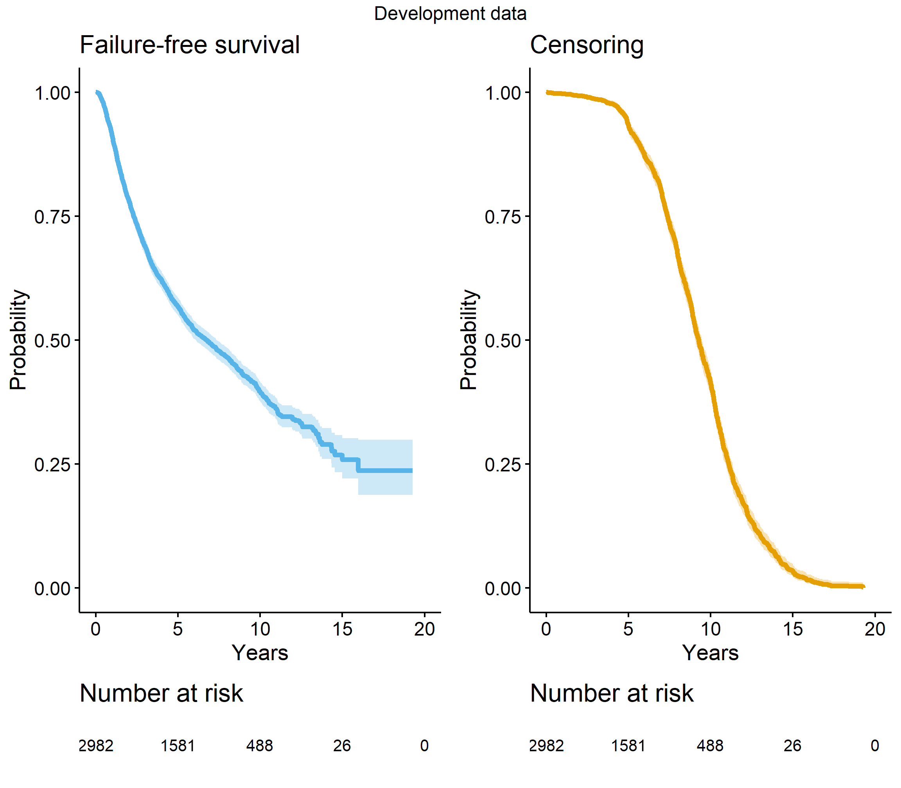
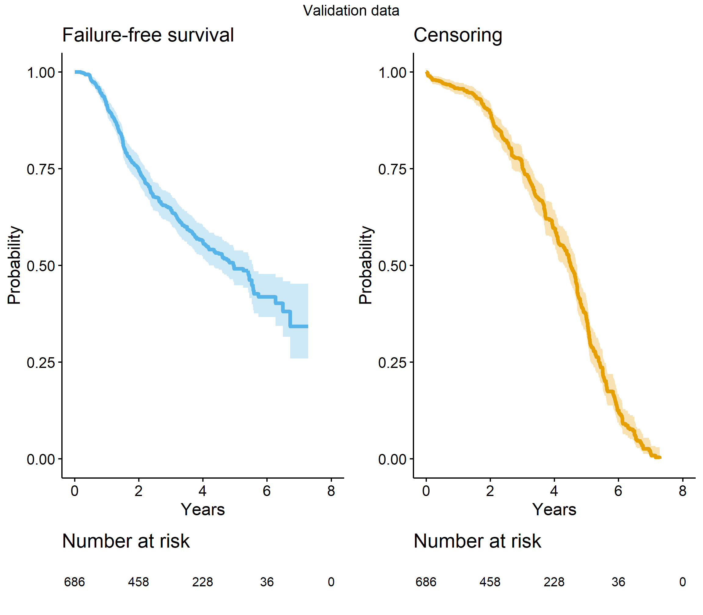
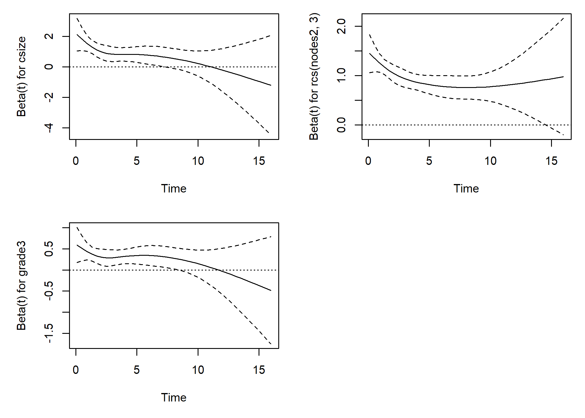
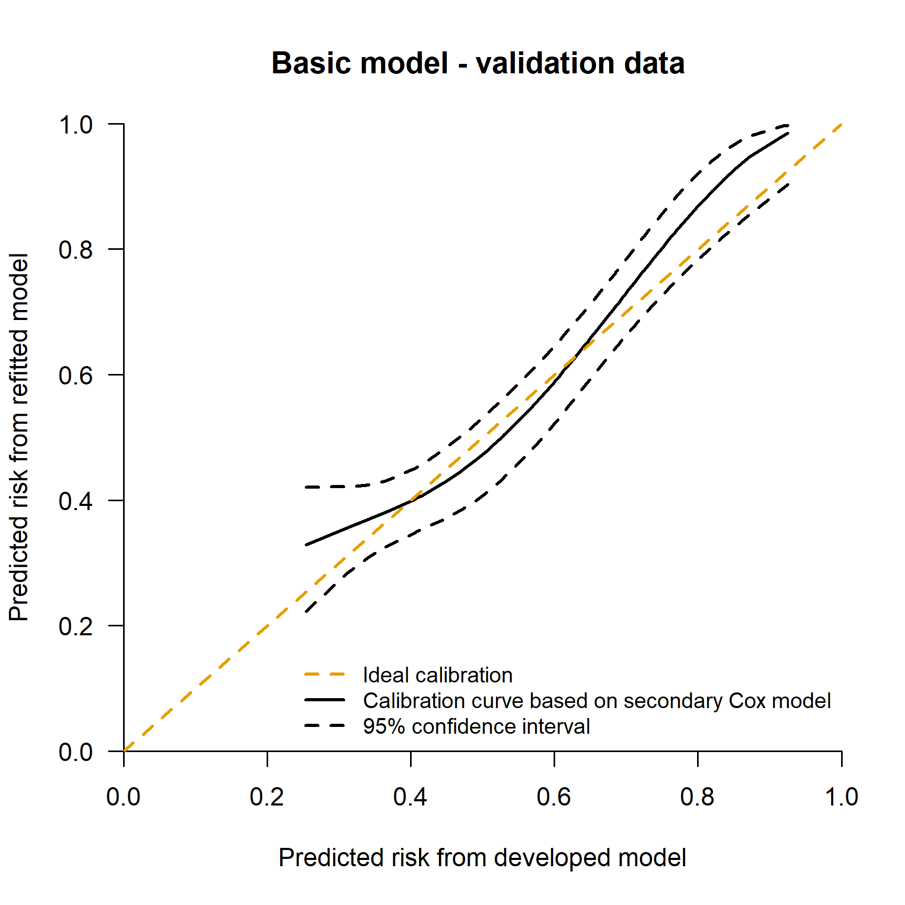
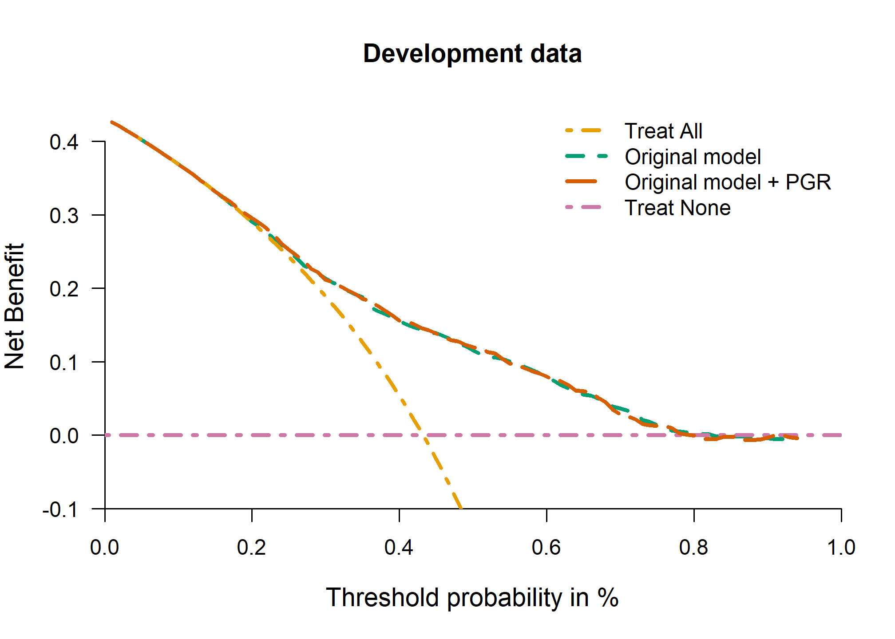
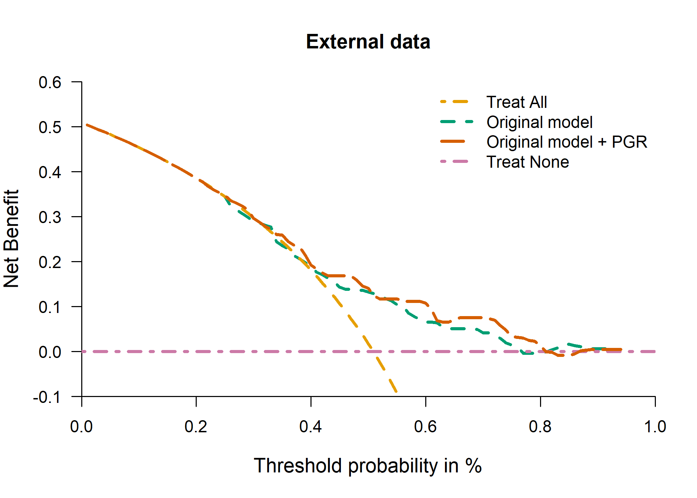

Performance assessment of survival prediction models - extended code
================

-   [Goals](#goals)
    -   [Load packages and import data](#load-packages-and-import-data)
    -   [Descriptive statistics](#descriptive-statistics)
-   [Goal 1 - Develop a risk prediction model with a time-to-event
    outcome](#goal-1---develop-a-risk-prediction-model-with-a-time-to-event-outcome)
    -   [1.1 Preliminary investigation - survival and censoring curves
        in the development and validation
        data](#11-preliminary-investigation---survival-and-censoring-curves-in-the-development-and-validation-data)
    -   [1.2 Secondary investigation - check non-linearity of continuous
        predictors](#12-secondary-investigation---check-non-linearity-of-continuous-predictors)
    -   [1.3 Model development - first check - the proportional hazard
        (PH)
        assumption](#13-model-development---first-check---the-proportional-hazard-ph-assumption)
    -   [1.4 Model development - fit the risk prediction
        models](#14-model-development---fit-the-risk-prediction-models)
-   [Goal 2 - Assessing performance in survival prediction
    models](#goal-2---assessing-performance-in-survival-prediction-models)
    -   [2.1 Overall performance
        measures](#21-overall-performance-measures)
    -   [2.2 Discrimination measures](#22-discrimination-measures)
    -   [2.3 Calibration](#23-calibration)
        -   [2.3.1 Mean calibration](#231-mean-calibration)
            -   [2.3.1.1 Mean calibration - fixed time
                point](#2311-mean-calibration---fixed-time-point)
            -   [2.3.1.2 Mean calibration - global
                assessment](#2312-mean-calibration---global-assessment)
        -   [2.3.2 Weak calibration](#232-weak-calibration)
            -   [2.3.2.1 Weak calibration - fixed time
                point](#2321-weak-calibration---fixed-time-point)
            -   [2.3.2.2 Weak calibration - global
                assessment](#2322-weak-calibration---global-assessment)
        -   [2.3.3 Moderate calibration](#233-moderate-calibration)
            -   [2.3.3.1 Moderate calibration - fixed time
                point](#2331-moderate-calibration---fixed-time-point)
            -   [2.3.3.2 Moderate calibration - global
                assessment](#2332-moderate-calibration---global-assessment)
        -   [2.3.4 Calibration when only coefficients of the model are
            available](#234-calibration-when-only-coefficients-of-the-model-are-available)
-   [Goal 3 - Clinical utility](#goal-3---clinical-utility)
-   [References](#references)
-   [Reproducibility ticket](#reproducibility-ticket)

## Goals

In this document, we assume that individual data of the development and
validation set are both available.

In particular:  
1. To develop a risk prediction model with a time-to-event outcome;  
2. To assess the prediction performance of a model with a time-to-event
outcome;  
3. To assess the potential clinical utility of a risk prediction model
with time-to-event outcome.

The extended code basically evaluates the prediction performance at a
fixed time horizon (e.g. 5 years) and also for the entire follow-up
time.

### Load packages and import data

We following libraries are needed to achieve the following goals, if you
have not them installed, please use install.packages(’‘)
(e.g. install.packages(’survival’)) or use the user-friendly approach if
you are using RStudio.

``` r
# Use pacman to check whether packages are installed, if not load
if (!require("pacman")) install.packages("pacman")
library(pacman)

pacman::p_load(
  rio,
  survival,
  rms,
  mstate,
  sqldf,
  pec,
  riskRegression,
  survAUC,
  survivalROC,
  timeROC,
  plotrix,
  splines,
  knitr,
  table1,
  kableExtra,
  gtsummary,
  boot,
  tidyverse,
  rsample,
  gridExtra,
  webshot
)
```

The two primary datasets from the Rotterdam study and the German Breast
Cancer Study Group (GBSG) are included as example data sets in the
survival package. The Rotterdam data has separate variables for time to
recurrence of disease and time to death, and these are combined into a
single endpoint of recurrence free survival (RFS), while the gbsg data
set has RFS as its single endpoint. The follow-up time is converted from
days to years, that being a more natural unit for any plots; it does not
change any fits. A categorical variable for nodes is also added.

### Descriptive statistics

``` r
# Development data
# Recurrence free survival (RFS) is the time until the earlier of
#  recurrence or death
rotterdam$ryear <- rotterdam$rtime/365.25  # time in years
rotterdam$rfs <- with(rotterdam, pmax(recur, death))

# variables used in the analysis
pgr99 <- quantile(rotterdam$pgr, .99) # there is a large outlier of 5000
rotterdam$pgr2 <- pmin(rotterdam$pgr, pgr99) # Winsorized value
rotterdam$csize <- rotterdam$size           # categorized size
rotterdam$cnode <- cut(rotterdam$nodes, c(-1,0, 3, 51),
                       c("0", "1-3", ">3"))   # categorized node

# Save in the data the restricted cubic spline term using Hmisc::rcspline.eval() package
rcs3_pgr <- rcspline.eval(rotterdam$pgr2, knots = c(0, 41, 486))
attr(rcs3_pgr, "dim") <- NULL
attr(rcs3_pgr, "knots") <- NULL
rotterdam$pgr3 <- rcs3_pgr

# Validation data
gbsg$ryear <- gbsg$rfstime/365.25
gbsg$rfs   <- gbsg$status           # the GBSG data contains RFS
gbsg$cnode <- cut(gbsg$nodes, c(-1, 0, 3, 51),
                       c("0", "1-3", ">3"))   # categorized node
gbsg$csize <- cut(gbsg$size,  c(-1, 20, 50, 500), #categorized size
                  c("<=20", "20-50", ">50"))
gbsg$pgr2 <- pmin(gbsg$pgr, pgr99) # Winsorized value


# Restricted cubic spline for PGR
rcs3_pgr <- rcspline.eval(gbsg$pgr2, knots = c(0, 41, 486))
attr(rcs3_pgr, "dim") <- NULL
attr(rcs3_pgr, "knots") <- NULL
gbsg$pgr3 <- rcs3_pgr


# Much of the analysis will focus on the first 5 years: create
#  data sets that are censored at 5
temp <- survSplit(Surv(ryear, rfs) ~ ., data = rotterdam, cut = 5,
                  episode = "epoch")
rott5 <- subset(temp, epoch == 1)  # only the first 5 years
temp <- survSplit(Surv(ryear, rfs) ~ ., data = gbsg, cut = 5,
                  episode = "epoch")
gbsg5 <- subset(temp, epoch == 1)

# Relevel
rott5$cnode <- relevel(rotterdam$cnode, "1-3")
gbsg5$cnode <- relevel(gbsg$cnode, "1-3")
```

<table class="table table-striped" style="margin-left: auto; margin-right: auto;">
<thead>
<tr>
<th style="text-align:left;">
Characteristic
</th>
<th style="text-align:left;">
Development dataset, N = 2,982
</th>
<th style="text-align:left;">
Validation dataset, N = 686
</th>
</tr>
</thead>
<tbody>
<tr>
<td style="text-align:left;">
Size (cm)
</td>
<td style="text-align:left;">
</td>
<td style="text-align:left;">
</td>
</tr>
<tr>
<td style="text-align:left;padding-left: 2em;" indentlevel="1">
&lt;=20
</td>
<td style="text-align:left;">
1,387 (47%)
</td>
<td style="text-align:left;">
180 (26%)
</td>
</tr>
<tr>
<td style="text-align:left;padding-left: 2em;" indentlevel="1">
20-50
</td>
<td style="text-align:left;">
1,291 (43%)
</td>
<td style="text-align:left;">
453 (66%)
</td>
</tr>
<tr>
<td style="text-align:left;padding-left: 2em;" indentlevel="1">
&gt;50
</td>
<td style="text-align:left;">
304 (10%)
</td>
<td style="text-align:left;">
53 (7.7%)
</td>
</tr>
<tr>
<td style="text-align:left;">
Number of nodes
</td>
<td style="text-align:left;">
</td>
<td style="text-align:left;">
</td>
</tr>
<tr>
<td style="text-align:left;padding-left: 2em;" indentlevel="1">
0
</td>
<td style="text-align:left;">
1,436 (48%)
</td>
<td style="text-align:left;">
0 (0%)
</td>
</tr>
<tr>
<td style="text-align:left;padding-left: 2em;" indentlevel="1">
1-3
</td>
<td style="text-align:left;">
764 (26%)
</td>
<td style="text-align:left;">
376 (55%)
</td>
</tr>
<tr>
<td style="text-align:left;padding-left: 2em;" indentlevel="1">
&gt;3
</td>
<td style="text-align:left;">
782 (26%)
</td>
<td style="text-align:left;">
310 (45%)
</td>
</tr>
<tr>
<td style="text-align:left;">
Grade
</td>
<td style="text-align:left;">
</td>
<td style="text-align:left;">
</td>
</tr>
<tr>
<td style="text-align:left;padding-left: 2em;" indentlevel="1">
1
</td>
<td style="text-align:left;">
0 (0%)
</td>
<td style="text-align:left;">
81 (12%)
</td>
</tr>
<tr>
<td style="text-align:left;padding-left: 2em;" indentlevel="1">
2
</td>
<td style="text-align:left;">
794 (27%)
</td>
<td style="text-align:left;">
444 (65%)
</td>
</tr>
<tr>
<td style="text-align:left;padding-left: 2em;" indentlevel="1">
3
</td>
<td style="text-align:left;">
2,188 (73%)
</td>
<td style="text-align:left;">
161 (23%)
</td>
</tr>
<tr>
<td style="text-align:left;">
Age (years)
</td>
<td style="text-align:left;">
</td>
<td style="text-align:left;">
</td>
</tr>
<tr>
<td style="text-align:left;padding-left: 2em;" indentlevel="1">
Mean (SD)
</td>
<td style="text-align:left;">
55 (13)
</td>
<td style="text-align:left;">
53 (10)
</td>
</tr>
<tr>
<td style="text-align:left;padding-left: 2em;" indentlevel="1">
Median (Range)
</td>
<td style="text-align:left;">
54 (24, 90)
</td>
<td style="text-align:left;">
53 (21, 80)
</td>
</tr>
<tr>
<td style="text-align:left;">
PGR (ng/mL)
</td>
<td style="text-align:left;">
</td>
<td style="text-align:left;">
</td>
</tr>
<tr>
<td style="text-align:left;padding-left: 2em;" indentlevel="1">
Mean (SD)
</td>
<td style="text-align:left;">
162 (291)
</td>
<td style="text-align:left;">
110 (202)
</td>
</tr>
<tr>
<td style="text-align:left;padding-left: 2em;" indentlevel="1">
Median (Range)
</td>
<td style="text-align:left;">
41 (0, 5,004)
</td>
<td style="text-align:left;">
32 (0, 2,380)
</td>
</tr>
</tbody>
</table>

## Goal 1 - Develop a risk prediction model with a time-to-event outcome

Prediction models are useful to provide the estimated probability of a
specific outcome using personal information. In many studies, especially
in medicine, the main outcome under assessment is the time to an event
of interest defined generally as survival time. Prognostic models for
survival end points, such as recurrence or progression of disease, need
to account for drop out during follow-up. Patients who have not
experienced the event of interest are censored observations. Cox
regression analysis is the most popular statistical model to deal with
such data in oncology and other medical research.

### 1.1 Preliminary investigation - survival and censoring curves in the development and validation data

First, we draw the survival and the censoring curves of the development
and validation data

``` r
# Development set
sfit_rott <- survfit(Surv(ryear, rfs == 1) ~ 1, 
                     data = rotterdam) # survival
sfit_rott_c <- survfit(Surv(ryear, rfs == 0) ~ 1, 
                       data = rotterdam) # censoring

par(xaxs = "i", yaxs = "i", las = 1)
plot(sfit_rott, conf.int = FALSE, lwd = 2, xlab = "Years", bty = "n")
lines(sfit_rott_c, conf.int = FALSE, col = 2, lwd = 2)
legend(11, .9, c("Death", "Censoring"), col = 1:2, lwd = 2, bty = "n")
title("Development set")
```



``` r
# Validation set
sfit_gbsg <- survfit(Surv(ryear, rfs == 1) ~ 1, 
                     data = gbsg) # survival
sfit_gbsg_c <- survfit(Surv(ryear, rfs == 0) ~ 1, 
                       data = gbsg) # censoring

par(xaxs = "i", yaxs = "i", las = 1)
plot(sfit_gbsg, conf.int = FALSE, 
     lwd = 2, xlab = "Years", bty = "n", xlim = c(0, 8))
lines(sfit_gbsg_c, conf.int = FALSE, 
      col = 2, lwd = 2)
legend("bottomleft", c("Death", "Censoring"), col = 1:2, lwd = 2, bty = "n")
title("Validation set")
```


A number of 2982 patients were included to develop the risk prediction
model for survival with a median follow-up of 9 years. The 5-year
survival was 56% (95% CI: 55-58%). A number of 686 patients were
selected to externally validate the risk prediction model. The median
survival in the validation data was 4.5 years. The median survival was 5
years while the 5-year survival was 49% (95% CI: 45-54%).

### 1.2 Secondary investigation - check non-linearity of continuous predictors

The potential non-linear relation between continuous predictors
(i.e. progesterone level) and the outcome should be investigated before
developing a risk prediction model. Non-linearity of continuous
predictors can be checked using splines.  
Physically, a spline is a flexible wood or metal strip, which is passed
through a set of fixed points (knots) in order to approximate a curve.
The most common computational approximation to this is a cubic smoothing
spline which is cubic between the knot points, and constrained to be
linear beyond the two end knots. For the restricted cubic spline using
rms::rcs() R package::function(), the position of the knots are defined
at 10<sup>th</sup>,50<sup>th</sup> and 90<sup>th</sup> quantile of the
continuous predictor distribution. For more details see Frank Harrell’s
book ‘Regression Model Strategies’ on page 27 (second edition).  
The user can specify the positions of the knots instead of using the
default calculation of the knots proposed in the book of Frank Harrell.
To deal with very large influential value, we winzorize progesterone
level to the 90<sup>th</sup> percentile.

``` r
dd <- datadist(rotterdam)
options(datadist = "dd")
fit_pgr <- cph(Surv(ryear, rfs) ~ rcs(pgr2), 
               data = rotterdam, x = T, y = T, surv = T)
plot(Predict(fit_pgr))
```


``` r
options(datadist = NULL)
```

We should model the progesterone level using a three-knot restricted
cubic spline. We save the spline in the development and validation data.

### 1.3 Model development - first check - the proportional hazard (PH) assumption

We now examine the fits in a more careful way by checking the
proportionality of the hazards of the Cox regression model. Firstly, we
fit the first prediction model in the development data using size, node,
grade. Then, we check the PH assumption.

``` r
fit1_ph <- coxph(Surv(ryear, rfs) ~ csize + cnode + grade, 
                data = rotterdam, x = T, y = T)


zp1 <- cox.zph(fit1_ph, transform = "identity")
kable(round(zp1$table, 3)) %>% kable_styling("striped", position = "center")
```

<table class="table table-striped" style="margin-left: auto; margin-right: auto;">
<thead>
<tr>
<th style="text-align:left;">
</th>
<th style="text-align:right;">
chisq
</th>
<th style="text-align:right;">
df
</th>
<th style="text-align:right;">
p
</th>
</tr>
</thead>
<tbody>
<tr>
<td style="text-align:left;">
csize
</td>
<td style="text-align:right;">
23.015
</td>
<td style="text-align:right;">
2
</td>
<td style="text-align:right;">
0.000
</td>
</tr>
<tr>
<td style="text-align:left;">
cnode
</td>
<td style="text-align:right;">
22.685
</td>
<td style="text-align:right;">
2
</td>
<td style="text-align:right;">
0.000
</td>
</tr>
<tr>
<td style="text-align:left;">
grade
</td>
<td style="text-align:right;">
4.243
</td>
<td style="text-align:right;">
1
</td>
<td style="text-align:right;">
0.039
</td>
</tr>
<tr>
<td style="text-align:left;">
GLOBAL
</td>
<td style="text-align:right;">
35.851
</td>
<td style="text-align:right;">
5
</td>
<td style="text-align:right;">
0.000
</td>
</tr>
</tbody>
</table>

``` r
oldpar <- par(mfrow = c(2, 2), mar = c(5, 5, 1, 1))
for (i in 1:3) {
  plot(zp1[i], resid = F)
  abline(0, 0, lty = 3)
}
par(oldpar)
```



The statistical tests show strong evidence of non-proportionality. Since
the number of death is large the formal tests are quite sensitive,
however, and it is important to also examine the graphs.  
These show an estimated coefficient as a function of time. As a further
follow-up we will divide the data into 3 epochs of 0-5, 5-10, and 10+
years, fitting a separate model to each.

``` r
# Development
edata <- survSplit(Surv(ryear, rfs) ~ .,
  data = rotterdam, cut = c(5, 10),
  episode = "epoch"
)
efit1 <- coxph(Surv(ryear, rfs) ~ csize + cnode + grade,
  data = edata[edata$epoch == 1, ], x = T, y = T
)
efit2 <- coxph(Surv(ryear, rfs) ~ csize + cnode + grade,
  data = edata[edata$epoch == 2, ], x = T, y = T
)
efit3 <- coxph(Surv(ryear, rfs) ~ csize + cnode + grade,
  data = edata[edata$epoch == 3, ], x = T, y = T
)
```

<table class="table table-striped" style="margin-left: auto; margin-right: auto;">
<thead>
<tr>
<th style="text-align:left;">
</th>
<th style="text-align:right;">
csize20-50
</th>
<th style="text-align:right;">
csize&gt;50
</th>
<th style="text-align:right;">
cnode1-3
</th>
<th style="text-align:right;">
cnode&gt;3
</th>
<th style="text-align:right;">
grade
</th>
</tr>
</thead>
<tbody>
<tr>
<td style="text-align:left;">
Epoch 1: 0-5 years
</td>
<td style="text-align:right;">
0.39
</td>
<td style="text-align:right;">
0.67
</td>
<td style="text-align:right;">
0.35
</td>
<td style="text-align:right;">
1.05
</td>
<td style="text-align:right;">
0.38
</td>
</tr>
<tr>
<td style="text-align:left;">
Epoch 2: 5-10 years
</td>
<td style="text-align:right;">
0.17
</td>
<td style="text-align:right;">
0.21
</td>
<td style="text-align:right;">
0.35
</td>
<td style="text-align:right;">
0.80
</td>
<td style="text-align:right;">
0.26
</td>
</tr>
<tr>
<td style="text-align:left;">
Epoch 3: &gt;10 years
</td>
<td style="text-align:right;">
-0.22
</td>
<td style="text-align:right;">
0.36
</td>
<td style="text-align:right;">
0.32
</td>
<td style="text-align:right;">
0.31
</td>
<td style="text-align:right;">
0.46
</td>
</tr>
</tbody>
</table>
<table class="table table-striped" style="margin-left: auto; margin-right: auto;">
<thead>
<tr>
<th style="text-align:left;">
</th>
<th style="text-align:right;">
Censored
</th>
<th style="text-align:right;">
Event
</th>
</tr>
</thead>
<tbody>
<tr>
<td style="text-align:left;">
Epoch 1: 0-5 years
</td>
<td style="text-align:right;">
1697
</td>
<td style="text-align:right;">
1285
</td>
</tr>
<tr>
<td style="text-align:left;">
Epoch 2: 5-10 years
</td>
<td style="text-align:right;">
1205
</td>
<td style="text-align:right;">
366
</td>
</tr>
<tr>
<td style="text-align:left;">
Epoch 3: &gt;10 years
</td>
<td style="text-align:right;">
419
</td>
<td style="text-align:right;">
62
</td>
</tr>
</tbody>
</table>

A drastic change in the size coefficients across all epochs is apparent,
along with a major reduction in the nodes coefficient in epoch 3. As an
ameleoration of this we will refit the model using only the first epoch,
which includes most of the recurrences and deaths.  
We applied the administrative censoring at 5 years in the development
data and we assessed the prediction performance of the prognostic model
at 5 years. The 5-year horizon was chosen because it is also a common
prediction time horizon in clinical practice. The hazards in the
development data seem not totally proportional within 5 years but minor
deviation of proportionality were considered acceptable.

### 1.4 Model development - fit the risk prediction models

We develop the risk prediction model in the development data considering
the first 5-year follow-up to minimize the violation of proportional
hazard including size, nodel and grade. The second model also includes
the progesterone level modelled using a 3-knot restricted cubic
spline.  
We also administratively censored the validation data at 5 years.

``` r
# Consider the first 5-year epoch in the development set
# Refit the model
efit1 <- coxph(Surv(ryear, rfs) ~ csize + cnode + grade,
  data = rott5, x = T, y = T
)
# Additional marker
efit1_pgr <- update(efit1, . ~ . + pgr2 + pgr3)
```

Below the results of the models:

-   Classical model:

 <strong>Cox Proportional Hazards Model</strong>
 
 <pre>
 cph(formula = Surv(ryear, rfs) ~ csize + cnode + grade, data = rott5, 
     x = T, y = T, surv = T)
 </pre>
 
 <table class='gmisc_table' style='border-collapse: collapse; margin-top: 1em; margin-bottom: 1em;' >
<thead>
<tr>
<th style='font-weight: 900; border-bottom: 1px solid grey; border-top: 2px solid grey; border-left: 1px solid black; border-right: 1px solid black; text-align: center;'></th>
<th style='font-weight: 900; border-bottom: 1px solid grey; border-top: 2px solid grey; border-right: 1px solid black; text-align: center;'>Model Tests</th>
<th style='font-weight: 900; border-bottom: 1px solid grey; border-top: 2px solid grey; border-right: 1px solid black; text-align: center;'>Discrimination<br>Indexes</th>
</tr>
</thead>
<tbody>
<tr>
<td style='min-width: 9em; border-left: 1px solid black; border-right: 1px solid black; text-align: center;'>Obs 2982</td>
<td style='min-width: 9em; border-right: 1px solid black; text-align: center;'>LR χ<sup>2</sup> 480.83</td>
<td style='min-width: 9em; border-right: 1px solid black; text-align: center;'><i>R</i><sup>2</sup> 0.149</td>
</tr>
<tr>
<td style='min-width: 9em; border-left: 1px solid black; border-right: 1px solid black; text-align: center;'>Events 1285</td>
<td style='min-width: 9em; border-right: 1px solid black; text-align: center;'>d.f. 5</td>
<td style='min-width: 9em; border-right: 1px solid black; text-align: center;'><i>D</i><sub>xy</sub> 0.347</td>
</tr>
<tr>
<td style='min-width: 9em; border-left: 1px solid black; border-right: 1px solid black; text-align: center;'>Center 1.2787</td>
<td style='min-width: 9em; border-right: 1px solid black; text-align: center;'>Pr(>χ<sup>2</sup>) 0.0000</td>
<td style='min-width: 9em; border-right: 1px solid black; text-align: center;'><i>g</i> 0.682</td>
</tr>
<tr>
<td style='min-width: 9em; border-left: 1px solid black; border-right: 1px solid black; text-align: center;'></td>
<td style='min-width: 9em; border-right: 1px solid black; text-align: center;'>Score χ<sup>2</sup> 552.16</td>
<td style='min-width: 9em; border-right: 1px solid black; text-align: center;'><i>g</i><sub>r</sub> 1.978</td>
</tr>
<tr>
<td style='min-width: 9em; border-bottom: 2px solid grey; border-left: 1px solid black; border-right: 1px solid black; text-align: center;'></td>
<td style='min-width: 9em; border-bottom: 2px solid grey; border-right: 1px solid black; text-align: center;'>Pr(>χ<sup>2</sup>) 0.0000</td>
<td style='min-width: 9em; border-bottom: 2px solid grey; border-right: 1px solid black; text-align: center;'></td>
</tr>
</tbody>
</table>

 
 <table class='gmisc_table' style='border-collapse: collapse; margin-top: 1em; margin-bottom: 1em;' >
<thead>
<tr><th style='border-bottom: 1px solid grey; font-weight: 900; border-top: 2px solid grey; min-width: 7em; text-align: center;'></th>
<th style='font-weight: 900; border-bottom: 1px solid grey; border-top: 2px solid grey; text-align: right;'>β</th>
<th style='font-weight: 900; border-bottom: 1px solid grey; border-top: 2px solid grey; text-align: right;'>S.E.</th>
<th style='font-weight: 900; border-bottom: 1px solid grey; border-top: 2px solid grey; text-align: right;'>Wald <i>Z</i></th>
<th style='font-weight: 900; border-bottom: 1px solid grey; border-top: 2px solid grey; text-align: right;'>Pr(>|<i>Z</i>|)</th>
</tr>
</thead>
<tbody>
<tr>
<td style='min-width: 7em; text-align: left;'>csize=20-50</td>
<td style='min-width: 7em; text-align: right;'>  0.3922</td>
<td style='min-width: 7em; text-align: right;'> 0.0648</td>
<td style='min-width: 7em; text-align: right;'> 6.06</td>
<td style='min-width: 7em; text-align: right;'><0.0001</td>
</tr>
<tr>
<td style='min-width: 7em; text-align: left;'>csize=>50</td>
<td style='min-width: 7em; text-align: right;'>  0.6660</td>
<td style='min-width: 7em; text-align: right;'> 0.0911</td>
<td style='min-width: 7em; text-align: right;'> 7.31</td>
<td style='min-width: 7em; text-align: right;'><0.0001</td>
</tr>
<tr>
<td style='min-width: 7em; text-align: left;'>cnode=0</td>
<td style='min-width: 7em; text-align: right;'> -0.3538</td>
<td style='min-width: 7em; text-align: right;'> 0.0749</td>
<td style='min-width: 7em; text-align: right;'>-4.72</td>
<td style='min-width: 7em; text-align: right;'><0.0001</td>
</tr>
<tr>
<td style='min-width: 7em; text-align: left;'>cnode=>3</td>
<td style='min-width: 7em; text-align: right;'>  0.6936</td>
<td style='min-width: 7em; text-align: right;'> 0.0722</td>
<td style='min-width: 7em; text-align: right;'> 9.61</td>
<td style='min-width: 7em; text-align: right;'><0.0001</td>
</tr>
<tr>
<td style='min-width: 7em; border-bottom: 2px solid grey; text-align: left;'>grade</td>
<td style='min-width: 7em; border-bottom: 2px solid grey; text-align: right;'>  0.3766</td>
<td style='min-width: 7em; border-bottom: 2px solid grey; text-align: right;'> 0.0710</td>
<td style='min-width: 7em; border-bottom: 2px solid grey; text-align: right;'> 5.30</td>
<td style='min-width: 7em; border-bottom: 2px solid grey; text-align: right;'><0.0001</td>
</tr>
</tbody>
</table>

-   Extended model:

 <strong>Cox Proportional Hazards Model</strong>
 
 <pre>
 cph(formula = Surv(ryear, rfs) ~ csize + cnode + grade + rcs(pgr2, 
     c(0, 41, 486)), data = rott5, x = T, y = T, surv = T)
 </pre>
 
 <table class='gmisc_table' style='border-collapse: collapse; margin-top: 1em; margin-bottom: 1em;' >
<thead>
<tr>
<th style='font-weight: 900; border-bottom: 1px solid grey; border-top: 2px solid grey; border-left: 1px solid black; border-right: 1px solid black; text-align: center;'></th>
<th style='font-weight: 900; border-bottom: 1px solid grey; border-top: 2px solid grey; border-right: 1px solid black; text-align: center;'>Model Tests</th>
<th style='font-weight: 900; border-bottom: 1px solid grey; border-top: 2px solid grey; border-right: 1px solid black; text-align: center;'>Discrimination<br>Indexes</th>
</tr>
</thead>
<tbody>
<tr>
<td style='min-width: 9em; border-left: 1px solid black; border-right: 1px solid black; text-align: center;'>Obs 2982</td>
<td style='min-width: 9em; border-right: 1px solid black; text-align: center;'>LR χ<sup>2</sup> 512.49</td>
<td style='min-width: 9em; border-right: 1px solid black; text-align: center;'><i>R</i><sup>2</sup> 0.158</td>
</tr>
<tr>
<td style='min-width: 9em; border-left: 1px solid black; border-right: 1px solid black; text-align: center;'>Events 1285</td>
<td style='min-width: 9em; border-right: 1px solid black; text-align: center;'>d.f. 7</td>
<td style='min-width: 9em; border-right: 1px solid black; text-align: center;'><i>D</i><sub>xy</sub> 0.362</td>
</tr>
<tr>
<td style='min-width: 9em; border-left: 1px solid black; border-right: 1px solid black; text-align: center;'>Center 0.9277</td>
<td style='min-width: 9em; border-right: 1px solid black; text-align: center;'>Pr(>χ<sup>2</sup>) 0.0000</td>
<td style='min-width: 9em; border-right: 1px solid black; text-align: center;'><i>g</i> 0.722</td>
</tr>
<tr>
<td style='min-width: 9em; border-left: 1px solid black; border-right: 1px solid black; text-align: center;'></td>
<td style='min-width: 9em; border-right: 1px solid black; text-align: center;'>Score χ<sup>2</sup> 581.04</td>
<td style='min-width: 9em; border-right: 1px solid black; text-align: center;'><i>g</i><sub>r</sub> 2.059</td>
</tr>
<tr>
<td style='min-width: 9em; border-bottom: 2px solid grey; border-left: 1px solid black; border-right: 1px solid black; text-align: center;'></td>
<td style='min-width: 9em; border-bottom: 2px solid grey; border-right: 1px solid black; text-align: center;'>Pr(>χ<sup>2</sup>) 0.0000</td>
<td style='min-width: 9em; border-bottom: 2px solid grey; border-right: 1px solid black; text-align: center;'></td>
</tr>
</tbody>
</table>

 
 <table class='gmisc_table' style='border-collapse: collapse; margin-top: 1em; margin-bottom: 1em;' >
<thead>
<tr><th style='border-bottom: 1px solid grey; font-weight: 900; border-top: 2px solid grey; min-width: 7em; text-align: center;'></th>
<th style='font-weight: 900; border-bottom: 1px solid grey; border-top: 2px solid grey; text-align: right;'>β</th>
<th style='font-weight: 900; border-bottom: 1px solid grey; border-top: 2px solid grey; text-align: right;'>S.E.</th>
<th style='font-weight: 900; border-bottom: 1px solid grey; border-top: 2px solid grey; text-align: right;'>Wald <i>Z</i></th>
<th style='font-weight: 900; border-bottom: 1px solid grey; border-top: 2px solid grey; text-align: right;'>Pr(>|<i>Z</i>|)</th>
</tr>
</thead>
<tbody>
<tr>
<td style='min-width: 7em; text-align: left;'>csize=20-50</td>
<td style='min-width: 7em; text-align: right;'>  0.3710</td>
<td style='min-width: 7em; text-align: right;'> 0.0649</td>
<td style='min-width: 7em; text-align: right;'> 5.72</td>
<td style='min-width: 7em; text-align: right;'><0.0001</td>
</tr>
<tr>
<td style='min-width: 7em; text-align: left;'>csize=>50</td>
<td style='min-width: 7em; text-align: right;'>  0.6441</td>
<td style='min-width: 7em; text-align: right;'> 0.0911</td>
<td style='min-width: 7em; text-align: right;'> 7.07</td>
<td style='min-width: 7em; text-align: right;'><0.0001</td>
</tr>
<tr>
<td style='min-width: 7em; text-align: left;'>cnode=0</td>
<td style='min-width: 7em; text-align: right;'> -0.3745</td>
<td style='min-width: 7em; text-align: right;'> 0.0750</td>
<td style='min-width: 7em; text-align: right;'>-4.99</td>
<td style='min-width: 7em; text-align: right;'><0.0001</td>
</tr>
<tr>
<td style='min-width: 7em; text-align: left;'>cnode=>3</td>
<td style='min-width: 7em; text-align: right;'>  0.6698</td>
<td style='min-width: 7em; text-align: right;'> 0.0723</td>
<td style='min-width: 7em; text-align: right;'> 9.26</td>
<td style='min-width: 7em; text-align: right;'><0.0001</td>
</tr>
<tr>
<td style='min-width: 7em; text-align: left;'>grade</td>
<td style='min-width: 7em; text-align: right;'>  0.3217</td>
<td style='min-width: 7em; text-align: right;'> 0.0718</td>
<td style='min-width: 7em; text-align: right;'> 4.48</td>
<td style='min-width: 7em; text-align: right;'><0.0001</td>
</tr>
<tr>
<td style='min-width: 7em; text-align: left;'>pgr2</td>
<td style='min-width: 7em; text-align: right;'> -0.0029</td>
<td style='min-width: 7em; text-align: right;'> 0.0006</td>
<td style='min-width: 7em; text-align: right;'>-5.10</td>
<td style='min-width: 7em; text-align: right;'><0.0001</td>
</tr>
<tr>
<td style='min-width: 7em; border-bottom: 2px solid grey; text-align: left;'>pgr2'</td>
<td style='min-width: 7em; border-bottom: 2px solid grey; text-align: right;'>  0.0128</td>
<td style='min-width: 7em; border-bottom: 2px solid grey; text-align: right;'> 0.0028</td>
<td style='min-width: 7em; border-bottom: 2px solid grey; text-align: right;'> 4.55</td>
<td style='min-width: 7em; border-bottom: 2px solid grey; text-align: right;'><0.0001</td>
</tr>
</tbody>
</table>

The coefficients of the models indicated that higher size, higher number
of positive lymph nodes and higher grade is more associate with poorer
prognosis. The association of the progesterone biomarker and the outcome
is non-linear as investigated previously.

## Goal 2 - Assessing performance in survival prediction models

The performance of a risk prediction models may be evaluated through:

-   discrimination: the ability of the model to identify patients with
    and without the outcome and it requires the coefficients (or the log
    of the hazard ratios) of the developed risk prediction model to be
    evaluated.

-   calibration: the agreement between observed and predicted
    probabilities. It requires the baseline (cumulative) hazard or
    survival.  

-   overall performance measures: as a combination of discrimination and
    calibration and/or as a measure of the explained variation;

-   overall measures: combination of discrimination and calibration
    measures

Unfortunately, a few publications report the complete baseline
(cumulative) hazard or survival or even the baseline (cumulative) hazard
or survival at fixed time horizon *t*. If we had both individual data of
the development and validation, a complete assessment of discrimination
and calibration would be possible. We could evaluate the prediction
performance of a risk prediction model at a fixed time horizon(s) *t*
and for the complete follow-up time. In risk prediction, physicians
typically focus on one or more clinically relevant time horizons to
inform subjects about their risk. For this reasons, according to
information available, different levels of validation assessment are
possible. Here we aim to assess the prediction performance of a risk
prediction model with time-to-event outcome in case all individual data
are available and in case of only the model equation of a fixed time
horizon (i.e. at 5 years) is provided including the baseline survival.

### 2.1 Overall performance measures

Some overall performance measures are proposed using survival data:

-   Brier score: it is the squared differences between observed and
    predicted values at fixed time point (e.g. at 5 years);

-   Scaled Brier score (also known as Index of prediction accuracy -
    IPA): it improves interpretability by scaling the Brier Score with
    the Brier of the null model.

First we save elements need to calculate the performance measures as the
linear predictor and the predicted survival at 5 years in the
development and validation data. Secondly, we create B bootstrap data to
calculate percentile bootstrap confidence intervals needed for scaled
Brier score.

``` r
# Models 
efit1 <- coxph(Surv(ryear, rfs) ~ csize + cnode + grade,
  data = rott5, x = T, y = T
)
# Additional marker
efit1_pgr <- update(efit1, . ~ . + pgr2 + pgr3)

# NOTE: waiting for brier score function created by Terry.

# Development set (apparent Brier and IPA) without pgr
score_rott5 <-
  Score(list("cox_development" = efit1),
    formula = Surv(ryear, rfs) ~ 1, 
    data = rott5, 
    conf.int = TRUE, 
    times = 4.95,
    cens.model = "km", 
    metrics = "brier",
    summary = "ipa"
  )

# Validation set without pgr
score_gbsg5 <-
  Score(list("cox_validation" = efit1),
    formula = Surv(ryear, status) ~ 1, 
    data = gbsg5, 
    conf.int = TRUE,
    times = 4.95,
    cens.model = "km", 
    metrics = "brier",
    summary = "ipa"
  )

# Development set (apparent Brier and IPA) with pgr
score_rott5_pgr <-
  Score(list("cox_development" = efit1_pgr),
    formula = Surv(ryear, rfs) ~ 1, 
    data = rott5, 
    conf.int = TRUE, 
    times = 4.95,
    cens.model = "km", 
    metrics = "brier",
    summary = "ipa"
  )

# Validation set with pgr
score_gbsg5_pgr <-
  Score(list("cox_validation" = efit1_pgr),
    formula = Surv(ryear, rfs) ~ 1, 
    data = gbsg5, 
    conf.int = TRUE, 
    times = 4.95,
    cens.model = "km", 
    metrics = "brier",
    summary = "ipa"
  )


# Bootstrap for IPA -------------------------
B <- 10
set.seed(1234)
rott5_boot <- bootstraps(rott5, times = B)
gbsg5_boot <- bootstraps(gbsg5, times = B)

# IPA confidence intervals
# NOTE: computational time is too long to compute them when the number of bootstrap replications is high

# Bootstrap for IPA - basic model
score_boot <- function(split) {
  Score(list("model" = efit1),
    formula = Surv(ryear, rfs) ~ 1, 
    data = analysis(split), 
    conf.int = FALSE, 
    times = 4.95,
    cens.model = "km", 
    metrics = "brier",
    summary = "ipa"
  )$Brier$score[model == "model"][["IPA"]]
}

# Bootstrap for IPA - extended model with PGR
score_boot_pgr <- function(split) {
  Score(list("model" = efit1_pgr),
    formula = Surv(ryear, rfs) ~ 1, 
    data = analysis(split), 
    conf.int = FALSE, 
    times = 4.95,
    cens.model = "km", 
    metrics = "brier",
    summary = "ipa"
  )$Brier$score[model == "model"][["IPA"]]
}


rott5_boot <- rott5_boot %>% mutate(
  IPA = map_dbl(splits, score_boot),
  IPA_pgr = map_dbl(splits, score_boot_pgr)
) # Development dataset

gbsg5_boot <- gbsg5_boot %>% mutate(
  IPA = map_dbl(splits, score_boot),
  IPA_pgr = map_dbl(splits, score_boot_pgr)
) # Validation dataset
```

    ## Joining, by = "id_boot"
    ## Joining, by = "id_boot"

<table class="table table-striped" style="margin-left: auto; margin-right: auto;">
<thead>
<tr>
<th style="empty-cells: hide;border-bottom:hidden;" colspan="1">
</th>
<th style="border-bottom:hidden;padding-bottom:0; padding-left:3px;padding-right:3px;text-align: center; " colspan="3">

<div style="border-bottom: 1px solid #ddd; padding-bottom: 5px; ">

Apparent

</div>

</th>
<th style="border-bottom:hidden;padding-bottom:0; padding-left:3px;padding-right:3px;text-align: center; " colspan="3">

<div style="border-bottom: 1px solid #ddd; padding-bottom: 5px; ">

Internal

</div>

</th>
<th style="border-bottom:hidden;padding-bottom:0; padding-left:3px;padding-right:3px;text-align: center; " colspan="3">

<div style="border-bottom: 1px solid #ddd; padding-bottom: 5px; ">

Apparent + PGR

</div>

</th>
<th style="border-bottom:hidden;padding-bottom:0; padding-left:3px;padding-right:3px;text-align: center; " colspan="3">

<div style="border-bottom: 1px solid #ddd; padding-bottom: 5px; ">

Internal + PGR

</div>

</th>
<th style="border-bottom:hidden;padding-bottom:0; padding-left:3px;padding-right:3px;text-align: center; " colspan="3">

<div style="border-bottom: 1px solid #ddd; padding-bottom: 5px; ">

External

</div>

</th>
<th style="border-bottom:hidden;padding-bottom:0; padding-left:3px;padding-right:3px;text-align: center; " colspan="3">

<div style="border-bottom: 1px solid #ddd; padding-bottom: 5px; ">

External + PGR

</div>

</th>
</tr>
<tr>
<th style="text-align:left;">
</th>
<th style="text-align:right;">
Estimate
</th>
<th style="text-align:right;">
Lower .95
</th>
<th style="text-align:right;">
Upper .95
</th>
<th style="text-align:right;">
Estimate
</th>
<th style="text-align:right;">
Lower .95
</th>
<th style="text-align:right;">
Upper .95
</th>
<th style="text-align:right;">
Estimate
</th>
<th style="text-align:right;">
Lower .95
</th>
<th style="text-align:right;">
Upper .95
</th>
<th style="text-align:right;">
Estimate
</th>
<th style="text-align:right;">
Lower .95
</th>
<th style="text-align:right;">
Upper .95
</th>
<th style="text-align:right;">
Estimate
</th>
<th style="text-align:right;">
Lower .95
</th>
<th style="text-align:right;">
Upper .95
</th>
<th style="text-align:right;">
Estimate
</th>
<th style="text-align:right;">
Lower .95
</th>
<th style="text-align:right;">
Upper .95
</th>
</tr>
</thead>
<tbody>
<tr>
<td style="text-align:left;">
Brier
</td>
<td style="text-align:right;">
0.21
</td>
<td style="text-align:right;">
0.19
</td>
<td style="text-align:right;">
0.23
</td>
<td style="text-align:right;">
0.21
</td>
<td style="text-align:right;">
NA
</td>
<td style="text-align:right;">
NA
</td>
<td style="text-align:right;">
0.21
</td>
<td style="text-align:right;">
0.19
</td>
<td style="text-align:right;">
0.23
</td>
<td style="text-align:right;">
0.21
</td>
<td style="text-align:right;">
NA
</td>
<td style="text-align:right;">
NA
</td>
<td style="text-align:right;">
0.22
</td>
<td style="text-align:right;">
0.20
</td>
<td style="text-align:right;">
0.24
</td>
<td style="text-align:right;">
0.21
</td>
<td style="text-align:right;">
0.19
</td>
<td style="text-align:right;">
0.23
</td>
</tr>
<tr>
<td style="text-align:left;">
IPA
</td>
<td style="text-align:right;">
0.14
</td>
<td style="text-align:right;">
0.12
</td>
<td style="text-align:right;">
0.17
</td>
<td style="text-align:right;">
0.14
</td>
<td style="text-align:right;">
NA
</td>
<td style="text-align:right;">
NA
</td>
<td style="text-align:right;">
0.15
</td>
<td style="text-align:right;">
0.13
</td>
<td style="text-align:right;">
0.18
</td>
<td style="text-align:right;">
0.14
</td>
<td style="text-align:right;">
NA
</td>
<td style="text-align:right;">
NA
</td>
<td style="text-align:right;">
0.12
</td>
<td style="text-align:right;">
0.05
</td>
<td style="text-align:right;">
0.14
</td>
<td style="text-align:right;">
0.15
</td>
<td style="text-align:right;">
0.09
</td>
<td style="text-align:right;">
0.18
</td>
</tr>
</tbody>
</table>

As expected the overall performance measures were lower in the external
validation. Including information about PGR slightly improved the
overall performance.

### 2.2 Discrimination measures

NOTE: to be adjusted in a consistent way with the paper Discrimination
is the ability to differentiate between subjects who have the outcome
and subjects who do not. In prognostic modelling, discrimination
reflects separation between survival curves for individuals or groups.

Concordance can be assessed over several different time intervals:

-   the entire range of the data
-   a 5 year window corresponding to our target assessment point

Clearly the last of these is most relevant

This is easy to compute using the concordance function in the survival
package. There is some uncertainty in the literature about the original
Harrell formulation verus Uno’s suggestion to re-weight the time scale
by the factor 1/*G*<sup>2</sup>(*t*) where *G* is the censoring
distribution. There is more detailed information in the concordance
vignette found in the survival package.

We used the time horizon at 4.95 and not 5 years since controls are
considered patients at risk after the time horizon and we
administratively censored at 5 years to minimize the violation of PH
assumption (see paragraph 1.3).

The Uno’s C-index provides a measure of an overall discrimination over
the follow-up time. The Uno’s time-dependent AUC measures discrimination
at a specific time horizon *t* defining cases and controls of censored
data at a fixed time horizon *t*.

More details are in the paper and in the references.

``` r
# Models 
efit1 <- coxph(Surv(ryear, rfs) ~ csize + cnode + grade,
  data = rott5, x = T, y = T
)
# Additional marker
efit1_pgr <- update(efit1, . ~ . + pgr2 + pgr3)

# Time-dependent AUC (in Table 3 called Uno's TD AUC at 5 years) ###
# Uno's time-dependent Area Under the Curve
# Development
Uno_rott5 <-
  timeROC(
    T = rott5$ryear, 
    delta = rott5$rfs,
    marker = predict(efit1, newdata = rott5),
    cause = 1, 
    weighting = "marginal", 
    times = 4.95,
    iid = TRUE
  )

Uno_rott5_pgr <-
  timeROC(
    T = rott5$ryear, 
    delta = rott5$rfs,
    marker = predict(efit1_pgr, newdata = rott5),
    cause = 1, 
    weighting = "marginal", 
    times = 4.95,
    iid = TRUE
  )

# Validation
Uno_gbsg5 <-
  timeROC(
    T = gbsg5$ryear, 
    delta = gbsg5$rfs,
    marker = predict(efit1, newdata = gbsg5),
    cause = 1, 
    weighting = "marginal", 
    times = 4.95,
    iid = TRUE
  )

Uno_gbsg5_pgr <-
  timeROC(
    T = gbsg5$ryear, 
    delta = gbsg5$rfs,
    marker = predict(efit1_pgr, newdata = gbsg5),
    cause = 1, 
    weighting = "marginal", 
    times = 4.95,
    iid = TRUE
  )
# NOTE: if you have a lot of data n > 2000, standard error computation may be really long.
# In that case, please use bootstrap percentile to calculate confidence intervals.
```

<table class="table table-striped" style="margin-left: auto; margin-right: auto;">
<thead>
<tr>
<th style="empty-cells: hide;border-bottom:hidden;" colspan="1">
</th>
<th style="border-bottom:hidden;padding-bottom:0; padding-left:3px;padding-right:3px;text-align: center; " colspan="3">

<div style="border-bottom: 1px solid #ddd; padding-bottom: 5px; ">

Apparent

</div>

</th>
<th style="border-bottom:hidden;padding-bottom:0; padding-left:3px;padding-right:3px;text-align: center; " colspan="3">

<div style="border-bottom: 1px solid #ddd; padding-bottom: 5px; ">

Internal

</div>

</th>
<th style="border-bottom:hidden;padding-bottom:0; padding-left:3px;padding-right:3px;text-align: center; " colspan="3">

<div style="border-bottom: 1px solid #ddd; padding-bottom: 5px; ">

Apparent + PGR

</div>

</th>
<th style="border-bottom:hidden;padding-bottom:0; padding-left:3px;padding-right:3px;text-align: center; " colspan="3">

<div style="border-bottom: 1px solid #ddd; padding-bottom: 5px; ">

Internal + PGR

</div>

</th>
<th style="border-bottom:hidden;padding-bottom:0; padding-left:3px;padding-right:3px;text-align: center; " colspan="3">

<div style="border-bottom: 1px solid #ddd; padding-bottom: 5px; ">

External

</div>

</th>
<th style="border-bottom:hidden;padding-bottom:0; padding-left:3px;padding-right:3px;text-align: center; " colspan="3">

<div style="border-bottom: 1px solid #ddd; padding-bottom: 5px; ">

External + PGR

</div>

</th>
</tr>
<tr>
<th style="text-align:left;">
</th>
<th style="text-align:right;">
Estimate
</th>
<th style="text-align:right;">
Lower .95
</th>
<th style="text-align:right;">
Upper .95
</th>
<th style="text-align:right;">
Estimate
</th>
<th style="text-align:right;">
Lower .95
</th>
<th style="text-align:right;">
Upper .95
</th>
<th style="text-align:right;">
Estimate
</th>
<th style="text-align:right;">
Lower .95
</th>
<th style="text-align:right;">
Upper .95
</th>
<th style="text-align:right;">
Estimate
</th>
<th style="text-align:right;">
Lower .95
</th>
<th style="text-align:right;">
Upper .95
</th>
<th style="text-align:right;">
Estimate
</th>
<th style="text-align:right;">
Lower .95
</th>
<th style="text-align:right;">
Upper .95
</th>
<th style="text-align:right;">
Estimate
</th>
<th style="text-align:right;">
Lower .95
</th>
<th style="text-align:right;">
Upper .95
</th>
</tr>
</thead>
<tbody>
<tr>
<td style="text-align:left;">
Uno AUC
</td>
<td style="text-align:right;">
0.71
</td>
<td style="text-align:right;">
0.69
</td>
<td style="text-align:right;">
0.73
</td>
<td style="text-align:right;">
0.71
</td>
<td style="text-align:right;">
NA
</td>
<td style="text-align:right;">
NA
</td>
<td style="text-align:right;">
0.72
</td>
<td style="text-align:right;">
0.7
</td>
<td style="text-align:right;">
0.74
</td>
<td style="text-align:right;">
0.72
</td>
<td style="text-align:right;">
NA
</td>
<td style="text-align:right;">
NA
</td>
<td style="text-align:right;">
0.7
</td>
<td style="text-align:right;">
0.65
</td>
<td style="text-align:right;">
0.76
</td>
<td style="text-align:right;">
0.73
</td>
<td style="text-align:right;">
0.68
</td>
<td style="text-align:right;">
0.78
</td>
</tr>
</tbody>
</table>

NOTE: add brief comments about concordance and time-dependent AUC

The discrimination ability may be evaluated over the time since
diagnosis through a plot showing the AUC over the time (years) in the
development and validation set in the basic and extended model. Since
the calculation of the AUC and the standard errors in the development
set is computationally demanding, we showed only the plot in the
validation data. However, we provided the R code (as a comment) for the
development data.

``` r
# Models 
efit1 <- coxph(Surv(ryear, rfs) ~ csize + cnode + grade,
  data = rott5, x = T, y = T
)
# Additional marker
efit1_pgr <- update(efit1, . ~ . + pgr2 + pgr3)

# NOTE: it takes long time to be computed
# Apparent without PGR
# AUC_rott5<-
#    timeROC(T=rott5$ryear, 
#            delta=rott5$rfs,
#            marker=predict(efit1,newdata=rott5),
#            cause=1,weighting='marginal',
#            times=quantile(rott5$ryear,probs=seq(0.01,0.85,0.02)),
#           iid=TRUE)

# Apparent with PGR
# AUC_rott5_pgr <-
#    timeROC(T=rott5$ryear, 
#            delta=rott5$rfs,
#            marker=predict(efit1_pgr,newdata=rott5),
#            cause=1,weighting='marginal',
#            times=quantile(rott5$ryear,probs=seq(0.01,0.85,0.02)),
#            iid=TRUE)

# Validation without PGR
AUC_gbsg5 <-
  timeROC(
    T = gbsg5$ryear, 
    delta = gbsg5$rfs,
    marker = predict(efit1, newdata = gbsg5),
    cause = 1, weighting = "marginal",
    times = quantile(gbsg5$ryear, probs = seq(0.02, 0.82, 0.02)),
    iid = TRUE
  )

# Validation with PGR
AUC_gbsg5_pgr <-
  timeROC(
    T = gbsg5$ryear, 
    delta = gbsg5$rfs,
    marker = predict(efit1_pgr, newdata = gbsg5),
    cause = 1, weighting = "marginal",
    times = quantile(gbsg5$ryear, probs = seq(0.02, 0.82, 0.02)),
    iid = TRUE
  )


# Calculate the confidence intervals
# AUC_rott5$lower <- AUC_rott5$AUC - qnorm(0.975) * AUC_rott5$inference$vect_sd_1
# AUC_rott5$upper <- AUC_rott5$AUC + qnorm(0.975) * AUC_rott5$inference$vect_sd_1
#
# AUC_rott5_pgr$lower <- AUC_rott5_pgr$AUC - qnorm(0.975)*AUC_rott5_pgr$inference$vect_sd_1
# AUC_rott5_pgr$upper <- AUC_rott5_pgr$AUC + qnorm(0.975) * AUC_rott5_pgr$inference$vect_sd_1

AUC_gbsg5$lower <- AUC_gbsg5$AUC - qnorm(0.975) * AUC_gbsg5$inference$vect_sd_1
AUC_gbsg5$upper <- AUC_gbsg5$AUC + qnorm(0.975) * AUC_gbsg5$inference$vect_sd_1

AUC_gbsg5_pgr$lower <- AUC_gbsg5_pgr$AUC - qnorm(0.975) * AUC_gbsg5_pgr$inference$vect_sd_1
AUC_gbsg5_pgr$upper <- AUC_gbsg5_pgr$AUC + qnorm(0.975) * AUC_gbsg5_pgr$inference$vect_sd_1

par(las = 1, xaxs = "i", yaxs = "i")
plot(AUC_gbsg5$times, 
     AUC_gbsg5$AUC,
     type = "l", 
     bty = "n",
     xlim = c(0, 5), 
     ylim = c(0, 1), 
     lwd = 2, 
     xlab = "Time (years)", 
     ylab = "AUC", 
     lty = 2
)
polygon(c(AUC_gbsg5$times, 
          rev(AUC_gbsg5$times)),
        c(AUC_gbsg5$lower, 
          rev(AUC_gbsg5$upper)),
  col = rgb(160, 160, 160, maxColorValue = 255, alpha = 100),
  border = FALSE
)
lines(AUC_gbsg5$times, 
      AUC_gbsg5$AUC, 
      col = "black", 
      lwd = 2, 
      lty = 2)
polygon(c(AUC_gbsg5_pgr$times, 
          rev(AUC_gbsg5_pgr$times)),
  c(AUC_gbsg5_pgr$lower, 
    rev(AUC_gbsg5_pgr$upper)),
  col = rgb(96, 96, 96, maxColorValue = 255, alpha = 100),
  border = FALSE
)
lines(AUC_gbsg5_pgr$times, 
      AUC_gbsg5_pgr$AUC, 
      col = "black", 
      lwd = 2, 
      lty = 1)
abline(h = 0.5)
legend("bottomright", 
       c("Original model", "Original model + PGR"), 
       lwd = 2, lty = c(2, 1), 
       bty = "n")
title("B GBSG data (n=686)", adj = 0)
```


The discrimination performance is higher in the extended model compared
to the model without PGR over the entire follow-up.

### 2.3 Calibration

Calibration is the agreement between observed outcomes and predicted
probabilities. For example, in survival models, a predicted survival
probability at a fixed time horizon *t* of 80% is considered reliable if
it can be expected that 80 out of 100 will survive among patients
received a predicted survival probability of 80%. Calibration can be
assessed at a fixed time point (e.g. at 5 years), and globally
(considering the entire range of the data). In addition, different level
of calibration assessment can be estimated according to the level of
information available in the data. When individual data of development
and validation set are available, full assessment of calibration is
possible. Calibration at fixed time point is possible when baseline
hazard at fixed time point and coefficient are available. When only
coefficients are available, limited assessment of calibration is
possible.

At a fixed time point t, mean calibration can be assessed using: +
globally: considering the entire range of the data;

Since different level of information may be available, different level
of calibration can be estimated: mean, weak, and moderate calibration.

-   Mean calibration can be estimated:

    -   at a fixed time point:
        -   using the Observed and Expected ratio at time t;  
        -   using the difference between the log cumulative hazard from
            Cox model with cloglog transformation of predicted
            probabilities as offset and the mean of cloglog
            transformation.
    -   global:
        -   using the exponential of Poisson model intercept,
            exp(a)=(O/E), with log of cumulative hazard as offset.

-   Weak calibration can be estimated:

    -   at a fixed time point
        -   using slope as the coefficient of cloglog transformation of
            predicted probabilities in Cox model. Possible to determine
            intercept after adjusting for slope.
    -   global:
        -   using slope as the coefficient of PI in Poisson model with
            log of baseline cumulative hazard as offset.

-   Moderate calibration can estimated:

    -   at a fixed time point:
        -   using flexible calibration curve, complemented with ICI,
            E50, E90.
    -   global:
        -   using flexible calibration curve (requires development
            dataset or baseline hazard at multiple time points).

More detailed explanations are available in the paper.

#### 2.3.1 Mean calibration

##### 2.3.1.1 Mean calibration - fixed time point

The mean calibration at fixed time point (e.g. at 5 years) can be
estimated using the Observed and Expected ratio. The observed is
estimated using the complementary of the Kaplan-Meier curve at the fixed
time point. The expected is estimated using the average predicted risk
of the event at the fixed time point.

``` r
# Models 
efit1 <- coxph(Surv(ryear, rfs) ~ csize + cnode + grade,
  data = rott5, x = T, y = T
)
# Additional marker
efit1_pgr <- update(efit1, . ~ . + pgr2 + pgr3)

##  Observed / Expected ratio at time t ------------
# Observed: 1-Kaplan Meier at time (t)
horizon <- 5
obj <- summary(survfit(Surv(ryear, rfs) ~ 1, 
                       data = gbsg5), 
               times = horizon)

pred <- 1 - predictSurvProb(efit1, 
                            newdata = gbsg5, 
                            times = horizon)

pred_pgr <- 1 - predictSurvProb(efit1_pgr, 
                            newdata = gbsg5, 
                            times = horizon)

OE <- (1 - obj$surv) / mean(pred)
OE_pgr <- (1 - obj$surv) / mean(pred_pgr)


## Difference between the log cumulative hazard from Cox model with cloglog transformation of predicted probabilities as offset and the mean of cloglog transformation ------------------
# NOTE: to be discussed if it is really needed

lp.val <- log(-log(1 - pred))   # lp = cloglog
lp.val_pgr <- log(-log(1 - pred_pgr)) 
center <- mean(lp.val)  # center
center_pgr <- mean(lp.val_pgr)  # center
f.val.offset <- coxph(Surv(gbsg5$ryear, gbsg5$rfs) ~ offset(lp.val))  
f.val.offset.pgr <- coxph(Surv(gbsg5$ryear, gbsg5$rfs) ~ offset(lp.val_pgr))
sf <- survfit(f.val.offset, conf.type = "log-log") 
sf_pgr <- survfit(f.val.offset.pgr, conf.type = "log-log") 
log.H <- log(-log(tail(sf$surv[sf$time == horizon], 1)))  
log.H.upper <- log(-log(tail(sf$upper,1)))
log.H_pgr <- log(-log(tail(sf_pgr$surv[sf$time == horizon], 1)))
log.H.upper_pgr <- log(-log(tail(sf_pgr$upper,1)))

int <- log.H - mean(lp.val)  
int.se <- (log.H - log.H.upper)/qnorm(.975)

int_pgr <- log.H_pgr - mean(lp.val_pgr)  
int.se_pgr <- (log.H_pgr - log.H.upper_pgr)/qnorm(.975)
```

<table class="table table-striped" style="margin-left: auto; margin-right: auto;">
<thead>
<tr>
<th style="empty-cells: hide;border-bottom:hidden;" colspan="1">
</th>
<th style="border-bottom:hidden;padding-bottom:0; padding-left:3px;padding-right:3px;text-align: center; " colspan="3">

<div style="border-bottom: 1px solid #ddd; padding-bottom: 5px; ">

External

</div>

</th>
<th style="border-bottom:hidden;padding-bottom:0; padding-left:3px;padding-right:3px;text-align: center; " colspan="3">

<div style="border-bottom: 1px solid #ddd; padding-bottom: 5px; ">

External + PGR

</div>

</th>
</tr>
<tr>
<th style="text-align:left;">
</th>
<th style="text-align:right;">
Estimate
</th>
<th style="text-align:right;">
Lower .95
</th>
<th style="text-align:right;">
Upper .95
</th>
<th style="text-align:right;">
Estimate
</th>
<th style="text-align:right;">
Lower .95
</th>
<th style="text-align:right;">
Upper .95
</th>
</tr>
</thead>
<tbody>
<tr>
<td style="text-align:left;">
OE ratio
</td>
<td style="text-align:right;">
1.07
</td>
<td style="text-align:right;">
0.95
</td>
<td style="text-align:right;">
1.2
</td>
<td style="text-align:right;">
1.03
</td>
<td style="text-align:right;">
0.92
</td>
<td style="text-align:right;">
1.16
</td>
</tr>
</tbody>
</table>

Observed and Expected ratio is 1.07 (95% CI: 0.95 - 1.20) for the basic
model and 1.03 (95% CI: 0.92 - 1.16) for the extended model.

##### 2.3.1.2 Mean calibration - global assessment

The mean calibration for the entire data is calculated using the
approach proposed by Crowson et al. to estimate calibration-in-the-large
and slope using Poisson regression. For mean calibration, we show the
calibration-in-the-large.

``` r
# Models 
efit1 <- coxph(Surv(ryear, rfs) ~ csize + cnode + grade,
  data = rott5, x = T, y = T
)
# Additional marker
efit1_pgr <- update(efit1, . ~ . + pgr2 + pgr3)

## Calibration in the large and calibration slope -------------
p <- predict(efit1, newdata = gbsg5, type = "expected")
lp5  <- predict(efit1, newdata = gbsg5, type = "lp")  #linear predictor

# With pgr
p_pgr <- predict(efit1_pgr, newdata = gbsg5, type = "expected")
lp5_pgr <- predict(efit1_pgr, newdata = gbsg5, type = "lp")  


# Calibration in the large
pfit1 <- glm(rfs ~ offset(log(p)), 
             family = poisson, 
             data = gbsg5,
             subset = (p > 0))
logbase <- p - lp5

# With pgr
pfit1_pgr <- glm(rfs ~ offset(log(p_pgr)), 
             family = poisson, 
             data = gbsg5,
             subset = (p_pgr > 0))
logbase_pgr <- p_pgr - lp5_pgr


int_summary <- summary(pfit1)$coefficients
int_summary_pgr <- summary(pfit1_pgr)$coefficients

# Look at the risk score itself
# pfit2 <- update(pfit1, . ~ . + eta5)
# summary(pfit2)
```

<table class="table table-striped" style="margin-left: auto; margin-right: auto;">
<thead>
<tr>
<th style="empty-cells: hide;border-bottom:hidden;" colspan="1">
</th>
<th style="border-bottom:hidden;padding-bottom:0; padding-left:3px;padding-right:3px;text-align: center; " colspan="3">

<div style="border-bottom: 1px solid #ddd; padding-bottom: 5px; ">

External

</div>

</th>
<th style="border-bottom:hidden;padding-bottom:0; padding-left:3px;padding-right:3px;text-align: center; " colspan="3">

<div style="border-bottom: 1px solid #ddd; padding-bottom: 5px; ">

External + PGR

</div>

</th>
</tr>
<tr>
<th style="text-align:left;">
</th>
<th style="text-align:right;">
Estimate
</th>
<th style="text-align:right;">
Lower .95
</th>
<th style="text-align:right;">
Upper .95
</th>
<th style="text-align:right;">
Estimate
</th>
<th style="text-align:right;">
Lower .95
</th>
<th style="text-align:right;">
Upper .95
</th>
</tr>
</thead>
<tbody>
<tr>
<td style="text-align:left;">
Calibration in-the-large
</td>
<td style="text-align:right;">
0.09
</td>
<td style="text-align:right;">
-0.03
</td>
<td style="text-align:right;">
0.2
</td>
<td style="text-align:right;">
0.05
</td>
<td style="text-align:right;">
-0.07
</td>
<td style="text-align:right;">
0.16
</td>
</tr>
</tbody>
</table>

Calibration-in-the-large was 0.09 and 0.05 in the basic and extended
model, respectively.

#### 2.3.2 Weak calibration

##### 2.3.2.1 Weak calibration - fixed time point

``` r
# Models 
efit1 <- coxph(Surv(ryear, rfs) ~ csize + cnode + grade,
  data = rott5, x = T, y = T
)
# Additional marker
efit1_pgr <- update(efit1, . ~ . + pgr2 + pgr3)


# Objects needed
horizon <- 5 # time horizon for prediction

# Predicted risk
pred <- 1 - predictSurvProb(efit1, 
                            newdata = gbsg5, 
                            times = horizon)

pred_pgr <- 1 - predictSurvProb(efit1_pgr, 
                            newdata = gbsg5, 
                            times = horizon)

# cloglog and center for the basic and extended model
lp.val <- log(-log(1 - pred))   # lp = cloglog
lp.val_pgr <- log(-log(1 - pred_pgr)) 
center <- mean(lp.val)  # center
center_pgr <- mean(lp.val_pgr)  # center

### Model with a slope and an intercept
f.val <- coxph(Surv(gbsg5$ryear, gbsg5$rfs) ~ lp.val)  
slope <- f.val$coefficients[1]
slope.se <- sqrt(vcov(f.val)[[1, 1]])

f.val_pgr <- coxph(Surv(gbsg5$ryear, gbsg5$rfs) ~ lp.val_pgr)  
slope_pgr <- f.val_pgr$coefficients[1]
slope.se_pgr <- sqrt(vcov(f.val_pgr)[[1, 1]])
 
### same procedure to find the intercept, now with slope-adjusted lp
# f.val.offset <- coxph(Surv(gbsg5$ryear, gbsg5$rfs) ~ offset(slope*lp.val))
# sf <- survfit(f.val.offset, conf.type = "log-log")
# log.H <- log(-log(tail(sf$surv[sf$time <= horizon], 1)))   
# int <- log.H - mean(slope*lp.val)
# log.H.upper <- log(-log(tail(sf$upper,1)))
# int.se <- (log.H-log.H.upper)/qnorm(.975)
```

<table class="table table-striped" style="margin-left: auto; margin-right: auto;">
<thead>
<tr>
<th style="empty-cells: hide;border-bottom:hidden;" colspan="1">
</th>
<th style="border-bottom:hidden;padding-bottom:0; padding-left:3px;padding-right:3px;text-align: center; " colspan="3">

<div style="border-bottom: 1px solid #ddd; padding-bottom: 5px; ">

External

</div>

</th>
<th style="border-bottom:hidden;padding-bottom:0; padding-left:3px;padding-right:3px;text-align: center; " colspan="3">

<div style="border-bottom: 1px solid #ddd; padding-bottom: 5px; ">

External + PGR

</div>

</th>
</tr>
<tr>
<th style="text-align:left;">
</th>
<th style="text-align:right;">
Estimate
</th>
<th style="text-align:right;">
Lower .95
</th>
<th style="text-align:right;">
Upper .95
</th>
<th style="text-align:right;">
Estimate
</th>
<th style="text-align:right;">
Lower .95
</th>
<th style="text-align:right;">
Upper .95
</th>
</tr>
</thead>
<tbody>
<tr>
<td style="text-align:left;">
Calibration slope
</td>
<td style="text-align:right;">
1.08
</td>
<td style="text-align:right;">
0.84
</td>
<td style="text-align:right;">
1.32
</td>
<td style="text-align:right;">
1.17
</td>
<td style="text-align:right;">
0.94
</td>
<td style="text-align:right;">
1.4
</td>
</tr>
</tbody>
</table>

Calibration slope was 1.08 and 1.17 for the basic and extended model,
respectively.

##### 2.3.2.2 Weak calibration - global assessment

The calibration for the entire data is calculated using the approach
proposed by Crowson et al. to estimate calibration-in-the-large and
slope using Poisson regression. For weak calibration, we show the
calibration slope.

``` r
# Models 
efit1 <- coxph(Surv(ryear, rfs) ~ csize + cnode + grade,
  data = rott5, x = T, y = T
)
# Additional marker
efit1_pgr <- update(efit1, . ~ . + pgr2 + pgr3)

## Calibration in the large and calibration slope -------------
p <- predict(efit1, newdata = gbsg5, type = "expected")
lp5 <- predict(efit1, newdata = gbsg5, type = "lp")  #linear predictor

# With pgr
p_pgr <- predict(efit1_pgr, newdata = gbsg5, type = "expected")
lp5_pgr <- predict(efit1_pgr, newdata = gbsg5, type = "lp")  
logbase <- p - lp5
logbase_pgr <- p_pgr - lp5_pgr

# Calibration slope
pfit2 <- glm(rfs ~ lp5 + offset(logbase), 
             family = poisson, 
             data = gbsg5,
             subset= (p > 0))

pfit2_pgr <- glm(rfs ~ lp5_pgr + offset(logbase_pgr), 
             family = poisson, 
             data = gbsg5,
             subset = (p_pgr > 0))


slope_summary <- summary(pfit2)$coefficients
slope_summary_pgr <- summary(pfit2_pgr)$coefficients

# Look at the risk score itself
# pfit2 <- update(pfit1, . ~ . + eta5)
# summary(pfit2)
```

<table class="table table-striped" style="margin-left: auto; margin-right: auto;">
<thead>
<tr>
<th style="empty-cells: hide;border-bottom:hidden;" colspan="1">
</th>
<th style="border-bottom:hidden;padding-bottom:0; padding-left:3px;padding-right:3px;text-align: center; " colspan="3">

<div style="border-bottom: 1px solid #ddd; padding-bottom: 5px; ">

External

</div>

</th>
<th style="border-bottom:hidden;padding-bottom:0; padding-left:3px;padding-right:3px;text-align: center; " colspan="3">

<div style="border-bottom: 1px solid #ddd; padding-bottom: 5px; ">

External + PGR

</div>

</th>
</tr>
<tr>
<th style="text-align:left;">
</th>
<th style="text-align:right;">
Estimate
</th>
<th style="text-align:right;">
Lower .95
</th>
<th style="text-align:right;">
Upper .95
</th>
<th style="text-align:right;">
Estimate
</th>
<th style="text-align:right;">
Lower .95
</th>
<th style="text-align:right;">
Upper .95
</th>
</tr>
</thead>
<tbody>
<tr>
<td style="text-align:left;">
Calibration slope
</td>
<td style="text-align:right;">
1.37
</td>
<td style="text-align:right;">
1.14
</td>
<td style="text-align:right;">
1.6
</td>
<td style="text-align:right;">
1.4
</td>
<td style="text-align:right;">
1.19
</td>
<td style="text-align:right;">
1.62
</td>
</tr>
</tbody>
</table>

Calibration slope was 1.37 and 1.40 for the basic and extended model,
respectively.

#### 2.3.3 Moderate calibration

##### 2.3.3.1 Moderate calibration - fixed time point

Moderate calibration at fixed time point can be assessed using flexible
calibration curve, complemented with ICI, E50, E90 as suggested by
Austin et al.

Calibration curve: it is a graphical representation of calibration
in-the-large and calibration. It shows:

-   on the *x-axis* the predicted survival (or risk) probabilities at a
    fixed time horizon (e.g. at 5 years);

-   on the *y-axis* the observed survival (or risk) probabilities at a
    fixed time horizon (e.g. at 5 years);

-   The 45-degree line indicates the good overall calibration. Points
    below the 45-degree line indicates that the model overestimate the
    observed risk. If points are above the 45-degree line, the model
    underestimate the observed risk; The observed probabilities
    estimated by the Kaplan-Meier curves (in case of survival) or by the
    complementary of the Kaplan-Meier curves (in case of risk in absence
    of competing risks) are represented in terms of percentiles of the
    predicted survival (risk) probabilities.

-   Integrated Calibration Index (ICI): it is the weighted difference
    between smoothed observed proportions and predicted probabilities in
    which observations are weighted by the empirical density function of
    the predicted probabilities;

-   E50 and E90 denote the median, the 90th percentile of the absolute
    difference between observed and predicted probabilities of the
    outcome at time *t*;

``` r
# Models  ---
efit1 <- coxph(Surv(ryear, rfs) ~ csize + cnode + grade,
  data = rott5, x = T, y = T
)
# Additional marker
efit1_pgr <- update(efit1, . ~ . + pgr2 + pgr3)

# Calibration plot --------
# Basic model
gbsg5$pred <- 1 - predictSurvProb(efit1, 
                                  newdata = gbsg5, 
                                  times = 5)
gbsg5$pred.cll <- log(-log(1 - gbsg5$pred))

# Extended model
gbsg5$pred_pgr <- 1 - predictSurvProb(efit1_pgr, 
                                      newdata = gbsg5, 
                                      times = 5)
gbsg5$pred.cll_pgr <- log(-log(1 - gbsg5$pred_pgr))


# Estimate actual risk - basic model
vcal <- cph(Surv(ryear, rfs) ~ rcs(pred.cll, 3),
            x = T,
            y = T,
            surv = T,
            data = gbsg5
) 

# Estimate actual risk - extended model
vcal_pgr <- cph(Surv(ryear, rfs) ~ rcs(pred.cll_pgr, 3),
            x = T,
            y = T,
            surv = T,
            data = gbsg5
) 


dat_cal <- cbind.data.frame(
  "obs" = 1 - survest(vcal, 
                      times = 5, 
                      newdata = gbsg5)$surv,
  
  "lower" = 1 - survest(vcal, 
                        times = 5, 
                        newdata = gbsg5)$upper,
  
  "upper" = 1 - survest(vcal, 
                        times = 5, 
                        newdata = gbsg5)$lower,
  "pred" = gbsg5$pred,
  
  
   "obs_pgr" = 1 - survest(vcal_pgr, 
                      times = 5, 
                      newdata = gbsg5)$surv,
  
  "lower_pgr" = 1 - survest(vcal_pgr, 
                        times = 5, 
                        newdata = gbsg5)$upper,
  
  "upper_pgr" = 1 - survest(vcal_pgr, 
                        times = 5, 
                        newdata = gbsg5)$lower,
  
  "pred_pgr" = gbsg5$pred_pgr
  
)


# Flexible calibration curve - basic model
dat_cal <- dat_cal[order(dat_cal$pred), ]

par(xaxs = "i", yaxs = "i", las = 1)
plot(
  dat_cal$pred, 
  dat_cal$obs,
  type = "l", 
  lty = 1, 
  xlim = c(0, 1),
  ylim = c(0, 1), 
  lwd = 2,
  xlab = "Predicted probability",
  ylab = "Observed probability", bty = "n"
)
lines(dat_cal$pred, 
      dat_cal$lower, 
      type = "l", 
      lty = 2, 
      lwd = 2)
lines(dat_cal$pred, 
      dat_cal$upper,
      type = "l", 
      lty = 2, 
      lwd = 2)
abline(0, 1, lwd = 2, lty = 2, col = "red")
title("Basic model - validation data ")
```



``` r
# Flexible calibration curve - extended model
dat_cal <- dat_cal[order(dat_cal$pred_pgr), ]
par(xaxs = "i", yaxs = "i", las = 1)
plot(
  dat_cal$pred_pgr, 
  dat_cal$obs_pgr,
  type = "l", 
  lty = 1, 
  xlim = c(0, 1),
  ylim = c(0, 1), 
  lwd = 2,
  xlab = "Predicted probability",
  ylab = "Observed probability", 
  bty = "n"
)
lines(dat_cal$pred_pgr, 
      dat_cal$lower_pgr, 
      type = "l", 
      lty = 2, 
      lwd = 2)
lines(dat_cal$pred_pgr, 
      dat_cal$upper_pgr,
      type = "l", 
      lty = 2, 
      lwd = 2)
abline(0, 1, lwd = 2, lty = 2, col = "red")
title("Extended model - validation data ")
```


``` r
# Numerical measures ---------------
# Basic model
absdiff_cph <- abs(dat_cal$pred - dat_cal$obs)

numsum_cph <- c(
  "ICI" = mean(absdiff_cph),
  setNames(quantile(absdiff_cph, c(0.5, 0.9)), c("E50", "E90"))
)

# Extended model ------
absdiff_cph_pgr <- abs(dat_cal$pred_pgr - dat_cal$obs_pgr)

numsum_cph_pgr <- c(
  "ICI" = mean(absdiff_cph_pgr),
  setNames(quantile(absdiff_cph_pgr, c(0.5, 0.9)), c("E50", "E90"))
)
```

<table class="table table-striped" style="margin-left: auto; margin-right: auto;">
<thead>
<tr>
<th style="text-align:left;">
</th>
<th style="text-align:right;">
ICI
</th>
<th style="text-align:right;">
E50
</th>
<th style="text-align:right;">
E90
</th>
</tr>
</thead>
<tbody>
<tr>
<td style="text-align:left;">
External data
</td>
<td style="text-align:right;">
0.04
</td>
<td style="text-align:right;">
0.04
</td>
<td style="text-align:right;">
0.06
</td>
</tr>
<tr>
<td style="text-align:left;">
External data + PGR
</td>
<td style="text-align:right;">
0.03
</td>
<td style="text-align:right;">
0.02
</td>
<td style="text-align:right;">
0.06
</td>
</tr>
</tbody>
</table>

In the validation, ICI at 5 years was 0.04 and 0.03 for the basic and
extended model, respectively.

##### 2.3.3.2 Moderate calibration - global assessment

Please program it in R…

#### 2.3.4 Calibration when only coefficients of the model are available

When only coefficients of the development model is available and the
baseline survival is not provided, only visual assessment of calibration
is possible based on Kaplan-Meier curves between risk groups.

``` r
# Models 
efit1 <- coxph(Surv(ryear, rfs) ~ csize + cnode + grade,
  data = rott5, x = T, y = T
)
# Additional marker
efit1_pgr <- update(efit1, . ~ . + pgr2 + pgr3)

# Development and validation dataset without pgr ---
rott5$lp <- predict(efit1, newdata = rott5)
rott5$group1 <- cut(rott5$lp, 
                    breaks = quantile(rott5$lp, 
                                      probs = seq(0, 1, 0.25)),
                    include.lowest = TRUE)


gbsg5$lp <- predict(efit1, newdata = gbsg5)
gbsg5$group1 <- cut(gbsg5$lp, 
                    breaks = quantile(gbsg5$lp, 
                                      probs = seq(0, 1, 0.25)),
                    include.lowest = TRUE)


par(las = 1, xaxs = "i", yaxs = "i")
plot(survfit(Surv(ryear, rfs) ~ group1, data = gbsg5),
  bty = "n", 
  xlim = c(0, 5), 
  ylim = c(0, 1), 
  lwd = 2, 
  col = "black",
  lty = 2, 
  xlab = "Time (years)", 
  ylab = "Survival probability"
)
lines(survfit(Surv(ryear, rfs) ~ group1, data = rott5),
      lwd = 2)
legend("bottomleft",
       c("Development", "Validation"),
       lwd = 2, 
       lty = c(1, 2),
       bty = "n")
title("A - basic model", adj = 0)
```


``` r
# Development and validation dataset with pgr ---
rott5$lp_pgr <- predict(efit1_pgr, newdata = rott5)
rott5$group1_pgr <- cut(rott5$lp_pgr, 
                    breaks = quantile(rott5$lp_pgr, 
                                      probs = seq(0, 1, 0.25)),
                    include.lowest = TRUE)


gbsg5$lp_pgr <- predict(efit1_pgr, newdata = gbsg5)
gbsg5$group1_pgr <- cut(gbsg5$lp_pgr, 
                    breaks = quantile(gbsg5$lp_pgr, 
                                      probs = seq(0, 1, 0.25)),
                    include.lowest = TRUE)


par(las = 1, xaxs = "i", yaxs = "i")
plot(survfit(Surv(ryear, rfs) ~ group1_pgr, 
             data = gbsg5),
     bty = "n",
     xlim = c(0, 5), 
     ylim = c(0, 1), 
     lwd = 2, 
     col = "black",
     lty = 2, 
     xlab = "Time (years)", 
     ylab = "Survival probability"
)
lines(survfit(Surv(ryear, rfs) ~ group1_pgr, 
              data = rott5),
              lwd = 2)
legend("bottomleft",
       c("Development", "Validation"),
       lwd = 2, 
       lty = c(1, 2),
       bty = "n")
title("B - extended model with PGR", adj = 0)
```


## Goal 3 - Clinical utility

Discrimination and calibration measures are essential to assess the
prediction performance but insufficient to evaluate the potential
clinical utility of a risk prediction model for decision making. When
new markers are available, clinical utility assessment evaluates whether
the extended model helps to improve decision making.  
Clinical utility is measured by the net benefit that includes the number
of true positives and the number of false positives. For example, in
time-to-event models, the true positives reflect the benefit of being
event free for a given time horizon using additional interventions such
as additional treatments, personalized follow-up or additional
surgeries. The false positives represent the harms of unnecessary
interventions.  
Generally, in medicine, clinicians accepts to treat a certain number of
patients for which interventions are unnecessary to be event free for a
given time horizon. So, false negatives (the harm of not being event
free for a given time horizon) are more important than false positives
(the harm of unnecessary interventions). Thus, net benefit is the number
of true positives classifications minus the false positives
classifications weighted by a factor related to the harm of not
preventing the event versus unnecessary interventions. The weighting is
derived from the threshold probability to death (one minus survival
probability) using a defined time horizon (for example 5 years since
diagnosis). For example, a threshold of 10% implies that additional
interventions for 10 patients of whom one would have experience the
event in 5 years if untreated is acceptable (thus treating 9 unnecessary
patients). This strategy is compared with the strategies of treat all
and treat none patients. If overtreatment is harmful, a higher threshold
should be used.  
The net benefit is calculated as:


*TP*=true positive patients  
*FP*=false positive patients  
*n*=number of patients and *p*<sub>t</sub> is the risk threshold.

For survival data *TP* and *FP* is calculated as follows:  


where  
*S(t)* survival at time *t*  
*X=1* where the predicted probability at time *t* is *p*<sub>t</sub>

And the the decision curve is calculated as follows:

1.  Choose a time horizon (in this case 5 years);
2.  Specify a risk threshold which reflects the ratio between harms and
    benefit of an additional intervention;
3.  Calculate the number of true positive and false positive given the
    threshold specified in (2);
4.  Calculate the net benefit of the survival model;
5.  Plot net benefit on the *y-axis* against the risk threshold on the
    *x-axis*;
6.  Repeat steps 2-4 for each model consideration;
7.  Repeat steps 2-4 for the strategy of assuming all patients are
    treated;
8.  Draw a straight line parallel to the *x-axis* at y=0 representing
    the net benefit associated with the strategy of assuming that all
    patients are not treated.

Given some thresholds, the model/strategy with higher net benefit
represents the one that potentially improves clinical decision making.
However, poor discrimination and calibration lead to lower net benefit.

``` r
# Models 
efit1 <- coxph(Surv(ryear, rfs) ~ csize + cnode + grade,
  data = rott5, x = T, y = T
)
# Additional marker
efit1_pgr <- update(efit1, . ~ . + pgr2 + pgr3)

# Development data ----
# Predicted probability calculation
rott5$pred5 <- 1 - predictSurvProb(efit1, newdata = rott5, times = 5)

# Extended model with PGR
# Predicted probability calculation
rott5$pred5_pgr <- 1 - predictSurvProb(efit1_pgr, newdata = rott5, times = 5)

# Run decision curve analysis

# Development data
# Model without PGR
rott5 <- as.data.frame(rott5)
dca_rott5 <- stdca(
  data = rott5, outcome = "rfs", ttoutcome = "ryear",
  timepoint = 5, predictors = "pred5", xstop = 1.0,
  ymin = -0.01, graph = FALSE
)
```

    ## [1] "pred5: No observations with risk greater than 84%, and therefore net benefit not calculable in this range."

``` r
# Model with PGR
dca_rott5_pgr <- stdca(
  data = rott5, outcome = "rfs", ttoutcome = "ryear",
  timepoint = 5, predictors = "pred5_pgr", xstop = 1.0,
  ymin = -0.01, graph = FALSE
)
```

    ## [1] "pred5_pgr: No observations with risk greater than 88%, and therefore net benefit not calculable in this range."

``` r
# Decision curves plot
par(xaxs = "i", yaxs = "i", las = 1)
plot(dca_rott5$net.benefit$threshold,
  dca_rott5$net.benefit$pred5,
  type = "l", 
  lwd = 2, 
  lty = 1,
  xlab = "Threshold probability in %", 
  ylab = "Net Benefit",
  xlim = c(0, 1),
  ylim = c(-0.10, 0.45), 
  bty = "n",
  cex.lab = 1.2, 
  cex.axis = 1
)
# legend('topright',c('Treat all','Treat none','Prediction model'),
#        lwd=c(2,2,2),lty=c(1,1,2),col=c('darkgray','black','black'),bty='n')
lines(dca_rott5$net.benefit$threshold, 
      dca_rott5$net.benefit$none, 
      type = "l", 
      lwd = 2, 
      lty = 4)
lines(dca_rott5$net.benefit$threshold, 
      dca_rott5$net.benefit$all, 
      type = "l",
      lwd = 2, 
      col = "darkgray")
lines(dca_rott5_pgr$net.benefit$threshold, 
      dca_rott5_pgr$net.benefit$pred5_pgr, 
      type = "l", 
      lwd = 2, 
      lty = 5)
legend("topright",
  c(
    "Treat All",
    "Original model",
    "Original model + PGR",
    "Treat None"
  ),
  lty = c(1, 1, 5, 4), 
  lwd = 2, 
  col = c("darkgray", "black", "black", "black"),
  bty = "n"
)
title("A Development data", adj = 0, cex = 1.5)
```



``` r
# External data
# Validation data
# Predicted probability calculation
gbsg5$pred5 <- 1 - predictSurvProb(efit1, newdata = gbsg5, times = 5)

# Extended model with PGR
# Predicted probability calculation
gbsg5$pred5_pgr <- 1 - predictSurvProb(efit1_pgr, newdata = gbsg5, times = 5)

# Run decision curve analysis

# Development data
# Model without PGR
gbsg5 <- as.data.frame(gbsg5)
dca_gbsg5 <- stdca(
  data = gbsg5, outcome = "status", ttoutcome = "ryear",
  timepoint = 5, predictors = "pred5", xstop = 1.0,
  ymin = -0.01, graph = FALSE
)
```

    ## [1] "pred5: No observations with risk greater than 84%, and therefore net benefit not calculable in this range."

``` r
# Model with PGR
dca_gbsg5_pgr <- stdca(
  data = gbsg5, outcome = "status", ttoutcome = "ryear",
  timepoint = 5, predictors = "pred5_pgr", xstop = 1,
  ymin = -0.01, graph = FALSE
)
```

    ## [1] "pred5_pgr: No observations with risk greater than 88%, and therefore net benefit not calculable in this range."

``` r
# Decision curves plot
par(xaxs = "i", yaxs = "i", las = 1)
plot(dca_gbsg5$net.benefit$threshold,
  dca_gbsg5$net.benefit$pred5,
  type = "l", 
  lwd = 2, 
  lty = 1,
  xlab = "Threshold probability in %", 
  ylab = "Net Benefit",
  xlim = c(0, 1), 
  ylim = c(-0.10, 0.60), 
  bty = "n",
  cex.lab = 1.2, 
  cex.axis = 1
)
lines(dca_gbsg5$net.benefit$threshold, 
      dca_gbsg5$net.benefit$none, 
      type = "l", 
      lwd = 2, 
      lty = 4)
lines(dca_gbsg5$net.benefit$threshold, 
      dca_gbsg5$net.benefit$all, 
      type = "l", 
      lwd = 2, 
      col = "darkgray")
lines(dca_gbsg5_pgr$net.benefit$threshold,
      dca_gbsg5_pgr$net.benefit$pred5_pgr, 
      type = "l", 
      lwd = 2, 
      lty = 5)
legend("topright",
  c(
    "Treat All",
    "Original model",
    "Original model + PGR",
    "Treat None"
  ),
  lty = c(1, 1, 5, 4), lwd = 2, 
  col = c("darkgray", "black", "black", "black"),
  bty = "n"
)
title("B External data", adj = 0, cex = 1.5)
```



COMMENTS NEED TO BE WRITTEN.  
Moreover, net benefit can be defined in terms of reduction of avoidable
interventions (e.g adjuvant chemotherapy per 100 patients) by:


where *NB*<sub>model</sub> is the net benefit of the prediction model,
*NB*<sub>all</sub> is the net benefit of the strategy treat all and
*p*<sub>*t*</sub> is the risk threshold.

## References

-   Overall measures  
    Reference:
    <https://diagnprognres.biomedcentral.com/articles/10.1186/s41512-018-0029-2*/>  
    R Vignette:
    <https://cran.r-project.org/web/packages/riskRegression/vignettes/IPA.html#fn.1>  

-   Discrimination measures   <https://www.jstor.org/stable/27639883>  
    <https://onlinelibrary.wiley.com/doi/10.1002/sim.5958>  
    <https://pubmed.ncbi.nlm.nih.gov/23172755/>  

-   Calibration  
    <https://www.ncbi.nlm.nih.gov/pmc/articles/PMC3933449/pdf/nihms542648.pdf>  
    <https://onlinelibrary.wiley.com/doi/full/10.1002/sim.8281>  
    <https://onlinelibrary.wiley.com/doi/full/10.1002/sim.8570>  

-   Clinical utility (decision curves)  
    R/SAS/STATA code and references:
    <https://www.mskcc.org/departments/epidemiology-biostatistics/biostatistics/decision-curve-analysis>  
    More guidelines about net benefit assessment and interpretation  
    <https://www.ncbi.nlm.nih.gov/pmc/articles/PMC6261531/>  
    <https://diagnprognres.biomedcentral.com/articles/10.1186/s41512-019-0064-7>  

-   Other useful references  
    <https://www.ncbi.nlm.nih.gov/pmc/articles/PMC6728752/>  
    <https://www.ncbi.nlm.nih.gov/pmc/articles/PMC7100774/>  

## Reproducibility ticket

``` r
sessioninfo::session_info()
```

    ## - Session info ---------------------------------------------------------------
    ##  setting  value                       
    ##  version  R version 4.0.5 (2021-03-31)
    ##  os       Windows 10 x64              
    ##  system   x86_64, mingw32             
    ##  ui       RTerm                       
    ##  language (EN)                        
    ##  collate  English_United States.1252  
    ##  ctype    English_United States.1252  
    ##  tz       Europe/Berlin               
    ##  date     2021-07-01                  
    ## 
    ## - Packages -------------------------------------------------------------------
    ##  package        * version    date       lib source        
    ##  assertthat       0.2.1      2019-03-21 [1] CRAN (R 4.0.5)
    ##  backports        1.2.1      2020-12-09 [1] CRAN (R 4.0.3)
    ##  base64enc        0.1-3      2015-07-28 [1] CRAN (R 4.0.3)
    ##  bit              4.0.4      2020-08-04 [1] CRAN (R 4.0.5)
    ##  bit64            4.0.5      2020-08-30 [1] CRAN (R 4.0.5)
    ##  blob             1.2.1      2020-01-20 [1] CRAN (R 4.0.5)
    ##  boot           * 1.3-27     2021-02-12 [2] CRAN (R 4.0.5)
    ##  broom            0.7.6      2021-04-05 [1] CRAN (R 4.0.5)
    ##  broom.helpers    1.2.1      2021-02-26 [1] CRAN (R 4.0.5)
    ##  cachem           1.0.4      2021-02-13 [1] CRAN (R 4.0.5)
    ##  cellranger       1.1.0      2016-07-27 [1] CRAN (R 4.0.5)
    ##  checkmate        2.0.0      2020-02-06 [1] CRAN (R 4.0.5)
    ##  chron            2.3-56     2020-08-18 [1] CRAN (R 4.0.5)
    ##  cli              2.4.0      2021-04-05 [1] CRAN (R 4.0.5)
    ##  cluster          2.1.1      2021-02-14 [2] CRAN (R 4.0.5)
    ##  cmprsk           2.2-10     2020-06-09 [1] CRAN (R 4.0.5)
    ##  codetools        0.2-18     2020-11-04 [2] CRAN (R 4.0.5)
    ##  colorspace       2.0-0      2020-11-11 [1] CRAN (R 4.0.5)
    ##  conquer          1.0.2      2020-08-27 [1] CRAN (R 4.0.5)
    ##  crayon           1.4.1      2021-02-08 [1] CRAN (R 4.0.5)
    ##  curl             4.3        2019-12-02 [1] CRAN (R 4.0.5)
    ##  data.table       1.14.0     2021-02-21 [1] CRAN (R 4.0.5)
    ##  DBI              1.1.1      2021-01-15 [1] CRAN (R 4.0.5)
    ##  dbplyr           2.1.1      2021-04-06 [1] CRAN (R 4.0.5)
    ##  digest           0.6.27     2020-10-24 [1] CRAN (R 4.0.5)
    ##  dplyr          * 1.0.5      2021-03-05 [1] CRAN (R 4.0.5)
    ##  ellipsis         0.3.1      2020-05-15 [1] CRAN (R 4.0.5)
    ##  evaluate         0.14       2019-05-28 [1] CRAN (R 4.0.5)
    ##  fansi            0.4.2      2021-01-15 [1] CRAN (R 4.0.5)
    ##  fastmap          1.1.0      2021-01-25 [1] CRAN (R 4.0.5)
    ##  forcats        * 0.5.1      2021-01-27 [1] CRAN (R 4.0.5)
    ##  foreach          1.5.1      2020-10-15 [1] CRAN (R 4.0.5)
    ##  foreign          0.8-81     2020-12-22 [2] CRAN (R 4.0.5)
    ##  Formula        * 1.2-4      2020-10-16 [1] CRAN (R 4.0.3)
    ##  fs               1.5.0      2020-07-31 [1] CRAN (R 4.0.5)
    ##  furrr            0.2.2      2021-01-29 [1] CRAN (R 4.0.5)
    ##  future           1.21.0     2020-12-10 [1] CRAN (R 4.0.5)
    ##  generics         0.1.0      2020-10-31 [1] CRAN (R 4.0.5)
    ##  ggplot2        * 3.3.3      2020-12-30 [1] CRAN (R 4.0.5)
    ##  globals          0.14.0     2020-11-22 [1] CRAN (R 4.0.3)
    ##  glue             1.4.2      2020-08-27 [1] CRAN (R 4.0.5)
    ##  gridExtra      * 2.3        2017-09-09 [1] CRAN (R 4.0.5)
    ##  gsubfn         * 0.7        2018-03-16 [1] CRAN (R 4.0.5)
    ##  gt               0.2.2      2020-08-05 [1] CRAN (R 4.0.5)
    ##  gtable           0.3.0      2019-03-25 [1] CRAN (R 4.0.5)
    ##  gtsummary      * 1.3.7      2021-02-26 [1] CRAN (R 4.0.5)
    ##  haven            2.3.1      2020-06-01 [1] CRAN (R 4.0.5)
    ##  here             1.0.1      2020-12-13 [1] CRAN (R 4.0.5)
    ##  highr            0.8        2019-03-20 [1] CRAN (R 4.0.5)
    ##  Hmisc          * 4.5-0      2021-02-28 [1] CRAN (R 4.0.5)
    ##  hms              1.0.0      2021-01-13 [1] CRAN (R 4.0.5)
    ##  htmlTable        2.1.0      2020-09-16 [1] CRAN (R 4.0.5)
    ##  htmltools        0.5.1.1    2021-01-22 [1] CRAN (R 4.0.5)
    ##  htmlwidgets      1.5.3      2020-12-10 [1] CRAN (R 4.0.5)
    ##  httr             1.4.2      2020-07-20 [1] CRAN (R 4.0.5)
    ##  iterators        1.0.13     2020-10-15 [1] CRAN (R 4.0.5)
    ##  jpeg             0.1-8.1    2019-10-24 [1] CRAN (R 4.0.3)
    ##  jsonlite         1.7.2      2020-12-09 [1] CRAN (R 4.0.5)
    ##  kableExtra     * 1.3.4      2021-02-20 [1] CRAN (R 4.0.5)
    ##  knitr          * 1.31       2021-01-27 [1] CRAN (R 4.0.5)
    ##  lattice        * 0.20-41    2020-04-02 [2] CRAN (R 4.0.5)
    ##  latticeExtra     0.6-29     2019-12-19 [1] CRAN (R 4.0.5)
    ##  lava             1.6.9      2021-03-11 [1] CRAN (R 4.0.5)
    ##  lifecycle        1.0.0      2021-02-15 [1] CRAN (R 4.0.5)
    ##  listenv          0.8.0      2019-12-05 [1] CRAN (R 4.0.5)
    ##  lubridate        1.7.10     2021-02-26 [1] CRAN (R 4.0.5)
    ##  magrittr         2.0.1      2020-11-17 [1] CRAN (R 4.0.5)
    ##  MASS             7.3-53.1   2021-02-12 [2] CRAN (R 4.0.5)
    ##  Matrix           1.3-2      2021-01-06 [2] CRAN (R 4.0.5)
    ##  MatrixModels     0.5-0      2021-03-02 [1] CRAN (R 4.0.5)
    ##  matrixStats      0.58.0     2021-01-29 [1] CRAN (R 4.0.5)
    ##  memoise          2.0.0      2021-01-26 [1] CRAN (R 4.0.5)
    ##  mets             1.2.8.1    2020-09-28 [1] CRAN (R 4.0.5)
    ##  modelr           0.1.8      2020-05-19 [1] CRAN (R 4.0.5)
    ##  mstate         * 0.3.1      2020-12-17 [1] CRAN (R 4.0.5)
    ##  multcomp         1.4-16     2021-02-08 [1] CRAN (R 4.0.5)
    ##  munsell          0.5.0      2018-06-12 [1] CRAN (R 4.0.5)
    ##  mvtnorm          1.1-1      2020-06-09 [1] CRAN (R 4.0.3)
    ##  nlme             3.1-152    2021-02-04 [2] CRAN (R 4.0.5)
    ##  nnet             7.3-15     2021-01-24 [2] CRAN (R 4.0.5)
    ##  numDeriv         2016.8-1.1 2019-06-06 [1] CRAN (R 4.0.3)
    ##  openxlsx         4.2.3      2020-10-27 [1] CRAN (R 4.0.5)
    ##  pacman         * 0.5.1      2019-03-11 [1] CRAN (R 4.0.5)
    ##  parallelly       1.24.0     2021-03-14 [1] CRAN (R 4.0.4)
    ##  pec            * 2020.11.17 2020-11-16 [1] CRAN (R 4.0.5)
    ##  pillar           1.5.1      2021-03-05 [1] CRAN (R 4.0.5)
    ##  pkgconfig        2.0.3      2019-09-22 [1] CRAN (R 4.0.5)
    ##  plotrix        * 3.8-1      2021-01-21 [1] CRAN (R 4.0.3)
    ##  png              0.1-7      2013-12-03 [1] CRAN (R 4.0.3)
    ##  polspline        1.1.19     2020-05-15 [1] CRAN (R 4.0.3)
    ##  prodlim        * 2019.11.13 2019-11-17 [1] CRAN (R 4.0.5)
    ##  proto          * 1.0.0      2016-10-29 [1] CRAN (R 4.0.5)
    ##  purrr          * 0.3.4      2020-04-17 [1] CRAN (R 4.0.5)
    ##  quantreg         5.85       2021-02-24 [1] CRAN (R 4.0.5)
    ##  R6               2.5.0      2020-10-28 [1] CRAN (R 4.0.5)
    ##  RColorBrewer     1.1-2      2014-12-07 [1] CRAN (R 4.0.3)
    ##  Rcpp             1.0.6      2021-01-15 [1] CRAN (R 4.0.4)
    ##  readr          * 1.4.0      2020-10-05 [1] CRAN (R 4.0.5)
    ##  readxl           1.3.1      2019-03-13 [1] CRAN (R 4.0.5)
    ##  reprex           2.0.0      2021-04-02 [1] CRAN (R 4.0.5)
    ##  rio            * 0.5.26     2021-03-01 [1] CRAN (R 4.0.5)
    ##  riskRegression * 2020.12.08 2020-12-09 [1] CRAN (R 4.0.5)
    ##  rlang            0.4.10     2020-12-30 [1] CRAN (R 4.0.5)
    ##  rmarkdown        2.7        2021-02-19 [1] CRAN (R 4.0.5)
    ##  rms            * 6.2-0      2021-03-18 [1] CRAN (R 4.0.5)
    ##  rpart            4.1-15     2019-04-12 [2] CRAN (R 4.0.5)
    ##  rprojroot        2.0.2      2020-11-15 [1] CRAN (R 4.0.5)
    ##  rsample        * 0.0.9      2021-02-17 [1] CRAN (R 4.0.5)
    ##  RSQLite        * 2.2.5      2021-03-27 [1] CRAN (R 4.0.5)
    ##  rstudioapi       0.13       2020-11-12 [1] CRAN (R 4.0.5)
    ##  rvest            1.0.0      2021-03-09 [1] CRAN (R 4.0.5)
    ##  sandwich         3.0-0      2020-10-02 [1] CRAN (R 4.0.5)
    ##  scales           1.1.1      2020-05-11 [1] CRAN (R 4.0.5)
    ##  sessioninfo      1.1.1      2018-11-05 [1] CRAN (R 4.0.5)
    ##  SparseM        * 1.81       2021-02-18 [1] CRAN (R 4.0.4)
    ##  sqldf          * 0.4-11     2017-06-28 [1] CRAN (R 4.0.5)
    ##  stringi          1.5.3      2020-09-09 [1] CRAN (R 4.0.3)
    ##  stringr        * 1.4.0      2019-02-10 [1] CRAN (R 4.0.5)
    ##  survAUC        * 1.0-5      2012-09-04 [1] CRAN (R 4.0.5)
    ##  survival       * 3.2-11     2021-04-26 [1] CRAN (R 4.0.5)
    ##  survivalROC    * 1.0.3      2013-01-13 [1] CRAN (R 4.0.3)
    ##  svglite          2.0.0      2021-02-20 [1] CRAN (R 4.0.5)
    ##  systemfonts      1.0.1      2021-02-09 [1] CRAN (R 4.0.5)
    ##  table1         * 1.3        2021-03-28 [1] CRAN (R 4.0.5)
    ##  TH.data          1.0-10     2019-01-21 [1] CRAN (R 4.0.5)
    ##  tibble         * 3.1.0      2021-02-25 [1] CRAN (R 4.0.5)
    ##  tidyr          * 1.1.3      2021-03-03 [1] CRAN (R 4.0.5)
    ##  tidyselect       1.1.0      2020-05-11 [1] CRAN (R 4.0.5)
    ##  tidyverse      * 1.3.0      2019-11-21 [1] CRAN (R 4.0.5)
    ##  timereg          1.9.8      2020-10-05 [1] CRAN (R 4.0.5)
    ##  timeROC        * 0.4        2019-12-18 [1] CRAN (R 4.0.5)
    ##  usethis          2.0.1      2021-02-10 [1] CRAN (R 4.0.5)
    ##  utf8             1.2.1      2021-03-12 [1] CRAN (R 4.0.5)
    ##  vctrs            0.3.7      2021-03-29 [1] CRAN (R 4.0.5)
    ##  viridisLite      0.3.0      2018-02-01 [1] CRAN (R 4.0.5)
    ##  webshot        * 0.5.2      2019-11-22 [1] CRAN (R 4.0.5)
    ##  withr            2.4.1      2021-01-26 [1] CRAN (R 4.0.5)
    ##  xfun             0.22       2021-03-11 [1] CRAN (R 4.0.5)
    ##  xml2             1.3.2      2020-04-23 [1] CRAN (R 4.0.5)
    ##  yaml             2.2.1      2020-02-01 [1] CRAN (R 4.0.4)
    ##  zip              2.1.1      2020-08-27 [1] CRAN (R 4.0.5)
    ##  zoo              1.8-9      2021-03-09 [1] CRAN (R 4.0.5)
    ## 
    ## [1] C:/Users/dgiardiello/Documents/R/win-library/4.0
    ## [2] C:/Program Files/R/R-4.0.5/library
