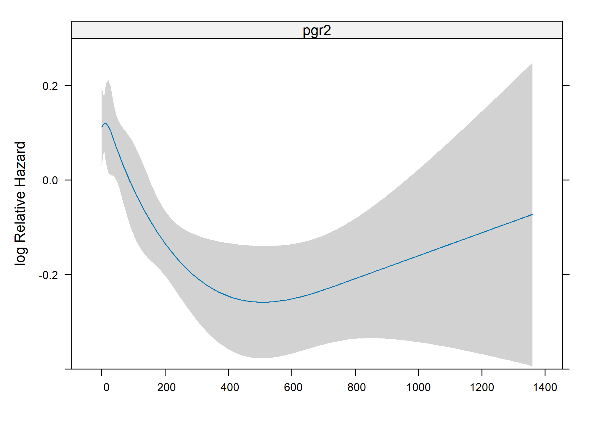
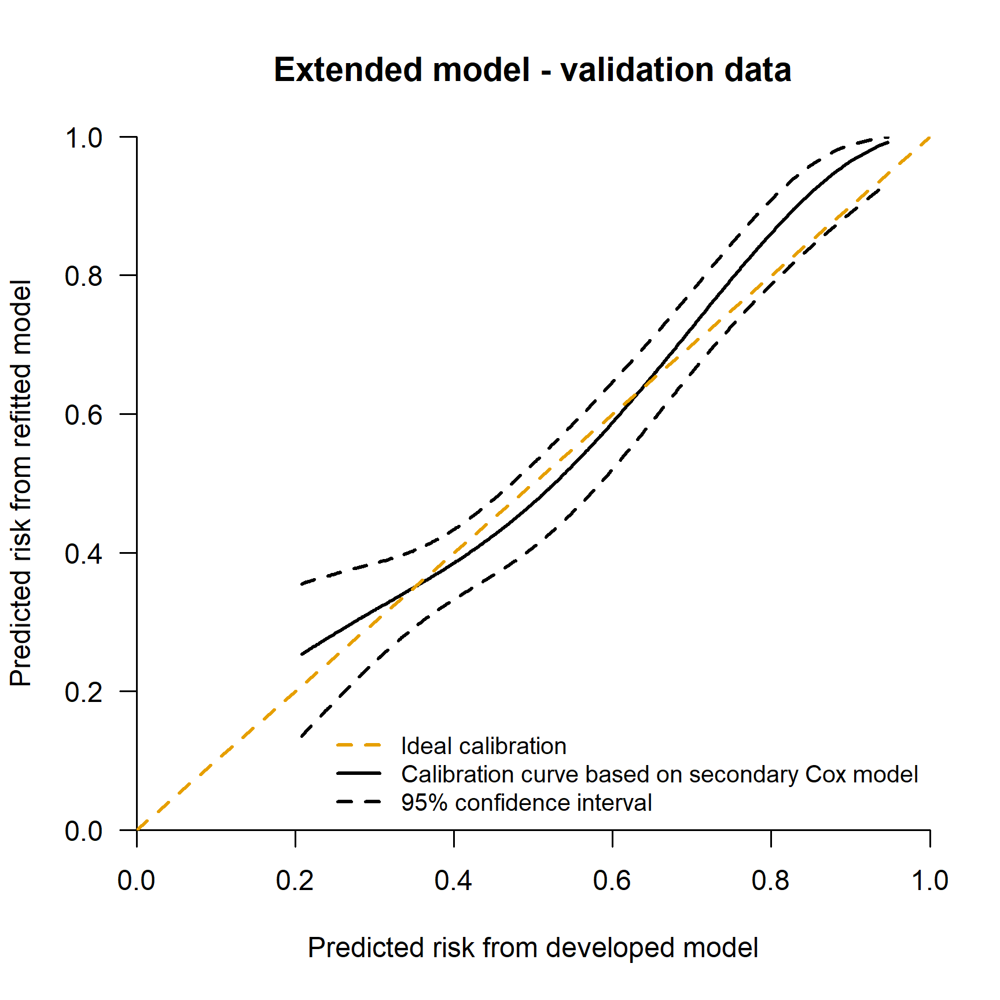

Performance assessment of survival prediction models - extended code
================

-   <a href="#goals" id="toc-goals">Goals</a>
    -   <a href="#load-packages-and-import-data"
        id="toc-load-packages-and-import-data">Load packages and import data</a>
    -   <a href="#data-preparation-and-descriptive-statistics"
        id="toc-data-preparation-and-descriptive-statistics">Data preparation
        and descriptive statistics</a>
-   <a
    href="#goal-1---develop-a-risk-prediction-model-with-a-time-to-event-outcome"
    id="toc-goal-1---develop-a-risk-prediction-model-with-a-time-to-event-outcome">Goal
    1 - Develop a risk prediction model with a time-to-event outcome</a>
    -   <a
        href="#11-preliminary-investigation---survival-and-censoring-curves-in-the-development-and-validation-data"
        id="toc-11-preliminary-investigation---survival-and-censoring-curves-in-the-development-and-validation-data">1.1
        Preliminary investigation - survival and censoring curves in the
        development and validation data</a>
    -   <a
        href="#12-secondary-investigation---check-non-linearity-of-continuous-predictors"
        id="toc-12-secondary-investigation---check-non-linearity-of-continuous-predictors">1.2
        Secondary investigation - check non-linearity of continuous
        predictors</a>
    -   <a
        href="#13-model-development---first-check---the-proportional-hazard-ph-assumption"
        id="toc-13-model-development---first-check---the-proportional-hazard-ph-assumption">1.3
        Model development - first check - the proportional hazard (PH)
        assumption</a>
    -   <a href="#14-model-development---fit-the-risk-prediction-models"
        id="toc-14-model-development---fit-the-risk-prediction-models">1.4 Model
        development - fit the risk prediction models</a>
    -   <a
        href="#15-histograms-of-predictions-with-and-without-the-additional-marker"
        id="toc-15-histograms-of-predictions-with-and-without-the-additional-marker">1.5
        Histograms of predictions with and without the additional marker</a>
-   <a href="#goal-2---assessing-performance-in-survival-prediction-models"
    id="toc-goal-2---assessing-performance-in-survival-prediction-models">Goal
    2 - Assessing performance in survival prediction models</a>
    -   <a href="#21-discrimination-measures"
        id="toc-21-discrimination-measures">2.1 Discrimination measures</a>
    -   <a href="#22-calibration" id="toc-22-calibration">2.2 Calibration</a>
        -   <a href="#221-mean-calibration" id="toc-221-mean-calibration">2.2.1 Mean
            calibration</a>
            -   <a href="#2211-mean-calibration---fixed-time-point"
                id="toc-2211-mean-calibration---fixed-time-point">2.2.1.1 Mean
                calibration - fixed time point</a>
            -   <a href="#2212-mean-calibration---time-range-assessment"
                id="toc-2212-mean-calibration---time-range-assessment">2.2.1.2 Mean
                calibration - time range assessment</a>
        -   <a href="#222-weak-calibration" id="toc-222-weak-calibration">2.2.2 Weak
            calibration</a>
            -   <a href="#2221-weak-calibration---fixed-time-point"
                id="toc-2221-weak-calibration---fixed-time-point">2.2.2.1 Weak
                calibration - fixed time point</a>
            -   <a href="#2222-weak-calibration---time-range-assessment"
                id="toc-2222-weak-calibration---time-range-assessment">2.2.2.2 Weak
                calibration - time range assessment</a>
        -   <a href="#223-moderate-calibration"
            id="toc-223-moderate-calibration">2.2.3 Moderate calibration</a>
            -   <a href="#2231-moderate-calibration---fixed-time-point"
                id="toc-2231-moderate-calibration---fixed-time-point">2.2.3.1 Moderate
                calibration - fixed time point</a>
            -   <a href="#2232-moderate-calibration---time-range-assessment"
                id="toc-2232-moderate-calibration---time-range-assessment">2.2.3.2
                Moderate calibration - time range assessment</a>
    -   <a href="#23-overall-performance-measures"
        id="toc-23-overall-performance-measures">2.3 Overall performance
        measures</a>
-   <a href="#goal-3---clinical-utility"
    id="toc-goal-3---clinical-utility">Goal 3 - Clinical utility</a>
-   <a href="#reproducibility-ticket"
    id="toc-reproducibility-ticket">Reproducibility ticket</a>

## Goals

In this document, we assume that individual data of the development and
validation set are both available.

In particular:  
1. To develop a risk prediction model with a time-to-event outcome;  
2. To assess the prediction performance of a model with a time-to-event
outcome;  
3. To assess the potential clinical utility of a risk prediction model
with time-to-event outcome.

The extended code basically evaluates the prediction performance at a
fixed time horizon (e.g. 5 years) and also for the entire follow-up
time.

### Load packages and import data

The following libraries are needed to achieve the following goals, if
you have not them installed, please use install.packages(’‘)
(e.g. install.packages(’survival’)) or use the user-friendly approach if
you are using RStudio.

``` r
# Use pacman to check whether packages are installed, if not load
if (!require("pacman")) install.packages("pacman")
library(pacman)

pacman::p_load(
  rio,
  survival,
  rms,
  pec,
  survminer,
  riskRegression,
  timeROC,
  plotrix,
  splines,
  knitr,
  kableExtra,
  gtsummary,
  boot,
  tidyverse,
  rsample,
  gridExtra,
  webshot
)

options(show.signif.stars = FALSE)  
palette("Okabe-Ito")  # color-blind friendly  (needs R 4.0)
```

The two primary datasets from the Rotterdam study and the German Breast
Cancer Study Group (GBSG) are included as example data sets in the
`survival` package. The Rotterdam data has separate variables for time
to recurrence of disease and time to death, and these are combined into
a single endpoint of recurrence free survival (RFS), while the gbsg data
set has RFS as its single endpoint. The follow-up time is converted from
days to years, that being a more natural unit for any plots; it does not
change any fits. A categorical variable for nodes is also added.

### Data preparation and descriptive statistics

<details>
<summary>
Click to expand code
</summary>

``` r
# Data and recoding ----------------------------------
# Development data

rotterdam$ryear <- rotterdam$rtime/365.25  # time in years
rotterdam$rfs <- with(rotterdam, pmax(recur, death)) #The variable rfs is a status indicator, 0 = alive without relapse, 1 = death or relapse.

# Fix the outcome for 43 patients who have died but 
# censored at time of recurrence which was less than death time. 
# The actual death time should be used rather than the earlier censored recurrence time.

rotterdam$ryear[rotterdam$rfs == 1 & 
                  rotterdam$recur == 0 & 
                  rotterdam$death == 1 & 
                  (rotterdam$rtime < rotterdam$dtime)] <- 
  
  rotterdam$dtime[rotterdam$rfs == 1 &
                    rotterdam$recur == 0 & 
                    rotterdam$death == 1 & 
                    (rotterdam$rtime < rotterdam$dtime)]/365.25  

# variables used in the analysis
pgr99 <- quantile(rotterdam$pgr, .99, type = 1) # there is a large outlier of 5000, used type=1 to get same result as in SAS
rotterdam$pgr2 <- pmin(rotterdam$pgr, pgr99) # Winsorized value
nodes99 <- quantile(rotterdam$nodes, .99, type = 1) 
rotterdam$nodes2 <- pmin(rotterdam$nodes, nodes99) # NOTE: winsorizing also continuous node?

rotterdam$csize <- rotterdam$size           # categorized size
rotterdam$cnode <- cut(rotterdam$nodes, 
                       c(-1,0, 3, 51),
                       c("0", "1-3", ">3"))   # categorized node
rotterdam$grade3 <- as.factor(rotterdam$grade)
levels(rotterdam$grade3) <- c("1-2", "3")

# Save in the data the restricted cubic spline term using Hmisc::rcspline.eval() package

# Continuous nodes variable
rcs3_nodes <- rcspline.eval(rotterdam$nodes2, 
                            knots = c(0, 1, 9))
attr(rcs3_nodes, "dim") <- NULL
attr(rcs3_nodes, "knots") <- NULL
rotterdam$nodes3 <- rcs3_nodes

# PGR
rcs3_pgr <- Hmisc::rcspline.eval(rotterdam$pgr2,
                                 knots = c(0, 41, 486)) # using knots of the original variable (not winsorized)
attr(rcs3_pgr, "dim") <- NULL
attr(rcs3_pgr, "knots") <- NULL
rotterdam$pgr3 <- rcs3_pgr

# Validation data
gbsg$ryear <- gbsg$rfstime/365.25
gbsg$rfs   <- gbsg$status           # the GBSG data contains RFS
gbsg$cnode <- cut(gbsg$nodes, 
                  c(-1,0, 3, 51),
                  c("0", "1-3", ">3"))   # categorized node
gbsg$csize <- cut(gbsg$size,  
                  c(-1, 20, 50, 500), #categorized size
                  c("<=20", "20-50", ">50"))
gbsg$pgr2 <- pmin(gbsg$pgr, pgr99) # Winsorized value of PGR
gbsg$nodes2 <- pmin(gbsg$nodes, nodes99) # Winsorized value of continuous nodes
gbsg$grade3 <- as.factor(gbsg$grade)
levels(gbsg$grade3) <- c("1-2", "1-2", "3")

# Restricted cubic spline 
# Continuous nodes
rcs3_nodes <- Hmisc::rcspline.eval(gbsg$nodes2, knots = c(0, 1, 9))
attr(rcs3_nodes, "dim") <- NULL
attr(rcs3_nodes, "knots") <- NULL
gbsg$nodes3 <- rcs3_nodes

# PGR
rcs3_pgr <- Hmisc::rcspline.eval(gbsg$pgr2, knots = c(0, 41, 486))
attr(rcs3_pgr, "dim") <- NULL
attr(rcs3_pgr, "knots") <- NULL
gbsg$pgr3 <- rcs3_pgr


# Much of the analysis will focus on the first 5 years: create
#  data sets that are censored at 5
temp <- survSplit(Surv(ryear, rfs) ~ ., data = rotterdam, cut = 5,
                  episode="epoch")
rott5 <- subset(temp, epoch == 1)  # only the first 5 years
temp <- survSplit(Surv(ryear, rfs) ~ ., data = gbsg, cut = 5,
                  episode ="epoch")
gbsg5 <- subset(temp, epoch == 1)

# Relevel
rott5$cnode <- relevel(rotterdam$cnode, "0")
gbsg5$cnode <- relevel(gbsg$cnode, "0")
```

</details>
<table style="NAborder-bottom: 0; margin-left: auto; margin-right: auto;" class="table table-striped">
<thead>
<tr>
<th style="text-align:left;">
Characteristic
</th>
<th style="text-align:center;">
Development dataset, N = 2,982
</th>
<th style="text-align:center;">
Validation dataset, N = 686
</th>
</tr>
</thead>
<tbody>
<tr>
<td style="text-align:left;">
Size (cm)
</td>
<td style="text-align:center;">
</td>
<td style="text-align:center;">
</td>
</tr>
<tr>
<td style="text-align:left;padding-left: 2em;" indentlevel="1">
\<=20
</td>
<td style="text-align:center;">
1,387 (47%)
</td>
<td style="text-align:center;">
180 (26%)
</td>
</tr>
<tr>
<td style="text-align:left;padding-left: 2em;" indentlevel="1">
20-50
</td>
<td style="text-align:center;">
1,291 (43%)
</td>
<td style="text-align:center;">
453 (66%)
</td>
</tr>
<tr>
<td style="text-align:left;padding-left: 2em;" indentlevel="1">
\>50
</td>
<td style="text-align:center;">
304 (10%)
</td>
<td style="text-align:center;">
53 (7.7%)
</td>
</tr>
<tr>
<td style="text-align:left;">
Number of nodes
</td>
<td style="text-align:center;">
</td>
<td style="text-align:center;">
</td>
</tr>
<tr>
<td style="text-align:left;padding-left: 2em;" indentlevel="1">
Mean (SD)
</td>
<td style="text-align:center;">
3 (4)
</td>
<td style="text-align:center;">
5 (5)
</td>
</tr>
<tr>
<td style="text-align:left;padding-left: 2em;" indentlevel="1">
Median (Range)
</td>
<td style="text-align:center;">
1 (0, 34)
</td>
<td style="text-align:center;">
3 (1, 51)
</td>
</tr>
<tr>
<td style="text-align:left;">
Grade
</td>
<td style="text-align:center;">
</td>
<td style="text-align:center;">
</td>
</tr>
<tr>
<td style="text-align:left;padding-left: 2em;" indentlevel="1">
1-2
</td>
<td style="text-align:center;">
794 (27%)
</td>
<td style="text-align:center;">
525 (77%)
</td>
</tr>
<tr>
<td style="text-align:left;padding-left: 2em;" indentlevel="1">
3
</td>
<td style="text-align:center;">
2,188 (73%)
</td>
<td style="text-align:center;">
161 (23%)
</td>
</tr>
<tr>
<td style="text-align:left;">
Age (years)
</td>
<td style="text-align:center;">
</td>
<td style="text-align:center;">
</td>
</tr>
<tr>
<td style="text-align:left;padding-left: 2em;" indentlevel="1">
Mean (SD)
</td>
<td style="text-align:center;">
55 (13)
</td>
<td style="text-align:center;">
53 (10)
</td>
</tr>
<tr>
<td style="text-align:left;padding-left: 2em;" indentlevel="1">
Median (Range)
</td>
<td style="text-align:center;">
54 (24, 90)
</td>
<td style="text-align:center;">
53 (21, 80)
</td>
</tr>
<tr>
<td style="text-align:left;">
PGR (ng/mL)
</td>
<td style="text-align:center;">
</td>
<td style="text-align:center;">
</td>
</tr>
<tr>
<td style="text-align:left;padding-left: 2em;" indentlevel="1">
Mean (SD)
</td>
<td style="text-align:center;">
162 (291)
</td>
<td style="text-align:center;">
110 (202)
</td>
</tr>
<tr>
<td style="text-align:left;padding-left: 2em;" indentlevel="1">
Median (Range)
</td>
<td style="text-align:center;">
41 (0, 5,004)
</td>
<td style="text-align:center;">
32 (0, 2,380)
</td>
</tr>
</tbody>
<tfoot>
<tr>
<td style="padding: 0; " colspan="100%">
<sup>1</sup> n (%)
</td>
</tr>
</tfoot>
</table>

## Goal 1 - Develop a risk prediction model with a time-to-event outcome

Prediction models are useful to provide the estimated probability of a
specific outcome using personal information. In many studies, especially
in medicine, the main outcome under assessment is the time to an event
of interest defined generally as survival time. Prognostic models for
survival end points, such as recurrence or progression of disease, need
to account for drop out during follow-up. Patients who have not
experienced the event of interest are censored observations. Cox
regression analysis is the most popular statistical model to deal with
such data in oncology and other medical research.

### 1.1 Preliminary investigation - survival and censoring curves in the development and validation data

First, we draw the survival and the censoring curves of the development
and validation data

<details>
<summary>
Click to expand code
</summary>

``` r
# Development set
sfit_rott <- survfit(Surv(ryear, rfs == 1) ~ 1, 
                     data = rotterdam) # survival
sfit_rott_c <- survfit(Surv(ryear, rfs == 0) ~ 1, 
                       data = rotterdam) # censoring

# Plots development data
dev_plots <- list()

# KM plot - development data
dev_plots[[1]] <- survminer::ggsurvplot(sfit_rott, data = rotterdam,
                                        risk.table = TRUE,
                                        risk.table.fontsize = 3.6,
                                        palette = 3,
                                        size = 1.5,
                                        censor = FALSE,
                                        legend = "none",
                                        title = "Failure-free survival",
                                        xlab = "Years",
                                        ylab = "Probability",
                                        tables.theme = theme_cleantable())

dev_plots[[1]]$table <- dev_plots[[1]]$table + 
  theme(
    axis.text.y = element_blank(),
    axis.ticks.y = element_blank()
  )

# Censoring plot - development data
dev_plots[[2]] <- survminer::ggsurvplot(sfit_rott_c, data = rotterdam,
                                        risk.table = TRUE,
                                        risk.table.fontsize = 3.6,
                                        palette = 2,
                                        size = 1.5,
                                        censor = FALSE,
                                        legend = "none",
                                        title = "Censoring",
                                        xlab = "Years",
                                        ylab = "Probability",
                                        # risk.table.title = "Number at risk",
                                        # risk.table.y.text.col =  TRUE,
                                        tables.theme = theme_cleantable())

dev_plots[[2]]$table <- dev_plots[[2]]$table + 
  theme(
    axis.text.y = element_blank(),
    axis.ticks.y = element_blank()
  )

# Join together 
survminer::arrange_ggsurvplots(dev_plots, print = TRUE,
                               ncol = 2, nrow = 1, risk.table.height = 0.15,
                               title = "Development data")  

# Validation set
sfit_gbsg <- survfit(Surv(ryear, rfs == 1) ~ 1, 
                     data = gbsg) # survival
sfit_gbsg_c <- survfit(Surv(ryear, rfs == 0) ~ 1, 
                       data = gbsg) # censoring

# KM plot - validation data
val_plots <- list()
val_plots[[1]] <- survminer::ggsurvplot(sfit_gbsg, data = gbsg,
                                        risk.table = TRUE,
                                        risk.table.fontsize = 3.6,
                                        palette = 3,
                                        size = 1.5,
                                        censor = FALSE,
                                        legend = "none",
                                        title = "Failure-free survival",
                                        xlab = "Years",
                                        ylab = "Probability",
                                        tables.theme = theme_cleantable())

val_plots[[1]]$table <- val_plots[[1]]$table + 
  theme(
    axis.text.y = element_blank(),
    axis.ticks.y = element_blank()
  )

# Censoring - validation data
val_plots[[2]] <- survminer::ggsurvplot(sfit_gbsg_c, data = gbsg,
                                        risk.table = TRUE,
                                        risk.table.fontsize = 3.6,
                                        palette = 2,
                                        size = 1.5,
                                        censor = FALSE,
                                        legend = "none",
                                        title = "Censoring",
                                        xlab = "Years",
                                        ylab = "Probability",
                                        tables.theme = theme_cleantable())

val_plots[[2]]$table <- val_plots[[2]]$table + 
  theme(
    axis.text.y = element_blank(),
    axis.ticks.y = element_blank()
  )

# Join together 
survminer::arrange_ggsurvplots(val_plots, print = TRUE,
                               ncol = 2, nrow = 1,
                               risk.table.height = 0.15,
                               title = "Validation data")
```

</details>


In total, 2982 patients were included to develop the risk prediction
model for survival with a median follow-up of 9 years. The 5-year
survival was 56% (95% CI: 55-58%). In total, 686 patients were selected
to externally validate the risk prediction model. The median survival in
the validation data was 4.5 years. The median survival was 5 years while
the 5-year survival was 49% (95% CI: 45-54%).

### 1.2 Secondary investigation - check non-linearity of continuous predictors

The potential non-linear relation between continuous predictors
(i.e. progesterone level) and the outcome should be investigated before
developing a risk prediction model. Non-linearity of continuous
predictors can be checked using splines.  
Physically, a spline is a flexible wood or metal strip, which is passed
through a set of fixed points (knots) in order to approximate a curve.
The most common computational approximation to this is a cubic smoothing
spline which is cubic between the knot points, and constrained to be
linear beyond the two end knots. For the restricted cubic spline using
`rms::rcs()` R package::function(), the position of the knots are
defined at 10<sup>th</sup>,50<sup>th</sup> and 90<sup>th</sup> quantile
of the continuous predictor distribution. For more details see Frank
Harrell’s book ‘Regression Model Strategies’ on page 27 (second
edition).  
The user can specify the positions of the knots instead of using the
default calculation of the knots proposed in the book of Frank Harrell.
To deal with very large influential value, we winzorize progesterone
level to the 90<sup>th</sup> percentile.

<details>
<summary>
Click to expand code
</summary>

``` r
dd <- datadist(rotterdam)
options(datadist = "dd")
fit_pgr <- rms::cph(Surv(ryear, rfs) ~ rcs(pgr2),
                    data = rotterdam, x = T, y = T, surv = T)
fit_nodes <- rms::cph(Surv(ryear, rfs) ~ rcs(nodes2),
                      data = rotterdam, x = T, y = T, surv = T)

oldpar <- par(mfrow = c(2, 2), mar = c(5, 5, 1, 1))
plot(rms::Predict(fit_pgr))
plot(rms::Predict(fit_nodes))
options(datadist = NULL)
par(oldpar)
```

</details>



We should model the progesterone level using a three-knot restricted
cubic spline. We save the spline in the development and validation data.

### 1.3 Model development - first check - the proportional hazard (PH) assumption

We now examine the fits in a more careful way by checking the
proportionality of the hazards of the Cox regression model. Firstly, we
fit the first prediction model in the development data using size, node,
grade. Then, we check the PH assumption.

<details>
<summary>
Click to expand code
</summary>

``` r
fit1_ph <- coxph(Surv(ryear, rfs) ~ csize + rcs(nodes2, 3) + grade3, 
                data = rotterdam, x = T, y = T)


zp1 <- cox.zph(fit1_ph, transform = "identity")
kable(round(zp1$table, 3)) |> kable_styling("striped", position = "center")

oldpar <- par(mfrow = c(2, 2), mar = c(5, 5, 1, 1))
for (i in 1:3) {
  plot(zp1[i], resid = F)
  abline(0, 0, lty = 3)
}
par(oldpar)
```

</details>
<table class="table table-striped" style="margin-left: auto; margin-right: auto;">
<thead>
<tr>
<th style="text-align:left;">
</th>
<th style="text-align:right;">
chisq
</th>
<th style="text-align:right;">
df
</th>
<th style="text-align:right;">
p
</th>
</tr>
</thead>
<tbody>
<tr>
<td style="text-align:left;">
csize
</td>
<td style="text-align:right;">
19.422
</td>
<td style="text-align:right;">
2
</td>
<td style="text-align:right;">
0.000
</td>
</tr>
<tr>
<td style="text-align:left;">
rcs(nodes2, 3)
</td>
<td style="text-align:right;">
22.387
</td>
<td style="text-align:right;">
2
</td>
<td style="text-align:right;">
0.000
</td>
</tr>
<tr>
<td style="text-align:left;">
grade3
</td>
<td style="text-align:right;">
4.144
</td>
<td style="text-align:right;">
1
</td>
<td style="text-align:right;">
0.042
</td>
</tr>
<tr>
<td style="text-align:left;">
GLOBAL
</td>
<td style="text-align:right;">
32.811
</td>
<td style="text-align:right;">
5
</td>
<td style="text-align:right;">
0.000
</td>
</tr>
</tbody>
</table>


The statistical tests show strong evidence of non-proportionality. Since
the number of death is large the formal tests are quite sensitive,
however, and it is important to also examine the graphs.  
These show an estimated coefficient as a function of time. As a further
follow-up we will divide the data into 3 epochs of 0-5, 5-10, and 10+
years, fitting a separate model to each.

<details>
<summary>
Click to expand code
</summary>

``` r
# Development
edata <- survSplit(Surv(ryear, rfs) ~ .,
  data = rotterdam, cut = c(5, 10),
  episode = "epoch"
)
efit1 <- coxph(Surv(ryear, rfs) ~ csize + nodes2 + nodes3 + grade3,
  data = edata[edata$epoch == 1, ], x = T, y = T
)
efit2 <- coxph(Surv(ryear, rfs) ~ csize + nodes2 + nodes3 + grade3,
  data = edata[edata$epoch == 2, ], x = T, y = T
)
efit3 <- coxph(Surv(ryear, rfs) ~ csize + nodes2 + nodes3 + grade3,
  data = edata[edata$epoch == 3, ], x = T, y = T
)
```

</details>
<table class="table table-striped" style="margin-left: auto; margin-right: auto;">
<thead>
<tr>
<th style="text-align:left;">
</th>
<th style="text-align:right;">
csize20-50
</th>
<th style="text-align:right;">
csize\>50
</th>
<th style="text-align:right;">
nodes2
</th>
<th style="text-align:right;">
nodes3
</th>
<th style="text-align:right;">
grade33
</th>
</tr>
</thead>
<tbody>
<tr>
<td style="text-align:left;">
Epoch 1: 0-5 years
</td>
<td style="text-align:right;">
0.34
</td>
<td style="text-align:right;">
0.57
</td>
<td style="text-align:right;">
0.30
</td>
<td style="text-align:right;">
-0.81
</td>
<td style="text-align:right;">
0.36
</td>
</tr>
<tr>
<td style="text-align:left;">
Epoch 2: 5-10 years
</td>
<td style="text-align:right;">
0.17
</td>
<td style="text-align:right;">
0.21
</td>
<td style="text-align:right;">
0.25
</td>
<td style="text-align:right;">
-0.75
</td>
<td style="text-align:right;">
0.27
</td>
</tr>
<tr>
<td style="text-align:left;">
Epoch 3: \>10 years
</td>
<td style="text-align:right;">
-0.22
</td>
<td style="text-align:right;">
0.24
</td>
<td style="text-align:right;">
0.05
</td>
<td style="text-align:right;">
0.11
</td>
<td style="text-align:right;">
0.37
</td>
</tr>
</tbody>
</table>
<table class="table table-striped" style="margin-left: auto; margin-right: auto;">
<thead>
<tr>
<th style="text-align:left;">
</th>
<th style="text-align:right;">
Censored
</th>
<th style="text-align:right;">
Event
</th>
</tr>
</thead>
<tbody>
<tr>
<td style="text-align:left;">
Epoch 1: 0-5 years
</td>
<td style="text-align:right;">
1707
</td>
<td style="text-align:right;">
1275
</td>
</tr>
<tr>
<td style="text-align:left;">
Epoch 2: 5-10 years
</td>
<td style="text-align:right;">
1212
</td>
<td style="text-align:right;">
369
</td>
</tr>
<tr>
<td style="text-align:left;">
Epoch 3: \>10 years
</td>
<td style="text-align:right;">
419
</td>
<td style="text-align:right;">
69
</td>
</tr>
</tbody>
</table>

A drastic change in the size coefficients across all epochs is apparent,
along with a major reduction in the nodes coefficient in epoch 3. As an
ameleoration of this we will refit the model using only the first epoch,
which includes most of the recurrences and deaths.  
We applied the administrative censoring at 5 years in the development
data and we assessed the prediction performance of the prognostic model
at 5 years. The 5-year horizon was chosen because it is also a common
prediction time horizon in clinical practice. The hazards in the
development data seem not totally proportional within 5 years but minor
deviation of proportionality were considered acceptable.

### 1.4 Model development - fit the risk prediction models

We develop the risk prediction model in the development data considering
the first 5-year follow-up to minimize the violation of proportional
hazard including size, nodel and grade. The second model also includes
the progesterone level modelled using a 3-knot restricted cubic
spline.  
We also administratively censored the validation data at 5 years.

<details>
<summary>
Click to expand code
</summary>

``` r
# Consider the first 5-year epoch in the development set
# Refit the model
efit1 <- coxph(Surv(ryear, rfs) ~ csize + nodes2 + nodes3 + grade3,
  data = rott5, x = T, y = T
)
# Additional marker
efit1_pgr <- update(efit1, . ~ . + pgr2 + pgr3)

# Baseline at 5 years
bh <- basehaz(efit1, centered = FALSE) # uncentered
bh$surv <- exp(-bh$hazard) # baseline survival
S0_t5 <- bh$surv[bh$time == 5] 
# NOTE: this can be used to calculate S(t = 5) = S0(t = 5)**exp(X*beta)

bh_c <- basehaz(efit1, centered = TRUE)
bh_c$surv_c <- exp(-bh_c$hazard) # baseline survival
S0_t5_c <- bh_c$surv[bh_c$time == 5] 
```

</details>

Below the results of the models:

-   Classical model:

 <strong>Cox Proportional Hazards Model</strong>
 
 <pre>
 rms::cph(formula = Surv(ryear, rfs) ~ csize + rcs(nodes2, c(0, 
     1, 9)) + grade3, data = rott5, x = T, y = T, surv = T)
 </pre>
 
 <table class='gmisc_table' style='border-collapse: collapse; margin-top: 1em; margin-bottom: 1em;' >
<thead>
<tr>
<th style='font-weight: 900; border-bottom: 1px solid grey; border-top: 2px solid grey; border-left: 1px solid black; border-right: 1px solid black; text-align: center;'></th>
<th style='font-weight: 900; border-bottom: 1px solid grey; border-top: 2px solid grey; border-right: 1px solid black; text-align: center;'>Model Tests</th>
<th style='font-weight: 900; border-bottom: 1px solid grey; border-top: 2px solid grey; border-right: 1px solid black; text-align: center;'>Discrimination<br>Indexes</th>
</tr>
</thead>
<tbody>
<tr>
<td style='min-width: 9em; border-left: 1px solid black; border-right: 1px solid black; text-align: center;'>Obs 2982</td>
<td style='min-width: 9em; border-right: 1px solid black; text-align: center;'>LR χ<sup>2</sup> 531.00</td>
<td style='min-width: 9em; border-right: 1px solid black; text-align: center;'><i>R</i><sup>2</sup> 0.163</td>
</tr>
<tr>
<td style='min-width: 9em; border-left: 1px solid black; border-right: 1px solid black; text-align: center;'>Events 1275</td>
<td style='min-width: 9em; border-right: 1px solid black; text-align: center;'>d.f. 5</td>
<td style='min-width: 9em; border-right: 1px solid black; text-align: center;'><i>R</i><sup><span style='font-size: 70%;'>2</span></sup><sub style='position: relative; left: -.47em; bottom: -.4em;'><span style='font-size: 70%;'>5,2982</span></sub> 0.162</td>
</tr>
<tr>
<td style='min-width: 9em; border-left: 1px solid black; border-right: 1px solid black; text-align: center;'>Center 0.8896</td>
<td style='min-width: 9em; border-right: 1px solid black; text-align: center;'>Pr(>χ<sup>2</sup>) 0.0000</td>
<td style='min-width: 9em; border-right: 1px solid black; text-align: center;'><i>R</i><sup><span style='font-size: 70%;'>2</span></sup><sub style='position: relative; left: -.47em; bottom: -.4em;'><span style='font-size: 70%;'>5,1275</span></sub> 0.338</td>
</tr>
<tr>
<td style='min-width: 9em; border-left: 1px solid black; border-right: 1px solid black; text-align: center;'></td>
<td style='min-width: 9em; border-right: 1px solid black; text-align: center;'>Score χ<sup>2</sup> 635.29</td>
<td style='min-width: 9em; border-right: 1px solid black; text-align: center;'><i>D</i><sub>xy</sub> 0.364</td>
</tr>
<tr>
<td style='min-width: 9em; border-bottom: 2px solid grey; border-left: 1px solid black; border-right: 1px solid black; text-align: center;'></td>
<td style='min-width: 9em; border-bottom: 2px solid grey; border-right: 1px solid black; text-align: center;'>Pr(>χ<sup>2</sup>) 0.0000</td>
<td style='min-width: 9em; border-bottom: 2px solid grey; border-right: 1px solid black; text-align: center;'></td>
</tr>
</tbody>
</table>

 
 <table class='gmisc_table' style='border-collapse: collapse; margin-top: 1em; margin-bottom: 1em;' >
<thead>
<tr><th style='border-bottom: 1px solid grey; font-weight: 900; border-top: 2px solid grey; min-width: 7em; text-align: center;'></th>
<th style='font-weight: 900; border-bottom: 1px solid grey; border-top: 2px solid grey; text-align: right;'>β</th>
<th style='font-weight: 900; border-bottom: 1px solid grey; border-top: 2px solid grey; text-align: right;'>S.E.</th>
<th style='font-weight: 900; border-bottom: 1px solid grey; border-top: 2px solid grey; text-align: right;'>Wald <i>Z</i></th>
<th style='font-weight: 900; border-bottom: 1px solid grey; border-top: 2px solid grey; text-align: right;'>Pr(>|<i>Z</i>|)</th>
</tr>
</thead>
<tbody>
<tr>
<td style='min-width: 7em; text-align: left;'>csize=20-50</td>
<td style='min-width: 7em; text-align: right;'>  0.3418</td>
<td style='min-width: 7em; text-align: right;'> 0.0654</td>
<td style='min-width: 7em; text-align: right;'> 5.23</td>
<td style='min-width: 7em; text-align: right;'><0.0001</td>
</tr>
<tr>
<td style='min-width: 7em; text-align: left;'>csize=>50</td>
<td style='min-width: 7em; text-align: right;'>  0.5736</td>
<td style='min-width: 7em; text-align: right;'> 0.0925</td>
<td style='min-width: 7em; text-align: right;'> 6.20</td>
<td style='min-width: 7em; text-align: right;'><0.0001</td>
</tr>
<tr>
<td style='min-width: 7em; text-align: left;'>nodes2</td>
<td style='min-width: 7em; text-align: right;'>  0.3040</td>
<td style='min-width: 7em; text-align: right;'> 0.0281</td>
<td style='min-width: 7em; text-align: right;'>10.82</td>
<td style='min-width: 7em; text-align: right;'><0.0001</td>
</tr>
<tr>
<td style='min-width: 7em; text-align: left;'>nodes2'</td>
<td style='min-width: 7em; text-align: right;'> -0.8111</td>
<td style='min-width: 7em; text-align: right;'> 0.1046</td>
<td style='min-width: 7em; text-align: right;'>-7.75</td>
<td style='min-width: 7em; text-align: right;'><0.0001</td>
</tr>
<tr>
<td style='min-width: 7em; border-bottom: 2px solid grey; text-align: left;'>grade3=3</td>
<td style='min-width: 7em; border-bottom: 2px solid grey; text-align: right;'>  0.3617</td>
<td style='min-width: 7em; border-bottom: 2px solid grey; text-align: right;'> 0.0713</td>
<td style='min-width: 7em; border-bottom: 2px solid grey; text-align: right;'> 5.07</td>
<td style='min-width: 7em; border-bottom: 2px solid grey; text-align: right;'><0.0001</td>
</tr>
</tbody>
</table>

-   Extended model:

 <strong>Cox Proportional Hazards Model</strong>
 
 <pre>
 rms::cph(formula = Surv(ryear, rfs) ~ csize + rcs(nodes2, c(0, 
     1, 9)) + grade3 + rcs(pgr2, c(0, 41, 486)), data = rott5, 
     x = T, y = T, surv = T)
 </pre>
 
 <table class='gmisc_table' style='border-collapse: collapse; margin-top: 1em; margin-bottom: 1em;' >
<thead>
<tr>
<th style='font-weight: 900; border-bottom: 1px solid grey; border-top: 2px solid grey; border-left: 1px solid black; border-right: 1px solid black; text-align: center;'></th>
<th style='font-weight: 900; border-bottom: 1px solid grey; border-top: 2px solid grey; border-right: 1px solid black; text-align: center;'>Model Tests</th>
<th style='font-weight: 900; border-bottom: 1px solid grey; border-top: 2px solid grey; border-right: 1px solid black; text-align: center;'>Discrimination<br>Indexes</th>
</tr>
</thead>
<tbody>
<tr>
<td style='min-width: 9em; border-left: 1px solid black; border-right: 1px solid black; text-align: center;'>Obs 2982</td>
<td style='min-width: 9em; border-right: 1px solid black; text-align: center;'>LR χ<sup>2</sup> 563.19</td>
<td style='min-width: 9em; border-right: 1px solid black; text-align: center;'><i>R</i><sup>2</sup> 0.172</td>
</tr>
<tr>
<td style='min-width: 9em; border-left: 1px solid black; border-right: 1px solid black; text-align: center;'>Events 1275</td>
<td style='min-width: 9em; border-right: 1px solid black; text-align: center;'>d.f. 7</td>
<td style='min-width: 9em; border-right: 1px solid black; text-align: center;'><i>R</i><sup><span style='font-size: 70%;'>2</span></sup><sub style='position: relative; left: -.47em; bottom: -.4em;'><span style='font-size: 70%;'>7,2982</span></sub> 0.170</td>
</tr>
<tr>
<td style='min-width: 9em; border-left: 1px solid black; border-right: 1px solid black; text-align: center;'>Center 0.6592</td>
<td style='min-width: 9em; border-right: 1px solid black; text-align: center;'>Pr(>χ<sup>2</sup>) 0.0000</td>
<td style='min-width: 9em; border-right: 1px solid black; text-align: center;'><i>R</i><sup><span style='font-size: 70%;'>2</span></sup><sub style='position: relative; left: -.47em; bottom: -.4em;'><span style='font-size: 70%;'>7,1275</span></sub> 0.354</td>
</tr>
<tr>
<td style='min-width: 9em; border-left: 1px solid black; border-right: 1px solid black; text-align: center;'></td>
<td style='min-width: 9em; border-right: 1px solid black; text-align: center;'>Score χ<sup>2</sup> 664.84</td>
<td style='min-width: 9em; border-right: 1px solid black; text-align: center;'><i>D</i><sub>xy</sub> 0.377</td>
</tr>
<tr>
<td style='min-width: 9em; border-bottom: 2px solid grey; border-left: 1px solid black; border-right: 1px solid black; text-align: center;'></td>
<td style='min-width: 9em; border-bottom: 2px solid grey; border-right: 1px solid black; text-align: center;'>Pr(>χ<sup>2</sup>) 0.0000</td>
<td style='min-width: 9em; border-bottom: 2px solid grey; border-right: 1px solid black; text-align: center;'></td>
</tr>
</tbody>
</table>

 
 <table class='gmisc_table' style='border-collapse: collapse; margin-top: 1em; margin-bottom: 1em;' >
<thead>
<tr><th style='border-bottom: 1px solid grey; font-weight: 900; border-top: 2px solid grey; min-width: 7em; text-align: center;'></th>
<th style='font-weight: 900; border-bottom: 1px solid grey; border-top: 2px solid grey; text-align: right;'>β</th>
<th style='font-weight: 900; border-bottom: 1px solid grey; border-top: 2px solid grey; text-align: right;'>S.E.</th>
<th style='font-weight: 900; border-bottom: 1px solid grey; border-top: 2px solid grey; text-align: right;'>Wald <i>Z</i></th>
<th style='font-weight: 900; border-bottom: 1px solid grey; border-top: 2px solid grey; text-align: right;'>Pr(>|<i>Z</i>|)</th>
</tr>
</thead>
<tbody>
<tr>
<td style='min-width: 7em; text-align: left;'>csize=20-50</td>
<td style='min-width: 7em; text-align: right;'>  0.3204</td>
<td style='min-width: 7em; text-align: right;'> 0.0655</td>
<td style='min-width: 7em; text-align: right;'> 4.89</td>
<td style='min-width: 7em; text-align: right;'><0.0001</td>
</tr>
<tr>
<td style='min-width: 7em; text-align: left;'>csize=>50</td>
<td style='min-width: 7em; text-align: right;'>  0.5542</td>
<td style='min-width: 7em; text-align: right;'> 0.0924</td>
<td style='min-width: 7em; text-align: right;'> 6.00</td>
<td style='min-width: 7em; text-align: right;'><0.0001</td>
</tr>
<tr>
<td style='min-width: 7em; text-align: left;'>nodes2</td>
<td style='min-width: 7em; text-align: right;'>  0.3050</td>
<td style='min-width: 7em; text-align: right;'> 0.0280</td>
<td style='min-width: 7em; text-align: right;'>10.87</td>
<td style='min-width: 7em; text-align: right;'><0.0001</td>
</tr>
<tr>
<td style='min-width: 7em; text-align: left;'>nodes2'</td>
<td style='min-width: 7em; text-align: right;'> -0.8198</td>
<td style='min-width: 7em; text-align: right;'> 0.1044</td>
<td style='min-width: 7em; text-align: right;'>-7.85</td>
<td style='min-width: 7em; text-align: right;'><0.0001</td>
</tr>
<tr>
<td style='min-width: 7em; text-align: left;'>grade3=3</td>
<td style='min-width: 7em; text-align: right;'>  0.3052</td>
<td style='min-width: 7em; text-align: right;'> 0.0721</td>
<td style='min-width: 7em; text-align: right;'> 4.23</td>
<td style='min-width: 7em; text-align: right;'><0.0001</td>
</tr>
<tr>
<td style='min-width: 7em; text-align: left;'>pgr2</td>
<td style='min-width: 7em; text-align: right;'> -0.0029</td>
<td style='min-width: 7em; text-align: right;'> 0.0006</td>
<td style='min-width: 7em; text-align: right;'>-5.05</td>
<td style='min-width: 7em; text-align: right;'><0.0001</td>
</tr>
<tr>
<td style='min-width: 7em; border-bottom: 2px solid grey; text-align: left;'>pgr2'</td>
<td style='min-width: 7em; border-bottom: 2px solid grey; text-align: right;'>  0.0127</td>
<td style='min-width: 7em; border-bottom: 2px solid grey; text-align: right;'> 0.0028</td>
<td style='min-width: 7em; border-bottom: 2px solid grey; text-align: right;'> 4.45</td>
<td style='min-width: 7em; border-bottom: 2px solid grey; text-align: right;'><0.0001</td>
</tr>
</tbody>
</table>

The coefficients of the models indicated that higher size, higher number
of positive lymph nodes and higher grade is more associate with poorer
prognosis. The association of the progesterone biomarker and the outcome
is non-linear as investigated previously.

### 1.5 Histograms of predictions with and without the additional marker

<details>
<summary>
Click to expand code
</summary>

``` r
# Refit the model
efit1 <- coxph(Surv(ryear, rfs) ~ csize + nodes2 + nodes3 + grade3,
  data = rott5, x = T, y = T
)
# Additional marker
efit1_pgr <- update(efit1, . ~ . + pgr2 + pgr3)

# Development data
t_horizon <- 5
rott5$pred <- riskRegression::predictRisk(efit1,
                                          newdata = rott5,
                                          times = t_horizon)

rott5$pred_pgr <- riskRegression::predictRisk(efit1_pgr,
                                              newdata = rott5,
                                              times = t_horizon)

# par(mgp=c(4,1,0), mar=c(6,5,2,2))
# oldpar <- par(mfrow = c(1, 2), las = 1)
par(las = 1)
xlab <- c(paste0('Basic model\nvariance = ', 
                 round(var(rott5$pred), 3)),
          paste0('Extended model with PGR\nvariance = ',
                 round(var(rott5$pred_pgr), 3)))
Hmisc::histbackback(rott5$pred,
                    rott5$pred_pgr, 
                    brks = seq(0.01, 0.99, by = 0.02), 
                    xlab = xlab, 
                    ylab = 'Predicted probability')
title("Development data")


# Validation data
gbsg5$pred <- riskRegression::predictRisk(efit1,
                                          newdata = gbsg5,
                                          times = t_horizon)


gbsg5$pred_pgr <- riskRegression::predictRisk(efit1_pgr,
                                              newdata = gbsg5,
                                              times = t_horizon)

par(las = 1)
xlab <- c(paste0('Basic model\nvariance = ', 
                 round(var(gbsg5$pred), 3)),
          paste0('Extended model with PGR\nvariance = ',
                round(var(gbsg5$pred_pgr), 3)))
Hmisc::histbackback(gbsg5$pred,
                    gbsg5$pred_pgr,
                    brks = seq(0.01, 0.99, by = 0.02),
                    xlab = xlab,
                    ylab = 'Predicted probability')
title("Validation data")
```

</details>


## Goal 2 - Assessing performance in survival prediction models

The performance of a risk prediction models may be evaluated through:

-   discrimination: the ability of the model to correctly rank patients
    with and without the outcome by a certain time point. This requires
    the coefficients (or the log of the hazard ratios) of the developed
    Cox prediction model to be evaluated;

-   calibration: the agreement between observed and predicted
    probabilities. It additionally requires the baseline (cumulative)
    hazard or survival;

-   overall performance measures: a combination of discrimination and
    calibration.

It is common that physicians focus on one or more clinically relevant
time horizons to inform subjects about their risk. We aim to assess the
prediction performance of a risk prediction model with time-to-event
outcome in a new data when information at a fixed time horizon(s) (here
at 5 years) of a developed prediction model were provided.

### 2.1 Discrimination measures

Discrimination is the ability to differentiate between subjects who have
the outcome by a certain time point and subjects who do not. Concordance
can be assessed over several different time intervals:

-   the entire range of the data. Two concordance measures are
    suggested:

    -   Harrell’s C quantifies the degree of concordance as the
        proportion of evaluable pairs where the patient with a longer
        survival time has better predicted survival;

    -   Uno’s C uses a time dependent weighting that more fully adjusts
        for censoring;

-   a 5 year window corresponding to our target assessment point. Uno’s
    cumulative/dynamic time-dependent Area Under the Curve (AUC) is
    suggested. Uno’s time-dependent AUC summarizes discrimination at
    specific fixed time points. At any time point of interest, *t*, a
    patient is classified as having an event if the patient experienced
    the event between baseline and *t* (5 years in our case study), and
    as a non-event if the patient remained event-free at *t*. The
    time-dependent AUC evaluates whether predicted probabilities were
    higher for cases than for non-cases.

There is some uncertainty in the literature about the original Harrell
formulation versus Uno’s suggestion to re-weight the time scale by the
factor $1/G^2(t)$ where $G$ is the censoring distribution. There is more
detailed information in the concordance vignette found in the survival
package.

For all three measures, values close to 1 indicate good discrimination
ability, while values close to 0.5 indicated poor discrimination
ability.

<details>
<summary>
Click to expand code
</summary>

``` r
# Models 
efit1 <- coxph(Surv(ryear, rfs) ~ csize + nodes2 + nodes3 + grade3,
  data = rott5, x = T, y = T
)
# Additional marker
efit1_pgr <- update(efit1, . ~ . + pgr2 + pgr3)

## Save elements needed to estimate concordance indexes
# Development data 
rott5$lp <- predict(efit1, newdata = rott5)
rott5$lp_pgr <- predict(efit1_pgr, newdata = rott5)

# Validation data 
gbsg5$lp <- predict(efit1, newdata = gbsg5)
gbsg5$lp_pgr <- predict(efit1_pgr, newdata = gbsg5)


# Harrell C - development
harrell_C_rott5 <- concordance(Surv(ryear, rfs) ~ lp, 
                               rott5, 
                               reverse = TRUE)

harrell_C_rott5_pgr <- concordance(Surv(ryear, rfs) ~ lp_pgr, 
                               rott5, 
                               reverse = TRUE)

# Harrell C - validation
harrell_C_gbsg5 <- concordance(Surv(ryear, rfs) ~ lp, 
                               gbsg5, 
                               reverse = TRUE)

harrell_C_gbsg5_pgr <- concordance(Surv(ryear, rfs) ~ lp_pgr, 
                               gbsg5, 
                               reverse = TRUE)

# Uno's C - development
Uno_C_rott5 <- concordance(Surv(ryear, rfs) ~ lp, 
                           rott5, 
                           reverse = TRUE,
                           timewt = "n/G2")

Uno_C_rott5_pgr <- concordance(Surv(ryear, rfs) ~ lp_pgr, 
                           rott5, 
                           reverse = TRUE,
                           timewt = "n/G2")

# Uno's C - validation
Uno_C_gbsg5 <- concordance(Surv(ryear, rfs) ~ lp, 
                           gbsg5, 
                           reverse = TRUE,
                           timewt = "n/G2")

Uno_C_gbsg5_pgr <- concordance(Surv(ryear, rfs) ~ lp_pgr, 
                           gbsg5, 
                           reverse = TRUE,
                           timewt = "n/G2")
```

</details>

Internal validation using bootstrap optimism-corrected cross-validation

<details>
<summary>
Click to expand code
</summary>

``` r
# Models 
efit1 <- coxph(Surv(ryear, rfs) ~ csize + nodes2 + nodes3 + grade3,
  data = rott5, x = T, y = T
)
# Additional marker
efit1_pgr <- update(efit1, . ~ . + pgr2 + pgr3)

int_val <- bootstrap_cv(db = rott5, 
                        B = 10,
                        time = "ryear",
                        status = "rfs",
                        formula_model = "Surv(ryear, rfs) ~ csize + 
                        nodes2 + nodes3 + 
                        grade3",
                        formula_ipcw = "Surv(ryear, rfs) ~ 1",
                        pred.time = 4.99)

int_val_pgr <- bootstrap_cv(db = rott5, 
                        B = 10,
                        time = "ryear",
                        status = "rfs",
                        formula_model = "Surv(ryear, rfs) ~ csize + 
                        nodes2 + nodes3 + 
                        grade3 + pgr2 + pgr3",
                        formula_ipcw = "Surv(ryear, rfs) ~ 1",
                        pred.time = 4.99)
```

</details>

    ## Joining, by = "id_boot"
    ## Joining, by = "id_boot"

NOTE: we use only B = 10 bootstrap samples. You can increase B although
it is computationally more demanding.

<table class="table table-striped" style="margin-left: auto; margin-right: auto;">
<thead>
<tr>
<th style="empty-cells: hide;border-bottom:hidden;" colspan="1">
</th>
<th style="border-bottom:hidden;padding-bottom:0; padding-left:3px;padding-right:3px;text-align: center; " colspan="3">

<div style="border-bottom: 1px solid #ddd; padding-bottom: 5px; ">

Apparent

</div>

</th>
<th style="border-bottom:hidden;padding-bottom:0; padding-left:3px;padding-right:3px;text-align: center; " colspan="3">

<div style="border-bottom: 1px solid #ddd; padding-bottom: 5px; ">

Internal

</div>

</th>
<th style="border-bottom:hidden;padding-bottom:0; padding-left:3px;padding-right:3px;text-align: center; " colspan="3">

<div style="border-bottom: 1px solid #ddd; padding-bottom: 5px; ">

Apparent + PGR

</div>

</th>
<th style="border-bottom:hidden;padding-bottom:0; padding-left:3px;padding-right:3px;text-align: center; " colspan="3">

<div style="border-bottom: 1px solid #ddd; padding-bottom: 5px; ">

Internal + PGR

</div>

</th>
<th style="border-bottom:hidden;padding-bottom:0; padding-left:3px;padding-right:3px;text-align: center; " colspan="3">

<div style="border-bottom: 1px solid #ddd; padding-bottom: 5px; ">

External

</div>

</th>
<th style="border-bottom:hidden;padding-bottom:0; padding-left:3px;padding-right:3px;text-align: center; " colspan="3">

<div style="border-bottom: 1px solid #ddd; padding-bottom: 5px; ">

External + PGR

</div>

</th>
</tr>
<tr>
<th style="text-align:left;">
</th>
<th style="text-align:right;">
Estimate
</th>
<th style="text-align:right;">
Lower .95
</th>
<th style="text-align:right;">
Upper .95
</th>
<th style="text-align:right;">
Estimate
</th>
<th style="text-align:right;">
Lower .95
</th>
<th style="text-align:right;">
Upper .95
</th>
<th style="text-align:right;">
Estimate
</th>
<th style="text-align:right;">
Lower .95
</th>
<th style="text-align:right;">
Upper .95
</th>
<th style="text-align:right;">
Estimate
</th>
<th style="text-align:right;">
Lower .95
</th>
<th style="text-align:right;">
Upper .95
</th>
<th style="text-align:right;">
Estimate
</th>
<th style="text-align:right;">
Lower .95
</th>
<th style="text-align:right;">
Upper .95
</th>
<th style="text-align:right;">
Estimate
</th>
<th style="text-align:right;">
Lower .95
</th>
<th style="text-align:right;">
Upper .95
</th>
</tr>
</thead>
<tbody>
<tr>
<td style="text-align:left;">
Harrell C
</td>
<td style="text-align:right;">
0.68
</td>
<td style="text-align:right;">
0.67
</td>
<td style="text-align:right;">
0.7
</td>
<td style="text-align:right;">
0.68
</td>
<td style="text-align:right;">
NA
</td>
<td style="text-align:right;">
NA
</td>
<td style="text-align:right;">
0.69
</td>
<td style="text-align:right;">
0.67
</td>
<td style="text-align:right;">
0.7
</td>
<td style="text-align:right;">
0.69
</td>
<td style="text-align:right;">
NA
</td>
<td style="text-align:right;">
NA
</td>
<td style="text-align:right;">
0.65
</td>
<td style="text-align:right;">
0.62
</td>
<td style="text-align:right;">
0.69
</td>
<td style="text-align:right;">
0.67
</td>
<td style="text-align:right;">
0.64
</td>
<td style="text-align:right;">
0.71
</td>
</tr>
<tr>
<td style="text-align:left;">
Uno C
</td>
<td style="text-align:right;">
0.68
</td>
<td style="text-align:right;">
0.67
</td>
<td style="text-align:right;">
0.7
</td>
<td style="text-align:right;">
0.68
</td>
<td style="text-align:right;">
NA
</td>
<td style="text-align:right;">
NA
</td>
<td style="text-align:right;">
0.69
</td>
<td style="text-align:right;">
0.67
</td>
<td style="text-align:right;">
0.7
</td>
<td style="text-align:right;">
0.68
</td>
<td style="text-align:right;">
NA
</td>
<td style="text-align:right;">
NA
</td>
<td style="text-align:right;">
0.64
</td>
<td style="text-align:right;">
0.60
</td>
<td style="text-align:right;">
0.67
</td>
<td style="text-align:right;">
0.66
</td>
<td style="text-align:right;">
0.63
</td>
<td style="text-align:right;">
0.69
</td>
</tr>
</tbody>
</table>

Concordance varied between 0.67 and 0.69 in the apparent, internal and
external validation using the basic and extended model.

<details>
<summary>
Click to expand code
</summary>

``` r
# Models 
efit1 <- coxph(Surv(ryear, rfs) ~ csize + nodes2 + nodes3 + grade3,
  data = rott5, x = T, y = T
)
# Additional marker
efit1_pgr <- update(efit1, . ~ . + pgr2 + pgr3)

# Time-dependent AUC (in Table 3 called Uno's TD AUC at 5 years) ###
# Uno's time-dependent Area Under the Curve
# Development
Uno_rott5 <-
  timeROC::timeROC(
    T = rott5$ryear, 
    delta = rott5$rfs,
    marker = predict(efit1, newdata = rott5),
    cause = 1, 
    weighting = "marginal", 
    times = 4.99,
    iid = TRUE
  )

Uno_rott5_pgr <-
  timeROC::timeROC(
    T = rott5$ryear, 
    delta = rott5$rfs,
    marker = predict(efit1_pgr, newdata = rott5),
    cause = 1, 
    weighting = "marginal", 
    times = 4.99,
    iid = TRUE
  )

# Validation
Uno_gbsg5 <-
  timeROC::timeROC(
    T = gbsg5$ryear, 
    delta = gbsg5$rfs,
    marker = predict(efit1, newdata = gbsg5),
    cause = 1, 
    weighting = "marginal", 
    times = 4.99,
    iid = TRUE
  )

Uno_gbsg5_pgr <-
  timeROC::timeROC(
    T = gbsg5$ryear, 
    delta = gbsg5$rfs,
    marker = predict(efit1_pgr, newdata = gbsg5),
    cause = 1, 
    weighting = "marginal", 
    times = 4.99,
    iid = TRUE
  )
# NOTE: if you have a lot of data n > 2000, standard error computation may be really long.
# In that case, please use bootstrap percentile to calculate confidence intervals.
```

</details>
<table class="table table-striped" style="margin-left: auto; margin-right: auto;">
<thead>
<tr>
<th style="empty-cells: hide;border-bottom:hidden;" colspan="1">
</th>
<th style="border-bottom:hidden;padding-bottom:0; padding-left:3px;padding-right:3px;text-align: center; " colspan="3">

<div style="border-bottom: 1px solid #ddd; padding-bottom: 5px; ">

Apparent

</div>

</th>
<th style="border-bottom:hidden;padding-bottom:0; padding-left:3px;padding-right:3px;text-align: center; " colspan="3">

<div style="border-bottom: 1px solid #ddd; padding-bottom: 5px; ">

Internal

</div>

</th>
<th style="border-bottom:hidden;padding-bottom:0; padding-left:3px;padding-right:3px;text-align: center; " colspan="3">

<div style="border-bottom: 1px solid #ddd; padding-bottom: 5px; ">

Apparent + PGR

</div>

</th>
<th style="border-bottom:hidden;padding-bottom:0; padding-left:3px;padding-right:3px;text-align: center; " colspan="3">

<div style="border-bottom: 1px solid #ddd; padding-bottom: 5px; ">

Internal + PGR

</div>

</th>
<th style="border-bottom:hidden;padding-bottom:0; padding-left:3px;padding-right:3px;text-align: center; " colspan="3">

<div style="border-bottom: 1px solid #ddd; padding-bottom: 5px; ">

External

</div>

</th>
<th style="border-bottom:hidden;padding-bottom:0; padding-left:3px;padding-right:3px;text-align: center; " colspan="3">

<div style="border-bottom: 1px solid #ddd; padding-bottom: 5px; ">

External + PGR

</div>

</th>
</tr>
<tr>
<th style="text-align:left;">
</th>
<th style="text-align:right;">
Estimate
</th>
<th style="text-align:right;">
Lower .95
</th>
<th style="text-align:right;">
Upper .95
</th>
<th style="text-align:right;">
Estimate
</th>
<th style="text-align:right;">
Lower .95
</th>
<th style="text-align:right;">
Upper .95
</th>
<th style="text-align:right;">
Estimate
</th>
<th style="text-align:right;">
Lower .95
</th>
<th style="text-align:right;">
Upper .95
</th>
<th style="text-align:right;">
Estimate
</th>
<th style="text-align:right;">
Lower .95
</th>
<th style="text-align:right;">
Upper .95
</th>
<th style="text-align:right;">
Estimate
</th>
<th style="text-align:right;">
Lower .95
</th>
<th style="text-align:right;">
Upper .95
</th>
<th style="text-align:right;">
Estimate
</th>
<th style="text-align:right;">
Lower .95
</th>
<th style="text-align:right;">
Upper .95
</th>
</tr>
</thead>
<tbody>
<tr>
<td style="text-align:left;">
Uno AUC
</td>
<td style="text-align:right;">
0.72
</td>
<td style="text-align:right;">
0.7
</td>
<td style="text-align:right;">
0.74
</td>
<td style="text-align:right;">
0.72
</td>
<td style="text-align:right;">
NA
</td>
<td style="text-align:right;">
NA
</td>
<td style="text-align:right;">
0.73
</td>
<td style="text-align:right;">
0.71
</td>
<td style="text-align:right;">
0.75
</td>
<td style="text-align:right;">
0.72
</td>
<td style="text-align:right;">
NA
</td>
<td style="text-align:right;">
NA
</td>
<td style="text-align:right;">
0.68
</td>
<td style="text-align:right;">
0.62
</td>
<td style="text-align:right;">
0.73
</td>
<td style="text-align:right;">
0.7
</td>
<td style="text-align:right;">
0.65
</td>
<td style="text-align:right;">
0.75
</td>
</tr>
</tbody>
</table>

Time-dependent AUC at 5 years was between 0.68 and 0.72 in the apparent,
internal and external validation for the basic and extended model.

We also provide here the plot of the discrimination measures over the
time.
<details>
<summary>
Click to expand code
</summary>

``` r
# Models 
efit1 <- coxph(Surv(ryear, rfs) ~ csize + nodes2 + nodes3 + grade3,
  data = rott5, x = T, y = T
)
# Additional marker
efit1_pgr <- update(efit1, . ~ . + pgr2 + pgr3)

# Save PI for development and validation data 
# Development data 
lp_dev <- predict(efit1, newdata = rott5)
lp_dev_pgr <- predict(efit1_pgr, newdata = rott5)

# Validation data 
lp_val <- predict(efit1, newdata = gbsg5)
lp_val_pgr <- predict(efit1_pgr, newdata = gbsg5)

mtime <- c((6:59) / 12, 4.99)  # From 0.5 years to 4.99

# Weights to estimate Uno's AUC in the development and validation data
gwt_dev <- rttright(Surv(ryear, rfs) ~ 1, rott5, times= mtime)
gwt_val <- rttright(Surv(ryear, rfs) ~ 1, gbsg5, times= mtime)

cstat <- matrix(0, length(mtime), 24) # Uno, Harrell, AUROC, then se of each

for (i in 1:length(mtime)) {
    # Harrell C - development data (basic + extended model)
    c0_dev <- concordance(efit1, ymax = mtime[i]) # dev data - basic + ext model
    c0_dev_pgr <- concordance(efit1_pgr, ymax = mtime[i]) 
    
    # Harrell C - validation data (basic + extended model)
    c0_val <- concordance(efit1, newdata = gbsg5, ymax = mtime[i])
    c0_val_pgr <- concordance(efit1_pgr, newdata = gbsg5, ymax = mtime[i])
    
    # Uno C - development data (basic + extended model)
    c1_dev <- concordance(efit1, 
                          ymax = mtime[i], 
                          timewt= "n/G2")
    c1_dev_pgr <- concordance(efit1_pgr, 
                              ymax = mtime[i], 
                              timewt= "n/G2")
    
    # Uno C - validation data (basic + extended model)
    c1_val <- concordance(efit1, 
                          newdata = gbsg5,
                          ymax = mtime[i], 
                          timewt= "n/G2")
    
    c1_val_pgr <- concordance(efit1_pgr, 
                              newdata = gbsg5,
                              ymax = mtime[i], 
                              timewt= "n/G2")
    # AUC - development data
    yy_dev <- with(rott5, ifelse(ryear <= mtime[i] & rfs == 1, 1, 0))
    c2_dev <- concordance(yy_dev ~ lp_dev, 
                          weight = gwt_dev[,i], 
                          subset = (gwt_dev[,i] > 0))

    c2_dev_pgr <- concordance(yy_dev ~ lp_dev_pgr, 
                              weight = gwt_dev[,i], 
                              subset = (gwt_dev[,i] > 0))
    
    # AUC - validation data
    yy_val <- with(gbsg5, ifelse(ryear <= mtime[i] & rfs == 1, 1, 0))
    c2_val <- concordance(yy_val ~ lp_val, 
                          weight = gwt_val[,i], 
                          subset = (gwt_val > 0))

    c2_val_pgr <- concordance(yy_val ~ lp_val_pgr, 
                              weight = gwt_val[,i], 
                              subset = (gwt_val[,i] > 0))
    # Save results
    cstat[i,] <- c(coef(c0_dev), 
                   coef(c0_dev_pgr),
                   coef(c0_val),
                   coef(c0_val_pgr),
                   coef(c1_dev),
                   coef(c1_dev_pgr),
                   coef(c1_val),
                   coef(c1_val_pgr),
                   coef(c2_dev),
                   coef(c2_dev_pgr),
                   coef(c2_val),
                   coef(c2_val_pgr),
                   sqrt(c(vcov(c0_dev), 
                          vcov(c0_dev_pgr), 
                          vcov(c0_val),
                          vcov(c0_val_pgr),
                          vcov(c1_dev), 
                          vcov(c1_dev_pgr),
                          vcov(c1_val),
                          vcov(c1_val_pgr),
                          vcov(c2_dev), 
                          vcov(c2_dev_pgr),
                          vcov(c2_val),
                          vcov(c2_val_pgr)
                          )))
}
colnames(cstat) <- c("Har_dev",
                     "Har_dev_pgr",
                     "Har_val",
                     "Har_val_pgr",
                     "Uno_dev",
                     "Uno_dev_pgr",
                     "Uno_val",
                     "Uno_val_pgr",
                     "AUC_dev",
                     "AUC_dev_pgr",
                     "AUC_val",
                     "AUC_val_pgr",
                     
                     "Har_dev_se",
                     "Har_dev_pgr_se",
                     "Har_val_se",
                     "Har_val_pgr_se",
                     "Uno_dev_se",
                     "Uno_dev_pgr_se",
                     "Uno_val_se",
                     "Uno_val_pgr_se",
                     "AUC_dev_se",
                     "AUC_dev_pgr_se",
                     "AUC_val_se",
                     "AUC_val_pgr_se"
                     )
cstat <- data.frame(cstat)
alpha <- .05

oldpar <- par(las = 1, xaxs = "i", yaxs = "i", mfrow = c(1, 2))
# Development - basic model
plot(mtime, 
     cstat[, c("Har_dev")], 
     type = 'l', 
     col = 1, 
     ylim = c(.60, .85),
     xlim = c(0, 5),
     lty = 1, 
     lwd = 3,
     xlab = "Threshold", 
     ylab = "Concordance",
     bty = "n")
polygon(c(
  mtime,
  rev(mtime)
),
c(
  cstat[, c("Har_dev")] - qnorm(1 - alpha / 2) * cstat[, c("Har_dev_se")],
  rev(cstat[, c("Har_dev")] + qnorm(1 - alpha / 2) * cstat[, c("Har_dev_se")])
),
col = rgb(160, 160, 160, maxColorValue = 255, alpha = 100),
border = FALSE
)
lines(mtime, 
      cstat[, c("Uno_dev")],
      type = "l",
      col = 2, 
      lty = 2,
      lwd = 3)
polygon(c(
  mtime,
  rev(mtime)
),
c(
  cstat[, c("Uno_dev")] - qnorm(1 - alpha / 2) * cstat[, c("Uno_dev_se")],
  rev(cstat[, c("Uno_dev")] + qnorm(1 - alpha / 2) * cstat[, c("Uno_dev_se")])
),
  col = rgb(200, 160, 160, maxColorValue = 255, alpha = 100),
  border = FALSE
)
lines(mtime, 
      cstat[, c("AUC_dev")],
      type = "l",
      col = 3, 
      lty = 1,
      lwd = 3)
polygon(c(
  mtime,
  rev(mtime)
),
c(
  cstat[, c("AUC_dev")] - qnorm(1 - alpha / 2) * cstat[, c("AUC_dev_se")],
  rev(cstat[, c("AUC_dev")] + qnorm(1 - alpha / 2) * cstat[, c("AUC_dev_se")])
),
  col = rgb(121, 175, 236, maxColorValue = 255, alpha = 100),
  border = FALSE
)
legend("topright", c("Harrell C", "Uno C", "Uno AUC"),
       lty = c(1, 2, 1),
       col = c(1, 2, 3),
       lwd = 3,
       bty = "n",
       cex = 0.85)
title("Discrimination over the time \ndevelopment data - basic model",
      cex.main = 0.95)

# Development data - extended model
plot(mtime, 
     cstat[, c("Har_dev_pgr")], 
     type = 'l', 
     col = 1, 
     ylim = c(.60, .85),
     xlim = c(0, 5),
     lty = 1, 
     lwd = 3,
     xlab = "Threshold", 
     ylab = "Concordance",
     bty = "n")
polygon(c(
  mtime,
  rev(mtime)
),
c(
  cstat[, c("Har_dev_pgr")] - 
    qnorm(1 - alpha / 2) * cstat[, c("Har_dev_pgr_se")],
  rev(cstat[, c("Har_dev_pgr")] + 
        qnorm(1 - alpha / 2) * cstat[, c("Har_dev_pgr_se")])
),
col = rgb(160, 160, 160, maxColorValue = 255, alpha = 100),
border = FALSE
)
lines(mtime, 
      cstat[, c("Uno_dev")],
      type = "l",
      col = 2, 
      lty = 2,
      lwd = 3)
polygon(c(
  mtime,
  rev(mtime)
),
c(
  cstat[, c("Uno_dev_pgr")] - 
    qnorm(1 - alpha / 2) * cstat[, c("Uno_dev_pgr_se")],
  rev(cstat[, c("Uno_dev_pgr")] + 
        qnorm(1 - alpha / 2) * cstat[, c("Uno_dev_pgr_se")])
),
  col = rgb(200, 160, 160, maxColorValue = 255, alpha = 100),
  border = FALSE
)
lines(mtime, 
      cstat[, c("AUC_dev")],
      type = "l",
      col = 3, 
      lty = 1,
      lwd = 3)
polygon(c(
  mtime,
  rev(mtime)
),
c(
  cstat[, c("AUC_dev_pgr")] - 
    qnorm(1 - alpha / 2) * cstat[, c("AUC_dev_pgr_se")],
  rev(cstat[, c("AUC_dev_pgr")] + 
        qnorm(1 - alpha / 2) * cstat[, c("AUC_dev_pgr_se")])
),
  col = rgb(121, 175, 236, maxColorValue = 255, alpha = 100),
  border = FALSE
)
legend("topright", c("Harrell C", "Uno C", "Uno AUC"),
       lty = c(1, 2, 1),
       col = c(1, 2, 3),
       lwd = 3,
       bty = "n",
       cex = 0.85)
title("Discrimination over the time \ndevelopment data - extended model",
      cex.main = 0.95)
par(oldpar)


# Validation data - basic model
oldpar <- par(las = 1, xaxs = "i", yaxs = "i", mfrow = c(1, 2))
plot(mtime, 
     cstat[, c("Har_val")], 
     type = 'l', 
     col = 1, 
     ylim = c(.60, .95),
     xlim = c(0, 5),
     lty = 1, 
     lwd = 3,
     xlab = "Threshold", 
     ylab = "Concordance",
     bty = "n")
polygon(c(
  mtime,
  rev(mtime)
),
c(
  cstat[, c("Har_val")] - qnorm(1 - alpha / 2) * cstat[, c("Har_val_se")],
  rev(cstat[, c("Har_val")] + qnorm(1 - alpha / 2) * cstat[, c("Har_val_se")])
),
  col = rgb(160, 160, 160, maxColorValue = 255, alpha = 100),
  border = FALSE
)
lines(mtime, 
      cstat[, c("Uno_val")],
      type = "l",
      col = 2, 
      lty = 2,
      lwd = 3)
polygon(c(
  mtime,
  rev(mtime)
),
c(
  cstat[, c("Uno_val")] - qnorm(1 - alpha / 2) * cstat[, c("Uno_val_se")],
  rev(cstat[, c("Uno_val")] + qnorm(1 - alpha / 2) * cstat[, c("Uno_val_se")])
),
  col = rgb(200, 160, 160, maxColorValue = 255, alpha = 100),
  border = FALSE
)
lines(mtime, 
      cstat[, c("AUC_val")],
      type = "l",
      col = 3, 
      lty = 1,
      lwd = 3)
polygon(c(
  mtime,
  rev(mtime)
),
c(
  cstat[, c("AUC_val")] - qnorm(1 - alpha / 2) * cstat[, c("AUC_val_se")],
  rev(cstat[, c("AUC_val")] + qnorm(1 - alpha / 2) * cstat[, c("AUC_val_se")])
),
  col = rgb(121, 175, 236, maxColorValue = 255, alpha = 100),
  border = FALSE
)
legend("topright", c("Harrell C", "Uno C", "Uno AUC"),
       lty = c(1, 2, 1),
       col = c(1, 2, 3),
       lwd = 3,
       bty = "n",
       cex = 0.85)
title("Discrimination over the time \nvalidation data - basic model",
      cex.main = 0.95)

# Validation data - extended model
plot(mtime, 
     cstat[, c("Har_val_pgr")], 
     type = 'l', 
     col = 1, 
     ylim = c(.60, .95),
     xlim = c(0, 5),
     lty = 1, 
     lwd = 3,
     xlab = "Threshold", 
     ylab = "Concordance",
     bty = "n")
polygon(c(
  mtime,
  rev(mtime)
),
c(
  cstat[, c("Har_val_pgr")] - 
    qnorm(1 - alpha / 2) * cstat[, c("Har_val_pgr_se")],
  rev(cstat[, c("Har_val_pgr")] + 
        qnorm(1 - alpha / 2) * cstat[, c("Har_val_pgr_se")])
),
  col = rgb(160, 160, 160, maxColorValue = 255, alpha = 100),
  border = FALSE
)
lines(mtime, 
      cstat[, c("Uno_val_pgr")],
      type = "l",
      col = 2, 
      lty = 2,
      lwd = 3)
polygon(c(
  mtime,
  rev(mtime)
),
c(
  cstat[, c("Uno_val_pgr")] - 
    qnorm(1 - alpha / 2) * cstat[, c("Uno_val_pgr_se")],
  rev(cstat[, c("Uno_val_pgr")] 
      + qnorm(1 - alpha / 2) * cstat[, c("Uno_val_pgr_se")])
),
  col = rgb(200, 160, 160, maxColorValue = 255, alpha = 100),
  border = FALSE
)
lines(mtime, 
      cstat[, c("AUC_val")],
      type = "l",
      col = 3, 
      lty = 1,
      lwd = 3)
polygon(c(
  mtime,
  rev(mtime)
),
c(
  cstat[, c("AUC_val_pgr")] - 
    qnorm(1 - alpha / 2) * cstat[, c("AUC_val_pgr_se")],
  rev(cstat[, c("AUC_val_pgr")] + 
        qnorm(1 - alpha / 2) * cstat[, c("AUC_val_pgr_se")])
),
  col = rgb(121, 175, 236, maxColorValue = 255, alpha = 100),
  border = FALSE
)
legend("topright", c("Harrell C", "Uno C", "Uno AUC"),
       lty = c(1, 2, 1),
       col = c(1, 2, 3),
       lwd = 3,
       bty = "n",
       cex = 0.85)
title("Discrimination over the time \nvalidation data - extended model",
      cex.main = 0.95)
```

</details>


### 2.2 Calibration

Calibration is the agreement between observed outcomes and predicted
probabilities. For example, in survival models, a predicted survival
probability at a fixed time horizon *t* of 80% is considered reliable if
it can be expected that 80 out of 100 will survive among patients who
received a predicted survival probability of 80%. Calibration can be
assessed at a fixed time point (e.g. at 5 years), and globally
(considering the entire range of the data). In addition, different level
of calibration assessment can be estimated according to the level of
information available in the data. When individual data of development
and validation set are available, full assessment of calibration is
possible. Calibration at fixed time point is possible when baseline
hazard at fixed time point and coefficient are available.

Since different level of information may be available, different level
of calibration can be estimated: mean, weak, and moderate calibration.

-   Mean calibration can be estimated:

    -   at a fixed time point:
        -   using the Observed and Expected ratio at time t. The
            estimated Observed number of events is calculated by the
            Kaplan-Meier curve, and the Expected number of events
            iscalculated as the average of the estimated predicted risk
            at time *t* (e.g. 5 years);
    -   time range:
        -   using the exponential of Poisson model intercept,
            exp(a)=(O/E), with log of cumulative hazard as offset.

-   Weak calibration can be estimated:

    -   at a fixed time point
        -   using a new ‘secondary’ Cox model using all of the
            validation data with the PI from the development model as
            the only covariate.
    -   time range:
        -   using slope as the coefficient of PI in Poisson model with
            log of baseline cumulative hazard minus PI as offset.

-   Moderate calibration can estimated:

    -   at a fixed time point:
        -   using flexible calibration curve, complemented with ICI,E50,
            E90.
    -   time range:
        -   Plot the observed / expected number of events over time
            using Poisson model intercept, exp(a) with log of cumulative
            hazard as offset across all time points to *t* (i.e. 5
            years);  
        -   Model relationship between predictions and observed risk in
            external dataset using Poisson model. Plot cumulative hazard
            from Poisson model versus cumulative hazard from original
            Cox model.

More detailed explanations are available in the preprint version of the
[paper](https://www.medrxiv.org/content/10.1101/2022.03.17.22272411v1).

#### 2.2.1 Mean calibration

##### 2.2.1.1 Mean calibration - fixed time point

The mean calibration at fixed time point (e.g. at 5 years) can be
estimated using the Observed and Expected ratio. The observed is
estimated using the complementary of the Kaplan-Meier curve at the fixed
time point. The expected is estimated using the average predicted risk
of the event at the fixed time point.

<details>
<summary>
Click to expand code
</summary>

``` r
# Models 
efit1 <- coxph(Surv(ryear, rfs) ~ csize + nodes2 + nodes3 + grade3,
  data = rott5, x = T, y = T
)
# Additional marker
efit1_pgr <- update(efit1, . ~ . + pgr2 + pgr3)

##  Observed / Expected ratio at time t ------------
# Observed: 1-Kaplan Meier at time (t)
horizon <- 5
obj <- summary(survfit(Surv(ryear, rfs) ~ 1, 
                       data = gbsg5), 
               times = horizon)

pred <- riskRegression::predictRisk(efit1,
                                    newdata = gbsg5, 
                                    times = horizon)

pred_pgr <- riskRegression::predictRisk(efit1_pgr,
                                        newdata = gbsg5,
                                        times = horizon)

OE <- (1 - obj$surv) / mean(pred)
OE_pgr <- (1 - obj$surv) / mean(pred_pgr)
```

</details>
<table class="table table-striped" style="margin-left: auto; margin-right: auto;">
<thead>
<tr>
<th style="empty-cells: hide;border-bottom:hidden;" colspan="1">
</th>
<th style="border-bottom:hidden;padding-bottom:0; padding-left:3px;padding-right:3px;text-align: center; " colspan="3">

<div style="border-bottom: 1px solid #ddd; padding-bottom: 5px; ">

External

</div>

</th>
<th style="border-bottom:hidden;padding-bottom:0; padding-left:3px;padding-right:3px;text-align: center; " colspan="3">

<div style="border-bottom: 1px solid #ddd; padding-bottom: 5px; ">

External + PGR

</div>

</th>
</tr>
<tr>
<th style="text-align:left;">
</th>
<th style="text-align:right;">
Estimate
</th>
<th style="text-align:right;">
Lower .95
</th>
<th style="text-align:right;">
Upper .95
</th>
<th style="text-align:right;">
Estimate
</th>
<th style="text-align:right;">
Lower .95
</th>
<th style="text-align:right;">
Upper .95
</th>
</tr>
</thead>
<tbody>
<tr>
<td style="text-align:left;">
OE ratio
</td>
<td style="text-align:right;">
1.02
</td>
<td style="text-align:right;">
0.91
</td>
<td style="text-align:right;">
1.14
</td>
<td style="text-align:right;">
0.99
</td>
<td style="text-align:right;">
0.88
</td>
<td style="text-align:right;">
1.12
</td>
</tr>
</tbody>
</table>

Observed and Expected ratio is 1.02 (95% CI: 0.91 - 1.14) for the basic
model and 0.99 (95% CI: 0.88 - 1.12) for the extended model.

##### 2.2.1.2 Mean calibration - time range assessment

The mean calibration for the entire data is calculated using the
approach proposed by [Crowson et
al.](https://journals.sagepub.com/doi/abs/10.1177/0962280213497434) to
estimate calibration-in-the-large and slope using Poisson regression. It
compares the observed to predicted event counts, amethod that is closely
related to the standardized mortality ratio (SMR), common in
epidemiology. For mean calibration, we show the ratio which is the
exponential of the intercept of the Poisson model
(i.e. calibration-in-the-large).

<details>
<summary>
Click to expand code
</summary>

``` r
# Models 
efit1 <- coxph(Surv(ryear, rfs) ~ csize + nodes2 + nodes3 + grade3,
  data = rott5, x = T, y = T
)

# Additional marker
efit1_pgr <- update(efit1, . ~ . + pgr2 + pgr3)

### Calibration in the large -------------
p <- predict(efit1, newdata = gbsg5, type = "expected")

# With pgr
p_pgr <- predict(efit1_pgr, newdata = gbsg5, type = "expected")

# Calibration in the large
pfit1 <- glm(rfs ~ offset(log(p)), 
             family = poisson, 
             data = gbsg5,
             subset = (p > 0))

# With pgr
pfit1_pgr <- glm(rfs ~ offset(log(p_pgr)), 
             family = poisson, 
             data = gbsg5,
             subset = (p_pgr > 0))

int_summary <- summary(pfit1)$coefficients
int_summary_pgr <- summary(pfit1_pgr)$coefficients
```

</details>
<table class="table table-striped" style="margin-left: auto; margin-right: auto;">
<thead>
<tr>
<th style="empty-cells: hide;border-bottom:hidden;" colspan="1">
</th>
<th style="border-bottom:hidden;padding-bottom:0; padding-left:3px;padding-right:3px;text-align: center; " colspan="3">

<div style="border-bottom: 1px solid #ddd; padding-bottom: 5px; ">

External

</div>

</th>
<th style="border-bottom:hidden;padding-bottom:0; padding-left:3px;padding-right:3px;text-align: center; " colspan="3">

<div style="border-bottom: 1px solid #ddd; padding-bottom: 5px; ">

External + PGR

</div>

</th>
</tr>
<tr>
<th style="text-align:left;">
</th>
<th style="text-align:right;">
Estimate
</th>
<th style="text-align:right;">
Lower .95
</th>
<th style="text-align:right;">
Upper .95
</th>
<th style="text-align:right;">
Estimate
</th>
<th style="text-align:right;">
Lower .95
</th>
<th style="text-align:right;">
Upper .95
</th>
</tr>
</thead>
<tbody>
<tr>
<td style="text-align:left;">
Calibration in-the-large
</td>
<td style="text-align:right;">
1.02
</td>
<td style="text-align:right;">
0.9
</td>
<td style="text-align:right;">
1.14
</td>
<td style="text-align:right;">
0.99
</td>
<td style="text-align:right;">
0.88
</td>
<td style="text-align:right;">
1.11
</td>
</tr>
</tbody>
</table>

The ratio is 1.02 (95% CI: 0.90 - 1.14) for the basic model and 0.99
(95% CI: 0.88 - 1.11) for the extended model.

#### 2.2.2 Weak calibration

##### 2.2.2.1 Weak calibration - fixed time point

For a fixed time point assessment of weak calibration, we can predict
the outcome at 5 years for every patient but we need to determine the
observed outcome at 5 years even for those who were censored before that
time. One way to do this is to fit a new ‘secondary’ Cox model using all
of the validation data with the PI from the development model as the
only covariate.

<details>
<summary>
Click to expand code
</summary>

``` r
# Models 
efit1 <- coxph(Surv(ryear, rfs) ~ csize + nodes2 + nodes3 + grade3,
  data = rott5, x = T, y = T
)
# Additional marker
efit1_pgr <- update(efit1, . ~ . + pgr2 + pgr3)

## Save elements needed to estimate concordance indexes
# Development data 
rott5$lp <- predict(efit1, newdata = rott5)
rott5$lp_pgr <- predict(efit1_pgr, newdata = rott5)

# Validation data 
gbsg5$lp <- predict(efit1, newdata = gbsg5)
gbsg5$lp_pgr <- predict(efit1_pgr, newdata = gbsg5)

# Basic model
gval <- coxph(Surv(ryear, rfs) ~ lp, data = gbsg5)

# Extended model with PGR
gval_prs <- coxph(Surv(ryear, rfs) ~ lp_pgr, data = gbsg5)
```

</details>
<table class="table table-striped" style="margin-left: auto; margin-right: auto;">
<thead>
<tr>
<th style="empty-cells: hide;border-bottom:hidden;" colspan="1">
</th>
<th style="border-bottom:hidden;padding-bottom:0; padding-left:3px;padding-right:3px;text-align: center; " colspan="3">

<div style="border-bottom: 1px solid #ddd; padding-bottom: 5px; ">

External

</div>

</th>
<th style="border-bottom:hidden;padding-bottom:0; padding-left:3px;padding-right:3px;text-align: center; " colspan="3">

<div style="border-bottom: 1px solid #ddd; padding-bottom: 5px; ">

External + PGR

</div>

</th>
</tr>
<tr>
<th style="text-align:left;">
</th>
<th style="text-align:right;">
Estimate
</th>
<th style="text-align:right;">
Lower .95
</th>
<th style="text-align:right;">
Upper .95
</th>
<th style="text-align:right;">
Estimate
</th>
<th style="text-align:right;">
Lower .95
</th>
<th style="text-align:right;">
Upper .95
</th>
</tr>
</thead>
<tbody>
<tr>
<td style="text-align:left;">
Calibration slope
</td>
<td style="text-align:right;">
1.06
</td>
<td style="text-align:right;">
0.82
</td>
<td style="text-align:right;">
1.3
</td>
<td style="text-align:right;">
1.14
</td>
<td style="text-align:right;">
0.9
</td>
<td style="text-align:right;">
1.38
</td>
</tr>
</tbody>
</table>

Calibration slope was 1.06 (95% CI: 0.82-1.30) and 1.14 (95% CI:
0.90-1.38) for the basic and extended model, respectively.

##### 2.2.2.2 Weak calibration - time range assessment

The calibration for the entire data is calculated using the approach
proposed by [Crowson et
al.](https://journals.sagepub.com/doi/abs/10.1177/0962280213497434) to
estimate calibration-in-the-large and slope using Poisson regression.
For weak calibration, we show the calibration slope.

<details>
<summary>
Click to expand code
</summary>

``` r
# Models 
efit1 <- coxph(Surv(ryear, rfs) ~ csize + nodes2 + nodes3 + grade3,
  data = rott5, x = T, y = T
)
# Additional marker
efit1_pgr <- update(efit1, . ~ . + pgr2 + pgr3)

## Calibration in the large and calibration slope -------------
p <- predict(efit1, newdata = gbsg5, type = "expected")
lp5 <- predict(efit1, newdata = gbsg5, type = "lp")  #linear predictor

# With pgr
p_pgr <- predict(efit1_pgr, newdata = gbsg5, type = "expected")
lp5_pgr <- predict(efit1_pgr, newdata = gbsg5, type = "lp")  

# Calibration slope
logbase <- log(p) - lp5
logbase_pgr <- log(p_pgr) - lp5_pgr

pfit <- glm(rfs ~ lp5 + offset(logbase), 
             family = poisson, 
             data = gbsg5,
             subset= (p > 0))

pfit_pgr <- glm(rfs ~ lp5_pgr + offset(logbase_pgr), 
             family = poisson, 
             data = gbsg5,
             subset = (p_pgr > 0))


slope_summary <- summary(pfit)$coefficients
slope_summary_pgr <- summary(pfit_pgr)$coefficients
```

</details>
<table class="table table-striped" style="margin-left: auto; margin-right: auto;">
<thead>
<tr>
<th style="empty-cells: hide;border-bottom:hidden;" colspan="1">
</th>
<th style="border-bottom:hidden;padding-bottom:0; padding-left:3px;padding-right:3px;text-align: center; " colspan="3">

<div style="border-bottom: 1px solid #ddd; padding-bottom: 5px; ">

External

</div>

</th>
<th style="border-bottom:hidden;padding-bottom:0; padding-left:3px;padding-right:3px;text-align: center; " colspan="3">

<div style="border-bottom: 1px solid #ddd; padding-bottom: 5px; ">

External + PGR

</div>

</th>
</tr>
<tr>
<th style="text-align:left;">
</th>
<th style="text-align:right;">
Estimate
</th>
<th style="text-align:right;">
Lower .95
</th>
<th style="text-align:right;">
Upper .95
</th>
<th style="text-align:right;">
Estimate
</th>
<th style="text-align:right;">
Lower .95
</th>
<th style="text-align:right;">
Upper .95
</th>
</tr>
</thead>
<tbody>
<tr>
<td style="text-align:left;">
Calibration slope
</td>
<td style="text-align:right;">
1.03
</td>
<td style="text-align:right;">
0.79
</td>
<td style="text-align:right;">
1.27
</td>
<td style="text-align:right;">
1.11
</td>
<td style="text-align:right;">
0.89
</td>
<td style="text-align:right;">
1.33
</td>
</tr>
</tbody>
</table>

Calibration slope was 1.03 (95% CI: 0.80-1.23) and 1.11 (95% CI:
0.89-1.33) for the basic and extended model, respectively.

#### 2.2.3 Moderate calibration

##### 2.2.3.1 Moderate calibration - fixed time point

Moderate calibration concerns whether among patients with the same
predicted risk, the observed event rate equals the predicted risk. A
smooth calibration curve of the observed event rates against the
predicted risks is used for assessment of moderate calibration. The
relation between the outcome at a fixed time point and predictions can
be visualised by plotting the predicted risk from another ‘secondary’
Cox model against the predicted risk from the development model.
Moderate calibration at fixed time point can be assessed using flexible
calibration curve, complemented with ICI, E50, E90 as suggested by
[Austin et
al](https://onlinelibrary.wiley.com/doi/full/10.1002/sim.8570).

Calibration curve: it is a graphical representation of calibration
in-the-large and calibration. It shows:

-   on the *x-axis* the predicted survival (or risk) probabilities at a
    fixed time horizon (e.g. at 5 years);

-   on the *y-axis* the observed survival (or risk) probabilities at a
    fixed time horizon (e.g. at 5 years);

-   The 45-degree line indicates the good overall calibration. Points
    below the 45-degree line indicates that the model overestimate the
    observed risk. If points are above the 45-degree line, the model
    underestimate the observed risk; The observed probabilities
    estimated by the Kaplan-Meier curves (in case of survival) or by the
    complementary of the Kaplan-Meier curves (in case of risk in absence
    of competing risks) are represented in terms of percentiles of the
    predicted survival (risk) probabilities.

-   Integrated Calibration Index (ICI): it is the mean absolute
    difference between smoothed observed proportions and predicted
    probabilities;

-   E50 and E90 denote the median, the 90th percentile of the absolute
    difference between observed and predicted probabilities of the
    outcome at time *t*;

<details>
<summary>
Click to expand code
</summary>

``` r
# Models  ---
efit1 <- coxph(Surv(ryear, rfs) ~ csize + nodes2 + nodes3 + grade3,
  data = rott5, x = T, y = T
)
# Additional marker
efit1_pgr <- update(efit1, . ~ . + pgr2 + pgr3)

# Calibration plot --------
# Basic model
gbsg5$pred <- riskRegression::predictRisk(efit1,
                                          newdata = gbsg5,
                                          times = 5)
gbsg5$pred.cll <- log(-log(1 - gbsg5$pred))

# Extended model
gbsg5$pred_pgr <- riskRegression::predictRisk(efit1_pgr,
                                              newdata = gbsg5,
                                              times = 5)
gbsg5$pred.cll_pgr <- log(-log(1 - gbsg5$pred_pgr))


# Estimate actual risk - basic model
vcal <- rms::cph(Surv(ryear, rfs) ~ rcs(pred.cll, 3),
                 x = T,
                 y = T,
                 surv = T,
                 data = gbsg5
) 

# Estimate actual risk - extended model
vcal_pgr <- rms::cph(Surv(ryear, rfs) ~ rcs(pred.cll_pgr, 3),
                     x = T,
                     y = T,
                     surv = T,
                     data = gbsg5
) 


dat_cal <- cbind.data.frame(
  "obs" = 1 - rms::survest(vcal,
                           times = 5,
                           newdata = gbsg5)$surv,
  
  "lower" = 1 - rms::survest(vcal,
                             times = 5,
                             newdata = gbsg5)$upper,
  
  "upper" = 1 - rms::survest(vcal,
                             times = 5,
                             newdata = gbsg5)$lower,
  "pred" = gbsg5$pred,
  
  
   "obs_pgr" = 1 - rms::survest(vcal_pgr,
                                times = 5,
                                newdata = gbsg5)$surv,
  
  "lower_pgr" = 1 - rms::survest(vcal_pgr,
                                 times = 5,
                                 newdata = gbsg5)$upper,
  
  "upper_pgr" = 1 - rms::survest(vcal_pgr,
                                 times = 5,
                                 newdata = gbsg5)$lower,
  
  "pred_pgr" = gbsg5$pred_pgr
  
)


# Flexible calibration curve - basic model
dat_cal <- dat_cal[order(dat_cal$pred), ]

par(xaxs = "i", yaxs = "i", las = 1)
plot(
  dat_cal$pred, 
  dat_cal$obs,
  type = "l", 
  lty = 1, 
  xlim = c(0, 1),
  ylim = c(0, 1), 
  lwd = 2,
  xlab = "Predicted risk from developed model",
  ylab = "Predicted risk from refitted model", bty = "n"
)
lines(dat_cal$pred, 
      dat_cal$lower, 
      type = "l", 
      lty = 2, 
      lwd = 2)
lines(dat_cal$pred, 
      dat_cal$upper,
      type = "l", 
      lty = 2, 
      lwd = 2)
abline(0, 1, lwd = 2, lty = 2, col = 2)
legend("bottomright",
        c("Ideal calibration",
          "Calibration curve based on secondary Cox model",
          "95% confidence interval"),
        col = c(2, 1, 1),
        lty = c(2, 1, 2),
        lwd = c(2, 2, 2),
        bty = "n",
        cex = 0.85)
title("Basic model - validation data ")


# Flexible calibration curve - extended model
dat_cal <- dat_cal[order(dat_cal$pred_pgr), ]
par(xaxs = "i", yaxs = "i", las = 1)
plot(
  dat_cal$pred_pgr, 
  dat_cal$obs_pgr,
  type = "l", 
  lty = 1, 
  xlim = c(0, 1),
  ylim = c(0, 1), 
  lwd = 2,
  xlab = "Predicted risk from developed model",
  ylab = "Predicted risk from refitted model", 
  bty = "n"
)
lines(dat_cal$pred_pgr, 
      dat_cal$lower_pgr, 
      type = "l", 
      lty = 2, 
      lwd = 2)
lines(dat_cal$pred_pgr, 
      dat_cal$upper_pgr,
      type = "l", 
      lty = 2, 
      lwd = 2)
abline(0, 1, lwd = 2, lty = 2, col = 2)
legend("bottomright",
        c("Ideal calibration",
          "Calibration curve based on secondary Cox model",
          "95% confidence interval"),
        col = c(2, 1, 1),
        lty = c(2, 1, 2),
        lwd = c(2, 2, 2),
        bty = "n",
        cex = 0.85)
title("Extended model - validation data")

# Numerical measures ---------------
# Basic model
absdiff_cph <- abs(dat_cal$pred - dat_cal$obs)

numsum_cph <- c(
  "ICI" = mean(absdiff_cph),
  setNames(quantile(absdiff_cph, c(0.5, 0.9)), c("E50", "E90"))
)

# Extended model ------
absdiff_cph_pgr <- abs(dat_cal$pred_pgr - dat_cal$obs_pgr)

numsum_cph_pgr <- c(
  "ICI" = mean(absdiff_cph_pgr),
  setNames(quantile(absdiff_cph_pgr, c(0.5, 0.9)), c("E50", "E90"))
)

## Bootstrap confidence intervals
## for the cal------
B <- 50 # Set B = 2000 although it takes more time
gbsg5_boot <- rsample::bootstraps(gbsg5, times = B)

# Bootstrap calibration measures
numsum_boot <- function(split) {
  
  pred <- riskRegression::predictRisk(efit1,
                                      newdata = analysis(split),
                                      times = 5)
  
  pred_pgr <- riskRegression::predictRisk(efit1_pgr,
                                          newdata = analysis(split),
                                          times = 5)
  
  pred.cll <- log(-log(1 - pred))
  pred.cll_pgr <- log(-log(1 - pred_pgr))
 
# Estimate actual risk - basic model
  vcal <- rms::cph(Surv(ryear, rfs) ~ rcs(pred.cll, 3),
                   x = T,
                   y = T,
                   surv = T,
                   data = analysis(split)
) 
 
 vcal_pgr <- rms::cph(Surv(ryear, rfs) ~ rcs(pred.cll_pgr, 3),
                      x = T,
                      y = T,
                      surv = T,
                      data = analysis(split)
) 
 
 # Save objects needed
db_cal_boot <- data.frame(
  "obs" = 1 - rms::survest(vcal,
                           times = 5,
                           newdata = analysis(split))$surv,
                      
  "pred" = pred,
  
  "obs_pgr" = 1 - rms::survest(vcal_pgr,
                               times = 5, 
                               newdata = analysis(split))$surv,
  
  "pred_pgr" = pred_pgr
)

absdiff_boot <- abs(db_cal_boot$obs - db_cal_boot$pred)
absdiff_boot_pgr <- abs(db_cal_boot$obs_pgr -
                          db_cal_boot$pred_pgr)

res_cal_boot <- data.frame(
  "ICI" = mean(absdiff_boot),
  "ICI_pgr" = mean(absdiff_boot_pgr),
  "E50" = quantile(absdiff_boot, probs = .5),
  "E50_pgr" = quantile(absdiff_boot_pgr, probs = .5),
  "E90" = quantile(absdiff_boot, probs = .9),
  "E90_pgr" = quantile(absdiff_boot_pgr, probs = .9)
)
    
}
numsum_b <- gbsg5_boot |>
  mutate(num_cal_boot = map(splits, numsum_boot),
         
         ICI = map_dbl(num_cal_boot, ~ .x$ICI),
         ICI_pgr = map_dbl(num_cal_boot, ~ .x$ICI_pgr),
         
         E50 = map_dbl(num_cal_boot, ~ .x$E50),
         E50_pgr = map_dbl(num_cal_boot, ~ .x$E50_pgr),
         
         E90 = map_dbl(num_cal_boot, ~ .x$E90),
         E90_pgr = map_dbl(num_cal_boot, ~ .x$E90_pgr)
         )
```

</details>



<table class="table table-striped" style="margin-left: auto; margin-right: auto;">
<thead>
<tr>
<th style="empty-cells: hide;border-bottom:hidden;" colspan="1">
</th>
<th style="border-bottom:hidden;padding-bottom:0; padding-left:3px;padding-right:3px;text-align: center; " colspan="3">

<div style="border-bottom: 1px solid #ddd; padding-bottom: 5px; ">

ICI

</div>

</th>
<th style="border-bottom:hidden;padding-bottom:0; padding-left:3px;padding-right:3px;text-align: center; " colspan="3">

<div style="border-bottom: 1px solid #ddd; padding-bottom: 5px; ">

E50

</div>

</th>
<th style="border-bottom:hidden;padding-bottom:0; padding-left:3px;padding-right:3px;text-align: center; " colspan="3">

<div style="border-bottom: 1px solid #ddd; padding-bottom: 5px; ">

E90

</div>

</th>
</tr>
<tr>
<th style="text-align:left;">
</th>
<th style="text-align:right;">
Estimate
</th>
<th style="text-align:right;">
Lower.95
</th>
<th style="text-align:right;">
Upper.95
</th>
<th style="text-align:right;">
Estimate
</th>
<th style="text-align:right;">
Lower.95
</th>
<th style="text-align:right;">
Upper.95
</th>
<th style="text-align:right;">
Estimate
</th>
<th style="text-align:right;">
Lower.95
</th>
<th style="text-align:right;">
Upper.95
</th>
</tr>
</thead>
<tbody>
<tr>
<td style="text-align:left;">
External data
</td>
<td style="text-align:right;">
0.03
</td>
<td style="text-align:right;">
0.02
</td>
<td style="text-align:right;">
0.06
</td>
<td style="text-align:right;">
0.03
</td>
<td style="text-align:right;">
0.01
</td>
<td style="text-align:right;">
0.06
</td>
<td style="text-align:right;">
0.07
</td>
<td style="text-align:right;">
0.04
</td>
<td style="text-align:right;">
0.12
</td>
</tr>
<tr>
<td style="text-align:left;">
External data + PGR
</td>
<td style="text-align:right;">
0.02
</td>
<td style="text-align:right;">
0.01
</td>
<td style="text-align:right;">
0.06
</td>
<td style="text-align:right;">
0.02
</td>
<td style="text-align:right;">
0.01
</td>
<td style="text-align:right;">
0.07
</td>
<td style="text-align:right;">
0.05
</td>
<td style="text-align:right;">
0.02
</td>
<td style="text-align:right;">
0.11
</td>
</tr>
</tbody>
</table>

In the validation, ICI at 5 years was 0.03 and 0.02 for the basic and
extended model, respectively.

##### 2.2.3.2 Moderate calibration - time range assessment

Moderate calibration over the time range can be assessed by plotting the
observed / expected number of events and prognostic index using Poisson
model.

<details>
<summary>
Click to expand code
</summary>

``` r
# Models ------------
efit1 <- coxph(Surv(ryear, rfs) ~ csize + nodes2 + nodes3 + grade3,
               data = rott5, x = T, y = T
)
# Additional marker
efit1_pgr <- update(efit1, . ~ . + pgr2 + pgr3)

# Save prognostic index (PI) and expected number of events
gbsg5$PI <- predict(efit1, newdata = gbsg5, tpye = "lp") # PI - basic model
gbsg5$PI_pgr <- predict(efit1_pgr, newdata = gbsg5, tpye = "lp") # PI - extended model
exp_t <- predict(efit1, newdata = gbsg5, type = "expected") # expected - basic model
exp_t_pgr <- predict(efit1_pgr, newdata = gbsg5, type = "expected") # expected - extended 

fit_01 <- glm(rfs ~ offset(log(exp_t)), 
               family = poisson,
               data = gbsg5,
               subset = (exp_t > 0))

fit_01_pgr <- glm(rfs ~ offset(log(exp_t_pgr)), 
               family = poisson,
               data = gbsg5,
               subset = (exp_t_pgr > 0))

fit_02 <- update(fit_01, . ~ . + ns(PI, df=3))
fit_02_pgr <- update(fit_01_pgr, . ~ . + ns(PI_pgr, df=3))

# Plot - O/E vs PI - basic model
temp <- termplot(fit_02, term = 1, se = TRUE,  plot = FALSE)[[1]]
yy <- temp$y + outer(temp$se, c(0, -1.96, 1.96), '*')
par(las = 1, xaxs = "i", yaxs = "i")
oldpar <- par(mfrow = c(1, 2))
graphics::matplot(temp$x,
                  exp(yy), 
                  log = 'y', 
                  type = 'l', 
                  lwd = c(2 ,1 ,1), 
                  lty = c(1 ,2, 2), 
                  col = 1,
                  xlim = c(-0.5, 2),
                  ylim = c(0.5, 2.5),
                  xlab = "Prognostic Index", 
                  ylab = "N of observed events / N of expected events", 
                  bty = "n",
                  main = "Basic model")
abline(0, 0, lty = 3)

# Plot - O/E vs PI - extended model
temp_pgr <- termplot(fit_02_pgr, term = 1, se = TRUE,  plot = FALSE)[[1]]
yy_pgr <- temp_pgr$y + outer(temp_pgr$se, c(0, -1.96, 1.96), '*')
graphics::matplot(temp_pgr$x, 
                  exp(yy_pgr), 
                  log = 'y', 
                  type = 'l', 
                  lwd = c(2 ,1 ,1), 
                  lty = c(1 ,2, 2), 
                  col = 1,
                  xlim = c(-0.5, 2),
                  ylim = c(0.5, 2.5),
                  xlab = "Prognostic Index", 
                  ylab = "N of observed events / N of expected events", 
                  bty = "n",
                  main = "Extended model")
abline(0, 0, lty = 3)
```

</details>


</details>

### 2.3 Overall performance measures

Two overall performance measures are proposed for prediction models with
a survival outcome:

-   Brier score: it is the mean squared difference between observed
    event indicators and predicted risks at a fixed time point (e.g. at
    5 years), lower is better;

-   Scaled Brier score, also known as Index of Prediction Accuracy
    (IPA): it improves interpretability by scaling the Brier Score. It
    is the decrease in Brier compared to a null model, expressed as a
    percentage, higher is better.

<details>
<summary>
Click to expand code
</summary>

``` r
# Models 
efit1 <- coxph(Surv(ryear, rfs) ~ csize + nodes2 + nodes3 + grade3,
  data = rott5, x = T, y = T
)
# Additional marker
efit1_pgr <- update(efit1, . ~ . + pgr2 + pgr3)

# Development set (apparent Brier and IPA) without pgr
score_rott5 <-
  riskRegression::Score(list("cox_development" = efit1),
                        formula = Surv(ryear, rfs) ~ 1, 
                        data = rott5, 
                        conf.int = TRUE, 
                        times = 4.99,
                        cens.model = "km", 
                        metrics = "brier",
                        summary = "ipa"
  )

# Validation set without pgr
score_gbsg5 <-
  riskRegression::Score(list("cox_validation" = efit1),
                        formula = Surv(ryear, status) ~ 1, 
                        data = gbsg5, 
                        conf.int = TRUE,
                        times = 4.99,
                        cens.model = "km", 
                        metrics = "brier",
                        summary = "ipa"
  )

# Development set (apparent Brier and IPA) with pgr
score_rott5_pgr <-
  riskRegression::Score(list("cox_development" = efit1_pgr),
                        formula = Surv(ryear, rfs) ~ 1, 
                        data = rott5, 
                        conf.int = TRUE, 
                        times = 4.99,
                        cens.model = "km", 
                        metrics = "brier",
                        summary = "ipa"
  )

# Validation set with pgr
score_gbsg5_pgr <-
  riskRegression::Score(list("cox_validation" = efit1_pgr),
                        formula = Surv(ryear, rfs) ~ 1, 
                        data = gbsg5, 
                        conf.int = TRUE, 
                        times = 4.99,
                        cens.model = "km", 
                        metrics = "brier",
                        summary = "ipa"
  )

# Bootstrap for IPA -------------------------
B <- 10
set.seed(1234)
rott5_boot <- rsample::bootstraps(rott5, times = B)
gbsg5_boot <- rsample::bootstraps(gbsg5, times = B)

# IPA confidence intervals
# NOTE: computational time is too long to compute them when the number of bootstrap replications is high

# Bootstrap for IPA - basic model
score_boot <- function(split) {
  riskRegression::Score(list("model" = efit1),
                        formula = Surv(ryear, rfs) ~ 1, 
                        data = analysis(split), 
                        conf.int = FALSE, 
                        times = 4.99,
                        cens.model = "km", 
                        metrics = "brier",
                        summary = "ipa"
  )$Brier$score[model == "model"][["IPA"]]
}

# Bootstrap for IPA - extended model with PGR
score_boot_pgr <- function(split) {
  riskRegression::Score(list("model" = efit1_pgr),
                        formula = Surv(ryear, rfs) ~ 1, 
                        data = analysis(split), 
                        conf.int = FALSE, 
                        times = 4.99,
                        cens.model = "km", 
                        metrics = "brier",
                        summary = "ipa"
  )$Brier$score[model == "model"][["IPA"]]
}


rott5_boot <- rott5_boot |> mutate(
  IPA = map_dbl(splits, score_boot),
  IPA_pgr = map_dbl(splits, score_boot_pgr)
) # Development dataset

gbsg5_boot <- gbsg5_boot |> mutate(
  IPA = map_dbl(splits, score_boot),
  IPA_pgr = map_dbl(splits, score_boot_pgr)
) # Validation dataset
```

</details>

    ## Joining, by = "id_boot"
    ## Joining, by = "id_boot"

<table class="table table-striped" style="margin-left: auto; margin-right: auto;">
<thead>
<tr>
<th style="empty-cells: hide;border-bottom:hidden;" colspan="1">
</th>
<th style="border-bottom:hidden;padding-bottom:0; padding-left:3px;padding-right:3px;text-align: center; " colspan="3">

<div style="border-bottom: 1px solid #ddd; padding-bottom: 5px; ">

Apparent

</div>

</th>
<th style="border-bottom:hidden;padding-bottom:0; padding-left:3px;padding-right:3px;text-align: center; " colspan="3">

<div style="border-bottom: 1px solid #ddd; padding-bottom: 5px; ">

Internal

</div>

</th>
<th style="border-bottom:hidden;padding-bottom:0; padding-left:3px;padding-right:3px;text-align: center; " colspan="3">

<div style="border-bottom: 1px solid #ddd; padding-bottom: 5px; ">

Apparent + PGR

</div>

</th>
<th style="border-bottom:hidden;padding-bottom:0; padding-left:3px;padding-right:3px;text-align: center; " colspan="3">

<div style="border-bottom: 1px solid #ddd; padding-bottom: 5px; ">

Internal + PGR

</div>

</th>
<th style="border-bottom:hidden;padding-bottom:0; padding-left:3px;padding-right:3px;text-align: center; " colspan="3">

<div style="border-bottom: 1px solid #ddd; padding-bottom: 5px; ">

External

</div>

</th>
<th style="border-bottom:hidden;padding-bottom:0; padding-left:3px;padding-right:3px;text-align: center; " colspan="3">

<div style="border-bottom: 1px solid #ddd; padding-bottom: 5px; ">

External + PGR

</div>

</th>
</tr>
<tr>
<th style="text-align:left;">
</th>
<th style="text-align:right;">
Estimate
</th>
<th style="text-align:right;">
Lower .95
</th>
<th style="text-align:right;">
Upper .95
</th>
<th style="text-align:right;">
Estimate
</th>
<th style="text-align:right;">
Lower .95
</th>
<th style="text-align:right;">
Upper .95
</th>
<th style="text-align:right;">
Estimate
</th>
<th style="text-align:right;">
Lower .95
</th>
<th style="text-align:right;">
Upper .95
</th>
<th style="text-align:right;">
Estimate
</th>
<th style="text-align:right;">
Lower .95
</th>
<th style="text-align:right;">
Upper .95
</th>
<th style="text-align:right;">
Estimate
</th>
<th style="text-align:right;">
Lower .95
</th>
<th style="text-align:right;">
Upper .95
</th>
<th style="text-align:right;">
Estimate
</th>
<th style="text-align:right;">
Lower .95
</th>
<th style="text-align:right;">
Upper .95
</th>
</tr>
</thead>
<tbody>
<tr>
<td style="text-align:left;">
Brier
</td>
<td style="text-align:right;">
0.21
</td>
<td style="text-align:right;">
0.20
</td>
<td style="text-align:right;">
0.21
</td>
<td style="text-align:right;">
0.21
</td>
<td style="text-align:right;">
NA
</td>
<td style="text-align:right;">
NA
</td>
<td style="text-align:right;">
0.21
</td>
<td style="text-align:right;">
0.20
</td>
<td style="text-align:right;">
0.21
</td>
<td style="text-align:right;">
0.21
</td>
<td style="text-align:right;">
NA
</td>
<td style="text-align:right;">
NA
</td>
<td style="text-align:right;">
0.22
</td>
<td style="text-align:right;">
0.21
</td>
<td style="text-align:right;">
0.24
</td>
<td style="text-align:right;">
0.22
</td>
<td style="text-align:right;">
0.20
</td>
<td style="text-align:right;">
0.23
</td>
</tr>
<tr>
<td style="text-align:left;">
IPA
</td>
<td style="text-align:right;">
0.16
</td>
<td style="text-align:right;">
0.13
</td>
<td style="text-align:right;">
0.18
</td>
<td style="text-align:right;">
0.15
</td>
<td style="text-align:right;">
NA
</td>
<td style="text-align:right;">
NA
</td>
<td style="text-align:right;">
0.16
</td>
<td style="text-align:right;">
0.14
</td>
<td style="text-align:right;">
0.19
</td>
<td style="text-align:right;">
0.16
</td>
<td style="text-align:right;">
NA
</td>
<td style="text-align:right;">
NA
</td>
<td style="text-align:right;">
0.10
</td>
<td style="text-align:right;">
0.03
</td>
<td style="text-align:right;">
0.12
</td>
<td style="text-align:right;">
0.13
</td>
<td style="text-align:right;">
0.06
</td>
<td style="text-align:right;">
0.16
</td>
</tr>
</tbody>
</table>

As expected the overall performance measures were lower in the external
validation. Including information about PGR slightly improved the
overall performance.

## Goal 3 - Clinical utility

Discrimination and calibration measures are essential to assess the
prediction performance but insufficient to evaluate the potential
clinical utility of a risk prediction model for decision making. When
new markers are available, clinical utility assessment evaluates whether
the extended model helps to improve decision making.  
Clinical utility is measured by the net benefit that includes the number
of true positives and the number of false positives. For example, in
time-to-event models, the true positives reflect the benefit of being
event free for a given time horizon using additional interventions such
as additional treatments, personalized follow-up or additional
surgeries. The false positives represent the harms of unnecessary
interventions.  
Generally, in medicine, clinicians accepts to treat a certain number of
patients for which interventions are unnecessary to be event free for a
given time horizon. So, false negatives (the harm of not being event
free for a given time horizon) are more important than false positives
(the harm of unnecessary interventions). Thus, net benefit is the number
of true positives classifications minus the false positives
classifications weighted by a factor related to the harm of not
preventing the event versus unnecessary interventions. The weighting is
derived from the threshold probability to death (one minus survival
probability) using a defined time horizon (for example 5 years since
diagnosis). For example, a threshold of 10% implies that additional
interventions for 10 patients of whom one would have experience the
event in 5 years if untreated is acceptable (thus treating 9 unnecessary
patients). This strategy is compared with the strategies of treat all
and treat none patients. If overtreatment is harmful, a higher threshold
should be used.  
The net benefit is calculated as:


*TP*=true positive patients  
*FP*=false positive patients  
*n*=number of patients and *p*<sub>t</sub> is the risk threshold.

For survival data *TP* and *FP* is calculated as follows:  


where  
*S(t)* survival at time *t*  
*X=1* where the predicted probability at time *t* is *p*<sub>t</sub>

And the the decision curve is calculated as follows:

1.  Choose a time horizon (in this case 5 years);
2.  Specify a risk threshold which reflects the ratio between harms and
    benefit of an additional intervention;
3.  Calculate the number of true positive and false positive given the
    threshold specified in (2);
4.  Calculate the net benefit of the survival model;
5.  Plot net benefit on the *y-axis* against the risk threshold on the
    *x-axis*;
6.  Repeat steps 2-4 for each model consideration;
7.  Repeat steps 2-4 for the strategy of assuming all patients are
    treated;
8.  Draw a straight line parallel to the *x-axis* at y=0 representing
    the net benefit associated with the strategy of assuming that all
    patients are not treated.

Given some thresholds, the model/strategy with higher net benefit
represents the one that potentially improves clinical decision making.

<details>
<summary>
Click to expand code
</summary>

``` r
# Models 
efit1 <- coxph(Surv(ryear, rfs) ~ csize + nodes2 + nodes3 + grade3,
  data = rott5, x = T, y = T
)
# Additional marker
efit1_pgr <- update(efit1, . ~ . + pgr2 + pgr3)

# Development data ----
# Predicted probability calculation
rott5$pred5 <- riskRegression::predictRisk(efit1,
                                           newdata = rott5, 
                                           times = 5)

# Extended model with PGR
# Predicted probability calculation
rott5$pred5_pgr <- riskRegression::predictRisk(efit1_pgr,
                                               newdata = rott5,
                                               times = 5)

# Run decision curve analysis

# Development data
# Model without PGR
rott5 <- as.data.frame(rott5)
dca_rott5 <- stdca(
  data = rott5, 
  outcome = "rfs", 
  ttoutcome = "ryear",
  timepoint = 5, 
  predictors = "pred5", 
  xstop = 1.0,
  ymin = -0.01, 
  graph = FALSE
)

# Model with PGR
dca_rott5_pgr <- stdca(
  data = rott5, 
  outcome = "rfs", 
  ttoutcome = "ryear",
  timepoint = 5,
  predictors = "pred5_pgr",
  xstop = 1.0,
  ymin = -0.01, 
  graph = FALSE
)

# Decision curves plot
par(xaxs = "i", yaxs = "i", las = 1)
plot(dca_rott5$net.benefit$threshold,
  dca_rott5$net.benefit$pred5,
  type = "l", 
  lwd = 3, 
  lty = 2,
  xlab = "Threshold probability in %", 
  ylab = "Net Benefit",
  xlim = c(0, 1),
  ylim = c(-0.10, 0.45), 
  bty = "n",
  cex.lab = 1.2, 
  cex.axis = 1,
  col = 4
)
abline(h = 0, 
       type = "l", 
       lwd = 3, 
       lty = 4,
       col = 8)
lines(dca_rott5$net.benefit$threshold, 
      dca_rott5$net.benefit$all, 
      type = "l",
      lwd = 3,
      lty = 4,
      col = 2)
lines(dca_rott5_pgr$net.benefit$threshold, 
      dca_rott5_pgr$net.benefit$pred5_pgr, 
      type = "l", 
      lwd = 3, 
      lty = 5,
      col = 7)
legend("topright",
  c(
    "Treat All",
    "Original model",
    "Original model + PGR",
    "Treat None"
  ),
  lty = c(4, 2, 5, 4), 
  lwd = 3, 
  col = c(2, 4, 7, 8),
  bty = "n"
)
title("Development data", cex = 1.5)


# External data
# Validation data
# Predicted probability calculation
gbsg5$pred5 <- riskRegression::predictRisk(efit1,
                                           newdata = gbsg5,
                                           times = 5)

# Extended model with PGR
# Predicted probability calculation
gbsg5$pred5_pgr <- riskRegression::predictRisk(efit1_pgr,
                                               newdata = gbsg5,
                                               times = 5)

# Run decision curve analysis

# Development data
# Model without PGR
gbsg5 <- as.data.frame(gbsg5)
dca_gbsg5 <- stdca(
  data = gbsg5, 
  outcome = "rfs", 
  ttoutcome = "ryear",
  timepoint = 5, 
  predictors = "pred5", 
  xstop = 1.0,
  ymin = -0.01, 
  graph = FALSE
)
# Model with PGR
dca_gbsg5_pgr <- stdca(
  data = gbsg5, 
  outcome = "rfs", 
  ttoutcome = "ryear",
  timepoint = 5, 
  predictors = "pred5_pgr", 
  xstop = 1,
  ymin = -0.01, 
  graph = FALSE
)

# Decision curves plot
par(xaxs = "i", yaxs = "i", las = 1)
plot(dca_gbsg5$net.benefit$threshold,
  dca_gbsg5$net.benefit$pred5,
  type = "l", 
  lwd = 3, 
  lty = 2,
  xlab = "Threshold probability in %", 
  ylab = "Net Benefit",
  xlim = c(0, 1), 
  ylim = c(-0.10, 0.60), 
  bty = "n",
  cex.lab = 1.2, 
  cex.axis = 1,
  col = 4
  
)
abline(h = 0, 
       type = "l", 
       lwd = 3, 
       lty = 4,
       col = 8)
lines(dca_gbsg5$net.benefit$threshold, 
      dca_gbsg5$net.benefit$all, 
      type = "l", 
      lwd = 3,
      lty = 2,
      col = 2)
lines(dca_gbsg5_pgr$net.benefit$threshold,
      dca_gbsg5_pgr$net.benefit$pred5_pgr, 
      type = "l", 
      lwd = 3, 
      lty = 5,
      col = 7)
legend("topright",
  c(
    "Treat All",
    "Original model",
    "Original model + PGR",
    "Treat None"
  ),
  lty = c(4, 2, 5, 4), 
  lwd = 3, 
  col = c(2, 4, 7, 8),
  bty = "n"
)
title("External data", cex = 1.5)
```

</details>

    ## [1] "pred5: No observations with risk greater than 93%, and therefore net benefit not calculable in this range."

    ## [1] "pred5_pgr: No observations with risk greater than 95%, and therefore net benefit not calculable in this range."


    ## [1] "pred5: No observations with risk greater than 93%, and therefore net benefit not calculable in this range."

    ## [1] "pred5_pgr: No observations with risk greater than 95%, and therefore net benefit not calculable in this range."


<table class="table table-striped" style="margin-left: auto; margin-right: auto;">
<thead>
<tr>
<th style="text-align:left;">
</th>
<th style="text-align:right;">
Theshold
</th>
<th style="text-align:right;">
Net benefit - Treat all
</th>
<th style="text-align:right;">
Net benefit - basic model
</th>
<th style="text-align:right;">
Net benefit - extended model with PGR
</th>
</tr>
</thead>
<tbody>
<tr>
<td style="text-align:left;">
Development data
</td>
<td style="text-align:right;">
0.23
</td>
<td style="text-align:right;">
0.263
</td>
<td style="text-align:right;">
0.267
</td>
<td style="text-align:right;">
0.273
</td>
</tr>
<tr>
<td style="text-align:left;">
Validation data
</td>
<td style="text-align:right;">
0.23
</td>
<td style="text-align:right;">
0.362
</td>
<td style="text-align:right;">
0.362
</td>
<td style="text-align:right;">
0.359
</td>
</tr>
</tbody>
</table>

The potential net benefit at 23% threshold of the prediction model was
0.26, 0.27 for the basic and extended model in the development data,
respectively.  
For validation data, the potential net benefit was 0.36 for the basic
and extended model.

Moreover, potential net benefit can be defined in terms of reduction of
avoidable interventions (e.g adjuvant chemotherapy per 100 patients) by:


where *NB*<sub>model</sub> is the net benefit of the prediction model,
*NB*<sub>all</sub> is the net benefit of the strategy treat all and
$p_{t}$ is the risk threshold.

## Reproducibility ticket

``` r
sessioninfo::session_info()
```

    ## - Session info ---------------------------------------------------------------
    ##  setting  value
    ##  version  R version 4.1.2 (2021-11-01)
    ##  os       Windows 10 x64 (build 19044)
    ##  system   x86_64, mingw32
    ##  ui       RTerm
    ##  language (EN)
    ##  collate  English_United States.1252
    ##  ctype    English_United States.1252
    ##  tz       Europe/Berlin
    ##  date     2022-09-29
    ##  pandoc   2.18 @ C:/Program Files/RStudio/bin/quarto/bin/tools/ (via rmarkdown)
    ## 
    ## - Packages -------------------------------------------------------------------
    ##  package        * version    date (UTC) lib source
    ##  abind            1.4-5      2016-07-21 [1] CRAN (R 4.1.1)
    ##  assertthat       0.2.1      2019-03-21 [1] CRAN (R 4.1.2)
    ##  backports        1.4.1      2021-12-13 [1] CRAN (R 4.1.2)
    ##  base64enc        0.1-3      2015-07-28 [1] CRAN (R 4.1.1)
    ##  boot           * 1.3-28     2021-05-03 [2] CRAN (R 4.1.2)
    ##  broom            1.0.0      2022-07-01 [1] CRAN (R 4.1.3)
    ##  broom.helpers    1.8.0      2022-07-05 [1] CRAN (R 4.1.3)
    ##  car              3.1-0      2022-06-15 [1] CRAN (R 4.1.3)
    ##  carData          3.0-5      2022-01-06 [1] CRAN (R 4.1.3)
    ##  cellranger       1.1.0      2016-07-27 [1] CRAN (R 4.1.2)
    ##  checkmate        2.1.0      2022-04-21 [1] CRAN (R 4.1.3)
    ##  cli              3.3.0      2022-04-25 [1] CRAN (R 4.1.3)
    ##  cluster          2.1.2      2021-04-17 [2] CRAN (R 4.1.2)
    ##  cmprsk           2.2-11     2022-01-06 [1] CRAN (R 4.1.3)
    ##  codetools        0.2-18     2020-11-04 [2] CRAN (R 4.1.2)
    ##  colorspace       2.0-3      2022-02-21 [1] CRAN (R 4.1.3)
    ##  crayon           1.5.1      2022-03-26 [1] CRAN (R 4.1.3)
    ##  curl             4.3.2      2021-06-23 [1] CRAN (R 4.1.2)
    ##  data.table       1.14.2     2021-09-27 [1] CRAN (R 4.1.2)
    ##  DBI              1.1.3      2022-06-18 [1] CRAN (R 4.1.3)
    ##  dbplyr           2.2.1      2022-06-27 [1] CRAN (R 4.1.3)
    ##  deldir           1.0-6      2021-10-23 [1] CRAN (R 4.1.1)
    ##  digest           0.6.29     2021-12-01 [1] CRAN (R 4.1.2)
    ##  dplyr          * 1.0.9      2022-04-28 [1] CRAN (R 4.1.3)
    ##  ellipsis         0.3.2      2021-04-29 [1] CRAN (R 4.1.2)
    ##  evaluate         0.16       2022-08-09 [1] CRAN (R 4.1.3)
    ##  fansi            1.0.3      2022-03-24 [1] CRAN (R 4.1.3)
    ##  farver           2.1.1      2022-07-06 [1] CRAN (R 4.1.3)
    ##  fastmap          1.1.0      2021-01-25 [1] CRAN (R 4.1.2)
    ##  forcats        * 0.5.2      2022-08-19 [1] CRAN (R 4.1.3)
    ##  foreach          1.5.2      2022-02-02 [1] CRAN (R 4.1.3)
    ##  foreign          0.8-81     2020-12-22 [2] CRAN (R 4.1.2)
    ##  Formula        * 1.2-4      2020-10-16 [1] CRAN (R 4.1.1)
    ##  fs               1.5.2      2021-12-08 [1] CRAN (R 4.1.3)
    ##  furrr            0.3.1      2022-08-15 [1] CRAN (R 4.1.3)
    ##  future           1.27.0     2022-07-22 [1] CRAN (R 4.1.3)
    ##  future.apply     1.9.0      2022-04-25 [1] CRAN (R 4.1.3)
    ##  gargle           1.2.0      2021-07-02 [1] CRAN (R 4.1.2)
    ##  generics         0.1.3      2022-07-05 [1] CRAN (R 4.1.3)
    ##  ggplot2        * 3.3.6      2022-05-03 [1] CRAN (R 4.1.3)
    ##  ggpubr         * 0.4.0      2020-06-27 [1] CRAN (R 4.1.2)
    ##  ggsignif         0.6.3      2021-09-09 [1] CRAN (R 4.1.2)
    ##  ggtext           0.1.1      2020-12-17 [1] CRAN (R 4.1.3)
    ##  globals          0.16.0     2022-08-05 [1] CRAN (R 4.1.3)
    ##  glue             1.6.2      2022-02-24 [1] CRAN (R 4.1.3)
    ##  googledrive      2.0.0      2021-07-08 [1] CRAN (R 4.1.2)
    ##  googlesheets4    1.0.1      2022-08-13 [1] CRAN (R 4.1.3)
    ##  gridExtra      * 2.3        2017-09-09 [1] CRAN (R 4.1.2)
    ##  gridtext         0.1.4      2020-12-10 [1] CRAN (R 4.1.3)
    ##  gt               0.6.0      2022-05-24 [1] CRAN (R 4.1.3)
    ##  gtable           0.3.0      2019-03-25 [1] CRAN (R 4.1.2)
    ##  gtsummary      * 1.6.1      2022-06-22 [1] CRAN (R 4.1.3)
    ##  haven            2.5.0      2022-04-15 [1] CRAN (R 4.1.3)
    ##  here             1.0.1      2020-12-13 [1] CRAN (R 4.1.2)
    ##  highr            0.9        2021-04-16 [1] CRAN (R 4.1.2)
    ##  Hmisc          * 4.7-1      2022-08-15 [1] CRAN (R 4.1.3)
    ##  hms              1.1.2      2022-08-19 [1] CRAN (R 4.1.3)
    ##  htmlTable        2.4.1      2022-07-07 [1] CRAN (R 4.1.3)
    ##  htmltools        0.5.3      2022-07-18 [1] CRAN (R 4.1.3)
    ##  htmlwidgets      1.5.4      2021-09-08 [1] CRAN (R 4.1.2)
    ##  httr             1.4.4      2022-08-17 [1] CRAN (R 4.1.3)
    ##  interp           1.1-3      2022-07-13 [1] CRAN (R 4.1.3)
    ##  iterators        1.0.14     2022-02-05 [1] CRAN (R 4.1.3)
    ##  jpeg             0.1-9      2021-07-24 [1] CRAN (R 4.1.1)
    ##  jsonlite         1.8.0      2022-02-22 [1] CRAN (R 4.1.3)
    ##  kableExtra     * 1.3.4      2021-02-20 [1] CRAN (R 4.1.2)
    ##  km.ci            0.5-6      2022-04-06 [1] CRAN (R 4.1.3)
    ##  KMsurv           0.1-5      2012-12-03 [1] CRAN (R 4.1.1)
    ##  knitr          * 1.39       2022-04-26 [1] CRAN (R 4.1.3)
    ##  labeling         0.4.2      2020-10-20 [1] CRAN (R 4.1.1)
    ##  lattice        * 0.20-45    2021-09-22 [2] CRAN (R 4.1.2)
    ##  latticeExtra     0.6-30     2022-07-04 [1] CRAN (R 4.1.3)
    ##  lava             1.6.10     2021-09-02 [1] CRAN (R 4.1.2)
    ##  lifecycle        1.0.1      2021-09-24 [1] CRAN (R 4.1.2)
    ##  listenv          0.8.0      2019-12-05 [1] CRAN (R 4.1.2)
    ##  lubridate        1.8.0      2021-10-07 [1] CRAN (R 4.1.2)
    ##  magrittr         2.0.3      2022-03-30 [1] CRAN (R 4.1.3)
    ##  MASS             7.3-54     2021-05-03 [2] CRAN (R 4.1.2)
    ##  Matrix           1.3-4      2021-06-01 [2] CRAN (R 4.1.2)
    ##  MatrixModels     0.5-0      2021-03-02 [1] CRAN (R 4.1.2)
    ##  mets             1.2.9      2021-09-06 [1] CRAN (R 4.1.2)
    ##  modelr           0.1.9      2022-08-19 [1] CRAN (R 4.1.3)
    ##  multcomp         1.4-20     2022-08-07 [1] CRAN (R 4.1.3)
    ##  munsell          0.5.0      2018-06-12 [1] CRAN (R 4.1.2)
    ##  mvtnorm          1.1-3      2021-10-08 [1] CRAN (R 4.1.1)
    ##  nlme             3.1-153    2021-09-07 [2] CRAN (R 4.1.2)
    ##  nnet             7.3-16     2021-05-03 [2] CRAN (R 4.1.2)
    ##  numDeriv         2016.8-1.1 2019-06-06 [1] CRAN (R 4.1.1)
    ##  openxlsx         4.2.5      2021-12-14 [1] CRAN (R 4.1.3)
    ##  pacman         * 0.5.1      2019-03-11 [1] CRAN (R 4.1.2)
    ##  parallelly       1.32.1     2022-07-21 [1] CRAN (R 4.1.3)
    ##  pec            * 2022.05.04 2022-05-04 [1] CRAN (R 4.1.3)
    ##  pillar           1.8.1      2022-08-19 [1] CRAN (R 4.1.3)
    ##  pkgconfig        2.0.3      2019-09-22 [1] CRAN (R 4.1.2)
    ##  plotrix        * 3.8-2      2021-09-08 [1] CRAN (R 4.1.1)
    ##  png              0.1-7      2013-12-03 [1] CRAN (R 4.1.1)
    ##  polspline        1.1.20     2022-04-25 [1] CRAN (R 4.1.3)
    ##  prodlim        * 2019.11.13 2019-11-17 [1] CRAN (R 4.1.2)
    ##  purrr          * 0.3.4      2020-04-17 [1] CRAN (R 4.1.2)
    ##  quantreg         5.94       2022-07-20 [1] CRAN (R 4.1.3)
    ##  R6               2.5.1      2021-08-19 [1] CRAN (R 4.1.2)
    ##  RColorBrewer     1.1-3      2022-04-03 [1] CRAN (R 4.1.3)
    ##  Rcpp             1.0.9      2022-07-08 [1] CRAN (R 4.1.3)
    ##  readr          * 2.1.2      2022-01-30 [1] CRAN (R 4.1.3)
    ##  readxl           1.4.1      2022-08-17 [1] CRAN (R 4.1.3)
    ##  reprex           2.0.2      2022-08-17 [1] CRAN (R 4.1.3)
    ##  rio            * 0.5.29     2021-11-22 [1] CRAN (R 4.1.2)
    ##  riskRegression * 2022.03.22 2022-03-23 [1] CRAN (R 4.1.3)
    ##  rlang            1.0.4      2022-07-12 [1] CRAN (R 4.1.3)
    ##  rmarkdown        2.15       2022-08-16 [1] CRAN (R 4.1.3)
    ##  rms            * 6.3-0      2022-04-22 [1] CRAN (R 4.1.3)
    ##  rpart            4.1-15     2019-04-12 [2] CRAN (R 4.1.2)
    ##  rprojroot        2.0.3      2022-04-02 [1] CRAN (R 4.1.3)
    ##  rsample        * 1.1.0      2022-08-08 [1] CRAN (R 4.1.3)
    ##  rstatix          0.7.0      2021-02-13 [1] CRAN (R 4.1.2)
    ##  rstudioapi       0.14       2022-08-22 [1] CRAN (R 4.1.2)
    ##  rvest            1.0.3      2022-08-19 [1] CRAN (R 4.1.3)
    ##  sandwich         3.0-2      2022-06-15 [1] CRAN (R 4.1.3)
    ##  scales           1.2.1      2022-08-20 [1] CRAN (R 4.1.3)
    ##  sessioninfo      1.2.2      2021-12-06 [1] CRAN (R 4.1.2)
    ##  SparseM        * 1.81       2021-02-18 [1] CRAN (R 4.1.1)
    ##  stringi          1.7.6      2021-11-29 [1] CRAN (R 4.1.2)
    ##  stringr        * 1.4.1      2022-08-20 [1] CRAN (R 4.1.3)
    ##  survival       * 3.4-0      2022-08-09 [1] CRAN (R 4.1.3)
    ##  survminer      * 0.4.9      2021-03-09 [1] CRAN (R 4.1.3)
    ##  survMisc         0.5.6      2022-04-07 [1] CRAN (R 4.1.3)
    ##  svglite          2.1.0      2022-02-03 [1] CRAN (R 4.1.3)
    ##  systemfonts      1.0.4      2022-02-11 [1] CRAN (R 4.1.3)
    ##  TH.data          1.1-1      2022-04-26 [1] CRAN (R 4.1.3)
    ##  tibble         * 3.1.8      2022-07-22 [1] CRAN (R 4.1.3)
    ##  tidyr          * 1.2.0      2022-02-01 [1] CRAN (R 4.1.3)
    ##  tidyselect       1.1.2      2022-02-21 [1] CRAN (R 4.1.3)
    ##  tidyverse      * 1.3.2      2022-07-18 [1] CRAN (R 4.1.3)
    ##  timereg          2.0.2      2022-04-11 [1] CRAN (R 4.1.3)
    ##  timeROC        * 0.4        2019-12-18 [1] CRAN (R 4.1.2)
    ##  tzdb             0.3.0      2022-03-28 [1] CRAN (R 4.1.3)
    ##  utf8             1.2.2      2021-07-24 [1] CRAN (R 4.1.2)
    ##  vctrs            0.4.1      2022-04-13 [1] CRAN (R 4.1.3)
    ##  viridisLite      0.4.1      2022-08-22 [1] CRAN (R 4.1.2)
    ##  webshot        * 0.5.3      2022-04-14 [1] CRAN (R 4.1.3)
    ##  withr            2.5.0      2022-03-03 [1] CRAN (R 4.1.3)
    ##  xfun             0.32       2022-08-10 [1] CRAN (R 4.1.3)
    ##  xml2             1.3.3      2021-11-30 [1] CRAN (R 4.1.2)
    ##  xtable           1.8-4      2019-04-21 [1] CRAN (R 4.1.2)
    ##  yaml             2.3.5      2022-02-21 [1] CRAN (R 4.1.3)
    ##  zip              2.2.0      2021-05-31 [1] CRAN (R 4.1.2)
    ##  zoo              1.8-10     2022-04-15 [1] CRAN (R 4.1.3)
    ## 
    ##  [1] C:/Users/dgiardiello/Documents/R/win-library/4.1
    ##  [2] C:/Program Files/R/R-4.1.2/library
    ## 
    ## ------------------------------------------------------------------------------
